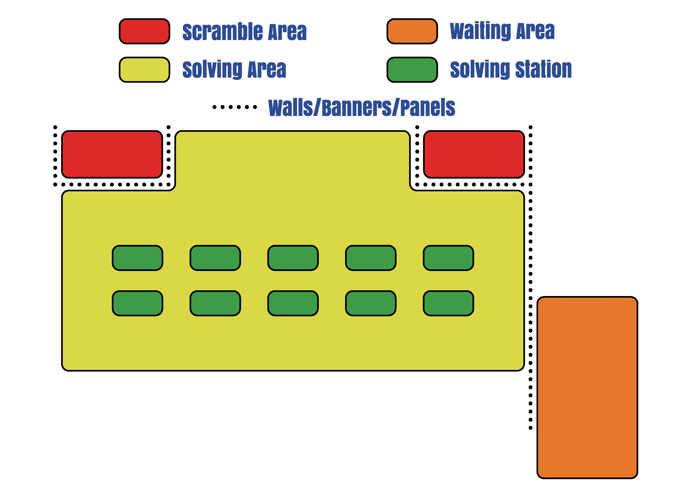

# WCA Scramble Accountability Policy

### Version 1.0

## Purpose

The purpose of this policy is to define standards of how official WCA Scrambles, which in addition to the WCA Regulations, must be treated. The policy is targeted towards the WCA Delegate and organization team. Not fully following the Scramble Accountability Policy may result in disqualification of the affected results, at the discretion of the WCA Regulations Committee.

## Policy

1. Drop-off-table

    1. A drop-off-table may be used for the competitors to submit their puzzles when they are called to compete.
    2. A drop-off table is recommended not to be the scrambling table.
        1. If the scrambling table is also serving the role as a drop-off-table, competitors must not submit their puzzles whilst scrambling is in process and the scramble sequences must not be visible on the table.
            1. At the discretion of the organization team and/or WCA Delegate, a competitor may submit their puzzle to an official after scrambling has begun.

2. Scrambling area

    1. A scrambling area is a section set aside for the purpose of scrambling puzzles.
        1. There may be multiple scrambling areas at a competition.
    2. The scrambling area should be arranged such that any information from the scrambles is visually isolated and should by all logistical means ensure that the scrambling is visually isolated from, firstly, the Competitor Waiting Areas and, secondly, the solving stations.
        1. A scrambling table is a table within a scrambling area. The organization team must take the placement of the scrambling table(s) into consideration

3. Competition Area

    1. A competition should have at least one designated Competition Area which will be in use throughout the group.
        1. If there is no designated Competitors Waiting Area, all competitors in one group must be placed at Solving Stations.
    2. The organization team may require the competitors to go back to the Competitors Waiting Area after an attempt and have them be called to a different solving station for the next attempt.
    3. When competing, competitors must not communicate with any other person regarding the scrambles they are receiving (see Regulation 2g3).
    4. When competing, competitors must not actively try to watch another competitor complete an official attempt.
        1. The organization team and the WCA Delegate should reduce the possibility of the above occuring. This could include adding a visual barrier between or having a sufficient distance between the Competitors Waiting Area to the solving stations.

4. Broadcasting of competitions

    1. When a competitor has been called for their group, they must not look at any broadcasting of their allocated group.
        1. The organization team should announce this on the competition page if they are aware of a broadcast at the competition being conducted.
    2. For a final round, the organization team may require competitors competing in the final round to not interact with certain electronic devices until they have completed their attempts to ensure that no broadcast of the competition is being viewed by the competitors.
        1. The organization team must consider the fairness of this and must receive approval from the WCA Delegate(s).

5. Displaying scrambles
    1. WCA Scrambles will be printed and/or displayed on an electronic device.
        1. Scrambles must be kept out of sight of competitors. Scrambles should be kept in a place that is within view of a WCA Delegate.
        2. If printed scrambles are used, they should not leave the WCA Delegate’s possession when not in use or should be stored in a secure place where it is impossible for the competitors to access.
            1. Once the scrambles are done being used, the scramble sheet should be crossed out immediately to ensure they are not accidentally reused.
        3. For scrambles being displayed on an electronic device, individual scramble sets must be password protected. Each individual scramble set must have a unique password.
            1. The password must be unguessable. The password must have nothing to do with the competition or personal data (name, birthdate).
            2. If a WCA Delegate’s personal device is used, a guest user account should be created which only has the password-protected computer display PDFs with it.
            3. The passwords may be given to the scramblers when the corresponding groups begin but not earlier. A WCA Delegate must not give the passwords for all the scramble sets in a round to scramblers at the beginning of that round.
                1. Exception: if the WCA Delegate(s) will be temporarily unavailable when a group is supposed to start, they may give a password to one of the scramblers.
            4. Once the scrambles are done being used, the file should be closed immediately to ensure they are not accidentally reused.

## Examples of competition setups

Below are some setups from WCA Competitions. Some of the setups follow the required points of the policy, whilst others violate some or several points of the policy above. Please pay attention to the description of each setup!

### Setup 1 {.text-center}

{.bordered-image}

Setup 1 has the competitors in a group placed at solving stations. The waiting area in the adjacent room is for competitors in the next group. The scrambling areas are properly visually isolated. Setup 1 is in compliance with the points of the policy in regards to the setup.

### Setup 2 {.text-center}

{.bordered-image}

Setup 2 is making use of a competitors waiting area. The scrambling area is properly visually isolated. Both from the waiting area and the solving stations. The solving stations are also visually isolated from the competitors waiting area. Setup 2 is in compliance with the points of the policy in regards to the setup.

### Setup 3 {.text-center}

{.bordered-image}

Setup 3 is also making use of a competitors waiting area. The scrambling area is properly visually isolated. Both from the waiting area and the solving stations. There is no visual barrier between the waiting area and the solving stations, which there preferably should be. Setup 3 is acceptable, but the distance between the waiting area and solving stations should be considered by the organization team and Delegate if it is appropriate to adhere to point 3.4.

### Setup 4 {.text-center}

{.bordered-image}

Setup 4 is also making use of a competitors waiting area. The scrambling area does not have any visual isolation and the competitors waiting area has a clear view to the scrambling area, which is against point 2.2. The solving stations and the waiting area and no visual barrier, making enforcement of point 3.4 difficult unless a sufficient distance between the areas is added. Setup 4 is breaching part of the policy and should not be replicated.

## Definition of Terms

| Term | Definition |
| :-- | :------ |
| Competitor | A participant at a WCA competition |
| Competition Area | An area consisting of a Competitor Waiting Area and Solving Stations |
| Competitors Waiting Area | A space inside the Competitors Area where competitors wait between their attempts, after submitting their puzzle to the scrambling area |
| Organization Team | Persons who are responsible for the organization of a WCA Competition, as defined in the WCA Regulations |
| Regulations | The Regulations of the WCA as approved for use in WCA Competitions |
| Solving Station | The area where a competitor will complete their attempts |
| WCA Delegate | A role defined in the Motions and in the WCA Regulations to oversee official WCA Competitions on behalf of the WCA |
