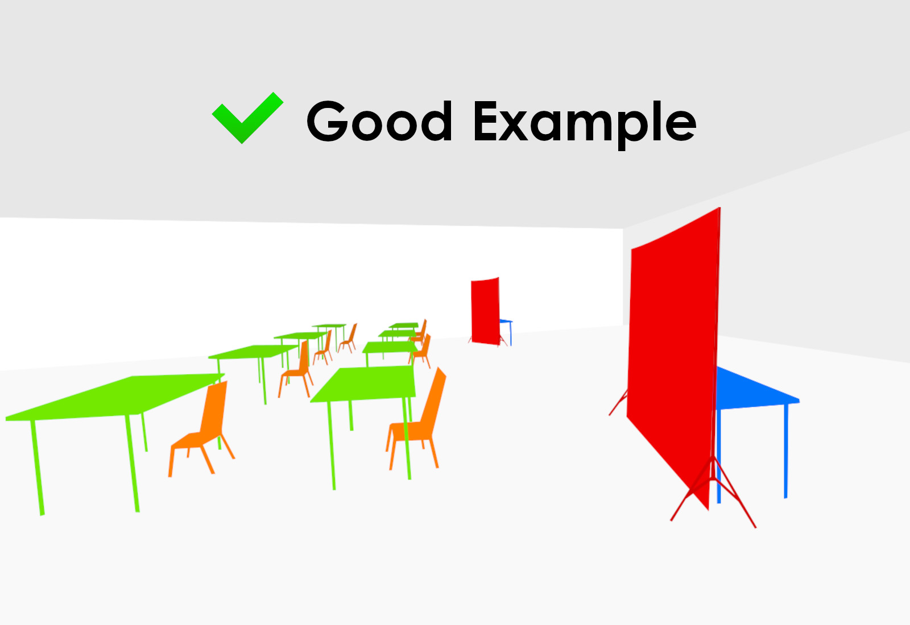
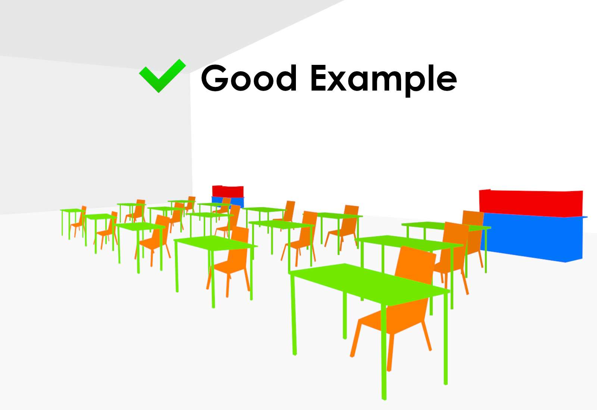
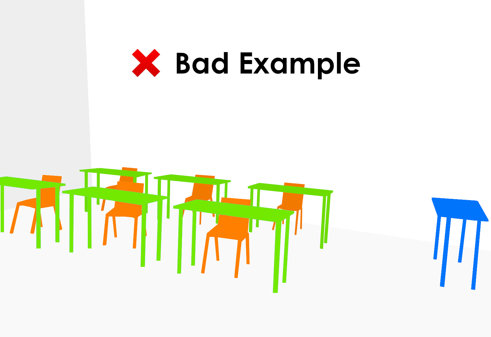
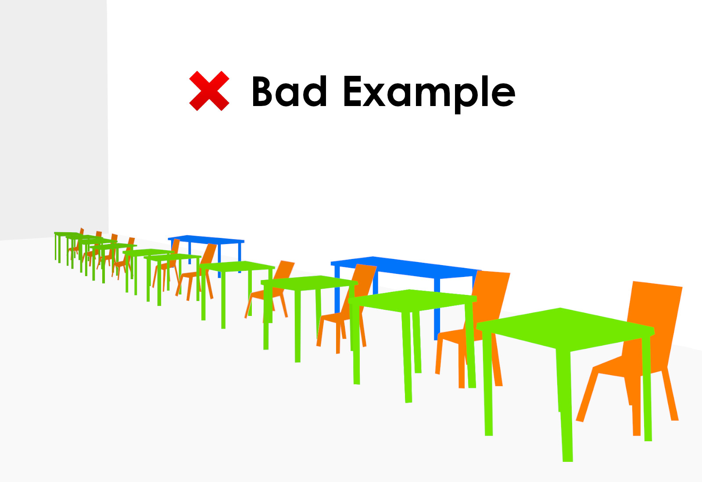
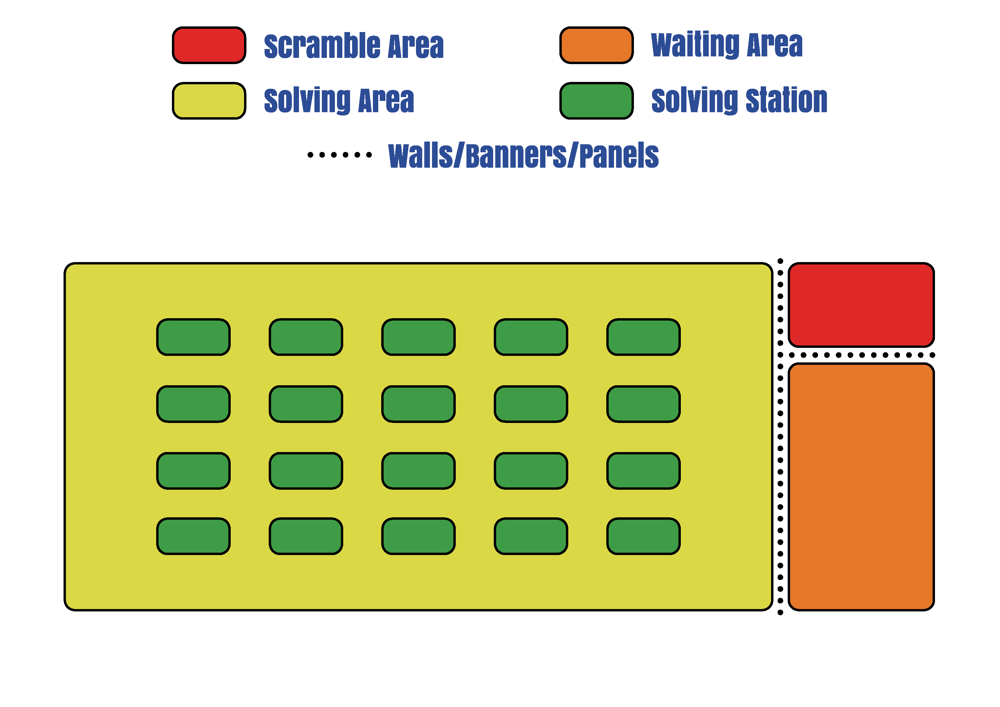
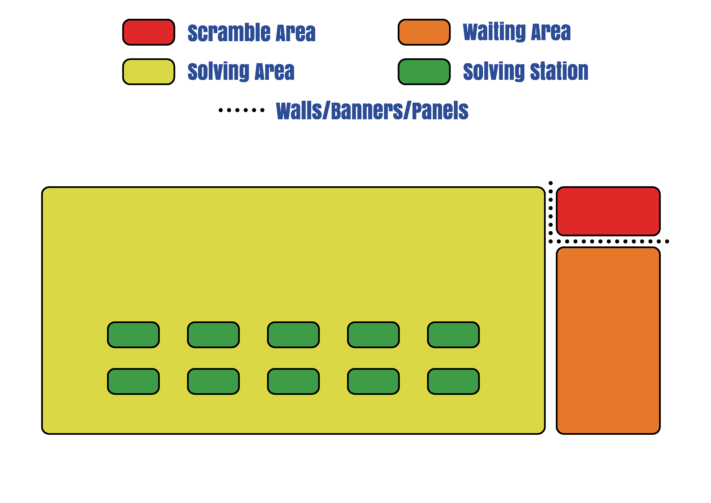
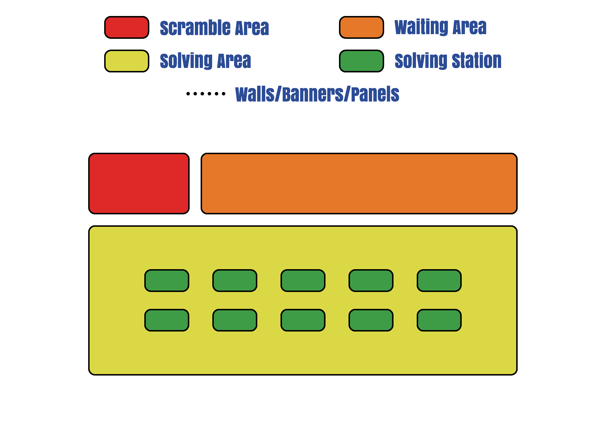

# WCA Scramble Accountability Policy

### Version 2.1 {.version}

## Purpose

The purpose of this policy is to define standards on how official WCA scrambles must be treated. The policy is targeted towards WCA Delegates and organization teams. Not fully following the Scramble Accountability Policy may result in disqualification of the affected results, at the discretion of the WCA Regulations Committee.

## Definition of Terms

| Term | Definition |
| :-- | :------ |
| Competition Area | A designated area where competitors do their official attempts at designated solving stations |
| Drop-off table | A table where competitors submit their puzzles at the start of their group |
| Scrambling Area | A section set aside for the purpose of scrambling puzzles |
| Solving Station | A place where a competitor will do their attempts (e.g. a table) |
| Competitor Waiting Area | See regulations [7h2](wca{regulations/full/#7h2}), [A2a1](wca{regulations/full/#A2a1}) and [A2a2](wca{regulations/full/#A2a2}) |

## Policy

1. Drop-off table
    1. A drop-off table may be used for the competitors to submit their puzzles when they are called to compete.
    2. A drop-off table is recommended not to be the scrambling table.
        1. If the scrambling table is also serving the role of a drop-off table, the scrambles must not be visible on the table.
            1. At the discretion of the organization team and/or WCA Delegate, a competitor may submit their puzzle to an official after scrambling has begun.
    3. A drop-off table should be visually isolated from the scrambling table.
2. Scrambling Area
    1. A competition may have multiple Scrambling Areas.
    2. The Scrambling Area must be arranged such that any information about the scrambles is visually isolated from the competitors of the ongoing groups and anyone who is not an assigned runner or scrambler, an organizer, or a listed WCA Delegate.
        1. A scrambling table is a table within a Scrambling Area. There must be at least one scrambling table in a Scrambling Area. The organization team must take the placement of the scrambling table(s) into consideration.
        2. The Scrambling Area may be visually isolated with the use of tall barriers placed in front of it or small barriers placed on top of the table(s). Regardless of the type of visual barriers used, they must break line of sight.
3. Competition Area
    1. A competition has at least one designated Competition Area, which will be in use throughout each group.
    2. The organization team and the WCA Delegate should reduce the possibility of competitors watching other competitors in their group make an official attempt. This could include adding a visual barrier between solving stations and/or having a sufficient distance between the Competitor Waiting Area and the solving stations.
        1. Solving Stations should not be arranged facing each other, unless a visual barrier is set up between them.
4. Broadcasting of competitions
    1. When a competitor has been called for their group, they must not look at any broadcasting of their group.
        1. The organization team should announce this on the competition page if they are aware of a broadcast taking place at the competition.
    2. The organization team may require competitors not to interact with certain electronic devices until they have completed their attempts to ensure that no broadcast of the competition is being viewed by the competitors of the ongoing group.
        1. The organization team must consider the fairness of this and must receive approval from the WCA Delegate(s).
5. Displaying scrambles
    1. The scrambles may be printed out or displayed on an electronic device.
        1. If printed scrambles are used, they should not leave the WCA Delegate’s possession when not in use or should be stored in a secure place where it is not possible for the competitors to access them.
            1. Once the scrambles are done being used, the scramble sheet should be crossed out immediately to ensure it is not accidentally reused.
        2. If the scrambles are being displayed on an electronic device, individual scramble sets must be password-protected. Each individual scramble set must have a unique randomly-generated password.
            1. Only the password-protected computer display PDFs should be available on the device. If a WCA Delegate’s personal device is used, a guest user account should be used.
            2. The passwords may be given to the scramblers when the corresponding groups begin, but not earlier. A WCA Delegate must not give the passwords for all the scramble sets in a round to scramblers at the beginning of that round.
                1. Exception: if the WCA Delegate(s) will be temporarily unavailable when a group is supposed to start, they may give the password for that group to a trusted scrambler.
            3. Once the scrambles are done being used, the file should be closed immediately to ensure they are not accidentally reused.

## Examples of Scrambling Area setups {.page-break-before}

Below are some Scrambling Area setups from WCA Competitions. The first two are good examples that you may use at your competitions. The next two are bad examples, and you must ensure that you do not use setups like those.

### Scrambling Area Setup 1 {.text-center}

{.bordered-image width=65%}

The scrambling tables have tall barriers placed in front of them, breaking line of sight between the puzzles being scrambled and anyone outside of the Scrambling Areas. This is a good setup, as it fully adheres to the relevant points of this policy.

### Scrambling Area Setup 2 {.text-center}

{.bordered-image width=65%}

Here the scrambling tables are placed behind the solving stations, with visual barriers placed on top of the tables. This competition utilizes fixed seating, meaning there are no Competitor Waiting Areas. This is a good setup, as the barriers break line of sight between the puzzles being scrambled and all competitors, who are expected to remain seated during each group.

### Scrambling Area Setup 3 {.text-center .page-break-before}

{.bordered-image width=65%}

The scrambling table is placed next to the solving stations and is not visually isolated at all. Any competitor moving to/from a solving station or being seated closer to the scrambling table would be able to peek at the scrambles very easily, and spectators also have a clear view of the scrambles. Therefore, this setup does not comply with point 2.2 of this policy and must not be used.

### Scrambling Area Setup 4 {.text-center}

{.bordered-image width=65%}

The scrambling tables are placed behind the solving stations this time, but are still not visually isolated. This is still unacceptable, as there is nothing to break line of sight between the solving stations and the scrambling tables, thus breaking point 2.2 of this policy.

## Examples of competition setups {.page-break-before}

Below are some setups from WCA Competitions. Some of the setups follow the required points of the policy, whilst others violate some or several points of the policy above. Please pay attention to the description of each setup!

### Setup 1 (good) {.text-center}

{.bordered-image width=65%}

Setup 1 is making use of a Competitor Waiting Area. The Scrambling Area is properly visually isolated, both from the Competitor Waiting Area and the solving stations. The solving stations are also visually isolated from the Competitor Waiting Area. This setup is in compliance with the relevant points of this policy.

### Setup 2 (okay) {.text-center}

{.bordered-image width=65%}

Setup 2 is also making use of a Competitor Waiting Area. The Scrambling Area is properly visually isolated from both the Competitor Waiting Area and the solving stations. There is no visual barrier between the Competitor Waiting Area and the solving stations, which there should be. This setup is acceptable, but the distance between the Competitor Waiting Area and the solving stations should be considered by the organization team and the WCA Delegate to ensure adherence to point 3.4 of this policy.

### Setup 3 (bad) {.text-center}

{.bordered-image width=65%}

Setup 3 is also making use of a Competitor Waiting Area. The Scrambling Area does not have any visual isolation and the Competitor Waiting Area has a clear view to the Scrambling Area, which is against point 2.2. The solving stations and the Competitor Waiting Area have no visual barriers, making enforcement of point 3.4 difficult unless sufficient distance between the areas is added. This setup is breaching an important part of the policy and must not be replicated.
