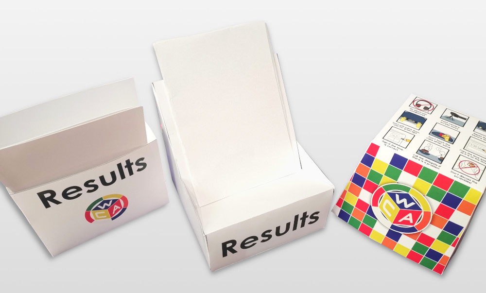

# Plantillas para Competiciones de la WCA

::::: {.box .important}
¡NO utilizar las plantillas antes de leer todo este documento!
:::::

Aquí podrás encontrar las siguientes plantillas imprimibles que pueden ser utilizadas en competiciones de la WCA:

- Tapacubos y coberturas para Clock, ambas apilables.
- Coberturas para Square-1, Clock y Skewb para imprimir en 3D.
- Cajas para guardar las hojas de resultados: un diseño para colgar en la pared y otro para poner en la mesa.
- Papeles para utilizar dentro del Square-1 (21 por página).
- Folleto con algunas de las reglas más importantes para competir.
- Folleto con buenas prácticas para mezclar los puzzles en la categoría Múltiples Cubos a Ciegas.
- Hojas para no perderse a la hora de mezclar los puzzles en la categoría Múltiples Cubos a Ciegas.

{.centered width=600px}

## Instrucciones

1. Si deseas utilizar los diseños de la WCA, busca los archivos en la carpeta/directorio que corresponda a la versión en español. Si tienes pensado hacer diseños personalizados, utiliza los archivos en la carpeta llamada `Editable Files`. **NO** hagas coberturas para Clock con diseños que hagan que el papel quede muy rígido, porque podría afectar a los botones (o "pines") del puzzle. Es mejor utilizar un diseño minimalista en blanco y negro (BW).
2. Los diseños de las coberturas para Clock en papel, los folletos con las reglas para competir y las hojas para mezclar en la categoría Múltiples Cubos a Ciegas, pueden imprimirse en una impresora doméstica. Los demás diseños **DEBEN** imprimirse utilizando una impresora de grado industrial, así que deberás buscar un lugar donde tengan una (debes llevar los archivos `.pdf`).

{.centered width=450px}

3. Si estás haciendo **coberturas para Clock personalizadas**, necesitarás copiar tu diseño terminado a una hoja formato A4 (210\*297mm / 8.27\*11.69in), rotar todo el diseño 12 grados en sentido anti-horario y guardar el archivo como `.pdf`. Si piensas utilizar una impresora doméstica que no puede imprimir hasta los bordes de la hoja, prueba a seleccionar la opción "ajustar al área imprimible" ("fit to printable area").

{.centered width=450px}

::::: {.text-center}
Cobertura 3D para Clock
:::::

{.centered width=450px}

::::: {.text-center}
Cobertura multipropósito 3D
:::::

4. Hay dos diseños de coberturas para imprimir en 3D: uno para Clock y otro que también sirve para Square-1 y Skewb (ambos son apilables). La cobertura multipropósito sirve para cualquier Clock con <= 24mm de grosor y cualquier Square-1/Skewb <= 57mm. Además, evita movimientos en el puzzle mientras es transportado. Las coberturas para imprimir en 3D tienen una duración y rendimiento mucho mayor que las coberturas de papel/cartón, pero son más caras de producir. Es recomendable que busques algún servicio de impresiones 3D o a algún entusiasta de las impresiones 3D que los pueda hacer por ti.

::::: {.page-break-before}
5. Asegúrate de imprimir todas las plantillas siguiendo **estrictamente** las siguientes especificaciones:
:::::

| Plantilla                         | Tamaño del papel | Densidad del papel | Tipo de papel  |
| --------------------------------- | :--------------: | :----------------- | :------------: |
| Tapacubo                          |        A3        | 350-400 gsm \*     |     Color      |
| Cobertura para Clock (papel) \*\* |        A4        | 60-90 gsm          | Blanco y negro |
| Caja de resultados (mesa)         |        A3        | 350-400 gsm \*     |     Color      |
| Caja de resultados (pared)        |        A4        | 250-400 gsm        |     Color      |
| Square-1 inserts                  |        A4        | 250-400 gsm        |     Color      |
| Folletos/Infografías              |        A4        | Cualquiera         |     Color      |
| Hojas para mezclar en MBLD        |        A4        | Cualquiera         | Blanco y negro |

"gsm" quiere decir "grams per square meter" (gramos por metro cuadrado). Esta es la unidad estándar para medir densidad de papel.

\* Más grueso es mejor. 

| Plantilla                           | Resolución |  Infill  | Filamento  |  Soportes  |
| ----------------------------------- | :--------: | :------: | :--------: | :--------: |
| Cobertura 3D multipropósito         | 0.2-0.3mm  |   15%    | PLA / PETG |  Ninguno   |
| Cobertura 3D para Clock             |   0.4mm    |   15% \* | PLA / PETG |  Ninguno   |

\* En caso de ser necesario.

6. Necesitarás las siguientes herramientas para poder armar las impresiones en papel:

- Tijeras
- Regla
- Pegamento para papel (solo para las coberturas para Clock)
- Cinta adhesiva de doble cara (solo para las cajas de resultados y los tapacubos)
- Cúter (cuchilla, trincheta, etc.) (solo para las cajas de resultados y los tapacubos)

7. A excepción de las coberturas para Clock, los cortes en todas las plantillas se deben hacer en la parte **INTERNA** de las líneas negras, de manera que no quede nada negro luego de realizar el recorte. En las coberturas para Clock, los cortes deben hacerse **SOBRE** las líneas negras.

8. La hoja para mezclar Múltiples Cubos a Ciegas tiene varias páginas, cada una de ellas con lugares numerados para 14 cubos (dos sets de mezclas de TNoodle). La primera página es para las mezclas 1-14, la segunda para las mezclas 15-28, y así sucesivamente hasta la 84. Puedes imprimir tantas como necesites para tu competición. Deberías considerar cuántos participantes tendrás y cuántos cubos intentarán los competidores. Puedes seguir reutilizando estas hojas en futuras competiciones para no malgastar el papel.

Al mezclar para un intento de Múltiples Cubos a Ciegas, se debe colocar cada cubo en el número de mezcla que se le aplicó. Asegúrate también de que nunca haya dos personas mezclando cubos utilizando la misma hoja para mezclas (recuerda que una de estas hojas corresponde a dos sets de mezclas de TNoodle, ya que tienen 7 mezclas por página). Todo esto reduce en gran medida el riesgo de aplicar la misma mezcla dos veces, lo que podría resultar en que el competidor reciba intentos extra, retrasando la competición.

::::: {.box .warning}
[Enlace a la carpeta con las plantillas](https://drive.google.com/drive/folders/1EVqEWSqruZ8_vEJpUmqhFUqaikzgUkkP?usp=sharing)

Por favor, comparte el enlace a ESTA página y no el enlace directamente a la carpeta.
:::::

## Créditos{.page-break-before}

Plantillas de papel/cartón - Deni Mintsaev 
Cobertura 3D multipropósito - Brendan Bakker, Patrick Dwye, YouBeen Lee (이유빈) y la KCCU 
Cobertura 3D para Clock - Francisco Montañés Barbudo y Mitchell Lane 
Folletos/Infografías - Tom Nelson 
Hoja para mezclar en la categoría Múltiples Cubos a Ciegas - Callum Goodyear
