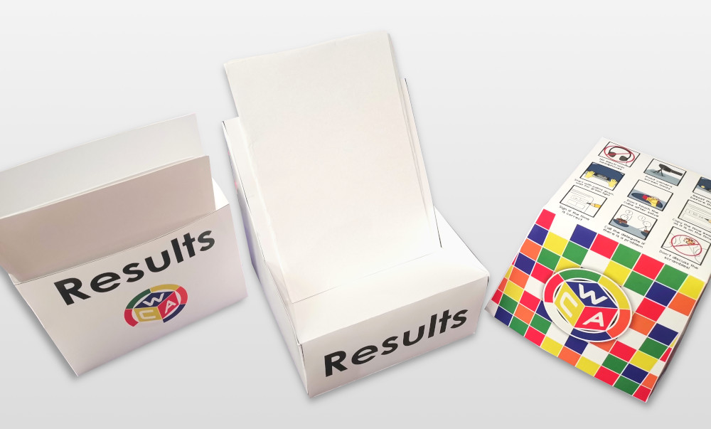
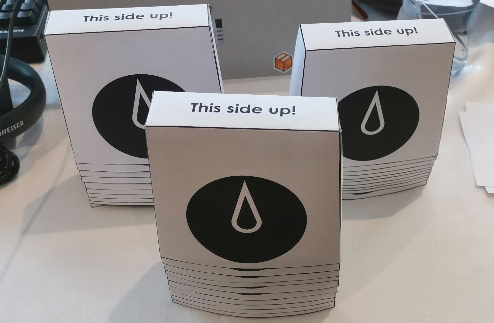
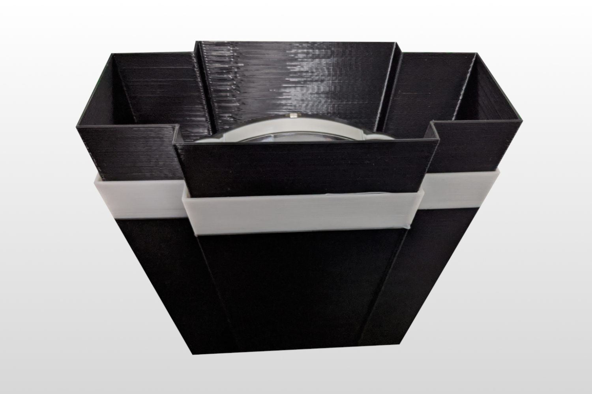
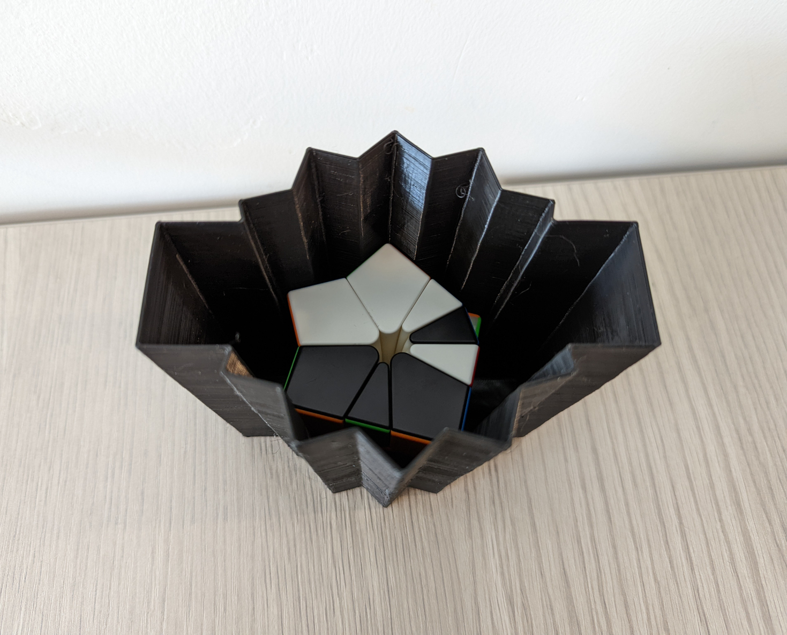

# Шаблоны Для WCA Соревнований

::::: {.box .important}
НЕ ИСПОЛЬЗУЙТЕ эти шаблоны, не прочитав этот документ полностью!
:::::

Здесь вы можете найти следующие шаблоны для печати, которые можно использовать для WCA соревнований:

- Накрывашки для кубов и Клоков, которые кладутся друг в дружку
- 3D накрывашки для головоломок Square-1, Clock и Skewb
- Коробки для скоркарточек: один вариант, который можно повесить на стену, и один, который можно положить на стол
- Bставки в Square-1 (21 штука на странице)
- Инфографика для участников с описанием самых важных правил
- Инфографика для скрамблинга Мульти с иллюстрациями самой лучшей практики
- Листы с очертаниями кубов для аккуратного скрамблинга Мульти (по 14 кубов на странице)

{.centered width=70%}

## Инструкция

1. Если вы хотите использовать готовые дизайны от WCA, используйте файлы в папке с языком вашего региона, если он доступен. Если вы хотите сделать свои дизайны, то используйте файлы в папке `Editable Files`. Рекомендуется **НЕ ДЕЛАТЬ** дизайны накрывашек для Клока с большим количеством цвета, так как бумага с большим количеством чернил становится более плотной и может привести к нажатию кнопок. Лучше использовать минимальный дизайн в черно-белом (ЧБ).
2. Шаблон бумажных накрывашек для Клока, инфографики и листы с очертаниями кубов для скрамблинга Мульти могут быть распечатаны на домашнем принтере. Инфографики должны быть распечатаны в цвете, а два других файла - в ЧБ. Все остальные шаблоны **ДОЛЖНЫ** быть распечатаны на принтере в типографии, поэтому вам придется найти типографию в своем регионе. Им понадобятся `.pdf` файлы, чтобы распечатать ваши шаблоны.

{.centered width=50%}

3. Если вы делаете **свой дизайн накрывашек для Клока**, скопируйте ваш готовый дизайн на новый документ размера А4 (210\*297мм), поверните весь дизайн на 12 градусов против часовой стрелки и сохраните файл в формате `.pdf`. Если вы их печатаете на домашнем принтере, который не может печатать до самых краев, попробуйте выбрать настройку "печать без полей".

{.centered width=50%}

::::: {.text-center}
3D накрывашка для Клока
:::::

{.centered width=50%}

::::: {.text-center .page-break-after}
Универсальная 3D накрывашка
:::::

4. Вам доступны два шаблона накрывашек, которые печатаются на 3D принтере: один для Клока и один для головоломок Square-1, Clock и Skewb. Обе накрывашки можно вставлять друг в дружку. Универсальные накрывашки подходят для Клоков ≤ 24мм толщиной и Square-1/Skewb ≤ 57мм, и предотвращяют случайное вращение во время транспортировки. 3D накрывашки служат гораздо дольше и лучше, чем бумажные/картонные варианты, но они стоят дороже. Рекомендуется найти услугу 3D печати в вашем регионе или обратиться к любителю 3D печати, который сможет их вам распечатать.

5. Обязательно печатайте все шаблоны **СТРОГО** используя следующие настройки:

| Шаблон                                           | Бумага | Плотность бумаги | Цвет / ЧБ |
| ------------------------------------------------ | :----: | :--------------- | :-------: |
| Накрывашка для куба                              |   A3   | 350-400 г/м2 \*  |    Цвет   |
| Накрывашка для Клока \*\*                        |   A4   | 60-90 г/м2       |     ЧБ    |
| Коробка для скоркарт (на стол)                   |   A3   | 350-400 г/м2 \*  |    Цвет   |
| Коробка для скоркарт (на стену)                  |   A4   | 250-400 г/м2     |    Цвет   |
| Вставки в Square-1                               |   A4   | 250-400 г/м2     |    Цвет   |
| Гайды для участника и скрамблинга Мульти         |   A4   | Любая            |    Цвет   |
| Листы с очертаниями кубов для скрамблинга Мульти |   A4   | Любая            |     ЧБ    |

"г/м2" значит грамм на квадратный метр. Это стандартная единица измерения для плотности бумаги.

\* Чем плотнее - тем лучше. 
\*\* Накрывашки для Клока печатаются на обычной бумаге, которая используется в домашних ЧБ принтерах. Лучший вариант - 80 г/м2.

| Шаблон                      | Качество  | Заполнение |  Материал  | Поддержки |
| --------------------------- | :-------: | :--------: | :--------: | :-------: |
| Универсальная 3D накрывашка | 0.2-0.3mm |     15%    | PLA / PETG |    Без    |
| 3D накрывашка для Клока     |   0.4mm   |    15% \*  | PLA / PETG |    Без    |

\* Если необходимо.

6. Вам нужны будут следующие инструменты, чтобы собрать бумажные шаблоны:

- Ножницы
- Линейка
- Клей для бумаги (только для накрывашек для Клока)
- Двусторонний скотч шириной до 1см (только для коробок для скоркарт и накрывашек для куба)
- Лезвие (нож, канцеллярский нож, итп.) (только для коробок для скоркарт и накрывашек для куба)

::::: {.page-break-after}
7. На всех шаблонах кроме накрывашек для Клока режьте с **ВНУТРЕННЕЙ** стороны черных линий, не оставляя черный цвет по краям. Шаблоны накрывашек для Клока надо резать **ЧЕРЕЗ** черные линии.
:::::

8. В файле с очертаниями кубов для скрамблинга Мульти есть несколько страниц, на каждой из которых пронумерованные места для 14 кубов (два сета скрамблов TNoodle). На первой странице скрамблы 1-14, на второй - 15-28, итд. до скрамбла номер 84. Вы можете распечатать столько страниц, сколько вам понадобится для соревнований. Учтите, сколько у вас будет скрамблеров и сколько кубов будут собирать ваши участники. Вы можете продолжать использовать распечатанные листы и на других соревнованиях, чтобы расходовать меньше бумаги.

Во время скрамблинга попытки Мульти, кладите каждый куб на номер скрамбла, которым он был разобран. Также убедитесь, чтобы два человека не скрамблили одновременно используя тот же самый лист с очертаниями кубов (помните, что один лист соответствует двум листам со скрамблами TNoodle, так как на них размещается по 7 скрамблов). Эти меры сильно уменьшают риск дублирования скрамблов, что может привести к необходимости выдать участнику экстру, что сильно замедляет процесс проведения соревнований.

::::: {.box .warning}
[Ссылка на папку с шаблонами](https://drive.google.com/drive/folders/1EVqEWSqruZ8_vEJpUmqhFUqaikzgUkkP)

Просьба делиться только ссылкой на ЭТОТ документ, а не на папку.
:::::

## Авторство

Бумажные/картонные шаблоны - Дени Минцаев 
Универсальная 3D накрывашка - Брэндан Баккер, Патрик Двайер, Юбин Ли и KCCU 
3D накрывашка для Клока - Франсиско Монтаньес Барбудо и Митчелл Лэйн 
Иллюстрации гайдов для участника и скрамблинга Мульти - Том Нельсон 
Листы с очертаниями кубов для скрамблинга Мульти - Каллум Гудьир