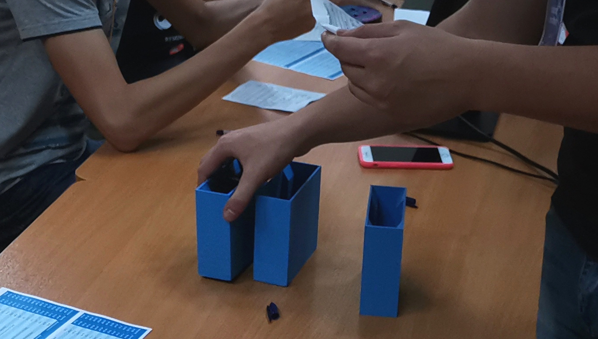

# Шаблоны Для WCA Соревнований

::::: {.box .important}
НЕ ИСПОЛЬЗУЙТЕ эти шаблоны, не прочитав этот документ полностью!
:::::

Здесь вы можете найти шаблоны накрывашек для кубов и клоков, которые кладутся друг в дружку, коробки для скоркарточек: один вариант, который можно повесить на стену и один, который можно положить на стол; вставки в Square-1 (21 штука на странице) и описание самых важных правил для соревнований. Все эти шаблоны можно распечатать на принтере. Также вам доступны два варианта накрывашек на клок, которые печатаются на 3D принтере.

{.centered width=600px}

## Инструкция

1. Если вы хотите использовать готовые дизайны от WCA, используйте файлы в папке с языком вашего региона. **ВНИМАНИЕ: Превью некоторых PDF файлов могут иметь визуальные артефакты, но их не будет на скачанном файле.** Если вы хотите сделать свои дизайны, то используйте файлы в папке `Editable Files`. **НЕ ДЕЛАЙТЕ** дизайны накрывашек для клока в цвете, они должны быть в черно-белом (ЧБ).
2. Шаблоны бумажных накрывашек для клока и правил для соревнований могут быть распечатаны на домашнем принтере; накрывашки для клока должны быть в ЧБ, а правила для соревнований - в цвете. Остальные шаблоны **ДОЛЖНЫ** быть распечатаны на принтере в типографии, так что вам придется найти типографию в своем регионе. Им понадобятся `PDF` файлы, чтобы распечатать ваши шаблоны.

{.centered width=430px}

3. Если вы делаете **свой дизайн накрывашек для клока**, скопируйте ваш готовый дизайн на новый документ размера А4 (210\*297мм), поверните весь дизайн на 12 градусов против часовой стрелки и сохраните файл в формате PDF. Если вы их печатаете на домашнем принтере, который не может печатать до самых краев, попробуйте выбрать настройку "печать без полей".

{.centered width=450px}

::::: {.text-center}
3D накрывашка для клока от Митчелла
:::::

4. Вам доступны два шаблона накрывашек для клока, которые печатаются на 3D принтере: один от Митчелл Лэйна и один от Кейди Шилдс. Накрывашки Митчелла можно вставлять друг в дружку, а накрывашки Кейди нельзя, но они более прочные и вмещают клоки с более толстыми корпусами (таких никогда не было в массовом производстве). Оба этих 3D шаблона служат гораздо дольше, чем бумажный вариант. Рекомендуем найти услугу 3D печати в вашем регионе или обратиться к любителю 3D печати, который сможет их вам распечатать.
5. Обязательно печатайте все шаблоны **СТРОГО** используя следующие параметры:

| Шаблон                          | Бумага  | Плотность бумаги | Тип бумаги |
| ------------------------------- | :-----: | :--------------- | :--------: |
| Накрывашка для куба             | A3      | 350-400 г/м2 \*  | Цвет       |
| Накрывашка для клока \*\*       | A4      | 60-90 г/м2       | ЧБ         |
| Коробка для скоркарт (на стол)  | A3      | 350-400 г/м2 \*  | Цвет       |
| Коробка для скоркарт (на стену) | A4      | 250-400 г/м2     | Цвет       |
| Вставки в Square-1              | A4      | 250-400 г/м2     | Цвет       |
| Правила для соревнований        | A4      | Любая            | Цвет       |

"г/м2" значит грамм на квадратный метр. Это стандартная единица измерения для плотности бумаги.

\* Чем плотнее - тем лучше 
\*\* Накрывашки для клока печатаются на обычной бумаге, которая используется в домашних ЧБ принтерах. Лучший вариант - 80 г/м2.

| Шаблон                              | Качество       | Заполнение | Материал   | Вид заполнения | Поддержки |
| ----------------------------------- | :------------: | :--------: | :--------: | :------------: | :-------: |
| 3D накрывашка для клока от Кейди    | 0.2-0.3мм      | 15%        | PLA        | Любой          | Нет \*    |
| 3D накрывашка для клока от Митчелла | 0.2-0.3мм \*\* | 15% \*\*\* | PLA / PETG | Нет            | Нет       |

\* Поддержки не нужны при вертикальной печати 
\*\* Рекомендуется 0.24мм 
\*\*\* Заполнение генерироваться не будет

{.centered width=480px}

::::: {.text-center}
3D накрывашка для клока от Кейди
:::::

6. Вам нужны будут следующие инструменты, чтобы собрать бумажные шаблоны:

-   Ножницы
-   Линейка
-   Клей для бумаги (только для накрывашек для клока)
-   Двусторонний скотч шириной до 1см (только для коробок для скоркарт и накрывашек для куба)
-   Лезвие (нож, канцеллярский нож, итп.) (только для коробок для скоркарт и накрывашек для куба)

7. На всех шаблонах кроме накрывашек для клока режьте с **ВНУТРЕННЕЙ** стороны черных линий, не оставляя черный цвет по краям. Шаблоны накрывашек для клока надо резать **ЧЕРЕЗ** черные линии.

::::: {.box .warning}
[Ссылка на папку с шаблонами](https://drive.google.com/drive/folders/1EVqEWSqruZ8_vEJpUmqhFUqaikzgUkkP?usp=sharing)

Просьба делиться только ссылкой на ЭТОТ документ, а не на папку.
:::::

## Авторство

Бумажные шаблоны - Дени Минцаев 
3D накрывашки для клока - Кейди Шилдс 
3D накрывашки для клока - Митчелл Лэйн 
Правила для соревнований - Том Нельсон

