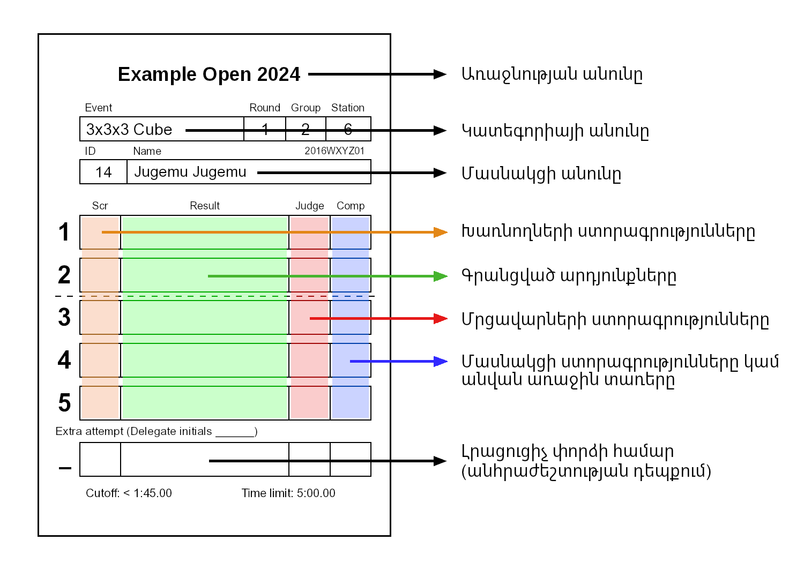
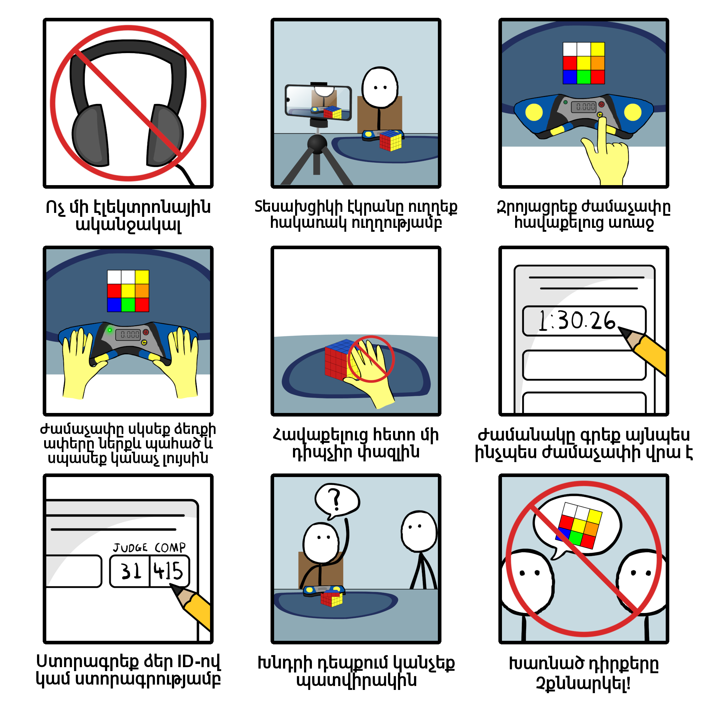

# ԱԿԱ Առաջնության Ձեռնարկ

Փաստաթղթի օտարալեզու թարգմանությունների համար իջեք մինչև վերջ։

## ԱԿԱ Կազմակերպություն - Ընդհանուր Ներածություն

{.logo width=15%}
Աշխարհի Կուբիկի Ասոցիացիան վերահսկում է Ռուբիկի Խորանարդի առաջնություններ աշխարհի բոլոր երկրներում։ ԱԿԱ-ի կողմից հաստատված բոլոր առաջնությունները պետք է հետևեն ԱԿԱ [Կանոնակարգերին](wca{regulations}) և [Ուղեցույցերին](wca{regulations/guidelines.html}), այսինքն շատ կարևոր է որ դուք առաջնության գնալուց առաջ ծանոթ լինեք այդ կանոններին։

Այս փաստաթղթի միջոցով դուք կծանոթանաք առաջնությանը մասնակցելու և մրցավարելու հիմնական կանոններին։ Այս փաստաթղթի միջոցով դուք մոտավոր կպատկերացնեք թե ինչպես են անցկացվում ԱԿԱ առաջնությունները, բայց ամեն դեպքում կարդացեք ԱԿԱ Կանոնակարգերը և Ուցեցույցերը և մասնակցեք "Առաջնության ուսուցում" միջոցառմանը այն առաջնության ժամանակ, որը մասնակցելու եք։

## Դերեր առաջնության ժամանակ
- **Պատվիրակ**: Պատվիրակները ԱԿԱ պաշտոնական ներկայացուցիչներն են և պատասխանատու են առաջնության ժամանակ ԱԿԱ Կանոնակարգի հետևելու համար։ Նրանք նաև զբաղվում են միջադեպերով, պատասխանատու են փազլների խառնելու և մասնակիցների արդյունքները հաստատելու համար։ Եթե դուք որևէ հարց կամ խնդիր ունենաք, պետք է առաջնահերթ մոտենաք պատվիրակին։

::::: {.box .important}
Եթե վստահ չեք ինչ-որ բանում, միշտ հարցրեք Պատվիրակին!
:::::

- **Կազմակերպիչ**: Կազմակերպիչները պատասխանատու են առաջնությունը կազմակերպելու և այն հնարավորինս հարթ անցկացնելու համար։ Սովորաբար կազմակերպիչները փորձված կուբերներ են և նրանք էլ կարող են ձեզ օգնել ինչ-որ հարցում։ Ուղղակի հիշեք որ պաշտոնական որոշումները կայացնում է միմիայն Պատվիրակը։
- **Մասնակից**: Ձեր հիմնական դերը մասնակցելն է: Այնուամենայնիվ, ձեզ նույնպես կարող են կանչել մրցավար լինելու համար, եթե դրա կարիքը լինի։
- **Մրցավար**: Մրցավարները վերահսկում են մասնակիցների փորձերը, որպեսզի դրանք անցնեն համաձայն Կանոնակարգերի։ Յուրաքանչյուր փորձի վերջում նրանք իրենց ստորագրությամբ հաստատում են, որ ամեն ինչ անցել է ըստ կանոնների։
- **Վազող**: Վազողները պատասխանատու են փազլները մրզավարներին և խառնողներին տալու համար։
- **Խառնող**: Խառնողները մասնակիցների փազլները խառնում են ըստ պատվիրակի տված բանաձևերի։ Նրանք իրենց ստորագրությամբ հաստատում են, որ փազլի խառնած դիրքը ճիշտ է։

## Առարկաներ առաջնության ժամանակ {.page-break-before}

- **Stackmat ժամաչափ**: Սա առաջնություններին ժամանակ պահելու համար պաշտոնական սարքն է։
Այն կարող է լինել ստորև նշված տարբերակներից որևէ մեկը։

{.centered width=30%}

- **Գորգ**: Stackmat ժամաչափերը պետք է օգտագործվեն գորգերով։ Գորգի հետ շփումը թույլ չի տալիս փազլները սահեն փարձի վերջում։

{.centered width=70%}

- **Վայրկյանաչափ**: Վայրկյանաչափերն օգտագործվում են զննման ժամանակը չափելու համար։ Դրանք նաև օգտագործվում են 10 րոպեից երկար տևողությամբ փորձերը չափելու համար։ Նշենք, որ վայրկյանաչափերը կարող են լինել տարբեր մոդելների և չհամապատասխանեն ստորև ներկայացված վայրկյանաչափի ֆունկցիոնալության հետ:

{.centered width=24%}

- **Ծածկ**: Ծածկերն օգտագործվում են փորձից առաջ փազլը ծածկելու համար, որպեսզի մասնակիցը չտեսնի փազլի խառնած դիրքը։

{.centered width=24% .page-break-after}

- **Արդյունքների թերթիկ**: Փազլը խառնելուց հետո, խառնողը ստորագրում է արդյունքների թերթիկի վրա։ Յուրաքանչյուր փորձից հետո մրցավարը գրում է ժամանակը արդյունքների թերթիկի վրա, հաստատում է ստորագրությամբ։ Այնուհետև մասնակիցը ստորագրում է թերթիկի վրա որով հաստատում է որ արդյունքը՝
- 1) ճիշտ է,
- 2) ամբողջական է,
- 3) ճշտորեն ձևակերպված է և
- 4) ընթեռնելի է։

{.centered width=70%}

::::: {.box .attention}
Եթե ձեր արդյունքների թերթիկի վրա արդյունքն անընթեռնելի է, ապա ամենավատ մեկնաբանելի արդյունքը կգրանցվի այդ փորձի համար։
:::::

::::: {.box .attention}
Մասնակիցը չպետք է ստորագրի մրցավարի կողմից արդյունքը գրանցելուց և ստորագրելուց առաջ!
Տուգանք: Փորձի որակազրկում
:::::

::::: {.box .attention}
Մրցավարը չպետք է ստորագրի արդյունքը գրանցելուց առաջ!
:::::

## Առաջնության ընթացքը {.page-break-before}

### Կատեգորիա:
ԱԿԱ առաջնություններն ունեն մեկ կամ ավելի կատեգորիաներ։ Ամենահաճախ հանդիպող կատեգորիան 3x3x3 խորանարդն է, ընդհանուր կան 17 պաշտոնական կատեգորիաներ։

### Փուլ:
Կատեգորիաները հիմնականում բաղկացած են մի քանի փուլերից; առաջին փուլին մասնակցում են կատեգորիային գրանցված բոլոր մասնակիցները, և մյուս փուլերին մասնակցում են նախորդ փուլը հաղթահարած մասնակիցները։

### Խմբեր:
Յուրաքանչյուր փուլի մասնակիցները բաժանված են մեկ կամ ավելի խմբերի։ Սա կանխում է Ժամաչափերի կայանների մոտ մասնակիցների կուտակումները։ Սովորաբար առաջնությունների ժամանակ մրցավար, վազող և խառնող լինում են հենց մասնակիցները, և մասնակիցներին մի քանի խմբերի բաժանելն ու փազլները տարբեր դիրքերով խառնելու բանաձևեր ունենալն օգնում է որպեսզի մասնակիցները չտեսնեն իրենց փորձերի համար խառնված կուբիկները և այդ ընթացքում կարողանան օգնել կազմակերպչկան հարցերով։

### Քո փազլը ներկայացնելը:
Երբ կանչում են ձեր խմբին, դուք պետք է պատրաստ լինեք ներկայացնել ձեր փազլը։ Դուք կտեսնեք արդյունքների թերթիկի համար նախատեսված սեղանը; գտեք ձեր անունով արդյունքների թերթիկը, դրեք վրան ձեր փազլը հավաքած վիճակում և գնացեք սպասման գոտի։

::::: {.box .attention}
Հիշեք, դուք պետք է պատրաստ լինեք ներկայացնել ձեր փազլը հենց որ կանչեն ձեր խմբին!
:::::

### Կայանի մրցավարներ կամ վազող մրցավարներ:
Առաջնություններն օգտագործում են տարբեր համակարգեր և կախված ինչ մեթոդ են օգտագործում առաջնության ժամանակ, մրցավարի պարտականությունները նույնպես կարող են փոփոխվել։

- **Կայանի մրցավարները** նստում են հավաքելու կայանում և լինում են մրցավար իրար հետևից մի քանի մասնակիցների համար։ Վազողները կվերցնեն փազլները խառնելու սեղանից, կկանչեն մասնակցին և կուղեկցեն ազատ կայանի մրցավարի մոտ։ Մրցավարի պարտականությունը սահմանափակվում է փազլը հավաքելը վերահսկելով։
- **Վազող մրցավարները** վերցնում են փազլները խառնելու սեղանից, կանչում են սպասման գոտում գտնվող մասնակցին, գալիս են հավաքելու կայան, վերահսկում են փազլը հավաքելու ընթացքը, և փազլը վերադարձնում են խառնելու սեղան։

### Հավաքելը սկսելը:
Յուրաքանչյուր փորձից առաջ մրցավարը պետք է վստահ լինի, որ ժամաչափը աշխատում է, միացված է և ժամանակը զրոյացված է։

Երբ մասնակիցը նստում է հավաքելու կայանում, մրցավարը/վազողը ծածկած փազլը դնում է սեղանին և սպասում է մինչև մասնակիցը պատրաստ լինի։

Համոզվելու համար մրցավարը մասնակցին հարցնում է “Պատրաստ ես?”

::::: {.box .important}
Մրցավարը պետք է վստահ լինի, որ մասնակիցը պատրաստ է փորձին! Ծածկը շուտ բարձրացնելը կարող է հանգեցնել լրացուցիչ փորձի։
:::::

::::: {.box .attention}
Հիշեք! Դուք ունեք 1 րոպե ժամանակ, որ սկսեք ձեր փորձը այն պահից, երբ խառնած փազլը ծածկով դնում են գորգին!
:::::

### Զննում:
Զննումը սկսում է այն պահից, երբ մասնակիցը հաստատում է, որ պատրաստ է սկսել փորձը՝ մրցավարին ասելով “Այո” (կամ հասկացնելով այլ հստակ ժեստով). Այդ պահին մրցավարը ծածկը բարձրացնելու հետ միաժամանակ միացնում է վայրկյանաչափը զննման ժամանակը չափելու համար։ Մասնակիցն ունի առավելագույնը 15 վայրկյան ժամանակ փազլը զննելու համար։ Նրանք կարող են վերցնել փազլը և զննել բոլոր կողմերից, բայց իրավունք չունեն կատարել որևէ քայլ։ Եթե մասնակիցը քայլ է անում զննման ժամանակ, մրցավարը որակազրկում է փորձը, որն էլ ավարտվում է։ Ստորև աղյուսակով կարող եք տեսնել զննման ժամանակ տեղի ունեցող գործողությունները։

| Ժամանակ       | Գործողություն                             |
| ------------- |:-----------------------------------------:|
| 8 վայրկյան    | Մրցավարն ասում է "8 վայրկյան"             |
| 12 վայրկյան   | Մրցավարն ասում է "12 վայրկյան"            |  
| 15 վայրկյան   | Մրցավարը չի դադարեցնում փորձը բայց վերջում կավելացնի 2 վայրկյան տուգանք|
| 17 վայրկյան   | Մրցավարը դադարեցնում է փորձը և գրում է DNF|   

::::: {.box .important}
Մասնակիցն ունի 15 վայրկյան փազլը զննելու համար!
:::::

::::: {.box .attention}
Հիշեք! Մասնակիցն իրավունք չունի զննման ժամանակ կատարել որևէ քայլ/շարժում փազլի վրա!
:::::

Հենց մասնակիցը սկսում է հավաքել, զննման ժամանակն ավարտվում է և մրցավարը որևէ գործողություն չի կատարում մինչև մասնակցի կողմից փազլի հավաքումը։

Մրցավարը պետք է սկսի վայրկյանաչափը ծածկը բարձրացնելու հետ միաժամանակ և դադարեցնի վայրկյանաչափը հենց մասնակիցը **բարձրացնում է ձեռքերը ժամաչափից** (դա սկսում է ժամաչափը).

### Հավաքելը:
Զննման վերջում մասնկիցը փազլը դնում է գորգին (ցանկացած դիրքով) և ձեռքերը դնում է ժամաչափի սենսորների վրա ժամանակը սկսելու համար։ Մասնակիցը կարող է սկսել հավաքել զննման ընթացքում ցանկացած պահի։ Մասնակիցը չպետք է դիպչի փազլին, ձեռքերը պետք է լինեն ուղիղ, ափերը ներքև, և սենսորին պետք է դիպչեն մատներով։ Մասնակիցը սկսում է հավաքել երբ ձեռքերը հանում է ժամաչափի սենսորի վրայից։

::::: {.box .important}
Ձեռքերը ժամաչափին դնելիս մասնակիցը սկզբում ժամաչափի վրա կտեսնի կարմիր, ապա կանաչ լույս։ Երբ կանաչ լույսը վառվի, այդ ժամանակ նոր մասնակիցը կարող է սկսել հավաքել։
:::::

::::: {.box .attention}
Հիշեք! Հավաքել սկսելիս մասնակցի ձեռքերը պետք է լինեն հարթ, ձեռքերի ափերը ներքև և ժամաչափի սենսորին պետք է դիպչի մատներով և ոչ թե ձեռքի ափերով! (Տուգանք: +2 վայրկյան [A4b](http://wca.link/A4b))
:::::

### Հավաքելը դադարելը:
Երբ փազլը հավաքված է, մասնակիցը ժամաչափը դադարեցնում է իր ձեռքերը դնելով սենսորներին։ Նրանք չպետք է դիպչեն փազլին և ձեռքերը պետք է լինեն հարթ՝ ափերը ներքև։

::::: {.box .attention}
Հիշեք! Հավաքելն ավարտելիս մասնակցի ձեռքերը պետք է լինեն հարթթ և ափերը ներքև! (Տուգանք: +2 վայրկյան [A6d](http://wca.link/A6d))
:::::

Մրցավարը ստուգում է փազլի հավաքվածությունը և մասնակցին ասում է արդյունքը; “ԼԱՎ”, “ՏՈՒԳԱՆՔ” կամ “DNF”։ Մասնակիցն իրավունք չունի դիպչել փազլին մինչև մրցավարի կողմից չհնչի վերջնական որոշումը։

::::: {.box .important}
Եթե ձեզ որոշում կայացնելու համար օգնություն է անհրաժեշտ, կամ ինչ-որ արտասովոր բան է տեղի ունեցել, խնդրում ենք անհապաղ դիմել ԱԿԱ Պատվիրակին։
:::::

::::: {.box .important}
Հիշեք! Տուգանքները կուտակային են, այսինքն մեկ փորձի ժամանակ կարող եք ստանալ մի քանի +2 վայրկյան տուգանքներ։
:::::

### Ադմինիստրատիվ:
Հենց մասնակիցն ավարտում է հավաքելը, մրցավարն արդյունքը գրանցում է արդյունքների թերթիկի վրա, հետո նոր ստորագրում է։ Մասնակիցը ստուգում է գրված արդյունքի ճշտությունը, ընթեռնելիությունը, մրցավարի ստորագրության առկայությունը, և հետո նոր ստորագրում է հաստատելու համար։

Եթե մասնակիցն ունի ևս մի քանի փորձ հավաքելու համար, ապա պետք է վերադառնա սպասման գոտի։ Մրցավարը փազլը և արդյունքների թերթիկը դնում է ծածկի մեջ և փոխանցում վազողին, ով դա տանում է խառնելու սեղան։

::::: {.box .important}
Ե՛վ մրցավարը, և՛ մասնակիցը պետք է հաստատեն արդյունքը թերթիկի վրա իրենց ստորագրություններով։
:::::

::::: {.box .attention .page-break-before}
Հիշեք! Մասնակիցը ստորագրելուց առաջ պետք է անպայման ստուգի գրված արդյունքի ճշտությունը!
:::::

## Կարևոր Կանոններ

- **Հավաքելը սկսելը**:

[Կանոն A4)](wca{regulations/#A4})-ը ցույց է տալիս ժամաչափը սկսելու ճիշտ ձևը։

{.centered width=90%}

::::: {.box .attention}
Հիշեք! Ժամաչափը ճիշտ չսկսելը հանգեցնում է տուգանքների!
:::::

- **Հավաքելու ընթացքում**:

[Կանոն A5)](wca{regulations/#A5})-ը սահմանում է հավաքելու ընթացքում կանոնները։
Հավաքելու ամբողջ ընթացքում դուք կարող եք խոսել միայն ձեր մրցավարի կամ ԱԿԱ պատվիրակի հետ, չեք կարող ստանալ լրացուցիչ օգնություն այլ անձից կամ առարկայից։ Կանոնի ցանկացած խախտումը հանգեցնում է DNF-ի։

- **Ժամաչափը դադարեցնելը**:

[Կանոն A6)](wca{regulations/#A6})-ը բացատրում է ինչպես ճիշտ կանգնեցնել ժամաչափը։

{.centered width=90%}

::::: {.box .attention .page-break-after}
Հիշեք! Ժամաչափը ճիշտ չդադարեցնելը հանգեցնում է տուգանքների!
:::::

- **Թեքվածություններ**:

<table>
  <tr>
    <td style="max-width: 120px"></td>
    <td>**Տուգանք չկա:** խորանարդը հավաքված է և բոլոր շերտերի թեքվածությունները մյուս շերտերի համեմատ 45°-ից ցածր են</td>
  <tr>
  <tr>
    <td style="max-width: 120px"></td>
    <td>**+2:** Խորանարդը հավաքված է, բայց շերտի թեքվածությունը գերազանցում է 45°-ը, դա նշանակում է որ խորանարդը ամբողջական հավաքված դիրքից հեռու է մի քայլով։ Հարկ ենք համարում նշել, որ ԱԿԱ Կանոնակարգերը համարում են փազլը մեկ քայլ հեռու հավաքված դիրքից եթե ընդամենը մեկ կողմի մեկ քայլից փազլը կհավաքվի – **նույնիսկ եթե մեկ կողմից երկու պտույտ է։**</td>
  <tr>
  <tr>
    <td style="max-width: 120px"></td>
    <td>**Հարցրեք պատվիրակին:** Եթե պարզ չէ +2 տուգանքի առկայությունը, **մի դիպչեք փազլին** և կանչեք Պատվիրակին հավաքման կայան։</td>
  <tr>
  <tr>
    <td style="max-width: 120px"></td>
    <td>**DNF:** Երբ ավելի քան մեկ քայլ է պետք փազլը հավաքելու համար, փորձի արդյունքը գրանցվում է որպես DNF։</td>
  <tr>
  <tr>
    <td style="max-width: 120px"></td>
    <td>**DNF:** Եթե փազլի մեջտեղի շերտը թեքված է, դա նույնպես ենթադրում է, որ 2 քայլից է հավաքվում, քանի որ միայն արտաքին շերտերի քայլերն են ընդունվում։ Հետևաբար, փորձի արդյունքը DNF է։</td>
  <tr>
</table>

::::: {.box .important}
Եթե վստահ չեք տուգանքների պահով, միշտ հարցրեք պատվիրակին!
:::::

## Կարևոր Բացատրություններ {.page-break-before}

- **Ձևաչափեր** Մասնակիցներին դասակարգելու համար, կախված կատեգորիայից, կան արդյունքները հաշվելու տարբեր ուղիներ։ Պաշտոնական ձևաչափերն են;

- **5-ի միջին**: Յուրաքանչյուր մասնակից ունի 5 փորձ։ Երբ ավարտում են 5 փորձերը, լավագույն և վատագույն արդյունքներն անտեսվում են, և մնացած երեք արդյունքից հաշվում են միջին։
- **3-ի միջին**: Յուրաքանչյուր մասնակից ունի 3 փորձ։ Միջինը հաշվում են օգտագործելով 3 արդյունքները։
- **X-ի լավագույն**: Յուրաքանչյուր մասնակից ունի X փորձ, որտեղ X-ը հավասար է 1, 2 կամ 3։ X արդյունքների միջից ամենալավ արդյունքն ընդունվում է որպես վերջնական։

- **Cutoff**: Որոշ կատեգորիաներ կարող են ունենալ "Cutoff փուլ”. Հիմնականում այս փուլի ֆորմատը “Best of 2 / Average of 5” (2-ից լավագույն/5-ի միջին)-ն է կամ “Best of 1 / Mean of 3”(1 լավագույն/3-ի միջին)-ը։ Երկու դեպքերում էլ կա ինչ-որ սահմանված ժամանակ։ Այսինքն դուք կանեք ձեր մեկ կամ երկու փորձերը և եթե ձեր արդյունքներից որևէ մեկը Cutoff ժամանակից արագ չլինի, այդքանով կավարտվի փուլը ձեզ համար։ Եթե դուք ունենաք գոնե մեկ արդյունք Cutoff ժամանակից արագ, ապա դուք կշարունակեք փուլը և ձեր միջին արդյունքը կհաշվվի։

- **Ժամանակի սահմանափակում**: Մասնակցի փորձերը պետք է չանցնեն ժամանակի սահմանափակումները։ Եթե մասնակիցն ավելի երկար է հավաքում սահմանված ժամանակից, ապա մրցավարը կանգնեցնում է մասնակցին և գրանցում է DNF։ Որոշ կատեգորիաներ ունեն հավաքական ժամանակի սահմանափակում։ Դա աշխատում է ինչպես սովորական ժամանակի սահմանափակումը, ուղղակի վերաբերում է փուլի բոլոր արդյունքների գումարին և ոչ անհատական փորձերին։ Հավաքական ժամանակի սահմանափակման դեպքում եթե անհատական արդյունքներից մեկը DNF է, ապա DNF-ը գրվում է փակագծերի մեջ։

- **DNF**: Չի ավարտել (Did Not Finish)։ DNF-ն ամենավատ գրանցվող արդյունքն է և տրվում է տուգանքի տեսքով։

- **DNS**: Չի սկսել (Did Not Start)։ DNS նշանակում է որ մասնակիցը հրաժարվել է հավաքել։ (Նշում: Փորձը սկսում է զննման պահից և ոչ թե հավաքելու պահից։) DNS արդյունքները գրվում են մրցավարների կողմից։

- **Լրացուցիչ փորձ**: Որոշ իրավիճակներում հնարավոր է ստանաք լրացուցիչ փորձի հնարավորություն։ Դա հիմնականում տրվում է ինչ որ միջադեպի դեպքում։ Միայն պատվիրակներն ունեն լրացուցիչ փորձ տալու հնարավորություն։

::::: {.box .important}
Լրացուցիչ հնարավորությունը տրվում է միայն պատվիրակի կողմից!
:::::

## Դուք պետք է... {.page-break-before}

- **... երբեք չխոսեք փազլների խառնած դիրքերից մինչև փուլի ավարտը։**

  :::{.text-right}
  *Դուք դեռ ժամանակ կունենաք դա քննարկել օրվա ընթացքում։ :)*
  :::

- **... հավաքելու ժամանակ ոչ մեկի հետ չխոսեք (բացի մրցավարից ու պատվիրակից).**

  :::{.text-right}
  *Չարժե DNF-ի գնով ռիսկի դիմել։ *
  :::

- **... երբեք չխանգարեք մասնակցին երբ մրցավար եք (օր․ զբաղվեք հեռախոսով, փազլով, խոսեք այլ մարդկանց հետ)։**

  :::{.text-right}
  *Դուք հաստատ չէիք ուզենա ձեզ խանգարեին հավաքելու ընթացքում, դուք էլ մի խանգարեք ուրիշներին։*
  :::

- **... մասնակցին միմիայն ասեք “Պատրաստ?”, “8 վայրկյան”, “12 վայրկյան” կամ հաստատեք արդյունքը, եթե մրցավար եք։**

  :::{.text-right}
  *Մնացած ամեն ինչը կարող է խանգարել նրանց։*
  :::

- **... երբեք չդիպչեք փազլին եթե թեքվածություն ունի մասնակցի հավաքելուց հետո։**

  :::{.text-right}
  *Պատվիրակին անմիջապես կանչեք, դիպչելով կազդեք վերջնական որոշման վրա։*
  :::

- **... երբեք չօգտագործեք ձեր հեռախոսը/տեսախցիկը նկարահանելուց էկրանը դեմքով ձեզ դիրքում։**

  :::{.text-right}
  *Դիմացի տեսախցիկով նկարահանելու դեպքում մի անգամից արդյունքը գրանցվելու է որպես DNF:*
  :::

- **... երբեք չկլորացնեք արդյունքը եթե մրցավար եք։**

  :::{.text-right}
  *Արդյունքը պետք է գրանցեք այնպես ինչպես ժամաչափի վրա է առաց կլորացնելու։ (օր․ 14.587-ը չեք գրանցում ո՛չ որպես 14.59, ո՛չ 14.500, և ո՛չ էլ 14.5)*
  :::

- **... երբեք չօգտագործեք տեսախցիկները լույսի առկայծումով (вспышка)**

  :::{.text-right}
  *Հաճելի չէ հավաքելու ընթացքում կուրանալ տեսախցիկների լույսերից։*
  :::

- **... երբեք չկայացնեք որոշում երբ 100% վստահ չեք։**

  :::{.text-right}
  *Համոզվեք որ գործում եք ըստ կանոնակարգի, և րմոռանաք հարցնել պատվիրակին!*
  :::

{.centered width=90%}
