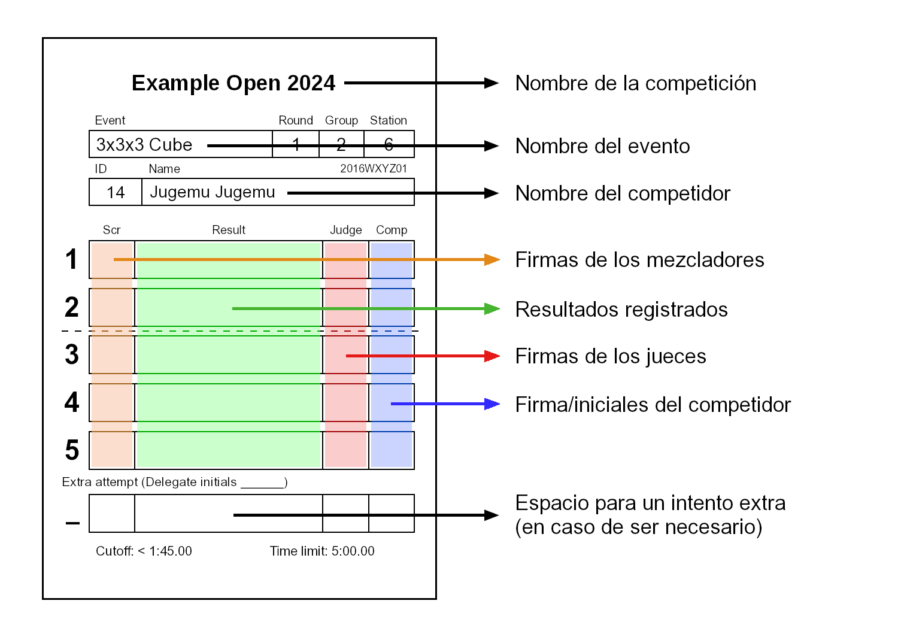

# Tutorial para Competiciones de la WCA

Para facilitar la lectura de este documento, se utiliza el masculino (el) en ocasiones donde tanto el término masculino como el femenino (el/la) son aplicables.

## Organización de la WCA - Introducción General

{.logo height=133px}
La World Cube Association es la organización que regula las competiciones de speedcubing en todo el mundo. Toda competición aprobada por la WCA debe cumplir con las [Reglas](wca{regulations}) y [Directrices](wca{regulations/guidelines.html}) de la WCA. Por esta razón, es muy importante que estés familiarizado con estos documentos antes de asistir a una competición.

Este documento te guiará a través de los conocimientos básicos que debes tener a la hora de competir y juzgar. Leer este documento puede ser de mucha utilidad para conocer lo básico acerca de las competiciones oficiales de la WCA, pero aún así te recomendamos que leas las Reglas y Directrices de la WCA y que participes en el "Tutorial para Competidores" en la competición a la que asistas, si es que tiene uno.

## Roles en las competiciones
- **Delegado**: Los Delegados son los oficiales de la WCA y son los responsables de asegurarse que se cumple con el Reglamento de la WCA durante la competición. También son los responsables de manejar los incidentes y de ocuparse de las mezclas y los resultados. Si en algún momento tienes una duda, deberías preguntarle al Delegado antes que a cualquier otra persona.

::::: {.box .important}
¡Si no estás seguro de algo pregúntale al Delegado!
:::::

- **Organizador**: Los organizadores son responsables de organizar la competición y de asegurarse que se desarrolla lo mejor posible. Generalmente, los organizadores son cuberos con experiencia, por lo que es probable que también te puedan ayudar. Simplemente recuerda que solo los Delegados pueden tomar decisiones oficiales.
- **Competidor**: Tu rol es el de competidor. Sin embargo, es posible que se te pida que seas juez o runner en algún momento de la competición.
- **Juez**: Los jueces se aseguran de que los intentos se dan de acuerdo a las Reglas de la WCA. Al final de cada intento, ellos certifican con su firma que el intento se desarrolló conforme a las reglas.
- **Runner**: Los runners son los responsables de llevarle los puzzles a los jueces y los mezcladores.
- **Mezcladores**: Los mezcladores aplican las secuencias de mezcla oficiales a los puzzles de los competidores. Ellos certifican con su firma que la secuencia de mezcla aplicada es la correcta.

## Materiales {.page-break-before}

- **Temporizador Stackmat**: este es el dispositivo oficial para medir los tiempos de resolución en las competiciones. Te puedes encontrar con cualquiera de las tres versiones que se ven abajo.

{.centered height=200px}

- **Mat**: Los temporizadores Stackmat deben ser usados con un mat (tapete). El mat ayuda a evitar que el puzzle se deslice al final de los intentos.

{.centered width=600px}

- **Cronómetro**: los cronómetros se utilizan para medir los tiempos de inspección. También se emplean para medir el tiempo de los intentos de más de 10 minutos. Se debe tener en cuenta que los cronómetros pueden ser de diferentes modelos, por lo tanto, su funcionamiento puede ser diferente al del cronómetro que se muestra en la imagen.

{.centered height=200px}

- **Tapacubos**: los tapacubos se utilizan para cubrir el puzzle antes del intento, con el objetivo de que los competidores no puedan verlo.

{.centered height=200px .page-break-after}

- **Hoja de resultados**: luego de mezclar el puzzle, el mezclador firma en la hoja de resultados confirmando que la mezcla es correcta. Adicionalmente, después de cada intento, el juez escribe el resultado en la hoja de resultados, la firma y le solicita al competidor que firme, reconociendo que el resultado:
  - 1) es correcto,
  - 2) está completo,
  - 3) tiene el formato adecuado,
  - 4) es legible.

{.centered height=600px}

::::: {.box .attention}
Si un tiempo en tu hoja de resultados no es legible, se registrará el peor resultado que se pueda interpretar para ese intento.
:::::

::::: {.box .attention}
¡El competidor no debe firmar la hoja de resultados antes de que el juez haya registrado y firmado el intento!
Penalización: descalificación del intento.
:::::

::::: {.box .attention}
¡El juez no debe firmar la hoja de resultados antes de registrar el resultado!
:::::

## Procedimiento para competir {.page-break-before}

### Evento:
Las competiciones de la WCA tienen uno o más eventos. El evento más común es el cubo 3x3x3, pero en total hay 17 eventos oficiales.

### Ronda:
La mayoría de los eventos generalmente tienen múltiples rondas: la primera, con todos los competidores registrados para el evento, y otras posteriores con los competidores que hayan logrado avanzar.

### Grupos:
Cada ronda se divide en uno o más grupos. Esto ayuda a prevenir que se saturen las estaciones de resolución con todos los competidores de la ronda. Además, la mayoría de las competiciones dependen de los mismos competidores para cumplir con los roles de juez, runner y mezclador, para los demás competidores de la ronda. Dividir a los competidores de una misma ronda en múltiples grupos, con diferentes mezclas, permite que puedan ayudar con las tareas mencionadas.

### A la hora de entregar tu puzzle:
Cuando tu grupo es llamado, debes estar listo para entregar tu puzzle. Encontrarás hojas de resultados sobre una mesa: busca la que tenga tu nombre escrito y deja tu puzzle sobre ella. Luego debes ir a la zona de espera.

::::: {.box .attention}
¡Recuerda que debes estar listo para entregar tu puzzle tan pronto como tu grupo sea llamado!
:::::

### Jueces fijos o jueces runner:
Las competiciones utilizan distintos sistemas, de modo que los jueces tienen pequeñas diferencias en sus roles y deberes dependiendo del sistema utilizado.

- Los **jueces fijos** se sientan en una misma estación de resolución y juzgan a varios competidores, uno tras otro. Los runners se encargarán de llevar los puzzles de la estación de mezcla a la estación de resolución, llamar a los competidores y repartirlos entre los jueces fijos.
- Los **jueces runner** toman el puzzle de la estación de mezcla, llaman al competidor correspondiente, lo llevan a una estación de resolución, ejecutan el procedimiento de resolución y luego devuelven el puzzle a la estación de mezcla.

### Al comenzar la resolución:
Antes de cada intento, el juez debe asegurarse de que el temporizador está encendido y de que haya sido reiniciado.

Cuando el competidor se sienta en la estación, el juez/runner coloca el puzzle cubierto sobre el mat y luego espera hasta que el competidor esté listo para iniciar el intento.

El juez se asegura de que el competidor está listo para iniciar el intento preguntándole "¿Listo?".

::::: {.box .important}
¡El juez debe asegurarse de que el competidor está listo! Remover la cobertura del puzzle antes de tiempo puede derivar en un intento extra.
:::::

::::: {.box .attention .page-break-before}
¡Recuerda que tienes 1 minuto para iniciar el intento a partir de que te sientas en la estación con el puzzle sobre el mat!
:::::

### Inspección:
La fase de inspección comienza cuando el competidor le confirma al juez de que está listo, diciendo "Sí" (o realizando cualquier otro gesto entendible). En ese momento, el juez le quita la cobertura al puzzle y comienza a medir el tiempo de inspección con un cronómetro. Durante la inspección, el competidor tiene un máximo de 15 segundos para inspeccionar el puzzle. Puede tomar el puzzle y mirarlo por todos lados, pero no debe aplicar ninguna clase de movimiento. Si el competidor le aplica algún movimiento al puzzle, el juez descalifica la resolución y el intento termina. La siguiente tabla muestra qué acciones ocurren durante la inspección.

| Tiempo         | Acción                                    |
| -------------- |:-----------------------------------------:|
| 8 segundos     | El juez dice "8 segundos"                 |
| 12 segundos    | El juez dice "12 segundos"                |
| 15 segundos    | El juez no detiene el intento, pero aplica una penalización de +2 segundos al final del intento |
| 17 segundos    | El juez detiene el intento y aplica DNF |

::::: {.box .important}
¡El competidor tiene un máximo de 15 segundos para inspeccionar el puzzle!
:::::

::::: {.box .attention}
¡Recuerda que el competidor no tiene permitido aplicar ningún movimiento durante la inspección!
:::::

Una vez que el competidor inicia la resolución, la fase de inspección finaliza y el juez ya no realizará ninguna acción de la fase de inspección.

El juez debe iniciar el cronómetro tan pronto como remueve la cobertura del puzzle y debe detenerlo solo cuando el competidor **levanta las manos del timer** (iniciando el timer).

### Resolución:
Al final de la inspección, el competidor coloca el puzzle en el mat (orientado de cualquier forma) y pone las manos sobre los sensores del timer para iniciarlo. El competidor es quien elige cuándo iniciar la resolución, puede hacerlo en cualquier momento de la fase de inspección. El competidor no debe estar tocando el puzzle y sus manos deben estar planas, con las palmas hacia abajo y los dedos tocando los sensores. Es entonces que el competidor puede iniciar la fase de resolución, quitando las manos del timer y comenzando a resolver el puzzle.

::::: {.box .important}
Al colocar las manos sobre el timer, el competidor primero verá una luz roja y luego una verde. El timer estará listo para comenzar la resolución solo cuando la luz verde se encienda.
:::::

::::: {.box .attention .page-break-before}
Recuerda que para iniciar la resolución, las manos del competidor deben estar planas, con las palmas hacia abajo y **los dedos** sobre los sensores del timer, ¡No las palmas! (Penalización: +2 segundos [A4b](http://wca.link/A4b))
:::::

### Terminando la resolución:
Una vez que el puzzle está resuelto, el competidor detiene el timer colocando las manos en los sensores. No deben estar tocando el puzzle y sus manos deben estar planas, con las palmas hacia abajo.

::::: {.box .attention}
¡Recuerda que para terminar la resolución, las manos del competidor deben estar planas, con las palmas hacia abajo! (Penalización: +2 segundos [A6d](http://wca.link/A6d))
:::::

El juez corrobora si el puzzle está resuelto o no y le comunica el resultado al competidor: "OK", "PENALIZACIÓN" o "DNF". El competidor no tiene permitido tocar el puzzle hasta que el juez haya tomando una decisión.

::::: {.box .important}
Si se necesita ayuda en una decisión, o si ocurre algo fuera de lo normal, por favor no dudes en contactar al Delegado de la WCA.
:::::

::::: {.box .important}
Recuerda que las penalizaciones son acumulativas, por lo tanto, podrías tener múltiples penalizaciones de +2 segundos en el mismo intento.
:::::

### Administración:
Una vez que la resolución terminó, el juez escribe el resultado en la hoja de resultados y luego la firma. El competidor, luego de corroborar que el resultado está correcta y claramente escrito y que el juez ha firmado, firma la hoja de resultados, aceptando el resultado.

Si el competidor tiene más intentos por delante, debe volver a la zona de espera. El juez coloca el puzzle y la hoja de resultados en el tapacubos y luego el juez/runner lo devuelve a la estación de mezcla

::::: {.box .important}
Tanto el juez como el competidor deben firmar la hoja de resultados para confirmar el resultado registrado.
:::::

::::: {.box .attention}
¡Recuerda que el competidor necesita asegurarse de que el resultado registrado es correcto y legible antes de firmar el intento!
:::::

## Reglas importantes {.page-break-before}

- **Al comenzar la resolución**:

La [Regla A4)](wca{regulations/#A4}) es la que indica la forma correcta de iniciar el timer.

{.centered width=90%}

::::: {.box .attention}
¡Recuerda que comenzar la resolución incorrectamente puede implicar penalizaciones!
:::::

- **Durante la resolución**:

La [Regla A5)](wca{regulations/#A5}) explica las reglas que aplican durante la resolución.
Durante toda la resolución, solo puedes hablar con tu juez o el Delegado de la WCA, no puedes recibir ninguna ayuda externa de objetos ni personas. La penalización por cualquiera de dichas infracciones es un DNF.

- **Al detener el timer**:

La [Regla A6)](wca{regulations/#A6}) es la que explica cómo se debe detener el timer correctamente.

{.centered width=90%}

::::: {.box .attention .page-break-after}
¡Recuerda que detener la resolución incorrectamente puede implicar penalizaciones!
:::::

- **Desalineaciones**:

| <!-- --> | <!-- --> {width=650px} |
| --- | --- |
| {width=150px} | **Sin penalización:** el cubo está resuelto y las desalineaciones de todas las capas, comparado con sus capas adyacentes, son menores a 45°. |
| {width=150px} | **+2:** el cubo está resuelto, pero la capa desalineada excede los 45°, lo que significa que el cubo se encuentra a un movimiento de estar oficialmente resuelto. Por favor, ten en cuenta que las Reglas de la WCA consideran que todos los estados del puzzle están a un movimiento del estado resuelto si tienes que girar una sola cara del puzzle para alcanzarlo – **incluso si es un giro doble.** |  
| {width=150px} | **Pregúntale al Delegado:** en caso de que no esté claro si hay que aplicar una penalización de +2 o no, **no toques el puzzle** y pídele a un Delegado que vaya a la estación. |
| {width=150px} | **DNF:** cuando es necesario más de un movimiento para resolver el puzzle, el resultado del intento es DNF. |
| {width=150px} | **DNF:** si una de las capas centrales está desalineada, se cuenta como dos movimientos restantes para llegar al estado resuelto, ya que solo se cuentan los giros de las capas externas. Entonces, el resultado del intento es DNF. |

::::: {.box .important}
¡Si no estás seguro acerca de una penalización, siempre pregúntale a un Delegado!
:::::

## Definiciones importantes {.page-break-before}

- **Formatos:** dependiendo del evento, hay distintas formas de calcular los resultados para determinar la posición de los competidores en el ranking. Los formatos legales son:

  - **Promedio de 5**: todos los competidores realizan 5 intentos. Cuando terminan todos los intentos, el mejor y el peor resultado se descartan y el promedio se calcula con los 3 resultados restantes.
  - **Media de 3**: todos los competidores realizan 3 intentos. El promedio se calcula con los 3 resultados.
  - **Mejor de X**: todos los competidores realizan X intentos, donde X equivale a 1, 2 o 3. El mejor resultado entre estos X intentos es el resultado final.

- **Corte o Cutoff**: algunos eventos pueden tener una "ronda de corte". La mayoría de las veces, el formato de la misma es "Mejor de 2 / Promedio de 5" o "Mejor de 1 / Media de 3". En ambos casos, también hay cierto tiempo definido, el tiempo de corte. Esto significa que primero realizarás uno o dos intentos, y si ninguno de ellos está por debajo del corte, no podrás continuar con los intentos restantes de la ronda. Si consigues por lo menos un resultado por debajo del tiempo de corte, puedes continuar con los demás intentos del promedio/media.

- **Tiempo límite**: el tiempo límite es el máximo que un competidor puede utilizar para un intento. Si un competidor alcanza el tiempo límite, el juez lo detiene inmediatamente y le asigna un DNF al intento. Algunos eventos tienen tiempo límite acumulativo. Un tiempo límite acumulativo funciona como un tiempo límite normal, solo que se aplica a la suma de todos los resultados de la ronda. En caso de haber un tiempo límite acumulativo, si el resultado es DNF, el tiempo que se tomó para llegar a dicho DNF se escribe entre paréntesis.

- **DNF**: Did Not Finish (No Ha Terminado). DNF es el peor resultado en speedcubing y generalmente se aplica como penalización.

- **DNS**: Did Not Start (No Ha Empezado). DNS significa que el competidor tenía derecho a realizar el intento, pero que lo rechazó. (Nota: el intento comienza con la fase de inspección, no con la resolución). En general, los jueces no son quienes aplican resultados DNS.

- **Intento extra**: en situaciones particulares, puedes recibir un intento extra. Esto quiere decir que tienes la oportunidad de volver a realizar un intento (con una mezcla diferente) porque hubo un incidente durante el intento original. Solo los Delegados pueden otorgar intentos extra, así que deberías reportarle a ellos cualquier incidente que ocurra.

::::: {.box .important}
¡Los intentos extra solo pueden ser otorgados por los Delegados!
:::::

## Además... {.page-break-before}

- **... nunca hables sobre las mezclas antes del final de la ronda.**

  :::{.text-right}
  *Tendrás tiempo suficiente para discutir sobre las mezclas en otro momento. :)*
  :::

- **... nunca hables con nadie durante la resolución (que no sea el juez o el Delegado).**

  :::{.text-right}
  *No vale la pena arriesgarse a obtener un DNF.*
  :::

- **... nunca molestes a un competidor cuando seas el juez (p.ej. jugar con tu teléfono móvil o tu puzzle, o hablar con alguien).**

  :::{.text-right}
  *No te gustaría ser interrumpido durante tus intentos, así que asegúrate de no molestar a los demás.*
  :::

- **... nunca hables con el competidor que estés juzgando, a no ser que sea para preguntarle si está listo, para avisarle a los 8 y 12 segundos de inspección, para confirmar los resultados o para resolver algún incidente.**

  :::{.text-right}
  *Hablarle por cualquier otro motivo podría molestarlo.*
  :::

- **... nunca toques el puzzle si queda desalineado cuando el competidor detiene el timer.**

  :::{.text-right}
  *Si lo haces, podrías influenciar la decisión del Delegado. Llámalo inmediatamente a la estación.*
  :::

- **... nunca utilices tu teléfono/cámara con la pantalla hacia ti cuando estés grabando una resolución.**

  :::{.text-right}
  *Tener la pantalla de la cámara a la vista invalida (DNF) automáticamente la resolución afectada.*
  :::

- **... nunca redondees los resultados cuando seas juez.**

  :::{.text-right}
  *Los resultados deberían ser registrados exactamente como se muestran en el timer, no deben ser redondeados. (P.ej. 14.587 no debería ser registrado como 14.59 y 14.500 no debería ser registrado como 14.5).*
  :::

- **... nunca utilices flash en una fotografía durante una competición.**

  :::{.text-right}
  *No es agradable quedar encandilado durante tus intentos oficiales.*
  :::

- **... nunca tomes una decisión si no estás 100% seguro de que sea correcta.**

  :::{.text-right}
  *¡Asegúrate de adherirte a las Reglas de la WCA y pregúntale a un Delegado!*
  :::

{.centered width=90%}

