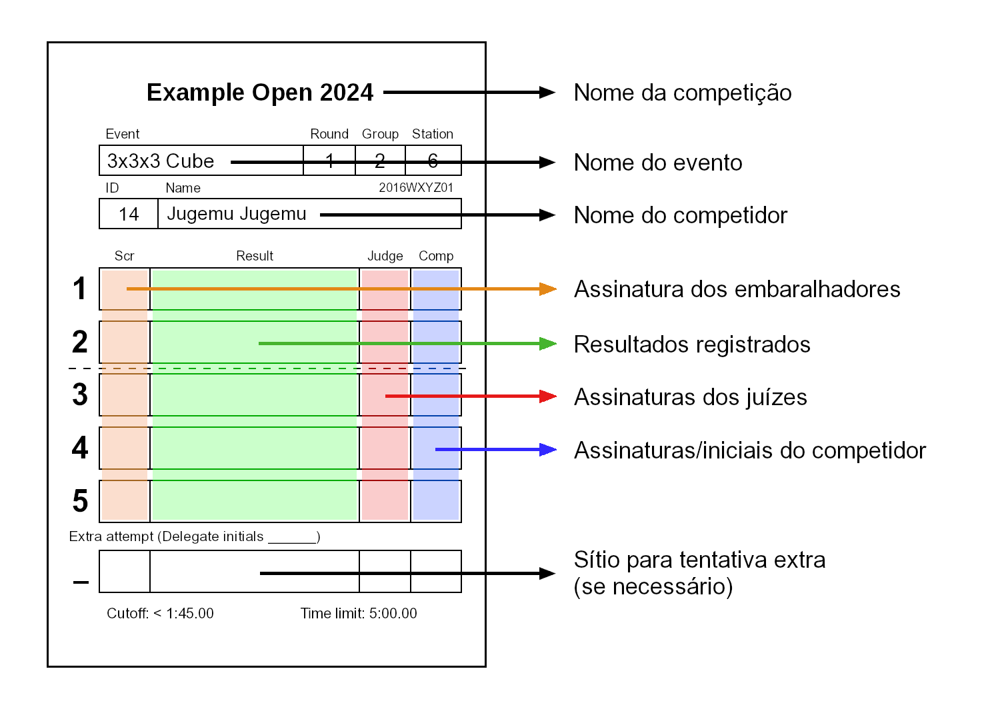
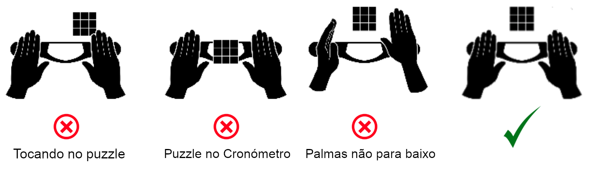
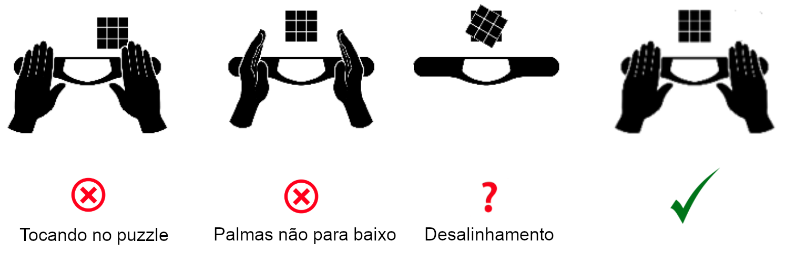
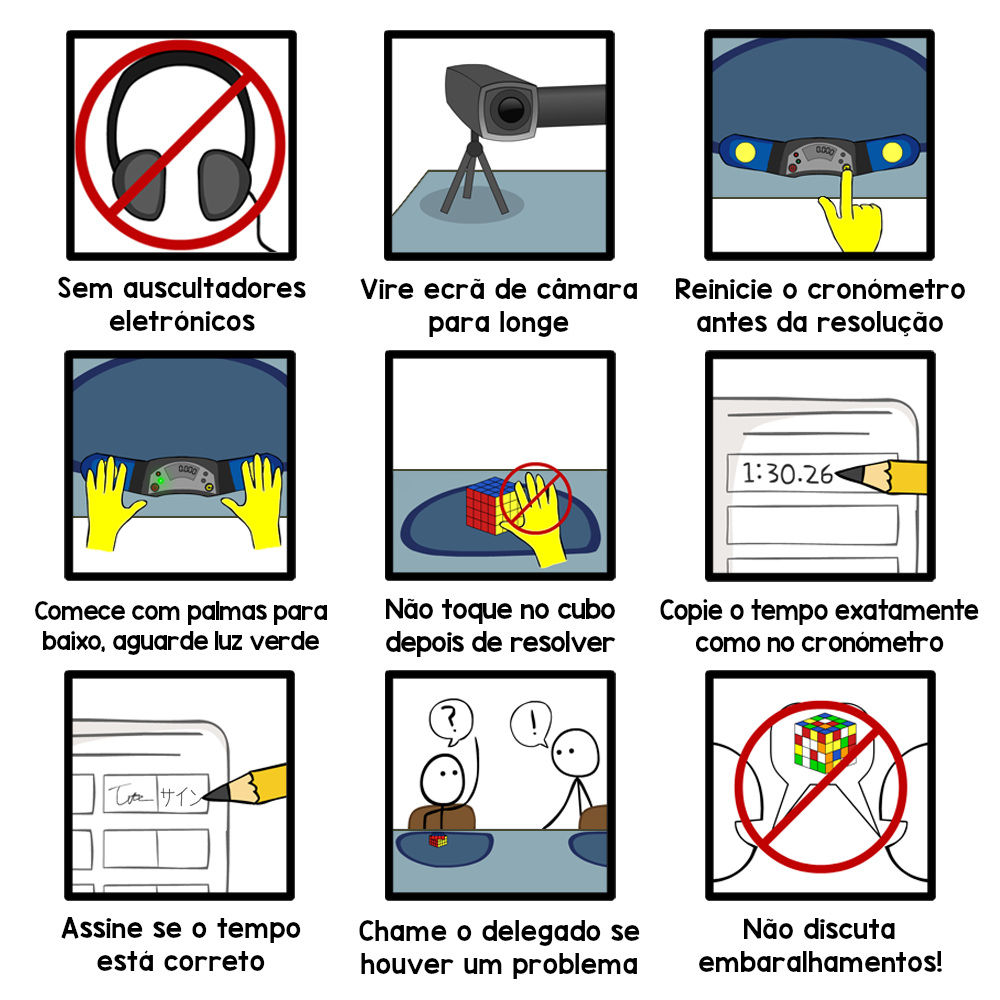

# Tutorial de Competição WCA

Consulte o final deste documento para ver outras traduções.

## Organização WCA - Introdução Geral

{.logo height=133px}
A World Cube Association é a organização que rege as competições de speedcubing em todo o mundo. Todas as competições sancionadas pela WCA devem seguir os seus [Regulamentos](https://www.worldcubeassociation.org/regulations/) e as [Orientações](https://www.worldcubeassociation.org/regulations/guidelines.html), por isso é muito importante que os conheça antes de ir a uma competição.

Este documento irá guiá-lo através dos fundamentos de como competir e ajuizar. A leitura deste documento pode ser muito útil para obter uma visão básica sobre as competições oficiais da WCA, mas ainda recomendamos que leia os Regulamentos e Orientações da WCA e participe do evento "Tutorial da Competição" na competição, se a sua competição tiver um.

## Papéis nas competições

- **Delegado**: Os Delegados são os oficiais da WCA e são responsáveis por garantir que os Regulamentos da WCA são seguidos durante a competição. Eles também lidam com incidentes e são responsáveis por disputas e resultados. Se tiver dúvidas ou perguntas, elas devem ser a sua primeira escolha para perguntar.

::::: {.box .important}
Se tiver dúvidas sobre algo, pergunte sempre ao Delegado!
:::::

- **Organizador**: Os organizadores são responsáveis por organizar a competição e por garantir que ela decorre sem problemas. Normalmente, os organizadores são cubers experientes, por isso eles também podem ajudá-lo. Lembre-se apenas de que só o Delegado pode tomar decisões oficiais.
- **Competidor**: A sua função básica é a de um competidor. No entanto, pode ser chamado para ajuizar ou ser corredor, caso seja necessário.
- **Juiz**: Os juízes garantem que as tentativas são realizadas de acordo com o Regulamento. No final de cada tentativa, certificam com a sua assinatura que correu tudo bem.
- **Corredor**: Os corredores são responsáveis por mover os puzzles entre embaralhadores e juízes.
- **Embaralhador**: Embaralhadores aplicam sequências oficiais de embaralhamento nos puzzles dos competidores. Eles certificam com sua assinatura que o embaralhamento aplicado foi correto.

## Objetos na competição {.page-break-before}

- **Cronómetro Stackmat**: Este é o dispositivo oficial para medir tempos numa competição.
  Pode parecer-se com qualquer uma das três versões abaixo.

{.centered height=200px}

- **Tapete**: Cronómetros Stackmat timers têm de ser usados com os tapetes que os acompanham. O tapete ajuda a evitar que os puzzles deslizem no final da tentativa.

{.centered width=600px}

- **Cronómetro**: Cronómetros são usados para medir o tempo de inspeção. Também são usados para medir o tempo de tentativas acima de 10 minutos. Note que os cronómetros podem ser de modelos diferentes e, portanto, o seu funcionamento pode ser diferente daquele mostrado na figura.

{.centered height=200px}

- **Cobertura**: As coberturas são usadas para cobrir um puzzle antes de uma tentativa, para que os competidores não possam ver os embaralhamentos.

{.centered height=200px .page-break-after}

- **Folha de resultados**: Depois de um puzzle ser embaralhado, o embaralhador assina a sua correção na folha de resultados. Além disso, após cada resolução, o juiz anota o resultado na folha de resultados, assina e faz com que o competidor assine, para reconhecer que o resultado é
  - 1. correto
  - 2. completo,
  - 3. devidamente formatado, e
  - 4. claramente legível.

{.centered height=600px}

::::: {.box .attention}
Se um tempo na sua folha de resultados estiver ilegível, o pior resultado interpretável será inserido para aquela tentativa.
:::::

::::: {.box .attention}
O competidor não pode assinar a folha de resultados antes que o juiz tenha registado e assinado a tentativa!
Penalidade: Desqualificação da resolução
:::::

::::: {.box .attention}
O juiz não deve assinar a folha de resultados antes de registar o resultado!
:::::

## Procedimento de Competição {.page-break-before}

### Evento:

As competições da WCA têm um ou mais eventos. O evento mais comum é o Cubo 3x3x3 normal, mas no total há 17 eventos oficiais.

### Ronda:

A maioria dos eventos geralmente tem várias rondas: uma primeira ronda com todos os competidores do evento e, possivelmente, outras para as quais apenas alguns dos competidores avançam.

### Grupos:

Cada ronda é dividida em um ou mais grupos. Isso ajuda a evitar estações de cronómetros Stackmat lotadas com todos os competidores numa mesma ronda ao mesmo tempo. A maioria das competições também depende de competidores para ajuizar, correr e embaralhar uns para os outros na mesma ronda, e dividir os competidores em vários grupos com diferentes embaralhamentos permite que eles possam ajudar sem ver embaralhamentos que tentarão resolver no futuro.

### Submetendo o seu puzzle:

Quando o seu grupo for chamado, deve estar pronto para submeter o seu puzzle. Encontrará folhas de resultados colocadas na mesa designada; procure aquele com o seu nome, coloque o seu puzzle nele e vá para a área de espera.

::::: {.box .attention}
Lembre-se de que deve estar pronto para submeter o seu puzzle assim que o seu grupo for chamado!
:::::

### Juízes estacionários ou juízes corredores:

As competições usam sistemas diferentes, portanto os juízes podem ter tarefas e atribuições ligeiramente diferentes com base no sistema que está a ser usado.

- **Juízes estacionários** sentam-se na mesma estação de resolução e ajuizam vários competidores em sequência. Os corredores levam os puzzles da mesa de embaralhamento, chamam os competidores e distribuem-nos aos juízes estacionários. Os deveres dos juízes limitam-se apenas ao procedimento de resolução.
- **Juízes corredores** levam os puzzles da mesa de embaralhamento, chamam os competidores relevantes na área de espera, levam-nos a uma estação de resolução, seguem o procedimento de resolução e, em seguida, trazem o puzzle de volta à mesa de embaralhamento.

### Iniciando a resolução:

Antes de cada tentativa, o juiz precisa de garantir que o Cronómetro Stackmat está ligado e tenha sido colocado a zero.

Quando o competidor se senta na estação de resolução, o juiz/corredor coloca o puzzle coberto no tapete e espera até que o competidor esteja pronto para iniciar a tentativa.

O juiz certifica-se de que o competidor está pronto para a tentativa, perguntando “Pronto?”

::::: {.box .important .page-break-before}
O juiz precisa ter certeza de que o competidor está pronto! Levantar a tampa muito cedo pode levar a uma tentativa extra.
:::::

::::: {.box .attention}
Lembre-se de que tem 1 minuto para iniciar a sua tentativa assim que se sentar na estação com o puzzle colocado no tapete!
:::::

### Inspeção:

A fase de inspeção começa quando o competidor confirma ao juiz que está pronto dizendo “Sim” (ou outro gesto claro). Nesse momento, o juiz levanta a cobertura e aciona o cronómetro para medir a fase de inspeção. Durante a inspeção, o competidor tem no máximo 15 segundos para inspecionar o puzzle. Podem pegar no puzzle e olhá-lo de todos os lados, mas não devem aplicar nenhum movimento. Se o competidor fizer um movimento, o juiz desclassifica a resolução e a tentativa é encerrada. A tabela a seguir mostra que ações ocorrem durante a inspeção.

| Tempo       |                                               Ação                                                |
| ----------- | :-----------------------------------------------------------------------------------------------: |
| 8 segundos  |                                       Juiz diz "8 segundos"                                       |
| 12 segundos |                                      Juiz diz "12 segundos"                                       |
| 15 segundos | Juiz não interrompe a tentativa, mas adiciona uma penalidade de +2 segundos no final da tentativa |
| 17 segundos |                            Juiz interrompe a tentativa e aplica um DNF                            |

::::: {.box .important}
O competidor tem até 15 segundos para inspecionar o puzzle!
:::::

::::: {.box .attention}
Lembre-se que durante a inspeção o competidor não pode aplicar nenhum movimento!
:::::

Assim que o competidor iniciar a sua resolução, a fase de inspeção termina e o juiz não realizará mais nenhuma ação da fase de inspeção.

O juiz deve iniciar o cronómetro assim que levantar a cobertura e pará-lo somente quando o competidor **levantar as mãos do Cronómetro Stackmat** (e, portanto, iniciar o Cronómetro).

### Resolvendo:

No final da inspeção, o competidor coloca o puzzle no tapete (em qualquer orientação) e coloca as mãos nos sensores do Cronómetro Stackmat para acioná-lo. A escolha de quando iniciar a resolução depende do competidor e ele pode fazer isso a qualquer momento durante a fase de inspeção. O competidor não deve estar a tocar no puzzle e as suas mãos devem estar espalmadas, com as palmas voltadas para baixo e os dedos a tocar nos sensores. O competidor pode então iniciar a fase de resolução levantando as mãos do Cronómetro Stackmat e iniciar a resolução.

::::: {.box .important .page-break-before}
Ao colocar as mãos no Cronómetro Stackmat, o competidor verá primeiro uma luz vermelha e depois uma verde. Só quando a luz ficar verde é que o Cronómetro estará pronto para o competidor iniciar a resolução.
:::::

::::: {.box .attention}
Lembre-se que para iniciar a resolução, as mãos do competidor devem estar espalmadas, palmas para baixo e devem tocar os sensores com os dedos, não com as palmas! (Penalidade: +2 segundos [A4b](http://wca.link/A4b))
:::::

### Terminando a resolução:

Quando o puzzle é resolvido, o competidor para o Cronómetro colocando as mãos nos sensores. Não devem tocar no puzzle e as suas mãos devem estar espalmadas com as palmas para baixo.

::::: {.box .attention}
Lembre-se que para parar a resolução, as mãos do competidor devem estar espalmadas com as palmas para baixo! (Penalidade: +2 segundos [A6d](http://wca.link/A6d))
:::::

O juiz verifica se o puzzle foi resolvido ou não e informa o resultado ao competidor: “OK”, “PENALIDADE” ou “DNF”. O competidor não tem permissão para tocar no puzzle até que o juiz tenha claramente tomado uma decisão.

::::: {.box .important}
Se precisar de ajuda numa decisão ou se algo irregular acontecer, entre em contato com o Delegado da WCA sem hesitações.
:::::

::::: {.box .important}
Lembre-se de que as penalidades são cumulativas, então é possível receber várias penalidades de +2 segundos na mesma tentativa.
:::::

### Administração:

Uma vez concluída a resolução, o juiz escreve o resultado na folha de resultados e assina-a. O competidor, após verificar que o resultado está escrito corretamente e claramente legível e que o juiz assinou, assina também a folha, para aceitá-lo.

Se o competidor tiver mais tentativas a realizar, precisará de voltar para a área de espera. O juiz coloca o puzzle e a folha de resultados na cobertura e, em seguida, o juiz/corredor leva-os de volta à mesa de embaralhamento.

::::: {.box .important}
Tanto o juiz quanto o competidor têm de confirmar o resultado na folha de resultados com suas assinaturas.
:::::

::::: {.box .attention}
Lembre-se que o competidor precisa de verificar se o tempo escrito está correto e legível antes de assinar a tentativa!
:::::

## Regulamentos Importantes {.page-break-before}

- **Iniciando a resolução**:

[Regulamento A4)](https://www.worldcubeassociation.org/regulations/#A4) é o regulamento que indica como iniciar o Cronómetro corretamente.

{.centered width=90%}

::::: {.box .attention}
Lembre-se de que iniciar a resolução incorretamente leva a penalidades!
:::::

- **Durante a resolução**:

[Regulamento A5)](https://www.worldcubeassociation.org/regulations/#A5) explica as regras durante a resolução.
Durante toda a resolução, só pode falar com o seu juiz ou com o Delegado da WCA, não pode receber ajuda externa de nenhum objeto ou pessoa. A penalidade para qualquer destas infrações é um DNF.

- **Parando o Cronómetro**:

[Regulamento A6)](https://www.worldcubeassociation.org/regulations/#A6) é o regulamento que explica como parar o Cronómetro Stackmat corretamente.

{.centered width=90%}

::::: {.box .attention .page-break-after}
Lembre-se que parar a resolução incorretamente leva a penalidades!
:::::

- **Desalinhamentos**:

| <!-- -->                                  | <!-- --> {width=650px}                                                                                                                                                                                                                                                                                                                                                               |
| ----------------------------------------- | ----------------------------------------------------------------------------------------------------------------------------------------------------------------------------------------------------------------------------------------------------------------------------------------------------------------------------------------------------------------------------------------- |
| {width=150px} | **Sem penalidade:** o cubo é resolvido e os desalinhamentos de todas as camadas em comparação com suas camadas adjacentes estão abaixo de 45°.                                                                                                                                                                                                                                            |
| {width=150px}     | **+2:** o cubo está resolvido, mas a camada desalinhada excede 45°, o que significa que o cubo está a um passo de ser resolvido. Note que os Regulamentos da WCA consideram todos os estados do puzzle como estando a um movimento de distância do estado resolvido se tiver que se girar apenas uma camada do puzzle para chegar ao estado resolvido – **mesmo que seja um giro duplo.** |
| {width=150px}   | **Pergunte ao Delegado:** Se não estiver claro se uma penalidade de +2 deve ser aplicada ou não, **não toque no puzzle** e chame um Delegado para a estação de resolução.                                                                                                                                                                                                                 |
| {width=150px} | **DNF:** Quando mais do que um movimento é necessário para resolver o puzzle, o resultado da tentativa é DNF.                                                                                                                                                                                                                                                                             |
| {width=150px}  | **DNF:** Se uma camada do meio do puzzle estiver desalinhada, isso conta como dois movimentos necessários para resolver, pois apenas as rotações das camadas externas são contadas. Portanto, o resultado da tentativa é DNF.                                                                                                                                                             |

::::: {.box .important}
Se não tiver a certeza sobre as penalidades, pergunte sempre a um Delegado!
:::::

## Definições Importantes {.page-break-before}

- **Formatos** Dependendo do evento, existem diferentes formas de calcular os resultados que são usados para classificar os competidores. Os formatos legais são:

  - **Média de 5**: Cada competidor faz 5 tentativas. Quando todas são feitas, o melhor e o pior resultado são descartados e a média é calculada usando os 3 resultados restantes.
  - **Média de 3**: Cada competidor faz 3 tentativas. A média é calculada usando esses 3 resultados.
  - **Melhor de X**: Cada competidor faz X tentativas, onde X é igual a 1, 2 ou 3. O melhor resultado entre essas X tentativas é o resultado final.

- **Tempo de corte**: Alguns eventos podem ter uma "Ronda de corte". Na maioria das vezes, o formato para isso é “Melhor de 2 / Média de 5” ou “Melhor de 1 / Média de 3”. Em ambos os casos , há também um certo tempo, o tempo de corte, fornecido também. Isso significa que fará primeiro uma ou duas tentativas e, se nenhum dos resultados estiver abaixo do tempo de corte, a sua ronda terminará. Se conseguiu pelo menos um resultado abaixo do tempo de corte, pode continuar com a ronda e terminar a sua média.

- **Tempo limite**: O tempo limite é o tempo máximo que um competidor pode usar para uma tentativa. Se um competidor atingir o limite de tempo, o juiz interrompe o competidor imediatamente e atribui-lhe um DNF para a resolução. Alguns eventos têm limites de tempo cumulativos. Um limite de tempo cumulativo funciona como um limite de tempo normal, mas é aplicado à soma de todos os seus resultados para toda a ronda e não aos resultados individuais. No caso de um limite de tempo cumulativo, se o resultado for um DNF, o tempo necessário para obter esse DNF também será escrito entre parêntesis.

- **DNF**: Did Not Finish (Não terminou). DNF é o pior resultado em speedcubing e geralmente é dado como penalidade.

- **DNS**: Did Not Start (Não começou). DNS significa que o competidor era elegível para uma tentativa, mas recusou-a. (Observação: a tentativa começa com a fase de inspeção, não com a resolução.) Os resultados de DNS geralmente não são atribuídos pelos juízes.

- **Tentativa extra**: Em certas situações, pode receber uma tentativa extra. Isso significa que tem a possibilidade de refazer uma tentativa usando um embaralhamento extra porque houve um incidente durante a tentativa original. Apenas os Delegados podem atribuir tentativas extras, portanto, relate-lhes sempre qualquer incidente.

::::: {.box .important}
Tentativas extras apenas podem ser dadas por um Delegado!
:::::

## Nunca deve... {.page-break-before}

- **... falar sobre os embaralhamentos antes da ronda acabar.**

  :::{.text-right}
  _Terá muito tempo para os discutir mais tarde. :)_
  :::

- **... falar com alguém durante as suas resoluções (que não seja o seu juiz ou um Delegado).**

  :::{.text-right}
  _Nunca será tão importante arriscar um DNF por causa disso._
  :::

- **... perturbar um competidor quando estiver a ajuizar (por exemplo, a brincar com o seu telefone ou com um puzzle ou a conversar com alguém).**

  :::{.text-right}
  _Não quererá ser incomodado durante as suas tentativas, certifique-se de que outras pessoas não serão incomodadas por si._
  :::

- **... falar com um competidor quando estiver a ajuizar, exceto para dizer “Pronto?”, “8 segundos”, “12 segundos” ou para confirmar resultados ou ao resolver incidentes.**

  :::{.text-right}
  _Qualquer outra conversa pode ser perturbadora para eles._
  :::

- **... tocar no puzzle se estiver desalinhado após o competidor ter parado o Cronómetro.**

  :::{.text-right}
  _Se fizer isso, poderá influenciar a decisão do Delegado. Chame-o imediatamente para a estação de resolução._
  :::

- **... usar um telefone/câmara para gravar resoluções com um ecrã voltada para si.**

  :::{.text-right}
  _Câmaras frontais invalidam automaticamente (DNF) a resolução afetada._
  :::

- **... arredondar os resultados quando for juiz.**

  :::{.text-right}
  _Os resultados devem ser registados exatamente como são exibidos no Cronómetro, não arredondados. (Por exemplo, 14.587 não deve ser registado como 14.59 e 14.500 não deve ser registado como 14.5)_
  :::

- **... usar flash em fotografias numa competição.**

  :::{.text-right}
  _Não é uma boa sensação ficar cego pelas luzes durante as suas resoluções oficiais._
  :::

- **... tomar decisões quando não tiver 100% de certeza se está correto ou não.**

  :::{.text-right}
  _Certifique-se de que cumpre os Regulamentos da WCA e pergunte a um Delegado!_
  :::

{.centered width=90%}
