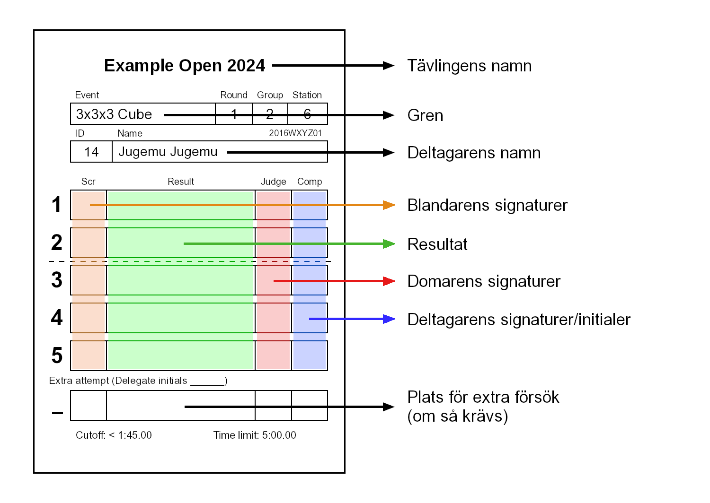

# Deltagarinstruktioner för WCA-tävlingar

## WCA som organisation - Generell Introduktion

{.logo width=15%}
WCA (World Cube Association) är organisationen som ansvarar för arrangerande av tävlingar i Speedcubing över hela världen. Alla WCA-tävlingar måste följa WCA:s [Tävlingsregler](wca{regulations}) och [Riktlinjer]((wca{regulations/guidelines.html})), därför är det viktigt att du är bekant med dessa innan du deltar.

Detta dokument guidar dig genom grunderna i att tävla och döma. Att läsa detta dokument kan vara väldigt nyttigt för att få en grundförståelse för WCA-tävlingar, men vi rekommenderar ändå att du läser WCA:s tävlingsregler och riktlinjer, samt deltar i deltagarinstruktionen om tävlingen har en sådan.

## Roller på tävlingar
- **Delegat**: Delegater är WCA:s officiella funktionärer, och de ansvarar för att WCA:s tävlingsregler följs på tävlingen. De hanterar också incidenter, och har ansvar för blandningar och resultat. Om det uppstår några tveksamheter eller frågor bör du i första hand vända dig till tävlingens delegat

::::: {.box .important}
Om du är osäker på något, fråga alltid delegaten!
:::::

- **Arrangör**: Arrangörer ansvarar för att arrangera tävlingen, och att se till att den flyter på som den ska. Arrangörer är ofta erfarna kubare, så de kan också hjälpa dig vid frågor. Kom dock ihåg att endast delegater kan ta officiella beslut.
- **Deltagare**: Din roll är huvudsakligen som deltagare. Men du kan även bli ombedd att vara domare eller runner om så behövs.
- **Domare**: Domaren ser till att alla försök utförs enligt WCA:s tävlingsregler. Vid slutet av varje försök verifierar de med en signatur att allt genomfördes på ett korrekt sätt.
- **Runner**: Runners ansvarar för att transportera pussel mellan blandarna och domarna.
- **Blandare**: Blandarna är de som blandar pusslen enligt officiella blandningssekvenser. De verifierar med en signatur att varje blandning är korrekt.

## Objekt som används på tävlingen {.page-break-before}

- **Stackmat-timer**: Detta är den officiella enheten för tidtagning på tävlingar.
Den kan se ut som någon av de tre versionerna nedan.

{.centered width=30%}

- **Matta**: Stackmat-timers måste användas tillsammans med tillhörande mattor. Mattan håller timern på plats, skyddar pusslen, och förhindrar dem från att glida iväg vid slutet av försöket.

{.centered width=70%}

- **Tidtagarur**: Tidtagarur används för att mäta inspektionstiden. De används även för att mäta tiden på försök över 10 minuter. Notera att tidtagarur kan vara av olika modeller, och de kan därför se ut och fungera annorlunda jämfört med det på bilden nedan.

{.centered width=24%}

- **Cube cover**: Cube covers används för att täcka över pusslet före ett försök, så att deltagare inte kan se blandningen i förväg.

{.centered width=24% .page-break-after}

- **Resultatkort**: När ett pussel blandats signerar blandaren på resultatkortet att det gjorts på korrekt sätt. Efter varje försök skriver domaren ner resultatet på resultatkortet och signerar. Därefter signerar deltagaren för att bekräfta att resultatet på resultatkortet är
  - 1) korrekt
  - 2) komplett
  - 3) korrekt formaterat
  - 4) tydligt läsbart

{.centered width=70%}

::::: {.box .attention}
Om någon del av resultatkortet är oläsligt kommer den sämsta möjliga tolkningen registreras för det försöket. 
:::::

::::: {.box .attention}
Deltagaren ska inte signera resultatet förrän domaren antecknat och signerat försöket!
:::::

::::: {.box .attention}
Domaren ska inte signera resultatkortet förrän resultatet har antecknats!
:::::

## Tävlingsprocedur {.page-break-before}

### Grenar:
WCA-tävlingar kan ha en eller flera grenar. Den vanligaste genen är 3x3x3, men det finns totalt 17 officiella grenar.

### Omgångar:
De flesta grenarna har vanligtvis flera omgångar: en första omgång för alla deltagare i grenen, och eventuellt fler omgångar som bara vissa deltagare går vidare till.

### Grupper:
Varje omgång är indelad i en eller flera grupper. Detta görs för att sprida ut deltagarna i omgången så att det finns plats vid lösningsstationerna. På de flesta tävlingar behöver deltagarna även hjälpa till som domare, runners, och blandare. Indelning i grupper tillåter dem att hjälpa till i en annan grupp utan att se blandningar de själva kommer lösa.

### Lämna in ditt pussel:
När din grupp ropas upp måste du vara redo att lämna in ditt pussel. Du hittar resultatkort utplacerade på ett bord. Leta efter det med ditt namn, lägg ditt pussel på kortet, och gå till väntområdet. 

::::: {.box .attention}
Kom ihåg: Du måste vara redo att lämna in ditt pussel när din grupp ropas upp!
:::::

### Stationära domare eller ”running judges”
Olika tävlingar använder olika system, så domare kan ha något olika roller och uppgifter beroende på vilket system som används.

- **Stationära domare** sitter vid samma lösningsstation under hela gruppen, och dömer flera deltagare i rad. En runner tar pusslet från blandningsbordet, ropar upp deltagaren, och fördelar dem till en domare. Domarens uppgifter är här begränsade till lösningsproceduren. Detta system är det absolut vanligaste i Sverige.
- **Running judges** är mycket ovanligt på svenska tävlingar. Här tar domaren pusslet från blandningsbordet, ropar upp deltagaren, tar dem till en lösningsstation, dömer försöket, och tar sedan tillbaka pusslet till blandningsbordet. Med detta system används alltså inga runners, utan domaren agerar runner. 

### Att starta en lösning:
Före varje försök måste domaren säkerställa att timern är påslagen, och att tiden har nollställts.

När deltagaren sätter sig vid lösningsstationen lägger domaren det täckta pusslet på mattan, och väntar på att deltagaren är redo att starta försöket.

Domaren säkerställer att deltagaren är redo för försöket genom att fråga ”Ready?”

::::: {.box .important}
Domaren måste se till att deltagaren är redo! Om pusslets cube cover lyfts för tidigt kan det leda till ett extra försök.
:::::

::::: {.box .attention .page-break-before}
Kom ihåg: Du har 1 minut på dig att starta ditt försök från det att du satt dig vid stationen med pusslet placerat på mattan!
:::::

### Inspektion:
Inspektionsfasen startar när deltagaren bekräftar för domaren att hen är redo genom att säga ”Yes” (eller med en annan tydlig signal). Domaren lyfter då pusslets cube cover, och startar ett tidtagarur för att ta tiden på inspektionsfasen. Under inspektionen har deltagaren maximalt 15 sekunder att inspektera pusslet. Deltagaren får plocka upp pusslet och kolla på det från alla sidor, men får inte göra några drag. Om deltagaren gör ett drag diskvalificerar domaren lösningen och försöket är över. Följande tabell visar vad som händer vid olika skeden av inspektionen.

| Tid           | Händelse                                  |
| ------------- |:-----------------------------------------:|
| 8 sekunder    | Domaren säger “8 seconds”                 |
| 12 sekunder   | Domaren säger “12 seconds”                |  
| 15 sekunder   | Domaren avbryter inte försöket, men kommer lägga till ett tidsstraff på +2 sekunder efter lösningen.  |
| 17 sekunder   | Domaren stoppar försöket och resultatet blir DNF (Did Not Finish) |   

::::: {.box .important}
Deltagaren har upp till 15 sekunder att inspektera pusslet!
:::::

::::: {.box .attention}
Kom ihåg: Deltagaren inte får göra några drag under inspektionen!
:::::

När deltagaren startar sin lösning avslutas inspektionsfasen, och domaren utför inga fler handlingar från inspektionsfasen.

Domaren måste starta tidtagaruret så snart de lyft pusslets cube cover, och endast stoppa det när deltagaren **lyfter händerna från timern** (och därmed startar timern).

### Lösning:

Vid slutet av inspektionen lägger deltagaren pusslet på mattan (i valfri orientering) och placerar sina händer på timerns sensorer för att starta timern. Det är upp till deltagaren att välja när hen vill starta lösningen, och det kan göras när som helst under inspektionsfasen. Medan timern startas får deltagaren inte röra pusslet, och händerna måste placeras med handflatorna nedåt, och med fingrarna i kontakt med sensorerna. Deltagaren startar lösningsfasen genom att lyfta händerna från timern och starta sin lösning.

::::: {.box .important}
När deltagaren placerar fingrarna på timern tänds först en röd lampa, och sedan en grön. Först när den gröna lampan tänts är timern redo, och deltagarn kan starta lösningen.
:::::

::::: {.box .attention .page-break-before}
Kom ihåg: Vid starten av lösningen måste deltagaren placera händerna platt, med handflatorna nedåt, och röra sensorerna med fingrarna, inte handflatorna! (Straff: +2 sekunder [A4b](http://wca.link/A4b))
:::::

### Stoppa lösningen:
När pusslet är löst stoppar deltagaren timern genom att placera händerna på sensorerna. Deltagaren får då inte röra pusslet, och handflatorna måste vara nedåt.

::::: {.box .attention}
Kom ihåg: Handflatorna måste vara nedåt när timern stoppas! (Straff: +2 sekunder [A6d](http://wca.link/A6d))
:::::

Domaren kollar om pusslet är löst eller inte, och bekräftar detta för deltagaren med ”OKAY”, ”PENALTY”, eller ”DNF”. Varken deltagaren eller domaren får röra pusslet förrän domaren tydligt har fattat ett beslut.

::::: {.box .important}
Om det behövs hjälp för att fatta ett beslut, eller om något händer under försöket, tveka inte att tillkalla delegaten.
:::::

::::: {.box .important}
Kom ihåg: Tidsstraff är kumulativa, vilken innebär att du kan få flera straff på +2 sekunder på samma försök.
:::::

### Administration:
När försöket är färdigt skriver domaren resultatet på resultatkortet, och signerar det. När deltagaren har säkerställt att resultatet är korrekt, är läsligt, och att domaren har signerat, signerar även deltagaren kortet för att acceptera det.

Om deltagaren har försök kvar går hen därefter tillbaka till väntområdet. Domaren placerar pusslet med resultatkortet i dess cube cover, och det tas därefter tillbaka till blandningsbordet.

::::: {.box .important}
Både domaren och deltagaren måste bekräfta resultatet på resultatkortet genom att signera det.
:::::

::::: {.box .attention}
Deltagaren måste verifiera att resultatet är korrekt och läsbart innan hen signerar försöket!
:::::

## Viktiga regler {.page-break-before}

- **Starta lösningen**:

[Regel A4)](wca{regulations/#A4}) reglerar hur timern ska startas.

{.centered width=90%}

::::: {.box .attention}
Kom ihåg: Att starta lösningen på ett felaktigt sätt leder till tidsstraff!
:::::

- **Under lösningen**:

[Regel A5)](wca{regulations/#A5}) förklarar reglerna under lösningen.
Under hela lösningen får deltagaren bara prata med domaren och Delegaten. Du får inte få någon hjälp från något föremål eller person. Straff för båda dessa är DNF.

- **Stoppa timern**:

[Regel A6)](wca{regulations/#A6}) reglerar hur timern ska stoppas.

{.centered width=90%}

::::: {.box .attention .page-break-after}
Kom ihåg: Att stoppa timern på ett felaktigt sätt leder till tidsstraff!
:::::

- **Feljusteringar**:

<table class="table-with-images">
  <tr>
    <td></td>
    <td>**Inget straff:** Kuben är löst, och alla lager är inom 45° jämfört med de andra lagren.</td>
  <tr>
  <tr>
    <td></td>
    <td>**+2:** Kuben är löst, men ett lager är vridet över 45°, vilket innebär att kuben är ett drag från att vara löst. Notera att WCA:s tävlingsregler betraktar pussel som ett drag ifrån löst om du bara behöver vrida en sida av pusslet för att lösa det – **även om det krävs en dubbelvridning.**</td>
  <tr>
  <tr>
    <td></td>
    <td>**Fråga Delegaten:** Om det är oklart om +2 ska utdelas eller inte, **rör inte pusslet** och tillkalla en delegat till lösningsstationen.</td>
  <tr>
  <tr>
    <td></td>
    <td>**DNF:** Om mer än ett drag krävs för att lösa pusslet är resultatet DNF.</td>
  <tr>
  <tr>
    <td></td>
    <td>**DNF:** Om ett mellanlager av kuben inte är löst räknas det som at två drag krävs för att lösa pusslet, eftersom endast vridningar av yttre lager räknas. Därmed blir resultatet DNF.</td>
  <tr>
</table>

::::: {.box .important}
Om du är osäker, fråga alltid en delegat!
:::::

## Viktiga definitioner {.page-break-before}

- **Format:** Beroende på gren finns följande sätt att beräkna resultatet som används för att ranka deltagare:

  - **Snitt av 5:** Varje deltagare får 5 försök. När alla försök är genomförda räknas den bästa och sämsta tiden bort, och genomsnittet beräknas av de resterande 3 resultaten.
  - **Snitt of 3:** Varje deltagare får 3 försök. Snittet beräknas med de 3 resultaten.
  - **Bäst av X:** Varje deltagare får X försök, där X är antingen 1, 2, eller 3. Det bästa resultatet av de X försöken blir det slutgiltiga resultatet.

- **Cutoff:** Vissa grenar kan ha en ”Cutoff-omgång”. Oftast är formatet för detta antingen ”Bäst av 2 / Snitt av 5” eller ”Bäst av 1 / Snitt av 3”. I båda fallen finns det också en tid, cutoff-tiden, specificerad. Detta innebär att man först gör ett eller två försök, och om inget av dem är under cutoff-tiden är man färdig med omgången. Om minst en av tiderna är under cutoff-tiden räknas dessa lösningar som början av deltagarens snitt, och omgången får slutföras.

- **Tidsgräns:** Tidsgränsen är den maximala tiden som en deltagare får använda för ett försök. Om en deltagare når tidsgränsen stoppar domaren försöket omedelbart, och tilldelar resultatet DNF för försöket.
Vissa grenar har kumulativa tidsgränser. En kumulativ tidsgräns fungerar som en vanlig tidsgräns, men gäller summan av alla ens resultat i omgången, och inte de enskilda resultaten. Om en kumulativ tidsgräns används och resultatet är DNF, antecknas även tiden försöket tog på resultatkortet inom parenteser. 

- **DNF:** Did Not Finish. DNF är det sämsta möjliga resultatet, och ges generellt som straff.

- **DNS:** Did Not Start. DNS innebär att deltagaren inte startade försöket. (Kom ihåg: Försöket startar med inspektionsfasen, inte lösningen.) DNS-resultat tilldelas normalt sett inte av domare.

- **Extra försök:** I vissa situationer kan ett extra försök tilldelas. Detta innebär att deltagaren får möjlighet att göra om ett försök på en extrablandning, eftersom något inträffade under det förra försöket. Endast delegater kan tilldela extra försök, så rapportera alltid incidenter till dem.

::::: {.box .important}
Endast delegater kan dela ut extra försök!
:::::

## Du bör... {.page-break-before}

- **... aldrig prata om blandningarna förrän omgången är över.**

:::::{.text-right}
_Ni har gott om tid att diskutera dem senare under dagen
:::::

- **... aldrig prata med någon under en lösning (förutom din domare eller en delegat).**

:::::{.text-right}
_Detta leder till att resultatet blir DNF.
:::::

- **... aldrig störa en deltagare när du dömer (t.ex. sitta med mobilen eller en kub, eller prata med någon).**

:::::{.text-right}
_Du vill inte bli störd under dina försök, se till att andra inte blir störda av dig._
:::::

- **... aldrig prata med en deltagare när du dömer, förutom det som behövs för tävlingsprocessen.**

:::::{.text-right}
_Annat prat kan vara störande för deltagaren._
:::::

- **... aldrig röra ett feljusterat pusslet efter att deltagaren har stoppat timern.**

:::::{.text-right}
_Det kan påverka delegatens beslut. Tillkalla delegaten till lösningsstationen direkt._
:::::

- **... aldrig använda din telefon/kamera för att spela in lösningen med skärmen riktad mot dig .**

:::::{.text-right}
_Skärmar inom synhåll ogiltigförklarar försöket automatiskt (DNF)._
:::::

- **... aldrig avrunda resultaten när du är domare.**

:::::{.text-right}
_Resultat ska skrivas ner exakt som de star på displayen, och ska inte avrundas.(T.ex. ska 14.587 *inte** skrivas som 14.59, och 14.500 ska **inte** skrivas som 14.5)*_
:::::

- **... aldrig fotografera med blixt på en tävling.**

:::::{.text-right}
_Blixtar kan störa de tävlande._
:::::

- **... aldrig fatta ett beslut om du inte är 100% säker.**

:::::{.text-right}
_Se till att följa tävlingsreglerna, och fråga en delegat om du är osäker!_
:::::

{.centered width=90%}
