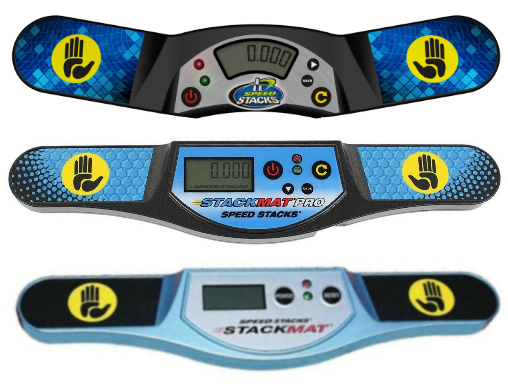

# WCA Competition Tutorial

## WCA Organization - General Introduction
{.logo height=133px}
The World Cube Association is the organization responsible for organizing speedcubing competitions all around the world.
Every competition that is sanctioned by the WCA has to follow the WCA Regulations and Guidelines,
so it's very important that you are familiar with them before going to a competition.

This document will guide you through the basics of competing and judging. Reading this document can be very helpful
to get a basic picture about official WCA competitions, but we still recommend you to read the WCA Regulations and Guidelines
and participate in the "Competition Tutorial" event at the competition if your competition has one.

## Roles at competitions
- **Delegate**: Delegates are the officials of the WCA, and they are responsible for ensuring the WCA Regulations
are followed during the competition. They also handle incidents and are responsible for scrambles and results.
If you ever have any doubts or questions, they should be your first choice for asking.

::::: {.important}
If you are not sure about something, always ask the Delegate!
:::::

- **Organizer**: Organizers are responsible for organizing the competition and for ensuring that it runs smoothly
through the day(s). Usually organizers are experienced cubers, so they also might be able to help you.
Just remember that only the Delegate can make official decisions.
- **Competitor**: Your basic role is that of a competitor. However, you may be called to judge or run
should it be required
- **Judge**: The judges ensure that attempts are performed according to the Regulations. At the end of each attempt,
they certify with their signature that everything was okay.
- **Runner**: Runners are responsible for moving puzzles between scramblers and judges.
- **Scrambler**: Scramblers are the ones who apply official scramble sequences on puzzles
and make sure that all the scrambles are correct.

## Objects at the competition
- **Stackmat timer**: This is the official device for measuring times at a competition.
It can look like any of the three versions below.
