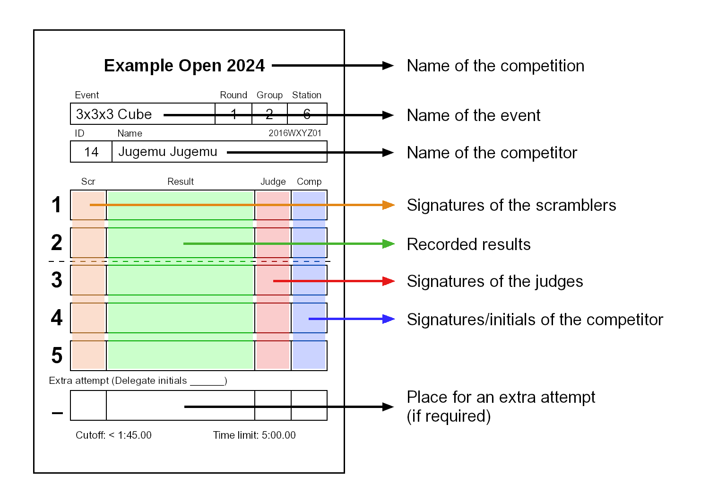

# WCA Competition Tutorial

## WCA Organization - General Introduction
{.logo height=133px}
The World Cube Association is the organization responsible for organizing speedcubing competitions all around the world.
Every competition that is sanctioned by the WCA has to follow the WCA [Regulations](https://www.worldcubeassociation.org/regulations/) and [Guidelines](https://www.worldcubeassociation.org/regulations/guidelines.html),
so it's very important that you are familiar with them before going to a competition.

This document will guide you through the basics of competing and judging. Reading this document can be very helpful
to get a basic picture about official WCA competitions, but we still recommend you to read the WCA Regulations and Guidelines
and participate in the "Competition Tutorial" event at the competition if your competition has one.

## Roles at competitions
- **Delegate**: Delegates are the officials of the WCA, and they are responsible for ensuring the WCA Regulations
are followed during the competition. They also handle incidents and are responsible for scrambles and results.
If you ever have any doubts or questions, they should be your first choice for asking.

::::: {.box .important}
If you are not sure about something, always ask the Delegate!
:::::

- **Organizer**: Organizers are responsible for organizing the competition and for ensuring that it runs smoothly
through the day(s). Usually organizers are experienced cubers, so they also might be able to help you.
Just remember that only the Delegate can make official decisions.
- **Competitor**: Your basic role is that of a competitor. However, you may be called to judge or run
should it be required
- **Judge**: The judges ensure that attempts are performed according to the Regulations. At the end of each attempt,
they certify with their signature that everything was okay.
- **Runner**: Runners are responsible for moving puzzles between scramblers and judges.
- **Scrambler**: Scramblers are the ones who apply official scramble sequences on puzzles
and make sure that all the scrambles are correct.

## Objects at the competition
- **Stackmat timer**: This is the official device for measuring times at a competition.
It can look like any of the three versions below.

::::: {}
{.centered height=200px}
:::::

 \pagebreak 

- **Mat**: Stackmat timers must be used with accompanying mats. The mat helps prevent puzzles from sliding at the end of the attempt.

::::: {}
{.centered width=600px}
:::::

- **Stopwatch**: Stopwatches are used for measuring the inspection time. They are also used to measure time for attempts over 10 minutes. Note that stopwatches can be of different models and hence their functioning can be different from the one shown in the picture.

::::: {}
{.centered height=200px}
:::::

- **Cover**: Covers are used to cover a puzzle before an attempt, so competitors cannot see the scrambles.

::::: {}
{.centered height=200px}
:::::

- **Score sheet**: After each solve, the judge writes down the result on a score sheet, signs and have you sign it to acknowledge that the result is 1) correct 2) complete, 3) properly formatted, and 4) clearly readable. Note that if your score sheet is illegible, the worst interpretable result will be entered for that attempt.

::::: {}
{.centered height=600px}
:::::

::::: {.box .attention}
The competitor must not sign the score sheet before the judge has recorded and signed the attempt!
Penalty: Disqualification of the solve
:::::

::::: {.box .attention}
The judge must not sign the score sheet before they have recorded the result!
:::::

## Competition Procedure

### Event: 
WCA competitions have one or more events. The most common event is the normal 3x3x3 Cube, but in total there are 18 official events.

### Round: 
Most events usually have multiple rounds: a first round with every competitor for the event, and possibly further ones that only some of the competitors advance to.

### Groups: 
Every round is divided into one or more groups. This helps prevent crowding timer stations with all the competitors in a round. Most competitions also rely on competitors to judge, run, and scramble for each other in the same round, and dividing competitors into multiple groups with different scrambles allows them to help without seeing a scramble that they will attempt in the future. 

### Submitting your puzzle: 
When your group gets called, you must be ready to submit your puzzle. You will find score sheets placed on the assigned table; search for the one with your name on, put your puzzle on it, and then go to the waiting area. 

::::: {.box .attention}
Remember that you must be ready to submit your puzzle as soon as your group is called!
:::::

### Stationary judges or running judges: 
Competitions use different systems, so judges have slightly different roles and duties based on what system is being used.

A stationary judge will sit at the same solving station and judge multiple competitors in a row. The runners will take the puzzles from the scrambling table, call the competitors, and distribute them to the stationary judges. The duties of the judges are just limited to the solving procedure.

Running judges take the puzzles from the scrambling table, call the relevant competitors in the waiting area, bring them to a station, follow the solving procedure, and then bring the puzzle back to the scrambling table.

### Starting the solve:
Before each attempt, the judge needs to ensure that the timer is on and has been reset.
When the competitor sits down at the station, the judge/runner puts the covered puzzle on the mat and then waits until the competitor is ready to start the attempt. Note that competitors have one minute to start the attempt once they sit at the station.

The judge makes sure that the competitor is ready for the attempt, by asking “Ready?”

::::: {.box .important}
The judge needs to make sure that the competitor is ready!
:::::

::::: {.box .attention}
Remember that you have 1 minute to start your attempt once you sit at the station with the puzzle placed on the mat!
:::::

### Inspection:
The inspection phase starts when the competitor confirms to the judge that they are ready by saying “Yes” (or another clear gesture). At this point, the judge lifts the cover and starts a stopwatch to measure the inspection phase. During inspection, the competitor has a maximum of 15 seconds to inspect the puzzle. They may pick up the puzzle and look at it from all sides, but must not apply any move. If the competitor makes a move, the judge disqualifies the solve and the attempt is over. The following table shows what actions occur during inspection.

| Time          | Action                                    | 
| ------------- |:-----------------------------------------:| 
| 8 seconds     | Judge calls "8 seconds"                   | 
| 12 seconds    | Judge calls "12 seconds"                  |  
| 15 seconds    | Judge does not stop the attempt, but will add a +2 second penalty at end of solve | 
| 17 seconds    | Judge stops the attempt and applies a DNF |   

 \pagebreak 

::::: {.box .important}
The competitor has up to 15 seconds to inspect the puzzle!
:::::

::::: {.box .attention}
Remember that during inspection the competitor is not allowed to apply any moves!
:::::

Once the competitor starts their solve, the inspection phase ends, and the judge will not perform any more actions from the inspection phase.
The judge has to start the stopwatch as soon as they lift the cover and to stop it only when the competitor **lifts the hands from the timer** (and hence starts the timer). 

### Solving:
At the end of inspection, the competitor puts the puzzle on the mat (in any orientation) and places their hands on the timer sensors to start the timer. Choosing when to start the solve it’s up to the competitor and they can do that at any point during the inspection phase. The competitor must not be touching the puzzle, and their hands must be palms down with their fingers touching the sensors. They will see a red light, then a green light. When the light goes green, the competitor can then start the solving phase by lifting their hands from the timer and beginning their solve.

::::: {.box .important}
The competitor must wait for the green light before starting the timer!
:::::

::::: {.box .attention}
Remember that for starting the solve the competitor’s hands must be flat, palms down and must touch the sensors with their fingers, not their palms!
:::::

### Stopping the solve:
When the puzzle is solved, the competitor stops the timer by putting their hands on the sensors. They must not be touching the puzzle and their hands must be flat with palms down.

::::: {.box .attention}
Remember that for stopping the solve the competitor’s hands must be flat with palms down!
:::::

The judge checks if the puzzle is solved or not, and confirms the correctness to the competitor: “OKAY”, “PENALTY” or “DNF.” The competitor is not allowed to touch the puzzle until the judge has clearly made a decision.

::::: {.box .important}
If any help is needed on a decision, or if something irregular happens, please contact the WCA Delegate without hesitation.
:::::

 \pagebreak 

### Administration:
Once the solve is done the judge writes the result on the score sheet, and then signs it. The competitor, after checking that the result is written correctly and clearly readable and that the judge has signed, signs the score sheet as well, to accept it.

If the competitor has more attempts left, the competitor then needs to go back to the waiting area. The judge places the puzzle and the score sheet in the cover and then the judge/runner takes it back to the scrambling table.

::::: {.box .important}
Both the judge and the competitor must confirm the result on the score sheet with their signatures.
:::::

::::: {.box .attention}
Remember that the competitor needs to check that the written time is correct and readable before signing the attempt!
:::::

## Important Regulations

- **Starting the solve**:

[Regulation A4)](https://www.worldcubeassociation.org/regulations/#A4) is the rule which indicates how to start the timer correctly.

::::: {}
{.centered width=90%}
:::::

::::: {.box .attention}
Remember that starting the solve incorrectly leads to penalties!
:::::

- **During the solve**:

[Regulation A5)](https://www.worldcubeassociation.org/regulations/#A5) explains the rules during the solve.
During the whole solve, you can only talk to your judge or to the WCA Delegate, you can’t receive any external help from any objects or person. Penalty for either infraction is a DNF.

 \pagebreak 

- **Stopping the timer**:

[Regulation A6)](https://www.worldcubeassociation.org/regulations/#A6) is the rule which explains how to stop the timer correctly.

::::: {}
{.centered width=90%}
:::::

::::: {.box .attention}
Remember that stopping the solve incorrectly leads to penalties!
:::::

- **Misalignments**:

| <!-- --> | <!-- --> {width=650px} | 
| --- | --- | 
| {width=150px} | **No penalty:** the cube is solved and the misalignments of all layers compared with their adjacent layers are below 45°. | 
| {width=150px} | **+2:** the cube is solved, but the misaligned layer exceeds 45°, which means the cube is one move away from being solved. Please note that the WCA Regulations consider all states of the puzzle to be one move away from the solved state if you have to turn only one side of the puzzle to reach the solved state – **even if it’s a double turn.** |  
| {width=150px} | **Ask the Delegate:** If it’s not clear whether a +2 penalty should be applied or not, **don’t touch the puzzle** and call a Delegate to the station. | 
| {width=150px} | **DNF:** When more than one move is required to solve the puzzle, the result of the attempt is DNF. |
| {width=150px} | **DNF:** If a middle layer of the puzzle is misaligned, this counts as two moves required to solve, as only outer layer turns are counted. Therefore, the result of the attempt is DNF. |

::::: {.box .important}
If you are unsure about penalties, always ask a Delegate!
:::::

## Formats

Depending on the event there are different ways of calculating the results that are used to rank competitors. The most common ones are:

- **Average of 5**: Every competitor gets 5 attempts. When they’re all done the best and the worst results are discarded and the average is calculated using the remaining 3 results.

- **Mean of 3**: Every competitor gets 3 attempts. The average is calculated using those 3 results.

- **Best of X**: Every competitor gets X attempts, where X equals either 1, 2 or 3. The best results among those X attempts is the final result.

## Important Definitions

- **Cutoff**: Some events may have a “combined round”. Most of the time the format for this is either “Best of 2 / Average of 5” or “Best of 1 / Mean of 3”. In both cases, there is also a certain time, the cutoff, provided as well. This means that you will first do one or two attempts, and if neither result is under the cutoff, you are done with the round. If you managed to get at least one resolution below the cutoff, those solves already count as the beginning of your average/mean, and you can continue with the round.

- **Time limit**: The time limit is the maximum time a competitor can use for an attempt. If a competitor reaches the time limit the judge stops the competitor immediately and assigns them a DNF for the solve. Some events have cumulative time limits. A cumulative time limit works like a normal time limit, but it’s applied to the sum of all your results for the entire round and not individual results. In case of a cumulative time limit, if the result is a DNF, then the time taken to get that DNF is also written in brackets.  

- **DNF**: Did Not Finish. DNF is the worst result in speedcubing and is generally given as a penalty.

- **DNS**: Did Not Start. DNS means that the competitor did not start the attempt. (Note: The attempt starts with the inspection phase, not with the solving.) DNS results are usually not assigned by judges.

- **Extra** attempt: In certain situations, you might receive an extra attempt. This means that you get the chance of redoing an attempt on an extra scramble because in the previous one something happened that disadvantaged you. Only Delegates can assign extra attempts, so always report any incident to them.

::::: {.box .important}
Extra attempts can be given only by a Delegate!
:::::

::::: {}
{.centered width=95%}
:::::

 \pagebreak 

## You should...

- **... never talk about the scrambles before the end of the round.**

 *You will have plenty of time to discuss them later in the day. :)* 

- **... never talk to someone during your solves (other than your judge or a Delegate).**

 *It will never be so important to risk getting a DNF because of it.* 

- **... never disturb a competitor when you are judging (e.g. playing with your phone or with your puzzle or talking to someone).**

 *You don’t want to be disturbed during your attempts, make sure that others won’t be disturbed by you.* 

- **... never talk to a competitor when you are judging, other than telling them “Ready?”, “8 seconds”, “12 seconds” or confirming results or when resolving incidents.**

 *Any other talk can be disturbing for them.* 

- **... never touch the puzzle if it’s misaligned after the competitor has stopped the timer.**

 *If you do so, you could influence the Delegate’s decision. Call them immediately to the station.* 

- **... never use your phone/camera for recording solves with a screen facing you.**

 *Front-facing cameras automatically invalidate (DNF) the affected solve.* 

- **... never round the results when you are a judge.**

 *Results should be recorded exactly as displayed on the timer, not rounded off.
(E.g. 14.587 should not be recorded as 14.59 and 14.500 should not be recorded as 14.5)* 

- **... never use flash photography at a competition.**

 *It’s not a good feeling to be blinded during your official solves.* 

- **... never make a decision when you are not 100% sure if it’s correct or not.**

 *Make sure to adhere with the WCA Regulations and ask a Delegate!* 
