# Competition Tutorial

## WCA Organization - General Introduction

{.logo width=15%}
The World Cube Association (WCA) is the organization that governs speedcubing competitions worldwide. Every competition sanctioned by the WCA must follow the WCA [Regulations](wca{regulations}) and [Guidelines](wca{regulations/guidelines.html}). You should become familiar with these documents before you go to a competition.

This document will guide you through the basics of competing and judging. Reading this document will give you a basic picture of official WCA competitions. However, we still recommend reading the WCA Regulations and Guidelines and watching an in-person first-time competitor at a local competition.

## Roles at Competitions

- **Delegate**: Delegates are the officials of the WCA, and they are responsible for ensuring the WCA Regulations are followed during the competition. They also handle incidents and are responsible for scrambles and results. If you ever have any doubts or questions, they should be your first choice for asking.

::::: {.box .important}
If you are uncertain about something, always ask the Delegate!
:::::

- **Organizer**: Organizers are responsible for organizing the competition and ensuring it runs smoothly. Organizers are often experienced cubers, so they could also help you. Remember that only Delegates are allowed to make official decisions.
- **Competitor**: The role of competitors is to compete. However, an organizer or Delegate may ask competitors to be judges or runners too.
- **Judge**: The judges ensure that attempts comply with the Regulations. At the end of each attempt, they certify with their signature that everything is okay.
- **Runner**: Runners are responsible for moving puzzles between scramblers and judges.
- **Scrambler**: Scramblers apply official scramble sequences on competitors’ puzzles. They certify with their signature that the applied scramble was correct.

## Objects at the Competition {.page-break-before}

- **Stackmat timer**: This is the official device for measuring times at a competition.
  It will look like one of the three versions below.

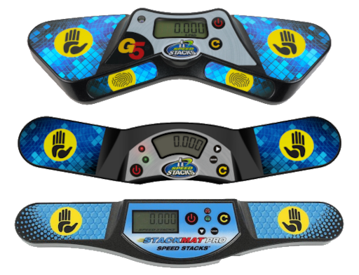{.centered width=30%}

- **Mat**: A mat must be attached to every Stackmat timer. The mat helps prevent puzzles from sliding at the end of the attempt.

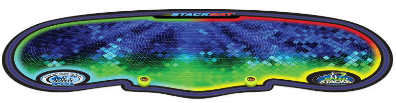{.centered width=70%}

- **Stopwatch**: The time elapsed during the inspection phase is measured using stopwatches. Attempts over 10 minutes are also measured using stopwatches. Remember that there are various stopwatch models. Hence, their functioning might be different from the one shown in the picture.

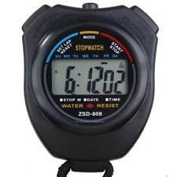{.centered width=24%}

- **Cover**: Covers are used to cover a puzzle before an attempt to prevent competitors from seeing scrambled puzzles.

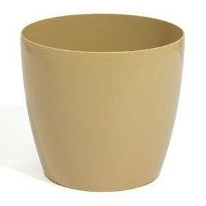{.centered width=24% .page-break-after}

- **Score sheet**: After a puzzle is scrambled, the scrambler signs for correctness on the score sheet. After each solve, the judge writes down the result on the score sheet and signs it. Then, the competitor signs it to acknowledge that the result is all of the following:

  1. correct
  2. complete
  3. properly formatted
  4. clearly readable

{.centered}

::::: {.box .attention}
If a time on a score sheet is illegible, the score taker will enter the worst interpretable result for that attempt.
:::::

::::: {.box .attention}
The competitor must not sign the score sheet before the judge has recorded and signed the attempt!
Penalty: Disqualification of the solve
:::::

::::: {.box .attention}
The judge must not sign the score sheet before they have recorded the result!
:::::

## Competition Procedure {.page-break-before}

### Event

Every WCA competition holds at least one event. The most common event is the 3x3x3 Cube, but there are 17 official events.

- 3x3x3 Cube
- 2x2x2 Cube
- 4x4x4 Cube
- 5x5x5 Cube
- 6x6x6 Cube
- 7x7x7 Cube
- 3x3x3 Blindfolded
- 3x3x3 Fewest Moves
- 3x3x3 One-Handed
- Clock
- Megaminx
- Pyraminx
- Skewb
- Square-1
- 4x4x4 Blindfolded
- 5x5x5 Blindfolded
- 3x3x3 Multi-Blind

### Round

Every event has at least one round. The first round is open to every competitor who registered for the event. Subsequent rounds are open to competitors who advance based on their results.

### Groups

Every round is divided into smaller groups. Groups prevent competition areas from getting crowded. Without groups, every competitor who signed up for an event would be in the competition area at the same time.

Groups also make assigning competitors judging, running, and scrambling assignments easier. Different groups use different scramble sets, allowing competitors to volunteer without seeing a scramble that they will attempt in the future.

### Submitting your puzzle

Competitors must be ready to submit their puzzle when their group is called. Competitors will find score sheets placed on the drop-off table. They will search for the score sheet with their name, put their puzzle on it, and then go to the waiting area.

::::: {.box .attention}
Remember that as a competitor, you must be ready to submit your puzzle as soon as your group is called!
:::::

### Seated judges or running judges

Competitions use different systems, so judges have different duties in each system.

- **Seated judges** sit at the same solving station and judge multiple competitors in a row. The runners will take the puzzles from the scrambling table, call the competitors, and distribute them to the seated judges. The duties of the judges are just limited to the solving procedure.
- **Running judges** take the puzzles from the scrambling table, call the relevant competitors in the waiting area, bring them to a station, follow the solving procedure, and then bring the puzzle back to the scrambling table.

### Starting the solve

Before each attempt, the judge ensures that the timer is on and is reset.

When the competitor sits down at the station, the judge or runner puts the covered puzzle on the mat and waits until the competitor is ready to start the attempt.

The judge ensures that the competitor is ready for the attempt by asking, “READY?”.

::::: {.box .important}
The judge must ensure that the competitor is ready! Lifting the cover too early could lead to an extra attempt.
:::::

::::: {.box .attention .page-break-before}
Remember that competitors have 1 minute to start their attempt once they sit at the station with the puzzle on the mat!
:::::

### Inspection phase

The inspection phase starts when the competitor tells the judge they are ready, such as saying “YES”. At this point, the judge lifts the cover and starts a stopwatch to measure the inspection. The competitor has 15 seconds to inspect the puzzle. They may pick up the puzzle and look at it from every side, but they must not apply any moves. If the competitor makes a move, the judge disqualifies the solve, and the attempt is over. The following table shows what actions occur during the inspection phase.

| Time       | Action                                                                                      |
| ---------- | :-----------------------------------------------------------------------------------------: |
| 8 seconds  | The judge calls “8 seconds”.                                                                |
| 12 seconds | The judge calls “12 seconds”.                                                               |
| 15 seconds | The judge does not stop the attempt but adds a +2 penalty at the end of the attempt. |
| 17 seconds | The judge stops the attempt and applies a DNF penalty.                                      |

::::: {.box .important}
The competitor has up to 15 seconds to inspect the puzzle!
:::::

::::: {.box .attention}
Remember that the competitor must not apply any moves during inspection!
:::::

Once the competitor starts their solve, the inspection phase ends, and the judge will stop performing actions from the inspection phase.

The judge needs to start the stopwatch as soon as they lift the cover. They stop it only when the competitor starts the timer by **lifting their hands from the timer**.

### Solving

At the end of the inspection, the competitor puts the puzzle on the mat (in any orientation) and places their hands on the timer sensors to start the timer.

The competitor decides when to stop inspecting and start the timer. When starting the timer, the competitor must not touch the puzzle, their hands must be flat, their palms must be facing down, and their fingers must be touching the sensors. The competitor may then start the solving phase by lifting their hands from the timer and starting their solve.

::::: {.box .important}
When a competitor places their hands on the timer, they will first see a red light. When the light turns green, the timer is ready for the competitor to lift their hands.
:::::

::::: {.box .attention}
Remember that when the competitor starts the timer, their hands must be flat, their palms must be facing down, and they must touch the sensors with their fingers, not their palms. (Penalty: +2s [A4b](http://wca.link/A4b))
:::::

### Stopping the solve: {.page-break-before}

When the puzzle is solved, the competitor stops the timer by putting their hands on the sensors. When the competitor stops the timer, they must not be touching the puzzle. Their hands must be flat, and their palms must be facing down.

::::: {.box .attention}
Remember that when the competitor stops the timer, their hands must be flat, and their palms must be facing down. (Penalty: +2s [A6d](http://wca.link/A6d))
:::::

The judge checks whether the puzzle is solved and tells the competitor one of these decisions: “OKAY”, “PENALTY”, or “DNF”. The competitor is not allowed to touch the puzzle until the judge has clearly made a decision.

::::: {.box .important}
If you need any help with a decision or if something irregular happens, please do not hesitate to ask the Delegate.
:::::

::::: {.box .important}
Remember that penalties are cumulative, so a competitor might get multiple +2 penalties on the same attempt.
:::::

### Administration

Once the solve is done, the judge writes the result on the score sheet, signs it, and gives the score sheet to the competitor. The competitor checks that the result is written correctly and clearly readable and that the judge has signed. The competitor then signs the score sheet to accept the result as it is written.

If the competitor has more attempts left, they need to return to the waiting area. The judge places the puzzle and the score sheet into the cover, and then the judge or runner takes it back to the scrambling table.

::::: {.box .important}
Both the judge and the competitor must confirm the result on the score sheet with their signatures.
:::::

::::: {.box .attention}
Remember that the competitor needs to check that the written time is correct and readable before signing the attempt!
:::::

## Important Regulations {.page-break-before}

- **Starting the solve**:

[Regulation A4)](wca{regulations/#A4}) is the rule that indicates how to start the timer correctly.

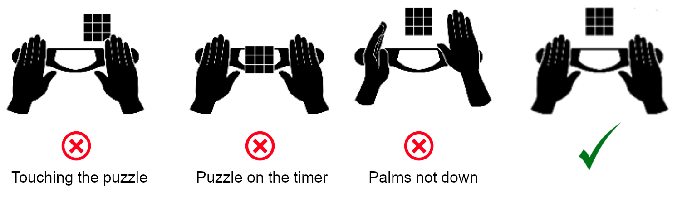{.centered width=90%}

::::: {.box .attention}
Remember that incorrectly starting the solve leads to penalties!
:::::

- **During the solve**:

[Regulation A5)](wca{regulations/#A5}) explains the rules during the solve.
During the whole solve, competitors may only talk to their judge or to the Delegate. They must not receive any external help from any objects or persons. The penalty for either infraction is a DNF.

- **Stopping the timer**:

[Regulation A6)](wca{regulations/#A6}) is the rule that explains how to stop the timer correctly.

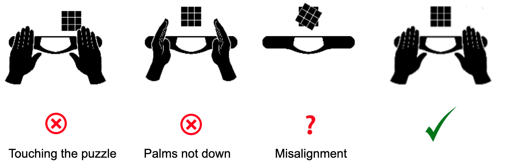{.centered width=90%}

::::: {.box .attention .page-break-after}
Remember that incorrectly stopping the solve leads to penalties!
:::::

- **Misalignments**:

<table class="table-with-images">
  <tr>
    <td>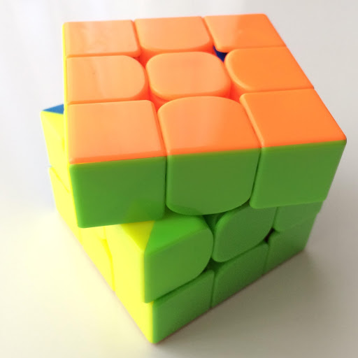</td>
    <td>**No penalty:** The cube is solved, and the misalignments of every layer compared to its adjacent layers are below 45°.</td>
  </tr>
  <tr>
    <td>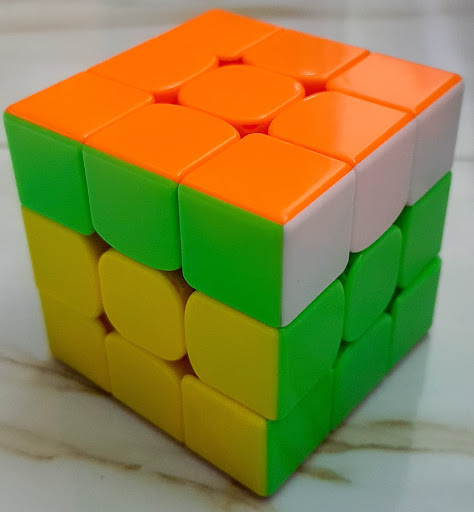</td>
    <td>**+2:** The cube is solved, but the misaligned layer exceeds 45°, which means the cube is one move away from being solved. Remember that the WCA Regulations consider a puzzle state to be one move away from the solved state if you only need to turn one side of the puzzle to reach the solved state – **even if it is a double turn.**</td>
  </tr>
  <tr>
    <td>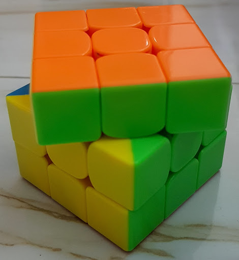</td>
    <td>**Ask the Delegate:** If it is unclear whether a +2 penalty should be applied, **do not touch the puzzle** and call a Delegate to the station.</td>
  </tr>
  <tr>
    <td>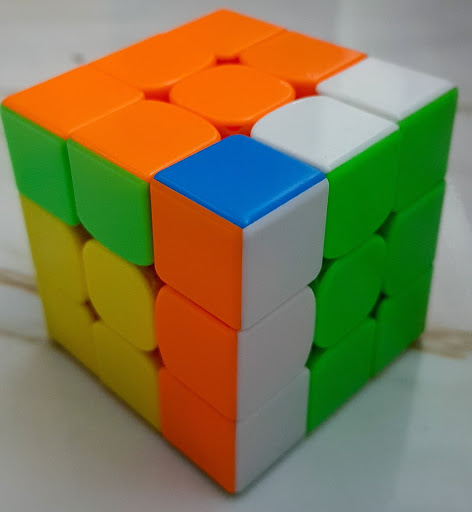</td>
    <td>**DNF:** When more than one move is required to solve the puzzle, the result of the attempt is DNF.</td>
  </tr>
  <tr>
    <td>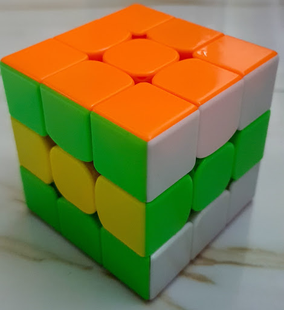</td>
    <td>**DNF:** If a middle layer of the puzzle is misaligned, this counts as two moves required to solve, as only outer layer turns are counted. Therefore, the result of the attempt is DNF.</td>
  </tr>
</table>

::::: {.box .important}
If you are uncertain about penalties, always ask a Delegate!
:::::

## Important Definitions {.page-break-before}

- **Formats** There are different ways of calculating the results to rank competitors. Here are all the legal formats:
  - **Average of 5**: Every competitor gets five attempts. When they are done, the best and the worst results are discarded, and the average is calculated using the remaining three results.
  - **Mean of 3**: Every competitor gets three attempts. The average is calculated using those three results.
  - **Best of X**: Every competitor gets X attempts, where X equals either 1, 2, or 3. The best result of those X attempts is the final result.
- **Cutoff**: When there is a cutoff time, the competitor will first do one or two attempts, and they are done competing in the round if neither result is under the cutoff time. If they achieve at least one result below the cutoff time, they may continue with the round and finish their average or mean. The format of a “Cutoff Round” is either “Best of 2 / Average of 5” or “Best of 1 / Mean of 3”.
- **Time limit**: The time limit is the maximum time a competitor may use for an attempt. If a competitor reaches the time limit, the judge stops the competitor immediately and assigns a DNF penalty for the solve. Some events have cumulative time limits. A cumulative time limit works like a regular time limit, but it is applied to the sum of all the competitor’s results for the entire round and not individual results. When there is a cumulative time limit and the result is a DNF, the time taken to get that DNF is also written in brackets.
- **DNF**: Did Not Finish. DNF is the worst result in speedcubing and is generally assigned as a penalty.
- **DNS**: Did Not Start. DNS means that the competitor was eligible for the attempt but declined it. Remember that the attempt starts with the inspection, not with the solving. DNS results are usually not assigned by judges.
- **Extra Attempt**: In some situations, competitors might receive an extra attempt. This means that they redo an attempt using an extra attempt scramble due to an incident during the original attempt. Only Delegates may assign extra attempts, so always report any incident to them.

::::: {.box .important}
Extra attempts may be granted only by a Delegate!
:::::

## What to Avoid as a Competitor {.page-break-before}

- **Never talk about the scrambles before the end of the round.**

:::::{.text-right}
_You will have plenty of time to discuss them later in the day._
:::::

- **Never talk to someone during your solves (other than your judge or a Delegate).**

:::::{.text-right}
_It will never be so important to risk getting a DNF penalty because of it._
:::::

- **Never disturb a competitor when you are a judge (e.g. playing with your phone or with your puzzle or talking to someone).**

:::::{.text-right}
_You do not want to be disturbed during your attempts, so ensure that others will not be disturbed by you._
:::::

- **Never talk to a competitor when you are a judge, other than telling them, “Ready?”, “8 seconds”, “12 seconds”, or confirming results or when resolving incidents.**

:::::{.text-right}
_Any other talk could be disturbing for them._
:::::

- **Never touch the puzzle if it is misaligned after the competitor has stopped the timer.**

:::::{.text-right}
_If you do so, you could influence the Delegate’s decision. Call them immediately to the station._
:::::

- **Never have a screen facing you when you record solves using your phone or camera.**

:::::{.text-right}
_Front-facing cameras automatically invalidate (DNF) the affected solve._
:::::

- **Never round the results when you are a judge.**

:::::{.text-right}
_Results should be recorded exactly as displayed on the timer, not rounded off. (e.g. 14.587 should not be recorded as 14.59, and 14.500 should not be recorded as 14.5)_
:::::

- **Never use flash photography at a competition.**

:::::{.text-right}
_It is not a good feeling to be blinded during your official solves._
:::::

- **Never make a decision when you are not 100% certain if it is correct.**

:::::{.text-right}
_Ensure you adhere to the WCA Regulations and ask a Delegate!_
:::::

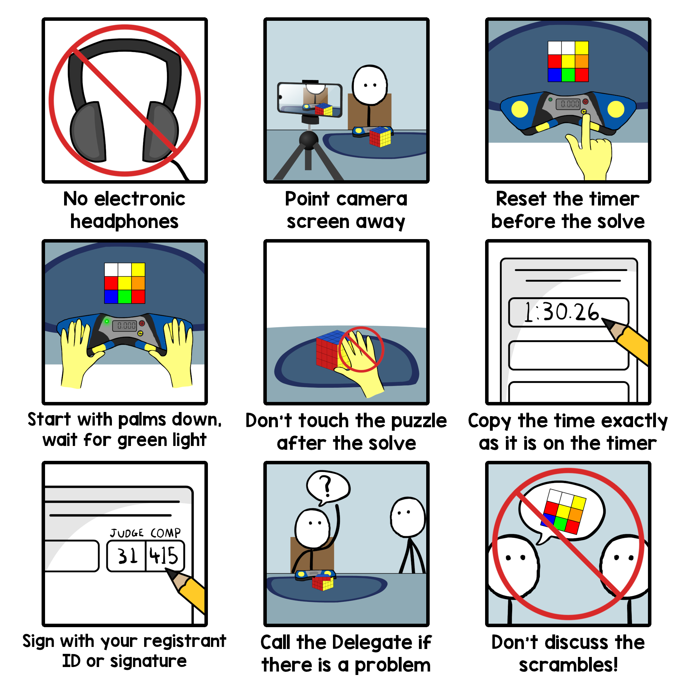{.centered width=90%}

## Translations

You can find translations of this document below. Contact [quality@worldcubeassociation.org](mailto:quality@worldcubeassociation.org) for instructions on how to add your own translation.

- [Հայերեն (Armenian)](wcadoc{edudoc/competitor-tutorial/am/tutorial.pdf}) - translated by Mayis Jraghatspanyan
- [Português Europeu (European Portuguese)](wcadoc{edudoc/competitor-tutorial/pt/tutorial.pdf}) - translated by António Gomes
- [Español (Spanish)](wcadoc{edudoc/competitor-tutorial/es/tutorial.pdf}) - translated by Gennaro Monetti
- [Svenska (Swedish)](wcadoc{edudoc/competitor-tutorial/se/tutorial.pdf})
