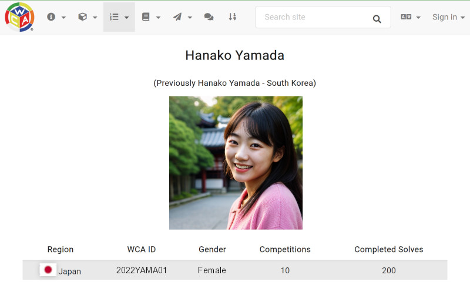

# Delegate Handbook

The _Delegate Handbook_ is an educational and referential resource for WCA Delegates of all levels of experience, whether you’re a newly appointed Trainee Delegate or a Full Delegate with a hundred competitions under your belt. This document attempts to lay a foundation for both the required responsibilities and the most common scenarios faced by a Delegate so that every WCA competition can run with consistent levels of fairness and quality.

This document is _not_ a guide for how to organize or run a competition. While a WCA Delegate often fulfills many of the organizational tasks, those may also be handled by non-Delegate organizers. As such, organizational details are generally not included in this document, and can instead be found within the [Organizer Guidelines](https://www.worldcubeassociation.org/organizer-guidelines).

While this document aims to be complete, it cannot be fully comprehensive. While delegating, you will almost certainly run into situations that could not possibly be foreseen or predicted. As you delegate more competitions, you will build a foundation of experience that will allow you to independently handle events which are not covered by this document.

Finally, the _Delegate Handbook_ aims to reflect official WCA policy, not create it. If any disagreements or contradictions arise, always defer to the policy, regulation, or precedent published through official WCA channels. See the section [Contributing to this Document](#contributing-to-the-delegate-handbook) for information on how to update this document so that it accurately reflects reality once again.

There is a lot of information that is relevant to all WCA Staff, not simply Delegates. If you have not already, read the [WCA Staff Crash Course](https://documents.worldcubeassociation.org/edudoc/staff-crash-course/staff_crash_course.pdf) to get a high-level overview of the responsibilities expected of all WCA Staff.

# Table of Contents {.page-break-before}

- [Introduction to Delegating](#introduction-to-delegating)
  - [The Roles of a WCA Delegate](#the-roles-of-a-wca-delegate)
  - [How to Become a Delegate](#how-to-become-a-delegate)
  - [Delegate Tiers](#delegate-tiers)
    - [Trainee Delegates](#trainee-delegates)
    - [Junior Delegates](#junior-delegates)
    - [Full Delegates](#full-delegates)
    - [Regional Delegates](#regional-delegates)
    - [Senior Delegates](#senior-delegates)
  - [Email](#email)
  - [Confidentiality](#confidentiality)
  - [Probation](#probation)
- [Before the Competition](#before-the-competition)
  - [Competitions and Your Community](#competitions-and-your-community)
    - [Competition Frequency](#competition-frequency)
    - [Competition Size](#competition-size)
    - [Event Selection](#event-selection)
  - [Organizing a Competition](#organizing-a-competition)
    - [Community Organizers and Delegate Organizers](#community-organizers-and-delegate-organizers)
    - [Interacting with Organizers](#interacting-with-organizers)
  - [Requesting a Competition](#requesting-a-competition)
    - [General Rules](#general-rules)
    - [Filling Out the New Competition Page](#filling-out-the-new-competition-page)
    - [Adding Events and a Schedule](#adding-events-and-a-schedule)
    - [Requesting a Fewest Moves Simultaneous Competition](#requesting-a-fewest-moves-simultaneous-competition)
    - [Making Changes to an Existing Competition](#making-changes-to-an-existing-competition)
  - [Managing Registrations](#managing-registrations)
    - [Administering Registration Data](#administering-registration-data)
  - [Communicating with Competitors and their Families](#communicating-with-competitors-and-their-families)
  - [Generating Scrambles](#generating-scrambles)
  - [Generating Groups](#generating-groups)
- [Day of the Competition](#day-of-the-competition)
  - [Setup and Environment](#setup-and-environment)
  - [Check-In and Registration](#check-in-and-registration)
    - [On-the-Spot Registration](#on-the-spot-registration)
    - [Verifying New Competitors](#verifying-new-competitors)
  - [New Competitor Tutorial](#new-competitor-tutorial)
  - [Competing as a Delegate](#competing-as-a-delegate)
    - [Conduct](#conduct)
    - [Self Incidents](#self-incidents)
  - [Scoretaking](#scoretaking)
    - [Common Scoretaking Issues](#common-scoretaking-issues)
    - [Records and Notable Solves](#records-and-notable-solves)
      - [World Record Social Media Posts](#world-record-social-media-posts)
    - [Missing Competitor Results](#missing-competitor-results)
  - [+2 Calls and Penalties](#plus2-calls-and-penalties)
    - [Square-1 Misalignments](#square-1-misalignments)
  - [Regulation 3j: Reasonable Wear](#regulation-3j-reasonable-wear)
  - [Regulation 5b5: Popped Puzzles](#regulation-5b5-popped-puzzles)
  - [Incidents](#incidents)
    - [Extras](#extras)
      - [Provisional Extras](#provisional-extras)
    - [Regulation A7g](#regulation-a7g)
    - [Common Incidents](#common-incidents)
  - [Competitors Requiring Accommodations](#competitors-requiring-accommodations)
  - [Handling Behavioral Issues](#handling-behavioral-issues)
  - [Preparing for Subsequent Rounds](#preparing-for-subsequent-rounds)
  - [Modifications to the Schedule or Events](#modifications-to-the-schedule-or-events)
    - [Running Behind Schedule](#running-behind-schedule)
    - [Running Ahead of Schedule](#running-ahead-of-schedule)
- [After the Competition](#after-the-competition)
  - [Competition Results](#competition-results)
    - [Double-checking Registration Data](#double-checking-registration-data)
    - [Submitting Results](#submitting-results)
    - [Requesting Changes to Competition Results](#requesting-changes-to-competition-results)
  - [Delegate Reports](#delegate-reports)
    - [Venue](#venue)
    - [Organization](#organization)
    - [Budget](#budget)
    - [Incidents](#incidents-1)
    - [Remarks](#remarks)
    - [Responses to Your Report](#responses-to-your-report)
  - [Paying Competition Dues](#paying-competition-dues)
  - [Lost and Found](#lost-and-found)
- [Delegates Outside of the Competition](#delegates-outside-of-the-competition)
  - [Managing WCA User Accounts](#managing-wca-user-accounts)
    - [Accounts vs. Profiles (WCA IDs)](#accounts-vs-profiles-wca-ids)
    - [Handling WCA ID Claims](#handling-wca-id-claims)
    - [Requesting Changes to Personal Data](#requesting-changes-to-personal-data)
  - [Acquiring Competition Equipment](#acquiring-competition-equipment)
    - [WCA Equipment Funding](#wca-equipment-funding)
    - [WCA Travel Funding](#wca-travel-funding)
  - [Engaging in Internal Discussions](#engaging-in-internal-discussions)
    - [Replying to Delegate Reports](#replying-to-delegate-reports)
    - [Disputes and Appeals](#disputes-and-appeals)
  - [Recommending a Delegate](#recommending-a-delegate)
  - [Supporting Your Local Community](#supporting-your-local-community)
    - [Business Cards](#business-cards)
  - [Contributing to the Delegate Handbook](#contributing-to-the-delegate-handbook)

# Introduction to Delegating {.page-break-before}

Delegates are one of the most prominent roles within the World Cube Association. A Delegate represents the WCA at a cubing competition to ensure that competitors adhere to the rules of each event and maintain fair play throughout the competition. Most importantly, all Delegates must have a strong understanding of the [WCA Regulations](https://www.worldcubeassociation.org/regulations/) and their associated [Guidelines](https://www.worldcubeassociation.org/regulations/guidelines.html).

As the face of the WCA to the attendees of a competition, a WCA Delegate has many considerations and responsibilities to effectively fulfill their role. This document is designed to capture those considerations and responsibilities in a unified place as a reference document for Delegates of all levels of experience.

While WCA Delegates are highly experienced members of their community and often help out as competition organizers, it is important that a Delegate understands the distinction between their role as a Delegate and their role as an organizer. While some tasks are often performed by a Delegate, such as generating groups and providing competition equipment, these are ultimately the responsibility of the organizer. Remember which hat you are wearing, as it is important to distinguish actions which are performed as a representative of the WCA and as a non-WCA organizer.

## The Roles of a WCA Delegate

As outlined in the [WCA Delegates Motion](https://documents.worldcubeassociation.org/documents/motions/08.2022.1%20-%20Delegates.pdf) of the WCA, a WCA Delegate is responsible for:

- Ensuring regulations are followed at WCA competitions
- Submitting competition results
- Writing competition reports
- Representing their local community within the WCA
- Staying up to date on the WCA Regulations
- Staying up to date on internal conversations with WCA Staff

## How to Become a Delegate

An individual usually becomes a Trainee Delegate after recommendation by another Delegate who has determined that they would like another Delegate to help manage their local community. Candidates are noticed for their maturity and responsibility, and are most frequently selected from regular competition organizers and competition staff members. The Delegate will recommend the candidate to their Regional Delegate (or Senior Delegate when a Regional Delegate is not applicable), who will review the recommendation and agree or disagree. The recommendation will then be forwarded to the Senior Delegate. If the Senior Delegate approves the appointment, they send an application to the WCA Board of Directors, who will reject or approve the application. After approval, the Senior Delegate will appoint the candidate as a Trainee Delegate.

The ideal candidate for a new Trainee Delegate has:

- Full trustworthiness
- A strong, independent, communicative, collaborative, and positive personality
- Leadership skills and responsibility
- Organizational skills, and the ability to execute on necessary tasks
- Fluency in English, to effectively participate in internal WCA communications
- A few hours of free time per week to work on Delegate tasks
- Experience as a competition organizer, with a track record of successful competitions

There is no minimum age requirement for becoming a Delegate, however, the responsibilities of a Delegate tend to naturally select for individuals who are adults, with rare exceptions for outstanding candidates under the age of 18.

## Delegate Tiers

There are multiple tiers of Delegates, each with their own responsibilities within the WCA. At their core, all tiers of Delegates have one thing in common: at a WCA competition, they all have the responsibility to make sure that competitions are run in accordance with the regulations.

### Trainee Delegates

A Delegate will typically start their journey by being appointed as a Trainee Delegate. A Trainee Delegate’s primary responsibility is learning how to Delegate WCA competitions. Usually, this will involve shadowing another Delegate to learn the ropes of delegating. This generally includes the full competition lifecycle, from working with organizers to organize a competition, to preparing for the competition, to delegating at the competition, to posting results and writing reports after the competition, and interacting with other WCA Staff in internal communications.

When appointed, a Trainee Delegate gains access to:

- The "New Competition" page of the WCA website
- The ability to manage users and edit profiles on the WCA website
- The Delegate reports mailing list

A Trainee Delegate has the same permissions and responsibilities as a Junior Delegate, except:

- Trainee Delegates cannot post Delegate Reports, confirm competitions, or submit results (Trainee Delegates can still compile results and write reports, but are simply restricted from submitting them).
- Trainee Delegates cannot delegate a competition without another Junior Delegate or higher. The only exception is in case of emergency, in which case the WCA Board may allow a Trainee Delegate to independently delegate a competition without supervision by another Delegate.
- Trainee Delegates cannot vote in Staff polls (this is separate from "voting rights" in the WCA).
- Trainee Delegates are not given WCA email addresses.

A Trainee Delegate is a Community Member, and not a member of WCA Staff. However, a Trainee Delegate is still expected to embody the full responsibilities of a Delegate, and shall behave as a representative of the WCA in accordance with the Mission, Spirit, Policies, and Code of Ethics of the WCA.

A Trainee Delegate’s training period is not just an evaluation of their skills, it is an opportunity for the Trainee Delegate to understand more fully what is expected of them. Sometimes a Trainee Delegate finds that delegating is not a good match for them, and that is okay. A Trainee Delegate may withdraw their appointment at any time by submitting a resignation letter to their Senior Delegate with a carbon copy (CC) to the WCA Board and WCA Executive Assistants Team (WEAT).

After 12 months, a Trainee Delegate will automatically lose their appointment as a Trainee Delegate, unless their Senior Delegate extends the appointment with approval from the WCA Board.

A Trainee Delegate is promoted to Junior Delegate after their Senior Delegate determines their readiness for promotion. This is usually after a Trainee Delegate demonstrates their capability as a Delegate over the course of a few competitions. A Senior Delegate may not be able to personally evaluate the performance of a Trainee Delegate, and may consult Regional Delegates as well as Full and Junior Delegates local to the Trainee Delegate in order to get a better understanding of the Trainee Delegate’s performance.

### Junior Delegates

A Junior Delegate is the first tier of WCA Delegate that is officially a WCA Staff member. They have demonstrated sufficient responsibility and are granted the independence to represent the WCA without direct supervision. However, a Junior Delegate is still expected to continue to gain experience in their role, and may require extra attention by their Senior Delegate or local Delegates.

A Junior Delegate has the same responsibilities as a Trainee Delegate, and additionally gains:

- The ability to submit results, confirm competitions, and post Delegate reports
- The ability to Delegate competitions without another Delegate
- A WCA email address
- Access to internal WCA resources accessed through their email login
- Access to the Poll areas of the WCA website

After a Junior Delegate has held the position for at least one year, and has successfully managed at least three WCA Competitions, a Senior Delegate may promote a Junior Delegate to Full Delegate. On a quarterly basis, the WEAT checks which Junior Delegates are eligible for promotion and will request Senior Delegates to choose who they believe are ready for promotion. Once a Senior Delegate returns to the WEAT with their selected candidates for promotion, the WEAT will request feedback from various WCA teams and committees:

- WCA Competition Announcement Team (WCAT), who look into the cleanliness of competition submissions. Generally, this is determined by the number and severity of mistakes in competition submissions, the timeliness of competition submissions (minimal submissions with under 30 days until the competition), and responsiveness to email queries. The Delegate must have confirmed at least one competition (by clicking the "Confirm" button themselves) to be eligible for a positive review from the WCAT. All of the Delegate’s confirmed competitions may be considered, with more consideration paid to recent competitions.
- WCA Quality Assurance Committee (WQAC), who look into the timeliness of Delegate Reports being submitted, scramble accountability at that Delegate’s competitions, and the general quality of their competitions. All of the Delegate’s competitions may be considered, with more consideration paid to recent competitions.
- WCA Results Team (WRT), who look into the cleanliness of a Delegate’s result submissions, change requests, and responsiveness to WRT questions. The Delegate must have submitted results at least three times to be eligible for a positive review from the WRT.
- WCA Regulations Committee (WRC), who use the Incidents section of Delegate Reports to determine that incidents are being handled correctly and change requests are made promptly after feedback is provided.
- WCA Financial Committee (WFC), who verify that dues are paid within 30 days and that other invoices are paid in a timely manner. This is not applicable to Delegates who have their dues covered by a Regional Organization. See [Paying Competition Dues](#paying-competition-dues) for more information on how Dues may be paid.
- WCA Integrity Committee (WIC), who verify that there are no active investigations into the Delegate.

If the Senior Delegate, WCA teams, committees, and the Board all agree that a Junior Delegate is ready for promotion, the Senior Delegate will promote the Junior Delegate to Full Delegate. A promotion to Full Delegate is recognition of that individual’s hard work and contribution to the WCA over a period of time while maintaining high standards. If a Delegate is not promoted, their promotion is simply postponed until the next promotions cycle (next quarter).

### Full Delegates

A Full Delegate, also known as simply a Delegate, has the same responsibilities as a Junior Delegate. However, they have demonstrated a commitment to the WCA as an organization, and so are granted voting rights within the WCA. When the WCA conducts a formal vote, such as when electing Board Members, only eligible voting members are allowed to vote. Voting members are Full Delegates, Regional Delegates, Senior Delegates, Senior members of WCA teams and committees, and leaders of teams and committees.

Full Delegate is the highest level that most Delegates will attain in their career as a WCA staff member. However, there are additional managerial and supervision based roles for Delegates who wish to take on additional responsibilities within the WCA.

### Regional Delegates

Alongside the normal responsibilities of a Full Delegate, a Regional Delegate helps oversee and manage competitions in a broader region than their immediate local cubing community. They are responsible for maintaining quality standards in their local community and supporting their local Full Delegates, Junior Delegates, and Trainee Delegates in performing their respective roles. Regional Delegates are expected to act as a leader of Delegates within their region, to encourage continuous improvement of competition quality, and evaluate area’s needs for additional Delegates. A Regional Delegate’s responsibilities are largely the same as a Senior Delegate’s, but the smaller assigned region allows a Regional Delegate to pay closer attention to the needs of their region and their Delegates than a Senior Delegate may be able to.

Regional Delegates are appointed by a Senior Delegate in conjunction with the WCA Board on an as-needed basis as determined by the Senior Delegate. A Regional Delegate’s appointment time is indefinite, although a Regional Delegate can step down from their position voluntarily or have their appointment removed by the WCA Board in consultation with the Senior Delegate if they do not fulfill their responsibilities.

Not all regions have a Regional Delegate. In the case that no Regional Delegate exists, the Senior Delegate fulfills their responsibilities.

### Senior Delegates

A Senior Delegate is the highest level of Delegate within the WCA. They are responsible for overseeing the largest geographic divisions in the WCA as well as appointing Trainee Delegates and promoting Delegates to higher roles.

A Senior Delegate is appointed by the WCA Board for a period of 24 months. After 24 months, the appointment automatically expires, unless extended by the WCA Board. Extensions can be of any length of time up to an additional 24 months. The maximum appointment length of a Senior Delegate is 48 months. Senior Delegates are able to re-apply for the position after the end of this period.

Some regions may not have a Senior Delegate appointed. In the case that no Senior Delegate is appointed, the WCA Board fulfills their responsibilities.

The regions with Senior Delegates are:

- Africa
- Asia Southeast
- Asia West and South
- Central Eurasia
- Europe
- Latin America
- Oceania
- USA and Canada

## Email

Most official WCA communication, both within the organization and to the general public, happens via email. WCA communications are expected to have a response within 48 hours typically, but at worst within a week, unless special circumstances arise. When possible, respond to both internal Staff communications and external communications with the general public within that time frame. Sometimes a meaningful response is not possible within that time frame, or you are waiting on other parties in order to respond appropriately. Let the sender know that you have seen their message, and that you intend to follow up by a specific deadline.

Do not use your WCA email for tasks that are explicitly organizer-related, such as contacting sponsors for a competition, as it could give the false impression that the WCA is organizing the competition. If the competition is being organized by a regional organization which you are part of, use your regional organization email to perform organizer tasks. Otherwise, use your personal email. You are still expected to use your WCA email for internal communications and communication with competitors about Delegating tasks, such as managing personal data.

If you are reaching out to a WCA Staff member, team, or committee, it is possible for things to slip through the cracks. After 48 hours, feel free to follow up on your initial message with a response to get the attention of the recipient.

For more information on internal WCA communication, see [Engaging in Internal Discussions](#engaging-in-internal-discussions).

## Confidentiality

As a WCA Delegate, you may occasionally become aware of confidential information. Please exercise responsibility when discussing such information. The following information is considered confidential, and must not be shared outside of WCA Staff:

- Delegate Reports.
- Internal WCA emails.
- Non-public personal information of competitors as described in the [WCA Privacy Statement](https://www.worldcubeassociation.org/privacy) and [Regulation 2d](https://www.worldcubeassociation.org/regulations/#2d).
  - Exception: contact information of competitors can be shared with their explicit permission. Permission grants are one-way; if Person A gives you permission to share their contact information with Person B, only give the contact information of Person A to Person B, and do not give Person B’s personal information to anyone else.
- Personal information of WCA Staff.
- Banned competitors list.

In addition, there is additional information which much be kept confidential even among other WCA staff members, except for specific individuals on a need-to-know basis, such as those conducting an investigation on behalf of the WIC:

- Information regarding an investigation by the WIC, including the identity of individuals involved in the investigation or details about the investigation
- Information regarding confidential information and partnerships with the WCA and external organizations

Large Language Models hosted by 3rd-party vendors such as ChatGPT are a potential vector for accidental disclosure of confidential information. Do not input confidential information into such tools.

In general, use your best judgment about confidentiality, and err on the side of caution when it comes to disclosing potentially sensitive information.

## Probation

Delegates who fail to do their duties may be placed on probation. The full details of probation can be viewed in the [WCA Delegate Probationary Status Policy](https://documents.worldcubeassociation.org/documents/policies/internal/Delegate%20Probationary%20Status.pdf). Probation is an internal designation which only the Delegate on probation, Regional Delegate, Senior Delegate, Board, and relevant committees and/or teams would be aware of. A Delegate may be placed on probation for:

- Late Delegate report submissions.
  - After 2 consecutive late reports, the WEAT will inform their Senior Delegate, who may then put the Delegate on probation. After submitting 3 consecutive reports on time, the Delegate’s probation can be removed.
- Late results submissions.
- Late payment of Invoices for WCA Dues or equipment orders.
- Quality issues. Examples of quality issues includes, but are not limited to:
  - Demonstrated patterns of scheduling issues.
  - Repeated issues leading to results being retroactively removed.
  - Failure to handle Delegate responsibilities, such as changes to personal data, in a reasonable time frame.
  - Failure to follow WCA policies.

The WFC may place Delegates on probation directly for outstanding payments without prior approval. A WCA team or committee with a relevant complaint may request that a Delegate be put on probation by contacting the Senior Delegate of that Delegate. Delegates who fail to improve in a certain time period may be demoted.

# Before the Competition {.page-break-before}

A Delegate has a number of responsibilities before a competition happens. The _Delegate Handbook_ is not intended to be a set of guidelines on how to organize a competition. That is the responsibility of the [Organizer Guidelines](https://www.worldcubeassociation.org/organizer-guidelines). Instead, this document covers the responsibilities of a Delegate that go beyond simply organizing a competition.

## Competitions and Your Community

Among a Delegate’s responsibilities are fostering the health of their local cubing community. Every cubing community is different, with a unique combination of factors that determine the best competition frequency, size, and event selection for the community.

### Competition Frequency

While demand for competitions will vary by region, the typical cuber benefits from a competition at least every few months. A good minimum goal for an established cubing community is one competition per season. Most large and highly engaged communities can support monthly competitions.

As each community varies, the exact frequency of competitions in your area will depend on many factors, and it is your responsibility as a Delegate to monitor the landscape and make educated decisions based on your assessment of the needs of the local cubing community. Generally speaking, it is better to provide slightly too many competitions than too few, as too few competitions will mean that your competitions are likely filling up and people who would like to compete are not granted the opportunity. If you are feeling overwhelmed by the number of competitions needed to support your community, it may be time to onboard some new Delegates! See the [Recommending a Delegate](#recommending-a-delegate) section for information on adding new Delegates to your community.

### Competition Size

Aim to hold competitions large enough that they do not fill up immediately. Competitions that fill up too quickly are a sign that there is more demand than can be satisfied by a particular competition. If you notice this happening regularly in your community, prioritize competitions in larger venues that allow more people to compete.

If larger venues are not available, or are not accessible for reasons such as cost, additional demand can be satisfied by offering more competitions, e.g. through onboarding new Delegates for the community (see above), by adjusting competition schedules/formats to prioritize the number of individual competitors over the number of rounds/events, and/or by holding series competitions. Series competitions are a good way to satisfy demand when larger venues are not available by allowing one or multiple venues to be split across more unique competitors. However, series competitions do not come without potential downsides:

- **Splitting the community.** Competitors will not be able to compete at both competitions, which results in competitors having to choose between two or more competitions. Therefore, each set of competitors at your competitions will have different experiences with two completely independent sets of competitors.
- **Shorter competitions.** If you are using the same venue for a series, you must split the time at that venue that you could use for one competition into two or more shorter competitions. In practice, this usually involves splitting a potential two-day competition into two one-day competitions, or a one-day competition into two half-day competitions occuring in the morning and afternoon.

Event selection can also have a large impact on the demand for a competition. Having too many popular events may overwhelm demand for a single competition, and having too many side events may lead to competitions not filling up and demand not being met. One potential approach is to hold less frequent but larger competitions with the most popular events, while filling the time between these large competitions with smaller ones that focus on less popular events. See the next section for more information on selecting appropriate events for your community.

### Event Selection

Unsurprisingly, some events are more popular than others. The most popular events in the WCA are 3x3x3, 2x2x2, Pyraminx, Skewb, 4x4x4, and 3x3x3 One-Handed. When trying to satisfy demand for very large competitions, or putting on competitions which are more approachable to beginners, prioritize these events over others.

Establishing regular competitions in a region also affords some flexibility to event selection. When competitions can be held regularly, they can be planned to cover the entire catalog of WCA events. A common pattern for one-day competitions is to hold 3-7 events at a competition, where 1-2 of the events are of the more popular events, and the other 2-3 events rotate between selections of the less popular events. Over the course of a year, this allows the most popular events to be held multiple times, while providing competitors the opportunity to compete in almost every event at least once.

The primary exceptions to this event schedule are the "quiet events": 3x3x3 Blindfolded, 4x4x4 Blindfolded, 5x5x5 Blindfolded, 3x3x3 Multi-Blind, and 3x3x3 Fewest Moves. They are more advanced events, and, with the exception of 3x3x3 Blindfolded, tend to have lower demand. It is common for these events to be bundled into "Please Be Quiet" (PBQ) or "Mental Breakdown" competitions, which hold almost exclusively these advanced events. The lower turnout can make it easier to organize competitions, as smaller venues are required.

The following is an example competition plan for five competitions that cover all events over the course of a year. Four standard competitions and a PBQ competition is a good starting point for a healthy cubing community. Modify the frequency of particular events and number of competitions to best match the preferences and skill level of the local community.

| Event      | Competition 1 | Competition 2 | Competition 3 | Competition 4 | PBQ |
| ---------- | ------------- | ------------- | ------------- | ------------- | --- |
| 3x3x3      | ✓             | ✓             | ✓             | ✓             |     |
| 2x2x2      | ✓             |               | ✓             | ✓             |     |
| 4x4x4      | ✓             |               | ✓             |               |     |
| 5x5x5      |               | ✓             |               | ✓             |     |
| 6x6x6      |               | ✓             |               | ✓             |     |
| 7x7x7      |               | ✓             | ✓             |               |     |
| 3x3x3 BLD  |               |               |               | ✓             | ✓   |
| 3x3x3 FM   |               |               |               |               | ✓   |
| 3x3x3 OH   | ✓             |               | ✓             |               |     |
| Clock      | ✓             |               |               | ✓             |     |
| Megaminx   |               | ✓             | ✓             |               |     |
| Pyraminx   | ✓             |               | ✓             |               |     |
| Skewb      | ✓             |               |               | ✓             |     |
| Square-1   |               | ✓             |               | ✓             |     |
| 4x4x4 BLD  |               |               |               |               | ✓   |
| 5x5x5 BLD  |               |               |               |               | ✓   |
| 3x3x3 MBLD |               |               |               |               | ✓   |

As a Delegate, you may occasionally find yourself in the position of delegating in regions which do not have established Delegates or do not hold regular competitions. While it may seem like a good idea to choose as many events as possible in order to afford competitors the rare opportunity to compete in as many events as possible, underdeveloped communities often do not have enough skilled cubers to justify having some of the more advanced events. This can lead to slow rounds when there are not enough skilled individuals to fill important roles like scrambling. Time at WCA-recognized competitions is much more valuable to these communities than it is to well-established communities; if the region is highly underdeveloped and does not get regular access to Delegates, consider holding more rounds of the beginner-friendly events with long cutoff times and large advancement groups over less popular events. When regular competitions can be established in those communities, it is safer to start holding less popular events, as time will not be spent catering to events that relatively few people can participate in.

## Organizing a Competition

As a WCA Delegate, you will often have more experience organizing WCA competitions than non-Delegate organizers. While Delegates can and often do much of the work organizing competitions, especially with inexperienced organizers, this document aims to cover only the Delegate responsibilities. For detailed information about the responsibilities involved with organizing competitions, see the [Organizer Guidelines](https://www.worldcubeassociation.org/organizer-guidelines).

### Community Organizers and Delegate Organizers

There is a spectrum of how WCA competitions are organized, with organizer-led competitions on one end and Delegate-led competitions on the other. Organizer-led competitions are when a non-Delegate member of the community does most of the work preparing for and running a competition, while a Delegate does the minimum required of them: receiving a competition proposal, confirming a competition on the WCA website, generating scrambles, showing up to the competition in person to verify that the regulations are being upheld, and submitting results. On the other end of the spectrum are Delegate-led competitions, where the Delegate(s) handle every aspect of organizing a competition, and often the overall arc of multiple competitions in a region.

In practice, fully organizer-led competitions are rare, as there are many possible points of failure that could prevent a competition from happening entirely, or happening at an unacceptably low level of quality. On the other hand, Delegate-led competitions are common in very small cubing communities with only one or two Delegates, as well as in very large and mature regions that have many Delegates under the umbrella of a Regional Organization.

Most competitions lie somewhere between these two extremes. Some Delegates may prefer to get proposals on potential venues from members of their community, but otherwise organize the competitions themselves. Other times, a Delegate will work with the organizer to guide them through the entire organizational process, effectively performing many of the organizational tasks themselves. As an organizer gets more experienced and demonstrates capability, a Delegate may feel more comfortable relaxing this level of supervision. Ultimately, however, the WCA Delegate is responsible for making sure that all organizational tasks are completed by the time the competition begins, so most Delegates will maintain some degree of involvement in the organizational process.

### Interacting with Organizers

When helping out an inexperienced organizer, be gracious with your assistance, as most organizers are also generous with their own free time to organize a competition to give back to their community. A Delegate has a position of authority within a cubing community, so use that position to foster a welcoming environment.

WCA competitions take a lot of work to organize. Some prospective organizers may not be fully aware or capable of the amount of effort that will be required of them to successfully organize a competition. Use the time before submitting a competition to the WCAT to evaluate the ability of an organizer to fulfill their responsibilities by asking them to draft budgets, draw layouts, create schedules, and populate the competition website. The ability for the organizers to complete these steps to the best of their ability is often a good indicator of their ability to organize a competition. However, be mindful of the level of experience of the organizer: an organizer who creates an unoptimized schedule can be guided towards creating a better one. An organizer who entirely neglects to create one is a bigger problem.

Other potential organizers may not have altruistic intentions. WCA competitions are not for profit, and so decline competition proposals from individuals who appear to be organizing a competition for personal gain.

As a Delegate, you are not obligated to follow through on any competitions which have not yet been announced. If at any point before confirming the competition you believe that it would be best for the competition to not happen, you may rescind your acceptance to delegate it. Do this cautiously; try to get the best indication on the likelihood of success for a competition before any contracts are signed or any money is spent. However, once a competition is announced, you are responsible for seeing it through to completion. For more information, see the section [Competition Cancelation and Rescheduling](#competition-cancelation-and-rescheduling).

## Requesting a Competition

Before appearing on the WCA website, a WCA Delegate must create a new competition on the WCA website and submit it to the WCAT. The WCAT will review the competition details, and then either approve or reject your competition proposal. When approved, a competition will be publicly viewable on the WCA website.

To request an official competition you first need to create a new competition by going to the "New Competition" page. This provides a form with all the necessary information to submit a competition. To speed up this process, you have the option to clone an existing competition, which will copy all of the information of an existing competition. Cloning can be done by going to the page of the desired competition and pressing the "Clone" button on the left sidebar.

### General Rules

There are some rules about how and when competitions must be requested. These are outlined in the [WCA Competition Requirements Policy](https://documents.worldcubeassociation.org/documents/policies/external/Competition%20Requirements.pdf) (WCRP). In particular, note:

- The competition must be announced **at least 28 days** before midnight UTC of the first day of the competition. **Submit the competition earlier than this** as a safety measure so that if there is an issue with the competition, then the competition will likely still be announced before the 28-day deadline.
- The competition must comply with the proximity requirements. This means the competition must be at least 10 kilometers and 5 days away from all other competitions. Exceptions apply when the competitions have no overlapping events or are held in different countries.

### Filling Out the New Competition Page

The following are guidelines for filling out the [New Competition page](https://www.worldcubeassociation.org/competitions/new). Special rules exist for 3x3x3 Fewest Moves simultaneous competitions which override some of the rules written here. See the [Requesting a 3x3x3 Fewest Moves Simultaneous Competition](#requesting-a-fewest-moves-simultaneous-competition) section for more information.

- The name of the competition must follow the Competition Requirements Policy. Even if you are choosing a name which is obvious for you why it complies with the policy, you must still give an explanation of the name in the "The reason for the name" field.
  - The competition nickname must be the same as the actual name of the competition if it is 32 or fewer characters with few exceptions. If the name of the competition is over 32 characters, pick a nickname which is as close as possible to the actual name. The nickname is only used for display purposes and is what will be shown on the "Competitions" page and in the "Rankings" page.
  - The ID must be the same as the name or nickname with few exceptions (but spaces and special characters must be removed).
- When writing the location of the venue, please be sure to write with the correct formatting. Do not write the country name in the "City name" field. If you are from a country that includes the region/state in the "City name" field like the United States, you must write the city name first, and then the state in full.
- The coordinates of the competition must be set correctly. Zoom in on the map pin and make sure it is pointing where the venue is, not to some nearby street.
  - There are two places where coordinates must be updated: one for the location of the competition as a whole under the "Organizer view", and another for the venue itself, under the "Manage schedule" tab and the "Edit venues information" dropdown. Usually, these locations listed here are the same, but if your competition spans multiple locations (such as a PBQ day held in a smaller venue on one day of a multi-day competition), update the location of the venue accordingly.
- The competitor limit of the competition must be listed and must be suitable for the community. The WCAT will use past competitions in the area to determine if this competitor limit is acceptable or not.
  - Many regions have minimum competitor limits for competitions with certain events. These limits can be found in [this document](https://docs.google.com/document/d/1TacpcAhPCeILFgN1CvQIfguWnRCT7bZNrXJZusA75EU/edit?usp=sharing).
- The relevant information must be filled out such that the automated registration requirements reflect the rules for signing up to the competition. This includes The competitor limit, registration fee, spectator fee, a refund policy, and information on whether or not you are accepting on-site registrations.
  - The box for extra registration requirements must only be used to explain something regarding the registration requirements or something important regarding the registration process which is not otherwise reflected. This is the place to include details for a money transfer. It is also okay to state that payment details will be sent to the competitor once they register. This can include the service through which the potential payment will take place, if Stripe is not being used. This can also include that a foreign competitor may contact the organization team to be accepted in case an alternate payment method is used.
- If you are not from the country/state where the competition will take place, please make sure that the local Delegates are informed of the competition and are okay with you delegating it before you confirm.
- If your competition is not on a weekend, please mention it in the "remarks" section.

### Adding Events and a Schedule

The usage of the schedule and events tab is mandatory for every WCA Competition.

- The "Manage Events" page is under the "Edit" section on the left sidebar. You must fill out the number of rounds for each event and the round formats, cutoffs, time limits, and advancement conditions for each round. Don’t forget to press save! This will create an "Events" tab on the competition page, which will be visible to everyone. This is used as an events overview for competitors.
- Once the events page is set up, you can create the schedule. The "Manage Schedule" page is under the "Edit" section. There you will find all of the events and rounds which you filled out on the "Manage Events" page. When you have filled the schedule out with all the rounds in their respective allocated time slots, press save. This will create a new "Schedule" tab on the competition website. All the information in the "Events" tab will also be found there.

After you have followed all the steps and double-checked that everything is correct, you scroll to the bottom of the competition form and press "Confirm" (this button is not available to Trainee Delegates). This action will create an email notification to all Delegates of the competition, your Senior Delegate, and the WCAT. This email is used to notify the WCAT that your competition is ready to be reviewed. It may take up to 48 hours before you receive a reply. This email thread will then be the official announcement thread of the competition in case you need to make any changes. Do not add anyone to this thread unless you have a very good reason for it. You are not allowed to add the organizers to this thread, unless the organizers are other WCA staff members who have a good reason to be added.

### Requesting a Fewest Moves Simultaneous Competition

A Fewest Moves Simultaneous Competition is a competition taking place in different venues at the same time. At such a competition **only** 3x3x3 Fewest Moves is held and all competitors at all locations get the same scrambles at the same time. These competitions are made to make it easier for competitors to compete in a less popular event which is not very regularly held.

There are differences in the Competition Requirements Policy which apply to Fewest Moves Simultaneous Competitions. These competitions can be held as long as none of the locations are closer than 10 kilometers to a regular competition. Exceptions can be made if both competitions are at least 5 days apart or the other competition does not have 3x3x3 Fewest Moves as an event.

Keep these points in mind when requesting a Fewest Moves Simultaneous Competition. The following points either supersede the listed point for regular competitions or are additions to the regular competition form:

- Set the coordinates of the competition to one of the listed venues or to a location which has a special meaning to the region where the Fewest Moves Simultaneous Competition is taking place. Worldwide competitions must be set to (0, 0).
- The city must be listed as "Multiple cities".
- The address must be listed as "Multiple locations".
- The locations of every venue **must** be individually set under the "Manage schedule" tab. Dummy locations are not allowed in this section.
- Include "Fewest Moves" or "FMC" in the name of the competition to further stress that it is a Fewest Moves Simultaneous Competition.
- There must be a place on the competition website (on the WCA website that could be a tab) that clearly displays all of the addresses for the different locations and who will be the official Delegate of that venue. Include additional location-specific information on that tab, such as a specific entry fee or competitor limit for a given location. It must be written in the extra registration requirements if there are different competitor limits for the different locations.
- All Delegates of the different locations must be listed as official Delegates of the competition.
- The latest deadline to add a new location is 28 days before the competition.
- An address can be listed as "To be decided" until 14 days before the start of the competition.
- There must not be a competitor limit for the entire competition. However, each individual location can have its own competitor limit.
- If there are different time zones for the different locations, include in the schedule at what local time the competition will begin in each location. The time zones must be adjusted so that all competitors will be doing their attempts simultaneously.

### Making Changes to an Existing Competition

All requests for changes to an existing competition must be made using "Reply All" on the same email thread which was created when you confirmed the competition. The email thread will include all listed Delegates of the competition, with the Senior and Regional Delegate for the competition’s region, and the WCAT in CC.

To add a Delegate, reply-all to the email thread, add the new Delegate to the CC field of the email, and ask "Could we add \<Delegate Name> (\<WCA ID>) as a Delegate for this competition?", then wait for WCAT approval. To remove a Delegate, the same process applies; mention the name of the Delegate and ask for them to be removed, and the WCAT will remove the Delegate.

To request a change to the list of organizers, include their name(s) and their WCA ID(s). Organizers must have an account to be listed.

Changing the list of events:

- Addition of events: at least 5 calendar days prior to the competition, ask for adding the event as an official event of the competition. In the request, explain why you would like the event to be added. The WCAT will then review your request, and if the request is approved, they will add the event(s) to the list of official events of the competition. After that is done, you have to write an email to the WCAT with all competitors in BCC, informing them of this change and offering to have the event included in their registration. Once approved, make sure to update the schedule on the competition website.
- Removal of events: ask for the removal of the event from the list of official events of the competition. In the request, explain the reason for the removal of the event. After approval, you will have to update the competition schedule on the website. After this is done, you have to write an email to all competitors with the WCAT in BCC to make them aware of the change.

Closing/extending the registration period:

- If you need to close registration earlier than expected, you may do so via the button on the top of the "organizer view" section of the competition website. If you want to close registration before the competitor limit has been filled, you may do so by emailing the WCAT with a request and explanation.
- Extending the registration period: write an email on the competition thread and ask for an extension. The email must include the closing time in UTC and the date. You must also write the reasons for the extension. A valid reason could be that you have fewer registrations than expected.
- Additional registration periods must be announced at least 24 hours before they are scheduled to start. The request must be written to the WCAT with times and dates in UTC. A valid reason to re-open registration could be that you have fewer registrations than expected. This approach can also be used for proposing on-the-spot registration (OTS).

Increasing the competitor limit:

- Delegates can request a change to the competitor limit of a competition by providing a valid reason. Potential reasons for increasing the competitor limit are that you have a larger venue than initially expected or the competitor to guest ratio is lower than expected or that you chose a competitor limit that was too low to begin with. Do not increase the competitor limit if there’s any likelihood of it being crammed in the venue. Registrations must **never** be accepted before the WCAT approves the limit increase.

## Managing Registrations

Managing registrations is a responsibility of the organizer. However, as a Delegate, you must ensure that the organizers of the competition are following through with this responsibility. Regularly confirm that:

- New registrations are being approved.
- Only competitors who have paid for registration are being accepted, excluding those exempt from registration fees according to point 1.3 of the [Code of Ethics](https://documents.worldcubeassociation.org/documents/Code%20of%20Ethics.pdf).
- Organizers are accepting registrations in the order of registration, and not showing favoritism or exclusionary practices based on any factor.
- Refunds are being handled, especially if your competition allows registrants to delete their own registration.
- Newcomers have their names capitalized and formatted correctly.
- All registration requirements and deadlines you have set are being followed.
- No registered competitors are on the [Banned Competitors list](https://www.worldcubeassociation.org/panel/delegate#banned-competitors). If a competitor who is banned registers for a competition, contact the WIC immediately.

Keep an eye out for registrations that seem to have mistakes. It is common for a new competitor to mistakenly register for the inverse of their intended events, such as every event except 3x3x3. Contact the competitor to verify their event selection before the competition. You are also permitted to edit their registration for them to fix presumed mistakes, but be careful to not unregister the competitor for events that they do intend to participate in. If such a mistake is not caught, you may allow the competitor to compete in events they did not register for under [Regulation A7g](https://www.worldcubeassociation.org/regulations/#A7g).

### Administering Registration Data

Special care must be taken when handling registration data. As problems with registration data can often be easily clarified when talking to the affected competitor during the competition, but are significantly harder to solve after the competition, it is highly recommended to carefully look through registration data at least once before the competition. You may send the competitor an email to correct their registration information or fix this information during check-in at the competition. You will review registration data again when submitting results in the [Double-checking Registration Data](#double-checking-registration-data) section.

Below are the most common issues with registration data:

- Make sure that all names are correctly capitalized and complete (see below).
- Make sure that all people have registered with reasonable dates of birth (e.g. not 1900-01-01 or some time in the current year).

On abbreviations in competitor names:

- Competitor names are required to contain a full last name (as noted on a person’s legal document) and reasonable first name or nickname they can be called by.
- The name of the competitor must be roman-readable. Competitors are allowed to have the locally written name if they wish. The localized version must be surrounded by parentheses and added after the roman-readable name. Example: Hanako Yamada (山田映奈子).
- Double letter abbreviations such as "AJ", "TJ", etc. are permitted as a first or middle name if a competitor wishes to be called accordingly.
- Single letter abbreviations ("A.", "B.", etc.) for first and last names are not permitted unless this is how the name is displayed on an ID document.
- First name single letter abbreviations are **only** permitted when a reasonable nickname or middle name is also provided. Example: A. Bob Smith.
- Second first names / middle names can be abbreviated if desired.
- Competitors who prefer to be called by their second first name are permitted to use this as their first name.
- Apart from the above abbreviation cases, no extra punctuation or symbols may be added to a name, unless that is how it appears in an ID document.

Examples corresponding to the list above:

- Permitted: "John J. Doe", "John James Doe", "James Doe", "JJ Doe", "J. James Doe"
- Not permitted: "J. J. Doe", "John James D.", "J. J. D."

## Communicating with Competitors and their Families

It is generally a good idea to send a couple of emails to competitors before the competition, in order to encourage the competitor to make the necessary updates to their registration and remind them to plan for the competition. This is a responsibility of the organizer, but as a Delegate, you must ensure that the organizers of the competition are following through with this responsibility. Remember to **always use BCC in communication to multiple competitors**, so that other competitor emails are not shared. The WCA website will automatically BCC all recipients if you email them by checking the box next to their registration on the Registration page of the competition website and then clicking the "Email" button. If there is a data breach, **you must** contact the WRT as soon as possible, explaining the situation.

See the Organizer Guidelines for more [information on emailing competitors](https://documents.worldcubeassociation.org/edudoc/organizer-guidelines/emails.pdf).

## Generating Scrambles

To generate scrambles:

1. **Download and install TNoodle**. You _must_ use the latest version of TNoodle. [You can download TNoodle here.](https://www.worldcubeassociation.org/regulations/scrambles/)
2. **Adjust the number of scramble sets on the competition website**. This can be found at `https://www.worldcubeassociation.org/competitions/<competition-id>/events/edit`.
   1. Typically, it is a good idea to create an extra scramble set for each round for each event in case it is needed on the day of the competition. It is a little more work to adjust it here and then remove them when preparing results, but it is easier to have extra scramble sets readily available in case a major incident occurs rather than having to generate new scramble sets on the fly.
3. **Open TNoodle**, which launches a page in your web browser, and log in by authorizing it to use your WCA account and select the competition on the left.
4. **Generate Scrambles**. Verify the number of scramble sets is correct and provide a secure password that will be used to protect the `.zip` file that is created. Click the "Generate Scrambles" button. The scramble generation process may take some time. When finished, the button will be named "Download Scrambles". Click it to download the `.zip` file to a location on your computer. **Do not lose this file** as you will need it when matching the scrambles to the results after the competition. It is a smart idea to back this up to a secondary storage device or an online cloud service for the case of hardware failure.
5. **Get Files.** Using the password from the previous step, unarchive the `.zip` file. This file will contain files related to scramble generation and result submission:
   1. `Interchange`, which is used when compiling results after the competition. This file contains the full scramble information for the competition in various formats.
   2. `pdfs`, which contains the scrambles for the competition in a **password-protected** PDF file. These are the same files that are contained in the Computer Display `.zip` file (see below).
   3. `Printing`, which contains the scrambles for the competition in **unprotected** PDF files and is designed for use when printing the scrambles onto paper.
      1. As this folder contains all scrambles for the competition in an unprotected format, be very careful when handling this file. **This file must be inaccessible to scramblers using scramble display devices.**
      2. Printing scrambles is highly discouraged under normal circumstances, due to the increased risk of a breach in scramble secrecy. If you must print scrambles, make sure that they are always kept secure and only accessible to Delegates at all times.
   4. `<competition-name> - Computer Display PDF Passcodes - SECRET`, which contains the passcodes to open the scramble set PDFs for each round. Only share this file with the Delegates of the competition.
      1. (optional) Input the contents of this into https://simonkellly.github.io/scramble-organizer/. You can then create a list in your note taking app of choice such as Google Keep and the passwords will be in order according to the competition schedule.
   5. `<competition-name> - Computer Display PDFs.zip`, which is an archive of the corresponding **password-protected** PDFs. Share this with the other Delegates who will display them on laptops or other scramble display devices for scrambling during the competition. **These must be the only accessible scramble-related files on any device that is used for displaying scrambles**.

When delegating a competition, you only need the Computer Display PDFs and their associated passcodes. To prevent accidental leaks of scramble information, do not bring any of the other files to the competition.

## Generating Groups

Generation of groups is an organizer responsibility, but as a Delegate it is your responsibility to verify that they are fair and consistent. The following events are considered highly scramble-dependent, as the scramble alone can strongly dictate who places on the podium or advances to subsequent rounds:

- 3x3x3 Cube
- 2x2x2 Cube
- 3x3x3 Blindfolded
- 3x3x3 One-Handed
- Clock
- Pyraminx
- Skewb
- Square-1

For non-first rounds, it is a good practice to put all of the similarly skilled competitors in one group to ensure that they receive the same scrambles. Use the previous round’s results to determine which groups to place competitors in.

## Competition Cancelation and Rescheduling

Once a competition is announced, it is the expectation and responsibility of the Delegates to commit to seeing the competition through on the original date announced. Competitors and their families will have made arrangements and financial commitments to attend on that day, and it is in everyone’s best interest to honor those commitments.

cancelations can only happen when there is no safe or feasible alternative. This is only an option in extenuating circumstances such as:

- Extreme weather conditions/natural disasters
- Political unrest or conflict
- Venue facility failures (electrical, plumbing, structural), where finding another venue is not possible
- General safety concerns with competitors traveling to or attending the competition

If you encounter issues such as these where canceling a competition appears necessary, do not make any major changes or statements to competitors. Instead, explain the situation to the WCAT on the competition announcement thread, as they can provide guidance on which options are available to prevent competition cancelation. Here are examples of some preventative measures that can be taken:

- If the listed Delegate(s) can no longer attend due to an emergency, in some circumstances the WCA Board can appoint an experienced and trusted community member as a temporary Delegate if no other Delegates are available. In this case, take the following steps:

1. Reply-all to the competition announcement thread and add the WCA Board to CC.
2. Explain why you are no longer able to attend and whom you propose as a temporary Delegate.
3. The Board will vote on whether to appoint this person and respond with any concerns.

- For financial concerns, such as low registration turnout, the WCAT may involve the WFC to analyze potental solutions. As a reminder, Delegates are responsible for reviewing the budget prior to announcement and to have a plan in the event of unexpectedly low income. It is strongly recommended that organizing is always done through ROs or a similar legal entity to protect individuals from liability, and to always have backup funds available. Competitions are unlikely to be canceled solely over a budget deficit. Contact the WCA Financial Committee at the soonest indication that a budget deficit poses a significant risk to a competition for assistance in resolving the situation.

# Day of the Competition

It’s the big day, and you are a Delegate at a competition. Your presence allows the competition to be WCA-recognized, and your responsibilities are making sure that it follows the standards put forth by the WCA.

## Setup and Environment

Regardless of whether organizers or venue staff are setting up the competition area, ensure that the layout of the competition abides by the WCA Regulations. These regulations are outlined in [Article 7: Environment](https://www.worldcubeassociation.org/regulations/#article-7-environment). In addition, [Regulation 1c1](https://www.worldcubeassociation.org/regulations/#1c1) dictates that your competition must follow the [WCA Scramble Accountability Policy](https://documents.worldcubeassociation.org/documents/policies/external/Scramble%20Accountability.pdf). If the Regulations cannot be followed, the results of the competition risk being retroactively removed. Review the competition setup and make any changes necessary to make it fully compliant with WCA policies. Pay especially close attention to zoning; the scrambling area must be visually isolated from all areas that may have competitors not involved in organizing or scrambling the ongoing group.

## Check-In and Registration

Most competitions will have a check-in or registration table. Place this table close to the main entrance of the competition area so that competitors entering can easily pick up any necessary materials for the competition, such as a name tag and lanyard. Only forgo a check-in table if the competition is very small, has very few or no newcomers, and you are confident you can easily identify all competitors without a check-in table.

### On-the-Spot Registration

You may receive questions regarding on-the-spot registration at the competition. You may register a competitor for the competition on the spot under these circumstances (exceptions may apply if other formats are used, see the next section for details):

1. Competitors must not be accepted on the day of the competition under any circumstances unless on-the-spot registration for the competition is enabled.
2. If registration is full, on-the-spot registrations _must not_ be accepted on the day of the competition.

Some regions have created alternative waiting list formats that can allow for maximizing the amount of competitors who get to compete and to mitigate no-shows. The Extra Registration Requirements must clearly outline these policies in order to implement them. Here are some examples of acceptable formats we have approved in the past when the process was explicitly outlined in the Extra Registration Requirements:

1. Competitors on the waiting list may be added in the order of the waiting list after the waiting list deadline if the conditions are specified.
2. Competitors attempting to register on the spot when registration is full may be added on the day of the competition in order of arrival when on-the-spot registration is enabled if the conditions are specified.
   1. On-the-spot registrations must not be accepted before competitors on the waiting list, unless otherwise specified.
3. If an online waiting list is not used and registration is full, competitors attempting to register on the spot may be added on the day of the competition in order of arrival when on-the-spot registration is enabled, if specified.
4. Other policies may be accepted at the discretion of the WCAT.

Above all, the competitor limit must not be exceeded for any reason. Competitor limits will not be increased after a competition if registrations were accepted beyond the specified limit.

### Verifying New Competitors

Verify the identity of all new competitors at their first competition, according to [Regulation 2e](https://www.worldcubeassociation.org/regulations/#2e) and [Guideline 2e++](https://www.worldcubeassociation.org/regulations/guidelines.html#2e++). It is recommended to include a "New Competitor Information" tab on every WCA competition page with instructions for all new competitors to bring some form of identification to verify their full name, date of birth, and country of representation. Forms of identification can include, but not limited to: passports, birth certificates, and school ID cards. A check-in table is the perfect place to verify this information, so assign a trusted competition staff member or Delegate to manage the check-in process and verify this information.

Identifying documents with private information, such as a newcomer checklist with dates of birth, must remain private and **never** be left unattended at a check-in table. Instruct competition staff members to keep such documents on their persons at all times, and to not show these documents to anyone except competition staff.

When checking in a new competitor, verify the following information:

- Name, including spelling and capitalization. Have the competitor view their written name to confirm that it is correct. Pre-printed name tags are a great place to do this.
- Date of birth.
- Region of representation. According to [Regulation 2e](https://www.worldcubeassociation.org/regulations/#2e), competitors must represent a country of which they hold citizenship. Take extra caution when verifying a competitor’s country of registration, as many competitors will mistakenly indicate their country of residence or heritage.
- Verbally confirm that they have never competed at a WCA competition before.

In the case that a new competitor does not have a form of identification available, it is acceptable to allow the competitor to verbally confirm their name and date of birth. If no documentation of citizenship can be provided, make a note for this competitor and inform them to send the documentation to you via email after the competition. Competitors without any citizenship may compete as "Stateless" under [Regulation 2e3](https://www.worldcubeassociation.org/regulations/#2e3). Contact the WRT if you encounter such a competitor.

## New Competitor Tutorial

While a new competitor tutorial is not required, it is recommended, as it helps reduce incidents if there are newcomers at your competition. Most new competitor tutorials take 15-20 minutes and occur at the start of a competition. Depending on your competition schedule, you may opt to change when the new competitor tutorial is held so that it is maximally effective:

- If the first event of the competition is not likely to have many newcomers, you may choose to delay it until right before the first newcomer-friendly event, as some new competitors may not be in attendance for events which they are not competing in.
- If there is a day where very few newcomers are expected, such as on a blind-focused day of a multi-day competition, you may skip the tutorial entirely and hold the tutorial on another day.
- If there are potentially multiple days that a newcomer may attend for the first time, consider holding multiple new competitor tutorials on each day of the competition.

Typically, a Delegate is best suited for this task because of their familiarity with the regulations. In cases where the Delegate doesn’t speak the local language, it may be best to choose an organizer or trusted competitor to give the new competitor tutorial. If there are a large number of newcomers, it may be best to have two separate tutorials so that everyone can both see and hear the tutorial more easily.

The following points are an outline of a new competitor tutorial for a WCA competition. Depending on the specific events of the competition, it may be a good idea to have a secondary judging tutorial before an event that has specific judging instructions. For example, 3x3x3 Blindfolded judging does not have the judge time inspection and has the judge hold a sight blocker, while Clock allows competitors to manipulate pins in inspection, requires judges to check both sides of the puzzle, and does not have +2s. Modify the tutorial as necessary to fit the needs of your competition.

- How to read a nametag, or otherwise determine the competitor’s competing, judging, scrambling, and/or running groups.
- What to do when the competitor’s group is called
- How to compete
  - Telling the judge they are ready
  - Inspection time, including penalties
  - How to start the timer properly
    - Hand position, particularly using fingers to start timer
    - Waiting for the green light on the timer
  - How to stop the timer properly
    - Flat hands; no karate chops
  - How to sign for attempts
    - Check that the time matches the timer and is written legibly. Times which are not written legibly will be interpreted in the worst way possible. Competitors can ask their judge to re-write times if they are not easily readable.
  - How to call over a Delegate
- How to judge
  - Asking the competitor if they are ready and waiting for the competitor’s ready signal
  - Judging inspection, including lifting the cube cover, operating the stopwatch, and making callouts
    - Emphasize that only "8 seconds" and "12 seconds" are called out, not 15 or 17 seconds
    - Stopping the stopwatch when the competitor starts their solve, so that the actual time of the inspection is measured
  - What to look for when the competitor starts their solve, including:
    - Timer start hand position
    - Whether the competitor is touching the puzzle
  - How to judge during the solve
    - Pay attention. Don’t cube, use your phone, or engage in conversation
    - Don’t distract the competitor during the solve. Sit still and be quiet
    - Watch the competitor for any regulation violations
    - Pay close attention to how the competitor stops their timer, and make sure they are using their hands with palms flat and facing down
  - Finishing the solve
    - The first step is to evaluate whether the cube is solved
    - Do not touch the puzzle, use only your eyes
    - How to evaluate the cube for +2s:
      - On a 3x3x3, explain that a single 90 degree turn (e.g. U or U’) is a +2
      - Explain that a double move (e.g. U2 or R2) is also a +2, and not considered 2 separate moves
      - Explain that a slice move (e.g. M or M2) is considered 2 moves, and is thus a DNF
      - If the cube is close to the limit for a +2 penalty (45 degrees), and the judge cannot determine the final state, call over a Delegate to make the final decision
    - Explain that a corner twist is a DNF
    - Explain how missing pieces affect the solved state
      - The complexity of regulation 5b5 can make this difficult for competitors to understand. Emphasize that judges can call over a Delegate if they are not certain about how to rule certain missing pieces
    - How to write the final time
      - Emphasize legible handwriting
    - How to write the final time if there are penalties
    - Ask the competitor to sign for the attempt
  - What to do after the attempt is over (this may vary depending on how your competition is being run)

## Competing as a Delegate

The competition is now underway! Most likely at some point during the competition you will compete. As a Delegate, there are some things that you must keep in mind while competing.

### Conduct

Even while competing, you are still representing the WCA as a Delegate. A listed Delegate at a competition does not cease to be a Delegate when they are competing. A solo Delegate still needs to be able to handle incidents arising from other competitors, even if they are in the same round. If there are other **listed** Delegates at the competition, it is recommended that you communicate with them and temporarily pass off incident-handling responsibilities while you are competing so that you minimize the risk of causing incidents for yourself during the round.

If there are no other Delegates available, you can consider appointing a member of the organization team as an incident handler via [Regulation 1c](https://www.worldcubeassociation.org/regulations/#1c). It is best to explicitly list out the responsibilities you are granting to an individual appointed this way, such as: "You can make +2 penalty calls and issue extras during incidents until the end of this group. When I am done, explain any Delegate calls you made to me." As the Delegate, you are ultimately accountable for how these responsibilities are carried out, so it is important to review any Delegate calls by appointed individuals.

Follow the same rules for yourself that you would apply to other competitors while competing, particularly on matters surrounding scramble secrecy. While competing, remain in the designated competition or waiting areas, do not interact with the scrambling table, and avoid handling incidents on scrambles in your group which you have not yet seen.

### Self Incidents

Inevitably, an incident will occur to you while you are competing. While Delegates are authorized to issue extras to themselves, they must exercise caution while doing so, as it can appear unfair to other competitors. Have a higher bar for issuing extras to yourself. For example, have a higher tolerance to sudden noises than the average competitor and only grant yourself an extra in the case of exceptional distraction. If there are other Delegates of this competition, call them over to issue the extra when possible. If there are no other Delegates available, call over a trusted and experienced community member to verify the reasonableness of the extra for transparency.

Generally, Delegates do not issue extras to themselves for being distracted by another competitor calling "Delegate". Such distractions happen often enough that it is typically unreasonable for a Delegate to not expect such calls during their solves, and if such calls are distracting, take steps to increase your noise isolation with earmuffs or earplugs.

## Scoretaking

Scoretaking gets the times from the scorecards and into WCA Live, and eventually, the main WCA database. It must be performed at every competition, but may be performed by any trusted person.

As the Delegate you are ultimately responsible for the results that get entered and submitted. It is usually a good idea to stay on top of scoretaking as much as possible, including double-checking results after they are entered to make sure that the correct individuals are advancing to the next round, as the results of a competitor who erroneously advances to a subsequent round are likely to be removed.

When assigning someone to do scoretaking using WCA Live, do not let them use your WCA account. Instead, have them log in with their own WCA account, and add the user as a scoretaker under the competition settings on WCA Live.

If you are logging in to WCA Live on a device which is not yours, such as an organizer’s laptop, you are **strongly** encouraged to use the one-time code sign in method for security reasons. Typing your password in on a device that you do not control is an extremely simple way to steal your WCA account’s login credentials, given a nefariously motivated individual. **Do not use the one-time code to allow someone else to log into your account. Instead, add their account as a scoretaker as mentioned above**. Because your WCA account gives you access to the personal information of hundreds of thousands of people, do not allow anyone else to access or use your WCA account under any circumstances.

### Common Scoretaking Issues

<!---
Using an HTML table here because Markdown formatters and renderers often can't present the information in a way that is easy to read when editing.
-->

<table>
  <tr>
   <td><strong>Issue</strong>
   </td>
   <td><strong>Resolution</strong>
   </td>
  </tr>
  <tr>
   <td>Time is not written clearly
   </td>
   <td><a href="https://www.worldcubeassociation.org/regulations/guidelines.html#A7c+">Guideline A7c+</a> states that you must make sure the time is clearly written and correctly formatted. Any ambiguous numbers are interpreted the worst reasonable way.

It is preferable that final results reflect the correct results instead of what is recorded due to an inattentive competitor or judge. With sufficient evidence (e.g. a video of the attempt with a clear view of the final timer display), enter the actual time that occurred regardless of the ambiguity of the scorecard.
   </td>
  </tr>
  <tr>
   <td>DNS result recorded on scorecard
   </td>
   <td>Some confused judges will write "DNS" on the scorecard for instances when the competitor fails to start the timer correctly, or other pre-solve issues. DNS is only used when the competitor is eligible for an attempt but decides to forfeit it. Unless you can verify that the attempt is a genuine DNS, it is safer to change this result to DNF.

One or more sequential DNS results at the end of a scorecard are much more likely to be genuine than a DNS followed by valid times.
   </td>
  </tr>
  <tr>
   <td>Competitor did not sign for an attempt
   </td>
   <td>If the competition is not over, you may call over the competitor to sign for the attempt after the fact via [Regulation A7c5](https://www.worldcubeassociation.org/regulations/#A7c5). Otherwise, enter the attempt as a DNF. Video or photographic evidence may not be used in lieu of a missing signature.

Entering a DNF attempt often prompts the competitor to appear once they check their results on WCA Live. You may still allow the competitor to sign for the attempt at your discretion.
   </td>
  </tr>
  <tr>
   <td>Judge did not sign for an attempt
   </td>
   <td>If the competition is not over, you may call over the judge to sign for the attempt after the fact via [Regulation A7c5](https://www.worldcubeassociation.org/regulations/#A7c5). The judge must be the same judge who actually judged that attempt, and another person may not sign for the attempt. If the judge cannot be quickly identified, you may ask the competitor to look for the judge and bring them to you. Otherwise, input the time as a DNF.
   </td>
  </tr>
</table>

### Records and Notable Solves

When a record, such as a world record or continental record, or an otherwise notable solve occurs, such as a top-5 3x3x3 single, it is strongly recommended to review the scrambles with the record holder to verify that they were scrambled correctly (note: for 5x5x5, 6x6x6, 7x7x7, and Megaminx, this is not necessary according to [Regulation 4g1](https://www.worldcubeassociation.org/regulations/#4g1)). If the competitor had their solves filmed, request to review the footage of every attempt and check that the scrambles match the expected scrambles.

If no footage is available, ask the competitor to reconstruct their solve from the correct scramble. Top cubers are generally able to recognize scrambles which they previously received and reconstruct them, especially for shorter events. A record-breaking solution is likely to also be rather lucky, so keep in mind whether the reconstruction provided by the competitor seems realistic. If the competitor is unable to reconstruct the solution, it may be a sign that they did not receive the correct scramble.

In the case that a misscramble is found during the competition, no matter how minor, give an extra for that attempt. Do not attempt to use the original intended scramble, as there may be features of the scramble that are identical to the correct scramble.

#### World Record Social Media Posts

World records are one of the largest drivers of the WCA’s public outreach. When one occurs, Delegates are encouraged to fill out the [World Record Submission Form](https://docs.google.com/forms/d/e/1FAIpQLSeLrkLhFnIy1QNGoWoZT4jsOIibNJ_xc9qTd_YKBpcuMIq-LA/viewform) so that the WCA Communication Team (WCT) can make posts on WCA social media pages regarding the new world record. An example of a world record post can be found [here](https://www.instagram.com/p/C3tazeXN9ZO/).

When a new world record is achieved, a lot of attention is directed towards the WCA. These world record social media posts are most effective when they are posted during this excitement. Fill out the form as soon as the record has been verified by checking the scrambles, validating the scorecard, and resolving any possible incidents.

Before submitting a photo of the competitor through the form, be sure to gain the competitor’s consent to be posted on the WCA’s social media pages.

### Missing Competitor Results

When the data for a round is fully entered, you may have competitors without results. Presumably, this is because they did not compete, but it’s good to verify this, as losing a competitor’s results leads to a very poor competitor experience.

Scorecards that are pre-labeled with the competitor’s name are highly recommended for all WCA competitions, as a blank scorecard with the competitor’s name after the round is complete is very strong evidence that the competitor did not compete. Once you have their blank scorecard, you can safely drop them from the round from WCA Live. If a blank scorecard cannot be found, it is likely that their results were misplaced. Scorecards can get stuck together or lost inside cube covers, and sometimes the competitor will take the scorecard without realizing its importance in scoretaking. If you still cannot locate the scorecard and the competitor can verify that they did their attempts, grant the competitor provisional extra attempts for the entire round and enter those as the result. If the original scorecard reappears, replace the provisional extra attempts with the original times.

## +2 Calls and Penalties {#plus2-calls-and-penalties}

A competitor or judge should call over a Delegate when they are unable to determine whether the resting state of a puzzle at the end of the solve is a penalty. Usually, this is because the puzzle is very close to the halfway threshold for penalties. Observe the puzzle from multiple angles and use multiple pieces and reference points to try and determine the most accurate ruling. If you still cannot determine the penalty state, this is generally considered no penalty, as the sub-regulations of [Regulation 10f](https://www.worldcubeassociation.org/regulations/#10f) state maximum offset amount, and a resting state on the threshold of the penalty does not explicitly exceed that limit.

Finally, note that a penalty is not considered an incident. Penalties correctly applied to solves fully follow the regulations as stated. For more information on what is considered an incident, see the Incidents section.

#### Square-1 Misalignments

Square-1 misalignments are handled slightly differently than other puzzles. Although [Regulation 10e1](https://www.worldcubeassociation.org/regulations/#10e1) defines +2 penalties as requiring one additional move to solve, the metric for misalignments overrides the metric for moves via [Guideline 10e1+](https://www.worldcubeassociation.org/regulations/guidelines.html#10e1+). The misalignment thresholds for Square-1 are at most 45 degrees (U/D) or 90 degrees (/).

One side effect of these regulations is that there are certain Square-1 states that may appear to be a DNF at first glance but are actually only a penalty. The most extreme case of this is in the following image:

{.centered width=50%}

In this example, a (1, 0) / (-1, -1), and then a partial slice under 90 degrees has been applied to the puzzle. This is only a +2 penalty because the (1, 0) is under the misalignment threshold of 45 degrees for (U, D) moves, and so is not a penalty. The slice is over the misalignment threshold of 90 degrees, and incurs a +2 penalty. The (-1, -1) once again is under the misalignment threshold, as U and D moves are considered separately according to [Guideline 10f4+](https://www.worldcubeassociation.org/regulations/guidelines.html#10f4+). Finally, the partial slice is under the 90 degree threshold. In conclusion, only 1 move has been made above the penalty threshold, so the final ruling is that this is a +2 penalty.

## Regulation 3j: Reasonable Wear

[Regulation 3j](https://www.worldcubeassociation.org/regulations/#3j) defines what is considered reasonable wear for a puzzle to be used in a competition. To increase the consistency in how reasonable wear is evaluated, the WRC has created a [Regulation 3j Visual Guide](https://drive.google.com/file/d/1m6THsA8fXRN7QFM4ApJbm6eVODKGbMLx/view) to assist Delegates in making rulings regarding wear. Familiarize yourself with the examples included in the guide. Some cases of wear will not perfectly match the provided examples. Make your best judgment by extrapolating from the given examples. If there is doubt about the legality of a puzzle, it is safest to request that a competitor use a different puzzle to prevent their results from being retroactively removed.

If an illegal puzzle is found during a round, any completed attempts may be replaced with extras at your discretion via [Regulation 3k2a](https://www.worldcubeassociation.org/regulations/#3k2a). If the round has already been completed, such as may be the case if an illegal puzzle is discovered to have been used in Round 1 during Round 2, these attempts may not be replaced with extras.

## Regulation 5b5: Popped Puzzles

[Regulation 5b5](https://www.worldcubeassociation.org/regulations/#5b5) is one of the most notoriously difficult regulations to rule on because of the vast number of final resting states and ambiguous piece positions when not fully placed. When you encounter a difficult-to-rule resting state of the final puzzle, refer to the [Regulation 5b5 Visual Guide](https://drive.google.com/file/d/15XszaCGNvy3Dk6X6qERzZWZaDH1RH04z/view) to help you make the final decision.

## Incidents

Beyond ensuring that a WCA competition adheres to the WCA Regulations, a Delegate’s primary responsibility at competitions is resolving incidents. According to the [Regulation 11a](https://www.worldcubeassociation.org/regulations/#11a) and its sub-regulations, an incident is defined as:

> [11a1](https://www.worldcubeassociation.org/regulations/#11a1)) Incorrect execution of event procedures, by officials or competitors.

> [11a2](https://www.worldcubeassociation.org/regulations/#11a2)) Interference or facility interruptions (e.g. power failure, emergency alarm activation).

> [11a3](https://www.worldcubeassociation.org/regulations/#11a3)) Equipment malfunction.

[Regulations 11b](https://www.worldcubeassociation.org/regulations/#11b) and [11d](https://www.worldcubeassociation.org/regulations/#11d) dictate the course of action expected of any Delegate, and are among the most important responsibilities of a Delegate at a competition:

> [11b](https://www.worldcubeassociation.org/regulations/#11b)) If an incident occurs, the WCA Delegate determines an impartial and appropriate course of action.

> [11d](https://www.worldcubeassociation.org/regulations/#11d)) If the WCA Regulations are not fully clear or if the incident is not covered by the WCA Regulations, then the WCA Delegate must make a decision based on fair sportsmanship (also see Regulation 11e3).

As a Delegate, your goal is to resolve any incidents which occur, while keeping in mind the fairness of the final resolution.

### Extras

Extra attempts are often issued to competitors to resolve incidents in order to prevent a competitor from being unfairly advantaged or disadvantaged. Always keep fairness in mind when issuing an extra attempt, as some competitors may attempt to take advantage of extras by replacing a bad solve. Use your discretion when issuing an extra. If you believe that a competitor may be taking advantage of an incident by requesting an extra, you may reject extra attempt requests.

When an incident arises, encourage competitors to stop the attempt immediately by calling over a Delegate with the timer still running. This is because a competitor who completes the solve then has the option to determine whether or not the attempt is a bad result before requesting an extra, effectively giving them a second shot at the attempt. According to [Guideline 11e+++](https://www.worldcubeassociation.org/regulations/guidelines.html#11e+++), use stronger discretion when granting an extra attempt after the solve is finished. Only grant the extra in exceptional circumstances. However, do note that for very short events, it may be difficult for a competitor to pause mid-solve. Keep the length of the attempt in mind when evaluating whether to grant an extra attempt, and be less lenient for events longer than a few seconds.

The following is a general decision tree for handling incidents, and gives you a general idea of what to consider and what the outcome usually is for an incident. However, **this decision tree is always welcome to be overruled by the Delegate if they believe their decision is more fair.**

{.centered width=90%}

#### Provisional Extras

If you are ever unsure of whether it is fair to issue an extra, or do not have time to fully investigate the circumstances around an incident, you may always issue a provisional extra. A provisional extra is an extra that is not guaranteed to be accepted as the final result. Communicate to the competitor that you are granting a provisional extra and explain that whether the original time or the extra time will stand will be determined at a future time.

If the provisional extra determines whether or not an individual advances to another round, you may choose to allow the affected competitor to compete provisionally as well. Inform them that their attempts for the next rounds are provisional, and may be thrown away depending on the final result of the other competitor’s provisional extra. Take caution when exercising this option, as it can often result in confusion for the affected competitor(s). Additionally, if this situation occurs more than once in a competition, rule all instances similarly in order to be fair to all competitors at that competition.

At any point, you may re-evaluate the fairness of the provisional extra and make a final ruling on whether or not it counts for the official attempt. However, if you are still unsure about a final ruling, describe the incident in the Incidents section of the Delegate Report and request WRC feedback. They will review the situation and provide a final ruling on whether to keep the provisional extra.

### Regulation A7g

> A7g) At the discretion of the WCA Delegate, an incident or penalty caused by a competitor's inexperience may be replaced with an extra attempt.

Many new competitors will inadvertently break the regulations due to their unfamiliarity with the regulations and processes of a WCA competition or an event’s specific regulations. In these cases, you are always encouraged to use [Regulation A7g](https://www.worldcubeassociation.org/regulations/#A7g) to issue an extra to these competitors. An inexperienced competitor defined by A7g may not necessarily be new to WCA competitions, such as a competitor who is returning to WCA competitions after a long time or a competitor who is unfamiliar with a specific event. For example, a blindfolded-focused competitor who is newly competing in other speedsolving events may not be used to the judge lifting the cube cover for them. Use your discretion when issuing extras for incidents like these.

A7g does not allow penalties to be waived, according to [Guideline A7g++](https://www.worldcubeassociation.org/regulations/guidelines.html#A7g++). An A7g-eligible competitor who gets a +2 due to their unfamiliarity with the regulations may be granted an extra attempt which fully replaces the original attempt. However, a +2 penalty alone is not a sufficient reason to justify granting an extra attempt to a new competitor, as this would effectively just be an additional attempt that would replace a poor result. There must be extenuating circumstances, such as confusion about the Regulations, to grant an extra for a +2.

### Common Incidents

The following incidents occur frequently at competitions, and usually have a standard way of getting resolved:

<!---
Using an HTML table here because Markdown formatters and renderers often can't present the information in a way that is easy to read when editing.
-->

<table>
  <tr>
   <td><strong>Incident</strong>
   </td>
   <td><strong>Resolution</strong>
   </td>
  </tr>
  <tr>
   <td>Judge did not reset timer
   </td>
   <td><a href="https://www.worldcubeassociation.org/regulations/#A3b">Regulation A3b</a> indicates that resetting the timer is the judge’s responsibility. This means that the competitor is not considered at fault for this incident. Issue an extra, remind the judge to make sure the timer is reset before any attempt, and additionally inform the competitor that they are allowed to reset the timer in inspection if they ever notice it isn’t reset in the future.

If the competitor repeatedly fails to notice that the timer is not reset, especially within a single round, you may use your discretion to not issue an extra.
   </td>
  </tr>
  <tr>
   <td>Timer was in 4-pad mode
   </td>
   <td><a href="https://www.worldcubeassociation.org/regulations/#7f4">Regulation 7f4</a> dictates that the timer must be in 2-pad mode. Because changing modes on a Gen 5 timer takes 5 seconds, it is not reasonable to expect the competitor to switch modes in inspection. Issue an extra, and inform the judge and competitor to check for the orange light indicating 2-pad mode is active before starting the solve.

Timers occasionally malfunction and may switch to 4-pad mode on their own. In instances like these, make a note of the timer and replace it if the issues continue to persist. If a timer is deemed to be regularly malfunctioning, be more generous when granting extras that may be caused by these malfunctions.
   </td>
  </tr>
  <tr>
   <td>Duplicate scramble reported
   </td>
   <td>Do your best to give them the correct scramble. If the correct scramble cannot be confidently determined, issue an extra.

If the competitor has footage or has not solved the puzzle, it is the best way to resolve such incidents. Request to see the footage or the unsolved puzzle and use it to identify which scramble they were given and to give them the correct one.

A duplicate scramble usually means they were given the previous scramble for the current attempt, or the current scramble in the previous attempt. If you can reasonably determine which of these is more likely, give them the correct scramble. If they report another duplicate, give them the other scramble. If neither scramble resolves the incident, grant the competitor an extra.

A competitor may incorrectly report a scramble as a duplicate, which may happen when scrambles share similar features. If this occurs, you may issue an extra if you believe the competitor reported the duplicate in good faith, otherwise you may disqualify the attempt.
   </td>
  </tr>
  <tr>
   <td>Revealed puzzle was not the competitor’s
   </td>
   <td>Issue an extra for the attempt if it is one the competitor has not seen. If the competitor has already seen the scramble from a previous attempt, no extra is necessary. Then, work to find the competitor’s actual puzzle. It is likely another competitor’s puzzle is also mixed up.

If the scorecard shows the competitor’s name, warn your scramblers to be more careful when scrambling puzzles.

If the scorecard is another competitor’s scorecard, you may tell your competitor to double-check that the scorecard at the station is theirs before beginning the attempt.
   </td>
  </tr>
  <tr>
   <td>Competitor went to wrong solving station
   </td>
   <td>Usually grant an extra, but use your discretion if you think the competitor may be particularly careless. As a Delegate, you may avoid these problems if groups are created to avoid duplicate names.
   </td>
  </tr>
  <tr>
   <td>Competitor saw scramble before attempt
   </td>
   <td>Depending on exactly how the competitor saw the puzzle, you may or may not issue an extra. If the competitor accidentally knocked over the cube cover themselves the attempt is a DNF. If the competitor saw the puzzle as a result of a runner or judge knocking over the cube cover or being careless with scramble secrecy, issue an extra. Additionally, consider warning the runner or judge to be more careful to keep the puzzle out of sight from the competitor.
   </td>
  </tr>
  <tr>
   <td>Judge lifted the cube cover before the competitor was ready
   </td>
   <td>If the competitor did not continue with the attempt and immediately called over a Delegate, grant an extra due to a violation of <a href="https://www.worldcubeassociation.org/regulations/#A3b2">Regulation A3b2</a>. However, if you determine that the competitor may have inspected the puzzle and is asking for an extra after determining that the scramble is bad, do not grant an extra.

If the competitor has already completed the solve, do not issue an extra, as this would unfairly allow the competitor to determine whether they like the outcome of the attempt before asking for an extra (<a href="https://www.worldcubeassociation.org/incidents/98">incident log</a>).
   </td>
  </tr>
  <tr>
   <td>Judge did not call "8 seconds" or "12 seconds"
   </td>
   <td>Issue an extra. This is a responsibility of the judge and is an important part so that the competitor is aware of how much of their inspection has elapsed.

If the competitor is requesting an extra for the judge not performing callouts <em>after</em> completing the solve, generally do not issue an extra. Extras are issued to prevent a competitor from being unfairly disadvantaged, and a competitor who noticed that callouts were not being made should stop the attempt immediately and call a Delegate over. Requesting an extra after the attempt is a sign that they may be attempting to replace a poor attempt with a better one.

If the competitor exceeded inspection due to a judge not performing callouts, consider whether the competitor received an unfair advantage. If you deem it likely that an an advantage was gained, such as by achieving an uncharacteristically faster time than the rest of their solves, issue an extra. If no advantage was gained, such as by getting a DNF result or the slowest time in their average, do not issue an extra, as providing one would give the competitor an unfair opportunity to replace a poor result.
   </td>
  </tr>
  <tr>
   <td>Judge performed erroneous inspection callouts (e.g. "10 seconds") or did not follow the inspection protocol correctly
   </td>
   <td>Issue an extra and instruct the judge on the appropriate callouts to make.

One notable exception to this is when the judge calls out "15 seconds" or "17 seconds". Although these are not valid callouts according to <a href="https://www.worldcubeassociation.org/regulations/#A3b3">Regulations A3b3</a> and <a href="https://www.worldcubeassociation.org/regulations/#A3b4">A3b4</a>, granting an extra in these situations would unfairly allow the competitor to retry an attempt where they may otherwise have received a +2 penalty or a DNF.
   </td>
  </tr>
  <tr>
   <td>Competitor is using a device with a front-facing screen
   </td>
   <td>The attempt, and any previous attempts with which the device was used, must be changed to a DNF result.

An extra may be granted if the competitor is inexperienced via <a href="https://www.worldcubeassociation.org/regulations/#A7g">Regulations A7g</a>.
   </td>
  </tr>
  <tr>
   <td>Competitor is using electronic headphones
   </td>
   <td>The attempt, and any previous attempts in which the headphones were used, must be changed to a DNF result.

An extra may be granted if the competitor is inexperienced via <a href="https://www.worldcubeassociation.org/regulations/#A7g">Regulations A7g</a>.
   </td>
  </tr>
  <tr>
   <td>Competitor is competing with an illegal puzzle
   </td>
   <td>The attempts where an illegal puzzle was used may be replaced with an extra at the Delegate’s discretion via <a href="https://www.worldcubeassociation.org/regulations/#3k2a">Regulations 3k2a</a>. Otherwise, the attempts using the illegal puzzle are to be changed to a DNF result.
   </td>
  </tr>
  <tr>
   <td>Timer was reset before time could be fully written on scorecard
   </td>
   <td>If the timer was reset by the competitor, the result must be disqualified (DNF) via <a href="https://www.worldcubeassociation.org/regulations/#A6f1">Regulations A6f1</a>, even if there is video, photo, or memory evidence of the full time. **The time must be disqualified even if the time is partially written**, e.g. "18." must not be interpreted as "18.99" via <a href="https://www.worldcubeassociation.org/regulations/guidelines.html#A7c+">Guideline A7c+</a>.

If the timer was reset by a person other than the competitor, or reset for another reason (e.g. a malfunction), video or photo evidence may be used to record the time. If no video or photo evidence exists, you may issue an extra or use the partially written time in conjunction with <a href="https://www.worldcubeassociation.org/regulations/guidelines.html#A7c+">Guideline A7c+</a> as the recorded time. Keep fairness in mind. For example, it is fairer to keep a partially written time of "18.8" recorded as "18.89" than it is to issue an extra, but a partially written time of "2" for a competitor averaging 20-30 seconds does not have a reasonable worst interpretation, so issue an extra.
   </td>
  </tr>
  <tr>
   <td>Timer malfunction
   </td>
   <td>If the time is strictly **below** 0.06 seconds and the competitor did not stop the timer deliberately, an extra **must** be issued according to <a href="https://www.worldcubeassociation.org/regulations/#A6b1">Regulations A6b1</a>. This is a rare exception to extras being granted according to Delegate discretion.

Make a note of the timer. If it continues to malfunction, remove or replace the timer with one that is functioning properly. It is recommended to mark this timer in some way so that it is not re-introduced to the competition area without being tested first.

If the time is equal to 0.06 seconds or higher, or below 0.06 seconds and the competitor deliberately stopped the timer, the result is a DNF.
   </td>
  </tr>
</table>

## Competitors Requiring Accommodations

Competitors who require accommodations which prevent them from abiding by the WCA Regulations may request special accommodations via [Regulation 2s](https://www.worldcubeassociation.org/regulations/#2s). When the accommodation is related to a disability, provide accommodations relevant to the disability which do not allow for an advantage that undermines the inherent difficulty of the task. Many accommodations are already explicitly written into the regulations, so check those first before offering accommodations. Use reasonable discretion when approving accommodations not explicitly written. When providing accommodations, perform due diligence to reasonably but not invasively verify the disability.

Examples of accommodations include:

- Colorblind competitors may use stickerless puzzles with colored stickers, bypassing [Regulation 3d](https://www.worldcubeassociation.org/regulations/#3d).
  - Note: [Regulation 3d1](https://www.worldcubeassociation.org/regulations/#3d1) provides some pre-approved accommodations for competitors with visual disabilities.
- Blind competitors using textured puzzles during 3x3x3 One-Handed are allowed to use a second hand to "observe" the puzzle, provided that they do not use this second hand to operate the puzzle.
- Allowing a competitor to compete in a round on a different day than it is scheduled, such as when a competitor has religious restrictions that prevent them from attending on a given day of a multi-day competition.
  - Do not grant accommodations to a competitor who is simply unable to attend on a given day because of scheduling conflicts.
- Permitting a competitor to stay at a single solving station (i.e. stationary solving) if they have mobility problems.

Competitors requiring accommodations are encouraged to contact the organization team at least two weeks before the competition. As a Delegate, you are strongly encouraged to accommodate reasonable requests, but are permitted to decline if the accommodations are not feasible. Contact the WRC if you need assistance in determining whether a requested accommodation is appropriate.

## Handling Behavioral Issues

At a competition you may find that you are required to address the disruptive behavior of a competitor or spectator. Always be respectful but assertive about addressing poor behavior. The specifics of any situation can vary widely and there is no one-size-fits-all solution to handling them. The WIC has created a document outlining [Guidelines for Disciplinary Incidents](https://documents.worldcubeassociation.org/edudoc/guidelines-for-disciplinary-incidents/guidelines-for-disciplinary-incidents.pdf), and as a Delegate, read through the document to familiarize yourself with the information contained.

## Preparing for Subsequent Rounds

If you are at a competition with more than one round of an event, you will need to prepare for the subsequent rounds. This is officially the responsibility of the organizer, so see the Organizer Guidelines for additional information on preparing for subsequent rounds of events.

As a Delegate, pay special attention to the creation of groups for subsequent rounds. In particular, if the subsequent rounds are final rounds or semifinal rounds, make an additional effort to ensure that the competitors most likely to advance to the final round or place on the podium use the same scramble sets. See the section [Generating Groups](#generating-groups) for more information.

## Modifications to the Schedule or Events

Sometimes things go wrong, and you run behind schedule. Other times, you end up ahead of schedule. In both cases, your organization team may be compelled to adjust the schedule of upcoming events in order to recalibrate with the reality of how the competition is running. There are a number of important considerations that you must be aware of as a Delegate when modifying the schedule that come from both the WCA Regulations and the WCA Competition Requirements Policy.

If you decide to modify the details of a competition, including the advancement conditions, time limits, cutoffs, or number of rounds, you must update these details on the WCA website and synchronize WCA Live to prevent issues with scoretaking.

### Running Behind Schedule

Running behind schedule is the most common schedule deviation at WCA competitions. You and the organization team have a number of tools at your disposal to potentially get the competition back on track:

- Continuing the competition as-is and ending later than expected
- Reducing lunch time
- Reducing advancement conditions, cutoffs, or time limits
- Removing rounds

You are allowed to change the advancement conditions of a competition according to [Regulation 9p2a](https://www.worldcubeassociation.org/regulations/#9p2a), and are allowed to change the cutoff and time limits by [Regulation A1a3](https://www.worldcubeassociation.org/regulations/#A1a3). In both cases, you must consider the fairness of such a change. When possible, announce any changes before affected rounds. While you are allowed to change these details during a round, avoid it if at all possible. [Guideline A1a3+](https://www.worldcubeassociation.org/regulations/guidelines.html#A1a3+) explains how modifications to the time limit or cutoff can disadvantage competitors because it can potentially change the strategy of a competitor.

Removing rounds is permitted, but consider it a last resort tool for getting a competition back on schedule. If removing rounds must be done, prioritize removing smaller subsequent rounds in order to affect as few competitors as possible. When canceling a planned final for a short event (e.g. 2x2x2 or Pyraminx), attempt to provide the same scrambles to prospective podium placements by putting the fastest competitors from the previous round in the same group. You are strongly discouraged from removing the first rounds of any event, as this is effectively the same as canceling the event entirely, and providing at least one round of attempts to everyone who signed up for an event is preferable to providing 2+ rounds in another event.

### Running Ahead of Schedule

The stakes are lower when you are running ahead of schedule. Naturally, the easiest path forward is to simply continue on ahead of schedule. This will allow for a buffer in case there is a delay that appears later in the competition, and allows you to leave early if you finish ahead of time. Sometimes competitors travel a long way to get to competitions, and they will appreciate being able to get a head start on their journey home. Alternatively, if it is still the morning, consider extending lunch, especially if it is under 1 hour. Having extra time to get food, eat it, relax, and warm up before the competition resumes can add greatly to the experience.

If you still want to fill up some time and you have some longer events that use a cutoff, prefer increasing the cutoff time over increasing the time limit. This is because competitors don’t often sign up for events which they do not expect to meet the time limit. Combined with the fact that changing event registration is disallowed at most competitions, increasing the time limit results in neither significantly more opportunities for competitors nor takes up substantially more time. On the contrary, increasing the cutoff times often allows some competitors who are already signed up to have a better chance at getting a full mean or average, which consequently results in slightly slower rounds. Use your experience with planning competitions to estimate a cutoff time that will extend the round by the desired amount.

Other more dramatic options include increasing the size of a subsequent round by increasing the number of competitors who advance. You may also add an additional round entirely. The number of advancing competitors between rounds must still follow the maximum size as stated by [Regulation 9p1](https://www.worldcubeassociation.org/regulations/#9p1). In both cases, keep in mind that some competitors may have already left the venue if they were not expecting to advance to a certain round. Unless you have a good reason to expect that the majority of the competitors who could take advantage of modified advancement conditions will still be present (e.g. a large 2nd round of a popular event like 3x3x3 still ahead of you in the schedule), generally avoid changing advancement conditions.

Per point 7.4 of the WCRP announcement criteria, you may not add an event to an ongoing WCA competition, except as an unofficial event.

Finally, remember that running ahead of schedule can cause some competitors to be "late" to their assigned groups, particularly if they are still referencing the original competition schedule. Do not disqualify competitors for being present at the originally scheduled time. If the same event is still ongoing, it is usually fairly simple to add them to an ongoing or future group. Even if this causes a small delay, being ahead of schedule means that you have the buffer time to accommodate it. However, competitors are ultimately responsible for appearing when their group is called, even if the competition is running ahead of schedule. If you feel that accommodating a late competitor is infeasible or otherwise detrimental to the rest of the competition, you are not required to allow them to compete.

# After the Competition {.page-break-before}

When the competition is over, **physical records from the competition must be retained by a Delegate of the competition for at least 90 days and digital records for 7 years according to the WCA Competition Requirements Policy.** Generally speaking, paper records tend to be only scorecards and solution sheets for 3x3x3 Fewest Moves attempts. Digital records can include scrambles, results, financial records, and contracts created through organizing competitions. The Delegate who will compile competition results and write incidents for the Delegate report is encouraged to hold paper records as reference material. Digital records related to scrambles and the competition Delegate Report will be maintained by the WCA after results are uploaded, and it is. As a Delegate, it is your responsibility to make sure that organizers have processes in place to maintain digital records related to competition finances for at least seven years. This can be done ahead of the competition as part of ensuring the competition organizers have a budget and reasonable levels of financial management. Encourage organizers to check requirements for financial record keeping for the government where the competition was held. The WCA expects financial records to be available for 7 years, but local government requirements may be higher than this.

If your Delegate community has shared equipment, use some time after the competition to coordinate who is taking the equipment home so that they have it ready for the next competition.

## Competition Results

**Ensuring the integrity of all results is one of the main goals of the WCA**! Results are essentially the product of the WCA. Make all reasonable efforts to make sure that the results submitted are representative of what happened at the competition. In particular, always check for:

- **Registration Data**: You have to verify that all issues related to registration data have been resolved (see the Administering Registration Data section). If this has already been done before the competition, as is recommended, no bigger issues are expected at this stage.
- **Score taking errors**: Always double-check scorecards after they are entered. This can be done during or after the competition is finished, but always **before **submitting the results (help from reliable organizers or volunteers can be enrolled). When doing this, remember to check for missing signatures from the judge or competitor and verify that extra attempts were entered at their correct positions in the average, and that the ambiguous times are always entered in the worst reasonable interpretation according to [Guideline A7c+](https://www.worldcubeassociation.org/regulations/guidelines.html#A7c+). It is good practice to have a different person from the initial data enterer perform the double-checking, in case handwriting is interpreted differently.

Also be aware of potential scoretaking errors. Scoretaking software like WCA Live will automatically check for results that exceeded the time limit or did not pass the cutoff, as long as WCA Live is synchronized with the times set in the competition’s edit page on the WCA website. However, if you are not using WCA Live, or if your scoretaking software does not automatically check that the results comply with the WCA Regulations, check that all results comply with the stated cutoffs, time limits, and cumulative time limits that were in place for that round of the competition.

- **Cutoffs**: If people do not meet the cutoff for a combined round, their further results have to be blank and they will have no average result. Blank results are different from DNF or DNS results, and are recorded as "no result".
- **Time limits**: Times that exceeded the time limits must be changed to DNF.
- **Cumulative time limits**: Make sure that the round format is correct (i.e. not using a cutoff), and that all times for a round with a cumulative time limit do not sum up to exceed the limit.

### Double-checking Registration Data

After the competition, verify that registration data is accurate. Along with the requirements listed in [Administering Registration Data](#administering-registration-data), check that:

- All newcomers are real newcomers. If you are absolutely certain that someone competed before, add their WCA ID before submission. You can do this by editing their account and manually assigning a WCA ID to them. If you get an error about mismatching data, double check with the competitor that they are indeed a returner, and you will need to contact the WRT to correct it. If there are any doubts, do not add a WCA ID and mention the issue to the WRT when submitting.
- All newcomers represent a region of which they hold citizenship, and not just their region of residence or heritage.
- The data for on-the-spot registrants is accurate, as they are particularly error-prone. Pay special attention to those, otherwise crucial information such as WCA IDs and/or dates of birth may be unavailable.
- All the data of all returners (competitors with a WCA ID) matches their data currently stored in the WCA database. If there is any difference and a correction is needed, request this change (see section on Requesting Changes to Personal Data further below) when submitting the results.
- If the date of birth for a competitor is still missing after the competition, the WRT will not accept their results. Change it to be blank on the user’s account and do not enter bogus dates such as "1900-01-01". The results must be removed before submitting, and the competitor must be contacted to get their information after which their results may be recognized.

### Submitting Results

To submit results for a competition, you must have access to the scrambles that were generated using TNoodle. Then follow these steps:

1. Modify the events tab with any changes that were made during the competition, such as adjusting a cutoff or adding a round.
2. Adjust the number of scramble sets for each round. You may have generated additional backup scramble sets that were unused, or generated additional scramble sets during the competition. The number of scramble sets must exactly match the number of scramble sets that were used during the round.
3. Modify the schedule tab to ensure every round is placed on its correct day.
4. Synchronize your competition results by logging into WCA Live, navigating to your competition, enabling the admin view, and clicking the "Synchronize" button.
5. Open [Scramble Matcher](https://scrambles-matcher.worldcubeassociation.org/) and log in by authorizing it to use your WCA account.
6. Select the competition from the list.
7. Upload the generated scrambles from TNoodle to Scramble Matcher. Go to the folder where you saved the scramble sets after generating scrambles and select `/Interchange/<competition-name>.json` to upload. If you generated multiple sets of scrambles, such as when generating an emergency set during the competition, you can upload multiple JSON files.
8. Assign scrambles to scramble sets by clicking the "Automatically Assign Scrambles" button. Navigate along the left hand side for each round and drag any scramble sets which were not used during the competition to the "Available" column.
9. When all scramble sets are assigned to rounds, return to the main page and click the "Get Results JSON" button. This downloads a JSON file which contains the complete competition results.
10. Submit results by going to the competition website and navigating to the Upload Results page. Upload the JSON file downloaded from the last step, then click the validate button. The website will run a series of checks on the results for common issues, and provide a list of errors and warnings.
11. Resolve all errors. Read the message provided next to the error, as it contains useful information about the problem. They can often be fixed by going back to one of the previous steps. When all errors are resolved, you will need to create and upload a new JSON file from step 4 onwards and revalidate. **Do not forget to synchronize once again in WCA Live!** Common errors are:
    1. Unexpected results for an event. This will happen if the results contain an event that was not officially listed for the competition. You will need to appeal to the WCA Board who will either add the event or reject the addition.
    2. Missing results for an event. This may happen if you have an event listed and nobody competed in the event you will need the WRT to remove the event in order to upload your results.
    3. Unexpected/missing results for a round. You will need to modify the competition events on the WCA website with what happened at the competition.
    4. Unexpected/missing scrambles for a round. Double check Scrambles Matcher to ensure that all scrambles intended to be used are checked.
    5. Unexpected/missing scrambles for a group. You will need to modify the events tab with the correct number of groups that were held at the competition.
    6. The number of persons in the competition (###) is above the competitor limit. You will need to remove the competitors above the limit or to appeal to the WRC and request the limit to be changed retroactively.
    7. Wrong country/name for person. You will need to correct the data for the person. If there is a country/name change request, please include all required information for such cases as described below to the WRT.
    8. Any regulation error must be rectified.
12. Review the remaining warnings. Read the messages provided and evaluate whether the warning is an actual issue or not. If it is, fix the issue and upload a new JSON file.
13. **Provide explanations for all remaining warnings**. At this point, the only remaining warnings will be ones which you have verified to be false positives, such as persons with names matching existing WCA IDs. Provide explanations for anything weird that happened such as "competitor opted not to finish average and resulted in DNS", as the WRT will likely ask about it. Additionally, here are some common items that can be listed in the message:
    1. Are there any name changes requested? If so, please list the WCA ID, old name, new name, and which version of the name is included in the submitted JSON file.
    2. Are dates of birth missing or are you unsure if a WCA ID is missing?
    3. Have rounds or entire events been dropped during the competition?
    4. Are there records that must be declined due to [Regulation 9i2](https://www.worldcubeassociation.org/regulations/#9i2)?
    5. What was the main event at the competition? While this is submitted to the WCAT during the competition page submission, this is prior to the competition taking place. The WRT needs to know **how** a main event was treated as such during the competition. This is not necessary if the main event was 3x3x3.
    6. If there is anything else of importance for the WRT, please don’t hesitate to include it; the more detailed, the better.
14. Clearly outline anything irregular with the results submission, such as edits you made manually to the JSON file.
15. Click "Submit Results" to send the results to the WRT. You and all other Delegates of the competition will receive a confirmation email that the results have been submitted.

### Requesting Changes to Competition Results

If changes need to be made to competition results after they have been submitted, the following information must be provided via "reply all" in the **results email thread** of the competition:

- Competition name and/or competition ID
- WCA ID and name of the competitor
- Event and round
- Time(s) to be changed. Please provide both old and new times for a clear internal historical change record

Here is an example of a proper change request corresponding to the list above:

- Competition: Example Open 2016 (ID: Example2016)
- Competitor: Jane Doe (2016DOEJ01)
- Pyraminx, First Round
- 3rd attempt: 6.79 -> 6.97
- 5th attempt: 9.32 -> 4.32

Notes:

- If you fail to provide all of the information above, the WRT will likely ask you to resend a complete change request. The WCA ID, which is the unique key to identify competitors in the WCA database, must never be missing. All results changes must be sent via "reply all" to the original results thread where you submitted the JSON of the competition.
- If the change stems from a clerical mistake, e.g. a mistake during data entry, just emailing the WRT in the results submission thread is enough. If, however, the change arises from WRC or WIC feedback, the relevant committee must be included in CC.
- For significant changes, e.g. retroactive disqualification of results, Delegates are advised to inform the affected competitor(s) by email or chat before or right after sending the change request to the WRT.

## Delegate Reports

After every competition, the Delegates must submit a Delegate report. The purpose of the Delegate report is to prove that the competition was run according to the regulations and at a sufficient level of quality, as well as share information that may be relevant to other Delegates. The Delegate report must be submitted within one week of the end of the competition. If you need an extension on your Delegate report, inform your Senior Delegate and CC the WEAT with a notice as soon as possible.

Each of the following sections will describe what to put in each section of the Delegate Report. In general, only interesting or notable items need to be written.

### Venue

You are strongly recommended to post pictures of the competition setup and venue in your report. These pictures help other Delegates get a sense for what your competition was like, and also help the WQAC and the WRC verify that the WCA Scramble Accountability Policy was followed. In the pictures, show:

1. General setup overview
2. Scrambling area(s)
3. (If applicable) waiting area(s)

Additionally, write down anything else worth mentioning about the venue, such as problems with the lighting or temperature.

### Organization

Write a few sentences about the organization team. You only need a few sentences explaining who the organization team is, whether they did a good job, and whether you’d work with them again. Generally, long-winded stories about the organization team are not necessary.

### Budget

Itemized lists are not required, but you may share them if you desire. At a minimum, explain:

1. Was any income generated from the competition aside from registration fees?
2. Did the competition make a profit or lose money?
3. Which entity or individual managed the competition finances and who will be taking the extra money or loss of money? (Typically, this is a Regional Organization or sub-Regional Organization)
4. Were any Delegate expenses covered?

### Incidents

Include any notable incidents from the competition. Notable incidents are usually ones that are not included in the [Common Incident table](#common-incidents). Not every extra or +2 is an incident worth mentioning in the report. Focus your time on the incidents which may be useful for other Delegates to learn from. Of course, any incidents requiring WRC or WIC feedback need to be written here.

Number the incidents in this section so that an incident can be uniquely referenced if there are any questions in the email thread. Include the name of the Delegate(s) who handled an incident, as this helps the WRC make a better judgment on Delegate promotions.

If you provided any special accommodations provided under [Regulation 2s](https://www.worldcubeassociation.org/regulations/#2s), you must list them in this section.

### Remarks

The Remarks section is where you may provide any additional information or personal reflections on the competition that you do not feel fits in any of the other sections.

### Responses to Your Report

You may receive responses to your report. If you requested feedback from the WRC or the WIC, expect a response from them. If they do not respond after a couple of weeks, you are encouraged to bump your email chain to remind them.

Please keep in mind that the reports mailing list goes out to hundreds of members of WCA Staff. Consider whether your email needs to include the reports mailing list as a recipient. If your email is directed at a small group of individuals, such as a thank you message to an individual or committee, please consider removing unrelated individuals and mailing lists from the email to avoid sending emails irrelevant to the vast majority of WCA Staff.

You may not receive responses to your report. This is fine, as some competitions are fairly standard and don’t prompt any responses. You have done your job with the Delegate report.

## Paying Competition Dues

All official WCA competitions must (bar some exceptions) pay a small fee as part of the Dues System. While creating a new competition, the website provides an estimate of WCA Dues based on current exchange rates that assumes the competition reaches its competitor limit. However, if you are ever unsure about how much to expect to pay in Dues while planning a competition, you can use the actual calculation methods described in the [WCA Dues System Policy](https://documents.worldcubeassociation.org/documents/policies/external/Dues%20System.pdf) yourself or reach out to the WFC for official guidance. Please remember that it is the Delegate’s responsibility to review the competition budget before announcement and ensure that Dues are being properly accounted for.

Upon results for a competition being uploaded by the WRT, the WFC will issue an invoice within a few days. This invoice will arrive via email and will contain a link to a third party website for collecting payment. Invoices can be issued either to an individual Delegate or to an organization. For many organizations that organize competitions frequently or are responsible for all competition finances in their region, the WFC has set up redirects so that all of their Dues invoices are sent directly to the organization. If you are delegating in an area that has such an organization, you are probably already familiar with it; however, please reach out to the WFC if you are not sure whether a redirect will apply to your competition’s Dues invoice.

If the invoice is being issued to a Delegate and not redirected to an organization, **only the alphabetically first listed Delegate will receive the invoice**. If you are the Delegate who receives the invoice, it is your duty to inform other Delegates for the competition about the Dues amount, and also to communicate with the WFC regarding this invoice if needed. You may also send the invoice itself to the organization team, another Delegate, an association treasurer, etc. if they will be the one actually completing the payment. If forwarding to someone else to pay, it is highly recommended to request confirmation from them once the payment has been made. There is a payment period of 30 days; invoices must be paid within this timeframe, otherwise there may be repercussions. The Delegates of the competition, specifically the one who receives the invoice, are responsible for ensuring payment is made in time even if the actual payment is being done by someone else.

If you ever need an invoice to actually be written out in the name of someone else (not just forwarded to that person for payment), the WFC can manually amend who the invoice is issued to after you receive it. In order to do so, please forward the invoice back to the WFC and list the name of the person or organization as it should be shown on the invoice along with their email and any other info that must be included on the invoice. Once the invoice has been amended, it will be emailed to the new contact.

If you ever have any doubts, questions, etc., feel free to send an email to [finance@worldcubeassociation.org](mailto:finance@worldcubeassociation.org), and they will get back to you as soon as possible.

## Lost and Found

Competitors frequently lose personal items, particularly puzzles, during a competition. If there are unclaimed items at the end of a competition, you or another Delegate can choose what to do with them. You may attempt to return lost items to their owners, however that is not always feasible or possible. It is appropriate to include a mention of lost items in post-competition communications. Instead of listing the missing items, encourage people to reach out with a description of the item to prevent nefarious actors from claiming other people’s property.

# Delegates Outside of the Competition {.page-break-before}

This section covers the responsibilities of a Delegate outside of directly delegating competitions.

## Managing WCA User Accounts

### Accounts vs. Profiles (WCA IDs) {#accounts-vs-profiles-wca-ids}

The difference between accounts (WCA accounts, website accounts, users) and WCA IDs (profiles, IDs, persons) is a common source of confusion, as they share a number of key items of personal data:

|                          | Account | WCA ID |
| ------------------------ | ------- | ------ |
| Email address            | Yes     | No     |
| Name                     | Yes     | Yes    |
| Birthdate                | Yes     | Yes    |
| Gender                   | Yes     | Yes    |
| Region of representation | Yes     | Yes    |
| Results                  | No      | Yes    |

A prospective competitor must create an account before registering for their first competition, unless that registration does not use the WCA website. They provide their own personal data, which is not verified at this stage. It is possible for an individual to have multiple website accounts.

A competitor's personal information is verified at their first competition (see the Administering Registration Data section above). When results for this competition are posted, a new WCA ID will be created for the competitor, containing the personal data from their account (or separately provided registration data for registrations not using the WCA website). Their account will automatically be linked to this WCA ID. A competitor must only have one WCA ID, as this is their unique identifier within the WCA.

A WCA ID is associated with a profile page, which looks like this:

{.centered width=65%}

All competition results in the WCA’s database are associated with a WCA ID, and this page provides access to all results for an individual competitor, along with other interesting results information.

Delegates and WCA Staff with access rights can access the account page for a competitor by clicking the pencil icon on a profile page, or using the manage users tool. These individuals, plus competition organizers, can also access the account page via links provided on the registration tab of a competition.

::::: {.page-break-before}
The account page may look like this:

{.centered width=60%}
:::::

Personal information can be edited by Delegates and organizers for an account without a WCA ID, but for accounts with a linked ID, only the WRT can make such changes (see the Requesting Changes to Personal Data section, below). Delegates can remove the linked WCA ID from one account (with some exceptions, which the WRT must handle) and assign it to another account. In order for a WCA ID to be linked to an account the personal data fields in both must match.

### Handling WCA ID Claims

Because an account is not inherently attached to a WCA ID, it is possible for a person to have a WCA ID but no account. This usually occurs one of three ways: a competitor registered for a competition through on-the-spot registration, a competition opts not to use the WCA’s registration system, or a competitor registered for a WCA competition before there were accounts. When such a competitor creates a new account, they are able to claim an existing WCA ID by selecting a WCA ID and a Delegate who can verify the identity of the individual. This will send a WCA ID claim email to the selected Delegate. If you receive this email, follow the steps in the email to verify the user’s identity and associate their account with their WCA ID.

If you receive an email and do not believe you are best suited to handle such a request (e.g. if you are unfamiliar with the competitor), forward the email to a Delegate who you believe may be better able to handle the request. Find an appropriate Delegate by looking at the competition history of the WCA ID and viewing the Delegates of the competitions which the individual competed at. If those Delegates are no longer active, forward the email to the appropriate Senior Delegate.

### Requesting Changes to Personal Data

There are several cases for change requests concerning personal data (which involves name, gender, date of birth, and citizenship of a competitor). The WRT has different requirements depending on different circumstances.

There are 2 types of data changes:

1. **Fix**: A fix changes a person’s data for all past and future competitions such that the person's old data is not visible on their competitor profile. This form of data change is commonly applied for:

- Correction of previously incorrect data.
- Any name change in which the competitor does not wish for their previous name to still be displayed anywhere on the WCA website.
- Any other changes of a sensitive nature (e.g. changes to gender).

2. **Update**: An update internally creates a new sub-profile, so that the previous data remains unchanged for all past competitions and a notice of the change is shown on the competitor’s profile. Such a profile may look like this:

{.centered width=65%}

This form of data change is commonly applied for:

- Changes of citizenship.
- Non-sensitive name changes where the competitor still wishes to have their previous name displayed for past competitions and as a notice on their profile (e.g. last name changes due to marriage).

**A note on last name changes:** Until July 2024, the WRT executed all non-sensitive last name changes as updates. Competitors now have the choice as to whether they would like their name change executed as a fix or as an update. It is possible for any previous name change update to be changed to a fix by contacting the WRT.

Changes in a competitor’s information can be requested directly by the competitor or through the WCA Delegate. If the competitor contacts the WRT directly, a legal document of identification must be provided. If the Delegate is making the request, they must verify the competitor is the correct person and that the information provided is correct (e.g. dates of birth or last names) or at least sensible (e.g. first name or gender changes). Moreover:

- Date of birth fixes can be requested by the competitor through the [Birthday Change Request Form](https://www.worldcubeassociation.org/contact/dob).
- Name changes: be sure to request the correct type (fix or update) as described above.
- Changes in gender: the WRT is more lenient with these and only requires proof of identity. Note: As gender changes are mostly sensitive, the WRT executes such changes (that are technically updates) as fixes.
- Send all changes to the WRT with the WCA ID, old data, and new data.

Change requests for a person’s region of representation are particularly delicate, as they affect rankings and possibly records. Therefore, such requests must include the following:

- Documentation of the old nationality (if available)
- Documentation of the new nationality
- A thorough description of the change request including answers to the following questions:
  - Does the competitor still hold the old nationality (as a dual nationality)?
  - If not: When did the competitor lose the old nationality? Did the competitor ever hold the old nationality?
  - When did the competitor obtain the new nationality?
- **Note**: residing in a region is **not **equivalent to having citizenship for that region.

Finally, the rules for competitor names described in the Administering Registration Data section also apply for name changes.

## Acquiring Competition Equipment

The WCA has negotiated discounted prices for competition equipment from Speed Stacks. Here is the current price list:

- Tournament display (includes cord and adapter): $90.00
- StackMat G5 (timer, mat, bag): $24.50
- G5 timer only: $18.00
- Mat only: $8.80
- Extra data cord: $3.00
- Extra AC adapter: $3.00

Prices do not include taxes and shipping. Within the US and Canada, shipping adds somewhere around $15-30 per box (their largest box fits 5 display sets). If you live somewhere else, shipping costs can be substantially higher. Your local jurisdiction may also incur customs fees. Contact the WCA Marketing Team if you have questions regarding shipping.

You may place an order using the [WCA Gear Order Form](https://docs.google.com/forms/d/e/1FAIpQLSc594bJA55CahKr7F8P-oHK44tn0cZ9NBZst0H5udwKnmh9Og/viewform). A member of the WCA Marketing Team will make the order and guide you through the ordering process. Once the order ships, you will receive an invoice from the WFC, which you can pay via Stripe (card payment), PayPal, or bank transfer.

### WCA Equipment Funding

At least once a year, the WCA Financial Committee performs a round of equipment funding in order to provide equipment to regions which may not be able to easily afford the equipment they need. A few weeks before applications open, the WFC will notify all Delegates via email of the timeframe in which applications will be accepted (usually for one entire month). Your application must justify why the WCA should purchase the equipment for you, including: listing all the equipment you currently have access to, explaining why it would be difficult to purchase equipment on your own, and demonstrating how having this equipment would allow for growth in your community.

Within 4 weeks of the end of the application period, the WFC will notify applicants how much, if any, of their funding request has been approved. If you are approved for equipment funding, the WFC will immediately work with you to coordinate ordering and shipping it to you. Depending on your financial situation, you may have 100% of costs covered or you may have to pay for non-equipment costs such as shipping or import taxes. The WFC will clearly state this when explaining their decision on your application so you can be aware of what your expected contribution will be.

Any equipment received via WCA Equipment Funding is officially owned by the WCA and held by the recipient as the official custodian of the equipment. If you are a custodian, you are responsible for taking good care of the equipment and letting the WFC know if anything happens to it so appropriate records of WCA property can be kept.

For more information on the WCA Equipment Funding program, please review the [official policy](https://documents.worldcubeassociation.org/documents/policies/external/Equipment%20Funding.pdf) or reach out to the WFC directly at [finance@worldcubeassociation.org](mailto:finance@worldcubeassociation.org).

### WCA Travel Funding

Depending on your geographic situation as a Delegate, you may receive requests to Delegate in regions that do not yet have their own Delegate. Often these regions are less wealthy and may struggle to provide funds for your travel via registration fees alone, so the WCA offers the Travel Funding program to support bringing competitions to these new areas.

If you want to take advantage of WCA Travel Funding, you must submit [an application](https://docs.google.com/forms/d/e/1FAIpQLSex2yNko7m6SL12zuMXD6WtowUNzxsNZYXYjx5yvYKYDOPbhQ/viewform) at least 60 days before the competition date while the competition is still unannounced. If the competition is less than 60 days away or already announced, the application will not be funded. The application must have the official support of a Senior Delegate or Board member as a sponsor and explain how much funding is needed and why the region where the competition will be held cannot provide those funds themselves. The WFC will discuss your application and return a decision to you as quickly as possible so you can move forward with the competition planning process. If your application is approved, the WFC will then work with you to make the necessary purchases (plane tickets, lodging reservations).

If you are able to take advantage of WCA Travel Funding and bring competitions to a new region, please keep an eye out for potential Trainee Delegates (or provide support in training existing ones if there are any). Once a new region gets its own Junior Delegate, then Travel Funding is no longer needed for future competitions there and other new regions around the world can be the beneficiaries of this program instead. Please note that WCA Travel Funding only applies in cases where the Delegate’s travel is strictly necessary to ensure the competition happens at all. It cannot currently be used to send experienced Delegates to continue the training of Junior Delegates or for Senior/Regional Delegates to visit other areas of their region for supervision.

For more information on the WCA Travel Funding program, please review the [official policy](https://documents.worldcubeassociation.org/documents/policies/external/Travel%20Reimbursement.pdf) or reach out to the WFC directly at [finance@worldcubeassociation.org](mailto:finance@worldcubeassociation.org).

## Engaging in Internal Discussions

As both a Delegate and a member of WCA Staff, you will be receiving emails not directly related to your competitions or your local community, such as other Delegate reports, requests for feedback on new iterations of the regulations, and more. You may participate in these discussions as much or as little as you wish. If you choose to engage in these discussions, keep the following in mind:

- Be professional and respectful.
- Other regions have different cultures and ways of running competitions, so what works in one region does not necessarily work everywhere.
- Tone is not always clearly communicated via text.

Be aware that some conversations are simply not relevant to some people. The WCA has over 500 volunteers with different responsibilities throughout the organization. When sending an email, it is good email etiquette to review the list of recipients and consider whether each of them needs to receive the email, or if a smaller list of recipients is the intended audience for your message. For discussions with a small number of people, using Reply-All is often fine, but use stronger discretion when replying to large mailing lists such as staff or Delegate reports.

### Replying to Delegate Reports

Reading Delegate reports of other regions is a great way to expand your knowledge as a Delegate, as well as to gain a better understanding for how competitions might be run in other regions. Feedback from Delegates is especially helpful whenever WRC or WIC feedback is requested, as the incidents which require feedback are often the least straightforward ones and have the most to learn from.

If you have questions related to the competition, feel free to ask the Delegates by responding to their email. However, do be aware that your response will be sent to hundreds of WCA Staff members, so consider whether or not it is appropriate to remove the Delegate reports mailing list from the CC to avoid sending an email to many people who may not appreciate it showing up in their inbox again.

Furthermore, it is not a Delegate’s responsibility to review other Delegates’ competition reports for regulation or quality violations. If you have a concern regarding the way something was handled at a competition based on the report, privately contact the relevant WCA committee and/or the Senior Delegate for the competition’s region to handle the concern on your behalf.

If you are a Full Delegate, you can opt out of receiving Delegate Reports by navigating to your WCA profile, clicking on the "edit" button, and unchecking the box "I would like to receive Delegate Reports of WCA Competitions by email". While this box can be unchecked for Junior and Trainee Delegates, you will still receive reports until you are promoted to Full Delegate.

Since there are a lot of Delegate reports sent out, you may find it helpful to set up filters for them. Instructions for setting up filters for your email account can be found [here](https://docs.google.com/document/d/18qKgleupdm52CHSodYBIMdxF4ny_pqvkaqsPIfL5ulM/edit?usp=sharing) (only accessible to users with a WCA email address).

### Disputes and Appeals

Some decisions made by WCA Staff may be controversial. Any individual affected by a decision (e.g. the Delegate of a competition where an incident occurred, or the competitor whose results are disputed) may file a dispute in accordance with the [Disputes Motion](https://documents.worldcubeassociation.org/documents/motions/16.2021.1%20-%20Disputes.pdf). The committee responsible for reviewing the dispute will provide a decision within 60 days. As a Delegate, you are responsible for ensuring that the decision of the team or committee handling the dispute is carried out immediately. Usually, this requires you to send an email to the WRT with the requested result changes.

Further disagreements with the result of a dispute may be escalated to an appeal. Even if an appeal was filed, you must still carry out the original decision of the dispute until the result of the appeal is provided.

## Recommending a Delegate

There may be a time when you want to make a member of your community a Delegate. Some reasons a new Delegate may be needed are to alleviate the workload of existing Delegates or to provide a more local Delegate who can better serve the needs of a remote cubing community. However, there are no hard and fast rules about how many Delegates are required for a given region, or where Delegates should be located. Discuss with any other local, Regional, or Senior Delegate whether adding a new Delegate is an appropriate step for your community.

To begin the process of inducting a member of your community as a Delegate, follow the following steps:

1. Recommend the person to your Senior and Regional Delegate with a reason for why this person should be a Delegate and why the region the person is located in needs a Delegate.
2. If the Senior Delegate agrees, they will fill out the application form to make the person a Trainee Delegate and submit it to the Board.
3. If the Board agrees, the Senior Delegate will have the new Trainee Delegate agree to and sign the [Code of Conduct](https://documents.worldcubeassociation.org/documents/Code%20of%20Conduct.pdf) and [Code of Ethics](https://documents.worldcubeassociation.org/documents/Code%20of%20Ethics.pdf), as well as disclose any potential conflicts of interest.
4. The Senior Delegate will then update the new Trainee Delegate’s status on the WCA website.
5. The Trainee Delegate must then send a short introduction email to the Board (and their regional Delegate mailing list if they want to)

After the above steps are completed, the individual will be officially appointed as a new Trainee Delegate.

## Supporting Your Local Community

One of your responsibilities as a Delegate is to foster the health of your local cubing community. This provides a way for you to communicate with your community outside of competitions, and also gives a way for your community to engage with each other. Popular ways to do this include:

- Social media groups or pages
- Websites
- Mailing lists

You are welcome to create a "Community" tab on your competitions’ websites that link to these additional resources.

If you do create an online community, you are responsible for effectively moderating the space. Create rules that align with the WCA’s Code of Conduct, and strive to make the community a welcoming place for everyone. Additionally, take note of the terms of service of the platform you use.

### Business Cards

Delegates are the face of the WCA, and are the Staff members whom most members of the public will interact with. A WCA Delegate often needs to introduce themselves to new people both inside and outside of a competition, and it is useful to have business cards to hand out. The WCA has a business card template that Delegates can use to print their own business cards, which includes a QR code that links to a LinkTree page with various WCA resources.

The templates are designed for use with VistaPrint, which is available in the US, Canada, and many countries in Europe. If you are in a country where VistaPrint is not available, you can use the template to create your own business cards with a local printing service.

The following are steps to create a business card using VistaPrint. Screenshots of each step are available [here](https://imgur.com/a/i28RZmo).

1. Download the business card assets from the [WMT Google Drive](https://drive.google.com/drive/folders/1QG4Zg5vGTzxzwMxEkLmFvtM0iV_KhIC1). _Note: only Staff members with a WCA email address can access this link._
2. Go to [https://www.vistaprint.com/business-cards](https://www.vistaprint.com/business-cards)
3. Go to "Upload Design", choose "Standard Horizontal" for style, and upload "wcaCardBackground.png"
4. Click "Make more edits" on the bottom
5. Using the font Catamaran and the reference images as a guide, position four text boxes with the following text:

::::: {.indent}
World Cube Association (Size 8, Bolded)

[Delegate Name] (Size 11, Bolded)

Junior/Full Delegate (Size 8, Not Bolded)

[Delegate’s WCA Email] (Size 8, Not Bolded)
:::::

If the font Catamaran does not support your language, you can use a different font as long as it is sans-serif and legible. Contact the WCA Marketing Team at [marketing@worldcubeassociation.org](mailto:marketing@worldcubeassociation.org) if you need assistance choosing an appropriate font.

6. Add "wcaLogo.png" as an image and position it using the reference image as a guide
7. Add local/regional information on the back (optional)
8. Once purchased, this cost can be reimbursed using competition funds

## Contributing to the Delegate Handbook

The _Delegate Handbook_ is an ever-evolving resource, and is subject to change as the WCA and the cubing community change. All members of WCA staff are encouraged to contribute! If you want to fix, improve, or otherwise change the document, it can be found in the [WCA Documents GitHub repository](https://github.com/thewca/wca-documents). If you already know how to use Git and GitHub, the best way to contribute is by opening a Pull Request or an Issue. Otherwise, send a message to the WCA Quality Assurance Committee at [quality@worldcubeassociation.org](mailto:quality@worldcubeassociation.org), and describe the changes you would like to propose.

Due to the length and complexity of this document, as well as the need to update it semi-regularly, there is currently no option to create official translations of the Delegate Handbook. Since the language used for communication within the WCA is English, it is expected that most Delegates will be able to read this document.
