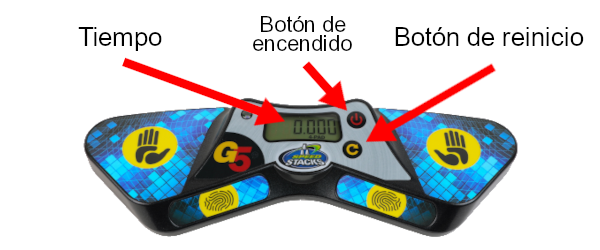

# Tutorial para Jueces Novatos

Este documento está dirigido a aquellos que nunca han sido jueces. Se resaltarán las reglas clave que se deben seguir en los intentos oficiales. El procedimiento descrito a continuación está pensado para eventos de speedsolving normales; los eventos de resolución a ciegas tienen algunas diferencias importantes que no serán tratadas en este documento.

## Equipamiento

Estas son las principales herramientas y equipamiento requeridos para proceder con un intento de speedsolving:

**Temporizador Stackmat**: Este es el dispositivo oficial para medir tiempos en las competiciones de la WCA. En la imagen de abajo se puede observar la última versión del temporizador, de todas formas, las versiones anteriores todavía son aceptadas para usar en las competiciones oficiales.

{.centered}

**Cronómetro de mano**: Utilizado para medir el tiempo de inspección. Los cronómetros de mano también se utilizan para medir el tiempo de los intentos que superan los 10 minutos. **Nota: No debe confundirse con el temporizador Stackmat.**

## Procedimiento

1. Colocar el puzzle mezclado en el tapete del Stackmat y mantenerlo cubierto hasta el comienzo de cada intento.
2. Reiniciar el temporizador Stackmat y el cronómetro de mano.
3. Una vez que se le pregunta, el competidor tiene un minuto para estar listo.
4. Cuando el competidor está listo, se quita la cobertura del puzzle y al mismo tiempo se inicia el cronómetro para medir la inspección. Esto marca el comienzo del intento.
5. Una vez que hayan transcurrido 8 segundos de inspección, debes decir "8 segundos". Luego de transcurridos 12 segundos, debes decir "12 segundos".
6. Durante la fase de inspección, el competidor no debe aplicar ningún movimiento al puzzle, a no ser que sea para corregir pequeñas desalineaciones.
7. Para comenzar la resolución, el competidor debe colocar los dedos en los sensores, esperar a que se encienda la luz verde, y luego levantar las manos del temporizador.
8. Debes detener el cronómetro de la inspección tan pronto como el competidor comienza la resolución.
9. El intento termina cuando el competidor detiene el temporizador luego de haber resuelto el puzzle. Debes revisar el puzzle, sin tocarlo, y decir "OK" (o "CORRECTO"), "PENALIZACIÓN" o "DNF".
10. El resultado final (junto con las penalizaciones, si las hay) es registrado en la hoja de resultados antes de que el juez y el competidor firmen el intento para confirmar que el resultado es correcto y aceptado por ambos.

## Penalizaciones {.page-break-before}

**+2** es una penalización que suma dos segundos al resultado final del intento. Las penalizaciones **+2** son acumulativas, lo que significa que el competidor podría llegar a recibir una penalización total de **+4** o incluso mayor. **Did Not Finish** (DNF) es una penalización que descalifica el intento. Si no estás seguro de lo que deberías hacer en un incidente, siempre deberías preguntarle al Delegado de la WCA.

Algunos incidentes comunes que pueden resultar en +2 o DNF:

{.centered}

**+2** es aplicado cuando el competidor excede los 15 segundos de inspección y comienza la resolución antes de los 17 segundos.

**DNF** es aplicado cuando el competidor no comienza la resolución antes de los 17 segundos de inspección.

{.centered}

**+2** es aplicado cuando el competidor toca el puzzle mientras inicia el temporizador.

**+2** es aplicado cuando el competidor detiene el temporizador sin soltar el puzzle por completo.

**+2** es aplicado cuando el competidor toca el puzzle antes de que el juez haya revisado el estado resuelto.

{.centered .page-break-before}

**+2** es aplicado cuando el competidor falla en iniciar el temporizador con las palmas de las manos hacia abajo.

**+2** es aplicado cuando el competidor falla en detener el temporizador con las palmas de las manos hacia abajo.

{.centered}

**+2** es aplicado si el puzzle queda a un movimiento del estado resuelto al final del intento.

Nota: los giros de 180° (R2, U2, etc.) son considerados un solo movimiento.

::::: {.box .warning .page-break-before}

#### A continuación se muestra qué tipo de desalineaciones resultan en un +2:

{.centered}
:::::

Otros incidentes que pueden resultar en una penalización:

- Mientras inspecciona o resuelve el puzzle, el competidor no debe comunicarse con nadie que no sea el juez o el Delegado de la WCA designado. (DNF)
- Mientras inspecciona o resuelve el puzzle, el competidor no debe recibir asistencia de nadie ni nada, aparte de la superficie. (DNF)
- Mientras inspecciona o resuelve el puzzle, el competidor no debe tocar ni interactuar con dispositivos de grabación o cualquier otro dispositivo electrónico. (DNF)

## Registrando los resultados

Si se aplica alguna penalización, siempre deberías escribir el tiempo original, las penalizaciones y el tiempo final. Además, las penalizaciones se escriben antes o después del tiempo original, dependiendo de si se originaron antes o después del intento. Por ejemplo, si un competidor termina un intento con un tiempo de 17.65 segundos y recibe un +2 por no iniciar correctamente el temporizador, el resultado final debería ser escrito como `2+17.65=19.65`, debido a que la penalización ocurrió antes de que comenzara el intento.
