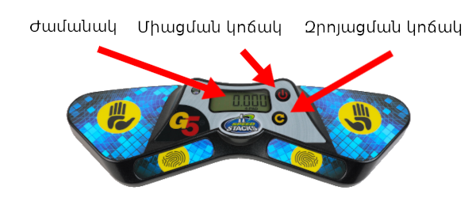
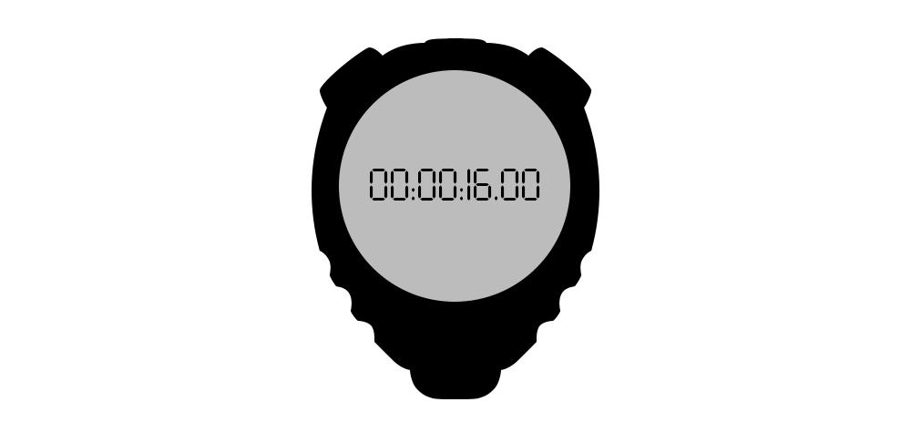
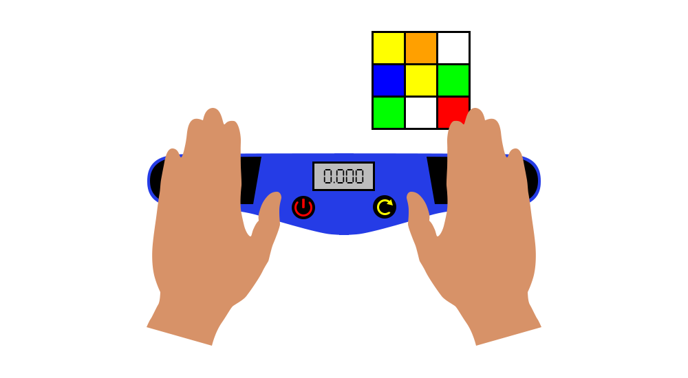
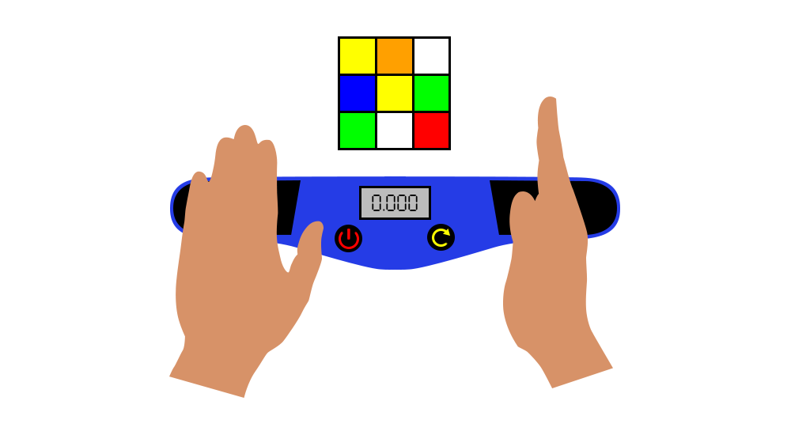
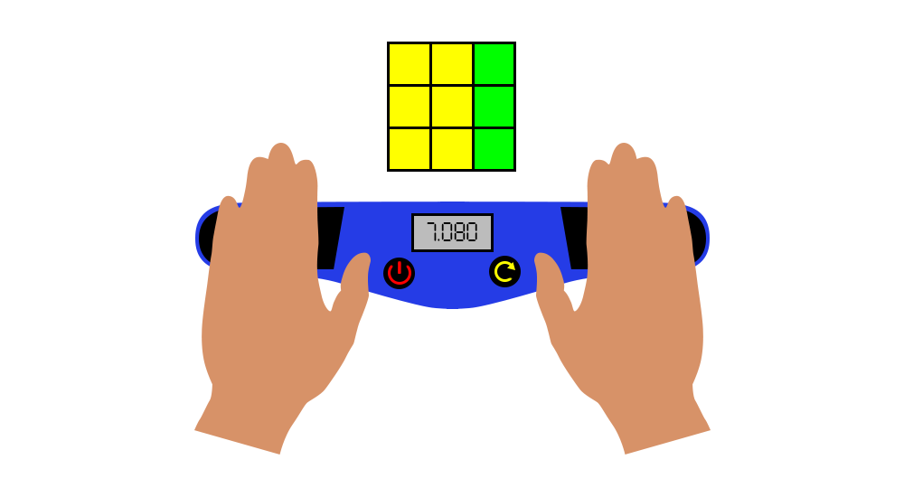
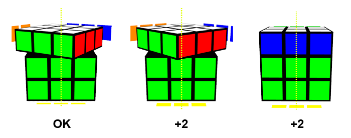

# Մրցավարի Ձեռնարկ Սկսնակների համար

### Version 1.0 {.version}

Այս փաստաթուղթը նախատեսված է այն մարդկանց համար ովքեր նախկինում մրցավար չեն եղել, և կնշի կարևոր կանոնները մրցավար լինելու ժամանակ։ Այս ընթացակարգը ներկայացված է կանոնավոր արագ հավաքելու կատեգորիաների համար։ Աչքերը փակ հավաքելու կատեգորիաների համար կան որոշ առանձնահատկություններ որոնք նշված չեն այս փաստաթղթում։

## Սարքավորում

Սրանք հիմնական սարքավորումներն ու գործիքներն են, որոնք անհրաժեշտ են արագ հավաքելու փորձը սկսելու համար։

**Stackmat ժամաչափ**: ԱԿԱ(Աշխարհի Կուբիկի Ասոցիացիա) առաջնությունների ընթացքում ժամանակ պահելու համար պաշտոնական սարքն է։ Ստորև նկարում ժամաչափի վերջին տարբերակն է, որի 3-րդ, 4-րդ, 5-րդ սերնդի տեսակներն օգտագործելը նույնպես ընդունված է առաջնությունների ժամանակ։

{.centered width=65%}

**Վայրկյանաչափ**: Սա օգտագործվում է զննման ժամանակը չափելու համար։ Վայրկյանաչափերն օգտագործվում են նաև 10 րոպեից երկար փորձերը չափելու համար։ **Նշում: Չշփոթել Stackmat ժամաչափի հետ**

## Մրցավարության ընթացակարգը

1. Դրեք խառնած փազլը գորգին և փակ պահեք մինչև ցանկացած փորձի սկսելը։
2. Զրոյացրեք Stackmat ժամաչափը և վայրկյանաչափը։
3. Մասնակիցը մեկ րոպե ժամանակ ունի փորձը սկսելու համար։
4. Երբ մասնակիցը պատրաստ է, հանեք փազլի ծածկը և միաժամանակ սկսեք վայրկյանաչափը մասնակցի զննումը չափելու համար։ Սրանով սկսվում է մասնակցի փորձը։
5. Զննման սկսվելուց 8 վայրկյան հետո դուք պետք է ասեք "8 վայրկյան"։ 12-րդ վայրկյանից հետո պետք է ասեք "12 վայրկյան"։
6. Զննման ընթացքում մասնակիցն իրավունք չունի շարժել փազլը՝ բացառությամբ թեթև թեքվածության դեպքերից։
7. Մասնակիցը հավաքելուց առաջ մատերը դնում է սենսորին, սպասում է մինչև միանա կանաչ լույսը, և հետո նոր հանում է ձեռները ժամաչափի վրայից։
8. Վայրկյանաչափը դադարեցրեք այն պահին երբ մասնակիցը սկսում է հավաքել։
9. Մասնակիցը հավաքելուց հետո կանգնեցնում է ժամաչափը և ավարտում է փորձը։ Հավաքելուց հետո զննեք փազլը առանց դիպչելու (բացառությամբ Ժամ փազլի կատեգորիայից) և ասեք "Լավ", "Տուգանք" կամ “DNF”:
10. Վերջնական արդյունքը (ինչպես նաև տուգանքները եթե եղել են) մրցավարը գրանցում է արդյունքի թերթիկի վրա և ստորագրում է։ Այնուհետև մասնակիցը հաստատում է, որ գրանցված ժամանակը ճիշտ է և ստորագրում է համապատասխան տեղում։

## Տուգանքներ

**+2**: տուգանքը 2 վայրկյան ավելացնում է մասնակցի վերջնական արդյունքին։ **+2** տուգանքները կուտակային են, այսինքն մասնակիցը կարող է ստանալ ընդհանուր **+4** կամ ավելի բարձր տուգանքներ. **Did Not Finish** (DNF) (թարգմ․ Չի Ավարտել) տուգանքը որակազրկում է մասնակցի փորձը։ Եթե դուք վստահ չեք, թե ինչ պետք է արվի ինչ որ դեպքում, պետք է անպայման դիմեք առաջնությանը ներկա ԱԿԱ պատվիրակին։

Սրանք հաճախ հանդիպող դեպքեր են, որոնք կհանգեցնեն +2 կամ DNF տուգանքի:

{.centered width=70%}

**+2**: տուգանքը տրվում է երբ մասնակցի զննման ժամանակը անցել է 15 վայրկյանը և մասնակիցը սկսել է հավաքել մինչև զննման 17-րդ վայրկյանը։

**DNF**: տուգանքը տրվում է երբ մասնակիցը ձախողում է հավաքելը սկսել զննման 17-րդ վայրկյանից շուտ։

{.centered width=70%}

**+2**: տուգանքը տրվում է երբ մասնակիցը ժամաչափը սկսելու ժամանակ դիպչում է փազլին։

**+2**: տուգանքը տրվում է երբ մասնակիցը դադարեցնում է ժամաչափը և դեռ դիպչում է փազլին։

**+2**: տուգանքը տրվում է երբ մասնակիցը հավաքելուց հետո դիպչում է փազլին մինչ մրցավարի զննումը։

{.centered width=70%}

**+2**: տուգանքը տրվում է երբ մասնակիցը ժամաչափը չի սկսում ձեռքերի ափերը ներքև պահած։

**+2**: տուգանքը տրվում է երբ մասնակիցը ժամաչափը չի դադարեցնում ձեռքերի ափերը ներքև պահած։

{.centered width=70%}

**+2**: տուգանքը տրվում է երբ փորձի վերջում փազլը հավաքված վիճակին կլինի մեկ քայլից։

Նշում: 180° պտույտները (R2, U2, և այլն) համարվում են մեկ քայլ։

::::: {.box .warning .page-break-before}

#### Սա ցույց է տալիս, թե որ տեսակի դասավորվածություններն հանգեցնում +2 տուգանքի։

{.centered width=80%}
:::::

Այլ միջադեպեր, որոնք կհանգեցնեն տուգանքի:

- Փազլը զննելու կամ հավաքելու ժամանակ մասնակիցն իրավունք չունի խոսել մրցավարից և ԱԿԱ պատվիրակից բացի այլ անձանց հետ։ (DNF)
- Փազլը զննելու կամ հավաքելու ժամանակ մասնակիցն իրավունք չունի ստանալ օգնություն այլ անձանցից կամ սեղանից բացի այլ իրերից։ (DNF)
- Փազլը զննելու կամ հավաքելու ժամանակ մասնակիցն իրավունք չունի առնչվել կամ դիպչել ցանկացած տեսակի էլէկտրոնային կամ տեսագրման սարքի։ (DNF)

## Արդյունքը գրանցելը

Եթե տուգանք կա, դուք պետք է սկզբում միշտ գրեք սկզբնական հավաքման ժամանակը, գումարած տուգանքը և հետո վերջնական արդյունքը։ Տուգանքները կարող են գրվել նաև սկզբնական հավաքման ժամանակից առաջ կախված նրանից, թե երբ է տեղի ունեցել տուգանքը։ Օրինակ, եթե մասնակիցը հավաքել է փազլը 17․65 վայրկյանում և ստանում է +2 տուգանք ժամաչափը ճիշտ չսկսելու համար, ապա վերջնական արդյունքը գրվում է այսպես `2+17.65=19.65`, քանի որ տուգանքը տեղի էր ունեցել հավաքել սկսելուց առաջ։

