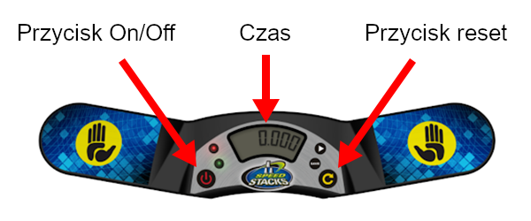

# Sędziowanie dla nowicjuszy

Ten dokument jest dla osób, które wcześniej nie były sędziami i przedstawi niektóre z kluczowych przepisów, których należy przestrzegać podczas procesu sędziowania. Opisana procedura jest przeznaczona dla regularnych zawodów Speedcubingu. W przypadku zawodów z zawiązanymi oczami istnieje kilka kluczowych różnic, które nie zostały wyróżnione w tym dokumencie.

## Sprzęt

Oto główne wyposażenie i narzędzia wymagane do podjęcia próby rozwiązania układanki:

**Stackmat timer**: Jest to oficjalne urządzenie do pomiaru czasu na zawodach WCA. Na zdjęciu poniżej widać najnowszą wersją timera, poprzednie wersje timera są nadal akceptowane do użytku w zawodach.

{.centered}

**Stoper**: Służy do pomiaru czasu preinspekcji. Stopery służą również do mierzenia czasu ułożenia układanki podczas rundy trwającej powyżej 10 minut. **Uwaga: Nie mylić z Stackmat timer.**

## Procedura sędziowania

    1. Umieść pomieszaną układankę na macie i trzymaj ją pod przykryciem przed rozpoczęciem każdej próby w rundzie.
2. Zresetuj stackmat timer i stoper.
3. Zawodnik, gdy zostanie o to poproszony, ma minutę na przygotowanie się do podjęcia proby rozwiązania układanki w danej rundzie. 
4. Gdy zawodnik jest gotowy, jednocześnie odkryj układankę i uruchom stoper, aby rozpocząć preinspekcję. 
5. Po upływie 8 sekund czasu preinspekcji należy powiedzieć "8 sekund". Po upływie 12 sekund czasu preinspekcji należy powiedzieć "12 sekund".
6. Podczas przebiegu preinspekcji zawodnik nie może wykonać żadnego ruchu w układance, z wyjątkiem skorygowania drobnych niewspółosiowości łamigłówki.
7. Zawodnik rozpoczyna probe rozwiązania układanki, kładąc palce na czujnikach i czeka na włączenie zielonego światła, następnie zdejmuje ręce z zegara.
8. Zatrzymaj stoper, gdy tylko zawodnik rozpocznie swoja probe w rundzie.
9. Zawodnik po rozwiązaniu układanki zatrzymuje zegar w celu zakończenia proby. Sprawdź układankę bez dotykania jej (z wyjątkiem układanki Zegara) i powiedz "W PORZĄDKU", "KARA" lub "DNF".
10. Wynik końcowy (wraz z karami, jeśli dotyczy) jest zapisywany przez sędziego na karcie wyników, zanim sędzia i zawodnik podpiszą dana próbę sprawdzając czy wynik jest poprawny i akceptowany.

## Kary {.page-break-before}

**+2** to kara, w której 2 sekundy są dodawane do końcowego wyniku próby. Kary kumulują się, co oznacza, że zawodnik może potencjalnie otrzymać łączną karę w wysokości **+4** lub nawet wyższą. **Did Not Finish (PL: Nie ukończył)** (DNF) to kara, która skutkuje dyskwalifikacją próby. Jeśli nie jesteś pewien, co należy zrobić w danym przypadku, zawsze powinieneś poprosić o radę Delegata WCA konkursu.

Oto kilka typowych zdarzeń, które mogą skutkować +2 lub DNF:

{.centered}

**+2** kara jest dawana, gdy zawodnik przekroczy 15 sekund czasu kontroli i rozpocznie rozwiązanie przed 17 sekundami.

**DNF** kara jest dawana, gdy zawodnik nie rozpocznie rozwiązania w ciągu 17 sekund od czasu inspekcji.

{.centered}

**+2** kara jest dawana, gdy zawodnik dotknie układanki podczas uruchamiania zegara.

**+2** kara jest dawana, gdy zawodnik zatrzymuje zegar bez całkowitego zwolnienia układanki.

**+2** kara jest dawana, gdy zawodnik dotknie układanki, zanim sędzia sprawdzi jej rozwiązanie. 

{.centered .page-break-before}

**+2** kara jest dawana, gdy zawodnik nie uruchamia zegara z dłońmi skierowanymi w dół.

**+2** kara jest dawana, gdy zawodnik nie zatrzymuje zegara z dłońmi skierowanymi w dół.

{.centered}

**+2** kara jest dawana, jeśli w układance brakuje jednego ruchu do stanu rozwiązanego na końcu próby.

Uwaga: obrót o 180° (R2, U2 itd.) jest uważany za jeden ruch.

::::: {.box .warning .page-break-before}

#### To pokazuje, jakie niewspółosiowości skutkują karą +2:

{.centered}
:::::

Inne zdarzenia, które mogą skutkować karą:

- Podczas inspekcji lub rozwiązywania układanki zawodnik nie może komunikować się z nikim innym niż sędzia lub delegatem WCA konkursu. (DNF)
- Podczas inspekcji lub rozwiązywania układanki zawodnik nie może otrzymać pomocy od nikogo ani żadnego przedmiotu innego niż powierzchnia stołu. (DNF)
- Podczas inspekcji lub rozwiązywania układanki zawodnik nie może wchodzić w interakcje ani dotykać żadnego rodzaju urządzenia nagrywającego lub elektronicznego. (DNF)

## Rejestrowanie wyników

Jeśli została nałożona jakakolwiek kara, zawsze należy zapisać pierwotny czas, przyznane kary i ostateczny czas. Kary są również pisane przed lub po pierwotnym czasie, w zależności od tego, czy miały miejsce przed czy po próbie. Na przykład, jeśli zawodnik zakończy próbę z czasem 17,65 i otrzyma +2 za nieprawidłowe uruchomienie licznika, wynik końcowy powinien zostać zapisany jako "2+17.65=19.65", ponieważ kara miała miejsce przed rozpoczęciem próby.

## Tłumaczenia

Poniżej znajdziesz tłumaczenia powyższej instrukcji. Skontaktuj się z quality@worldcubeassociation.org, aby uzyskać instrukcje dotyczące dodawania własnego tłumaczenia.

- [Հայերեն (Armeński)](https://www.worldcubeassociation.org/edudoc/judge-tutorial/judge-tutorial-am.pdf) - Tłumaczone przez Mayis Jraghatspanyan
- [Română (Rumuński)](https://www.worldcubeassociation.org/edudoc/judge-tutorial/judge-tutorial-ro.pdf) - Tłumaczone przez porduska
- [Español (Hiszpański)](https://www.worldcubeassociation.org/edudoc/judge-tutorial/judge-tutorial-es.pdf)

