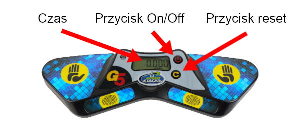
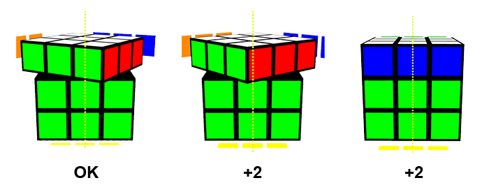

# Sędziowanie dla nowicjuszy

### Wersja 2.1 {.version}

Niniejszy dokument jest przeznaczony dla tych, którzy nie byli wcześniej sędziami i podkreśla niektóre z kluczowych reguł, których należy przestrzegać podczas procedury sędziowania. Opisana procedura dotyczy zwyczajnych konkurencji speedcubingowych. W przypadku konkurencji bez patrzenia istnieje kilka kluczowych różnic, które nie zostały wyróżnione w tym dokumencie.

## Sprzęt

Oto główne wyposażenie i narzędzia wymagane do przeprowadzenia ułożenia:

**Stackmat timer**: Jest to oficjalne urządzenie do pomiaru czasu podczas zawodów WCA. Na zdjęciu poniżej widać najnowszą wersją timera (Gen 5), ale wersje Gen 4 oraz Gen 3 są nadal dozwolone do użytku na zawodach.

{.centered}

**Stoper**: Służy do pomiaru czasu preinspekcji. Stopery służą również do mierzenia czasu ułożenia układanki dla prób trwających powyżej 10 minut. **Uwaga: Nie mylić ze     timerem.**

## Procedura sędziowania

1. Umieść pomieszaną układankę na macie i trzymaj ją pod przykryciem przed rozpoczęciem każdej próby w rundzie.
2. Zresetuj zarówno Stackmat timer, jak i stoper. Jeśli twoje stanowisko ma timer Gen 5, będziesz musiał nacisnąć przycisk resetowania nieco dłużej niż zwykle, a także powinieneś sprawdzić, czy timer jest w trybie 2-padowym (światło powinno być żółte, **nie** niebieskie).
3. Zawodnik, gdy zostanie o to poproszony, ma minutę na przygotowanie się do podjęcia próby rozwiązania układanki.
4. Gdy zawodnik jest gotowy, jednocześnie odkryj układankę i uruchom stoper, aby rozpocząć preinspekcję.
5. Po upływie 8 sekund czasu preinspekcji należy powiedzieć "8 sekund". Po upływie 12 sekund czasu preinspekcji należy powiedzieć "12 sekund".
6. Podczas fazy inspekcji zawodnik nie może wykonywać żadnych ruchów na układance, z wyjątkiem skorygowania nieprawidłowego ustawienia układanki.
7. Zawodnik rozpoczyna próbe rozwiązania układanki, kładąc palce na czujnikach i czeka na włączenie zielonego światła, następnie zdejmuje ręce z timera.
8. Zatrzymaj stoper, gdy tylko zawodnik rozpocznie swoja probe w rundzie.
9. Gdy zawodnik rozwiąże łamigłówkę, musi zatrzymać timer, aby zakończyć ułożenie. Sprawdź stan łamigłówki bez dotykania jej (z wyjątkiem konkurencji Clock) i podaj czas oraz ewentualne kary.
10. Ostateczny wynik (wraz z karami, jeśli dotyczy) jest zapisywany na karcie wyników, zanim zarówno sędzia, jak i zawodnik podpiszą próbę, aby zweryfikować, że wynik jest poprawny i zaakceptowany.

## Kary {.page-break-before}

**+2**: to kara, w której 2 sekundy są dodawane do końcowego wyniku próby. Kary kumulują się, co oznacza, że zawodnik może potencjalnie otrzymać łączną karę w wysokości **+4** lub nawet wyższą. **Did Not Finish (PL: Nie ukończył)** (DNF) to kara, która skutkuje dyskwalifikacją próby. Jeśli nie jesteś pewien, co należy zrobić w danym przypadku, zawsze powinieneś poprosić o radę Delegata WCA.

Oto kilka typowych incydentów, które mogą skutkować +2 lub DNF:

{.centered}

**+2**: zawodnik przekroczy 15 sekund czasu preinspekcji, ale rozpocznie ułożenie przed 17 sekundami.

**DNF**: zawodnik nie rozpocznie ułożenia w ciągu 17 sekund od rozpoczęcia preinspekcji.

{.centered}

**+2**: zawodnik dotknie układanki podczas uruchamiania timera.

**+2**: zawodnik zatrzymuje timer bez całkowitego puszczenia układanki.

**DNF**: zawodnik dotyka łamigłówki, zanim sędzia sprawdził stan rozwiązania. Jeśli jesteś pewien, że w wyniku tego nie nastąpiła żadna zmiana w ułożeniu łamigłówki, zamiast tego możesz przyznać **+2**. Wyjątek: jeśli natychmiast po zatrzymaniu stopera zawodnik **krótko** dotknie łamigłówki bez wpływu na jej stan, kara czasowa może zostać zniesiona według uznania sędziego.

{.centered .page-break-before}

**+2**: zawodnik nie uruchamia timera z dłońmi skierowanymi w dół.

**+2**: zawodnik nie zatrzymuje timera z dłońmi skierowanymi w dół.

{.centered}

**+2**:układance brakuje jednego ruchu do stanu rozwiązanego na końcu próby.

Uwaga: obrót o 180° (R2, U2 itd.) jest uważany za jeden ruch.

::::: {.box .warning .page-break-before}

#### To pokazuje, jakie nieprawidłowe ustawienia skutkują karą +2:

{.centered}
:::::

Inne incydenty, które mogą skutkować karą, to m.in:

**DNF**: podczas fazy preinspeksji i ułożenia łamigłówki zawodnik nie może komunikować się z nikim innym niż sędzia lub Delegat WCA. Wyjątek: Jeśli zawodnik nie zyskuje przewagi poprzez komunikowanie się z kimkolwiek innym niż sędzia lub Delegat WCA, wynik może zostać utrzymany, według uznania Delegata WCA.

**DNF**: podczas fazy preinspekcji i ułożenia łamigłówki zawodnik nie może korzystać z pomocy osób trzecich oraz przedmiotów innych niż powierzchnia stanowiska.

**DNF**: podczas fazy preinspekcji i ułożenia łamigłówki zawodnik nie może korzystać z żadnego urządzenia elektronicznego (patrz [Wytyczne 2i++++](wca{regulations/guidelines.html#2i++++}) w celu wyjaśnienia).

## Rejestrowanie wyników

Jeśli została nałożona jakakolwiek kara, należy zawsze wpisać oryginalny czas, nałożone kary oraz wynik końcowy. Przykłady:

- Jeśli zawodnik ukończy rozwiązanie z czasem 17.65 i otrzyma +2 za nieprawidłowe uruchomienie timera, wynik powinien być zapisany jako `17.65+2=19.65`. 
- Jeśli zawodnik ukończy rozwiązanie 3x3x3 z czasem 12.19 i otrzyma +2 za preinspekcję trwającą 16 sekund oraz +2 za warstwę przesuniętą o 60° na końcu, wynik powinien być zapisany jako `12.19+4=16.19`.
