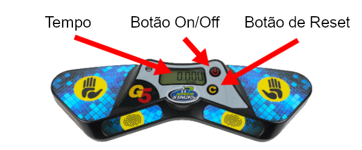

# Tutorial de Ajuizamento para Iniciantes

### Versão 2.1 {.version}

Este documento destina-se àqueles que nunca foram juízes e destacará alguns dos principais regulamentos a serem seguidos durante o processo de julgamento. O procedimento descrito destina-se a eventos regulares de resolução em velocidade. Para eventos de os olhos vendados, existem algumas diferenças importantes não destacadas neste documento.

## Equipamento

Este é o principal equipamento e ferramentas necessárias para realizar uma tentativa de resolução em velocidade:

**Cronómetro Stackmat**: Este é o dispositivo oficial para medir tempos numa competição WCA. A imagem abaixo é a versão mais recente do cronómetro (Gen 5), as versões Gen 3 e Gen 4 do cronómetro são também aceites em competições.

{.centered}

**Cronómetro**: É usado para medir o tempo de inspeção. Os cronómetros também são usados para medir o tempo de tentativas de mais de 10 minutos. **Nota: não confundir com um cronómetro Stackmat.**

## Procedimento de Ajuizamento

1. Coloque o puzzle embaralhado no tapete e mantenha-o coberto antes do início de cada tentativa.
2. Coloque o cronómetro e o Cronómetro Stackmat a zeros. Se a sua estação tiver um cronómetro Gen 5, terá que premir o botão de reset por um pouco mais que o normal e também deverá verificar se o Cronómetro Stackmat está no modo de 2 botões (a luz deve estar amarela, **não** azul).
3. Pergunte ao competidor se está pronto; Este tem até um minuto para se preparar.
4. Assim que o competidor estiver pronto, destape o puzzle e ligue o cronómetro simultaneamente para cronometrar a inspeção. Isso inicia a tentativa.
5. Após 8 segundos de inspeção, deve dizer “8 segundos”. Depois de decorridos 12 segundos de inspeção, deve dizer “12 segundos”.
6. Durante a fase de inspeção, o competidor não deve fazer nenhum movimento no puzzle, exceto para corrigir pequenos desalinhamentos.
7. O competidor inicia a resolução colocando os dedos nos sensores, aguardando o acender da luz verde e retirando as mãos do Cronómetro.
8. Pare o cronómetro assim que o competidor iniciar o Cronómetro Stackmat (quando as luzes começarem a piscar).
9. Assim que o competidor resolver o puzzle, tem que parar o Cronómetro Stackmat para terminar a tentativa. Inspecione o estado de resolução do puzzle sem lhe tocar (exceto para o evento Clock) e anuncie o tempo e penalidades, se aplicável.
10. Um resultado final (juntamente com penalidades, se aplicável) é registado na folha de resultados antes do juiz e o competidor assinarem a tentativa para verificar que o resultado está correto e aceite.

## Penalidades {.page-break-before}

**+2**: é uma penalidade onde 2 segundos são adicionados ao resultado final da tentativa. As penalidades de **+2** são cumulativas, o que significa que o competidor pode potencialmente receber uma penalidade total de **+4** ou até mais. **Did Not Finish** (DNF) é uma penalidade que resulta na desqualificação da tentativa. Se não tem a certeza do que deve ser feito num incidente, deve sempre pedir um conselho ao Delegado da WCA da competição.

Aqui estão alguns incidentes comuns que podem resultar em +2 ou DNF:

{.centered}

**+2**: o competidor excede 15 segundos de tempo de inspeção e inicia a resolução antes de 17 segundos.

**DNF**: o competidor não consegue iniciar a resolução dentro de 17 segundos do tempo de inspeção.

{.centered}

**+2**: o competidor está a tocar no puzzle ao iniciar o Cronómetro.

**+2**: o competidor para o cronómetro sem largar totalmente o puzzle.

**DNF**: o competidor toca no puzzle antes que o juiz inspecione o estado de resolução. Se tiver a certeza de que não foi feita qualquer alteração no alinhamento do puzzle como resultado dessa ação, pode ser dado **+2**. Exceção: se imediatamente após parar o cronómetro, o competidor **tocar brevemente** no puzzle sem afetar o seu estado, a penalização de tempo poderá ser suspensa, segundo critério do juiz.

{.centered .page-break-before}

**+2**: o competidor falha em iniciar o Cronómetro com as palmas das mãos voltadas para baixo.

**+2**: o competidor não consegue parar o Cronómetro com as palmas das mãos voltadas para baixo.

{.centered}

**+2**: o puzzle está a um movimento de distância do estado resolvido no final da tentativa. Nota: movimentos de 180° (R2, U2, etc.) em puzzles NxNxN são considerados um movimento.

::::: {.box .warning .page-break-before}

#### Isto mostra que tipo de desalinhamento resulta numa penalidade de +2:

{.centered}
:::::

Outros incidentes que podem resultar em penalidade incluem os seguintes:

**DNF**: ao inspecionar ou resolver o puzzle, o competidor não deve se comunicar com ninguém além do juiz ou do Delegado da WCA da competição. Exceção: Se o competidor não obtiver qualquer vantagem ao comunicar com alguém que não seja o juiz ou o Delegado da WCA, o resultado poderá ser mantido, segundo o critério do Delegado da WCA.

**DNF**: ao inspecionar ou resolver o puzzle, o competidor não deve receber ajuda de ninguém ou de nenhum objeto que não seja a superfície.

**DNF**: ao inspecionar ou resolver o puzzle, o competidor não pode interagir com nenhum tipo de dispositivo eletrónico. (consulte a [Orientação 2i++++](wca{regulations/guidelines.html#2i++++}) para clarificação).

## Registando Resultados

Se alguma penalidade foi aplicada, deve sempre escrever o tempo original, as penalidades aplicadas e o tempo final. Exemplos:

- Se um competidor terminar uma resolução com um tempo de 17,65 e receber +2 por não iniciar corretamente o Cronómetro, o resultado final deve ser escrito como `17,65+2=19,65`.
- Se um competidor terminar uma resolução de 3x3x3 com um tempo de 12,19 e receber +2 por inspecionar em 16 segundos e +2 por um alinhamento de 60° no fim da resolução, o resultado final deve ser escrito como `12,19+4=16,19`.
