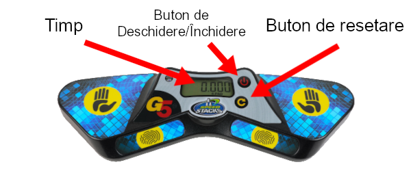

# Tutorial de Judecată pentru Noi-Veniți

Acest document sunt pentru cei care nu au mai fost niciodată judecători, și va evidenția câteva dintre regulațiile cheie în timpul procesului de judecare/jurizare. Această procedură descrisă este destinată pentru evenimente normale de speedsolving. Pentru evenimentele blindfolded sunt câteva diferențe cheie care nu sunt evidențiate în document.

## Echipament

Acesta este echipamentul principal si instrumentele necesare pentru a continua cu o incercare de speedsolving:

**Cronometru Stackmat**: Acesta este dispozitivul oficial pentru a măsura timpuri la o competiție WCA. Imaginea de mai jos este ultima revizie a cronometrului, revizii mai vechi ale cronometrului sunt încă folosite în competiții.

{.centered}

**Cronometru**: Asta este folosit pentru a măsura timpul de inspecție. Cronometrele pot fi folosite pentru a măsura timpul pentru încercăriile de peste 10 minute.
**Notă: A nu fi confundat cu un cronometru Stackmat.**

## Procedura de Jurizare

1. Așezați puzzle-ul amestecat pe covoraș li păstrați-l acoperit înainte de începerea fiecărei încercări
2. Resetează cronometrul Stackmat și cronometrul normal.
3. Concurentul are un minut să se pregătească când este întrebat.
4. Odată ce concurentul este gata, descoperiți puzzle-ul și porniți simultan cronometrul Stackmat și cronometrul normal. Aceasta începe încercarea.
5. După ce au trecut 8 secunde de inspecție, trebuie să spui “8 secunde”. După ce 12 secunde de inspecție au trecut, trebuie să spui “12 secunde”.
6. În timpul fazei de inspecție, concurentul nu trebuie să facă nicio mișcare la puzzle, decât pentru a corecta nealinieri minore.
7. Concurentul începe rezolvarea punându-și degetele pe senzori, așteptând lumina verde și apoi scoțându-și mâinile de pe cronometru.
8. Opriți cronometrul imediat ce concurentul își începe rezolvarea.
9. Concurentul oprește cronometrul odată ce a rezolvat puzzle-ul pentru a opri încercarea. Inspectați puzzle fără a-l atinge (cu excepția evenimentului Clock) și spune „OK”, „PENALITATE” sau „DNF”.
10. Un rezultat final (împreună cu penalizările, dacă este cazul) este înregistrat pe tabelul de punctaj înaintea judecătorului ți concurentul semnează încercarea de a verifica dacă rezultatul este correct și acceptat.

## Penalizări {.page-break-before}

**+2** este o penalizare în care se adaugă 2 secunde la rezultatul final al încercării. **+2** penalitățile sunt cumulative, ceea ce înseamnă că concurentul ar putea primi o penalizare totală de **+4** sau chiar mai mare. **Nu a terminat** (DNF) este o penalizare care duce la descalificarea încercării. Dacă nu ești sigur ce ar trebui făcut într-un incident, trebuie să întrebați întotdeauna delegatul WCA al competiției pentru un sfat.

Iată câteva incidente comune care pot duce la +2 sau DNF:

{.centered}

**+2** este dat atunci când concurentul depășește timpul de inspecție de 15 secunde și începe rezolvarea înainte de 17 secunde.

**DNF** este dat atunci când concurentul nu reușește să înceapă rezolvarea în 17 secunde de la timpul de inspecție.

{.centered}

**+2** este dat atunci când concurentul atinge puzzle-ul în timp ce pornește cronometrul.

**+2** este dat atunci când concurentul oprește cronometrul fără a elibera complet puzzle-ul.

**+2** este dat atunci când concurentul atinge puzzle-ul înainte ca judecătorul să fi inspectat starea rezolvată.

{.centered .page-break-before}

**+2** este dat atunci când concurentul nu reușește să pornească cronometrul cu palmele îndreptate în jos.

**+2** este dat atunci când concurentul nu reușește să oprească cronometrul cu palmele îndreptate în jos.

{.centered}

**+2** este dat dacă puzzle-ul este la o distanță de starea rezolvată la sfârșitul încercării.

Notă: Virajele de 180° (R2, U2 etc.) sunt considerate o singură mișcare.

::::: {.box .warning .page-break-before}

#### Aceasta arată ce fel de nealiniere duc la o penalizare de +2:

{.centered}
:::::

Alte incidente care pot avea ca rezultat o penalizare:

- În timpul inspectării sau rezolvării puzzle-ului, concurentul nu trebuie să comunice cu nimeni altul decât arbitrul sau delegatul WCA al competiției. (DNF)
- În timpul inspectării sau rezolvării puzzle-ului, concurentul nu trebuie să primească asistență de la nimeni sau alt obiect altul decât suprafața. (DNF)
- În timpul inspectării sau rezolvării puzzle-ului, concurentul nu trebuie să interacționeze cu sau să atingă niciun fel de dispozitiv de înregistrare sau dispozitiv. (DNF)

## Rezultatele înregistrării

Dacă a fost dată vreo penalizare, trebuie să scrieți întotdeauna ora inițială, penalitățile acordate și ora finală. Penalitățile sunt scrise  înainte sau după ora inițială, în funcție de faptul că au avut loc înainte sau după încercare. De exemplu, dacă un concurent termină o încercare cu un timp de 17.65 și primește un +2 pentru nepornirea corectă a cronometrului, rezultatul final ar trebui scris ca `2+17.65=19.65`, deoarece penalizarea a avut loc înainte de începerea încercării.
