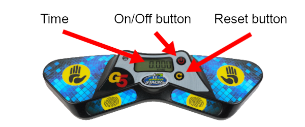

# Judging Tutorial for Newcomers

### Version 2.0 {.version}

This document is intended for those who have not been a judge before, and will highlight some of the key regulations to follow during the judging process. The procedure described is intended for regular speedsolving events. For blindfolded events there are a few key differences not highlighted in this document.

## Equipment

This is the main equipment and tools required to proceed with a speedsolving attempt:

**Stackmat timer**: This is the official device for measuring times at a WCA competition. The image below is the latest version of the timer, but the Gen 3 and Gen 4 versions of the timer are also accepted for use at competitions.

{.centered width=65%}

**Stopwatch**: This is used for measuring the inspection time. Stopwatches are also used to measure time for attempts over 10 minutes. **Note: not to be confused with a Stackmat timer.**

## Judging Procedure

1. Place the scrambled puzzle on the mat and keep it covered before the start of every attempt.
2. Reset both the Stackmat timer and stopwatch.
3. Ask the competitor if they are ready; they have one minute to get ready.
4. Once the competitor is ready, uncover the puzzle and start the stopwatch simultaneously to time the inspection. This starts the attempt.
5. After 8 seconds of inspection have elapsed you must call “8 seconds”. After 12 seconds of inspection have elapsed, you must call “12 seconds”.
6. During the inspection phase, the competitor must not make any move to the puzzle, except to correct minor misalignments.
7. The competitor starts the solve by placing their fingers on the sensors, waiting for the green light to turn on and then removing their hands from the timer.
8. Stop the stopwatch as soon as the competitor starts the timer (when the lights start flashing).
9. Once the competitor solves the puzzle, they must stop the timer to finish the solve. Inspect the solved state of the puzzle without touching it (except for the Clock event) and announce the time and any penalties, if applicable.
10. A final result (along with penalties, if applicable) is recorded on the scorecard before both the judge and the competitor sign the attempt to verify that the result is correct and accepted.

## Penalties {.page-break-before}

**+2**: is a penalty where 2 seconds are added to the final result of the attempt. **+2** penalties are cumulative, which means the competitor could potentially receive a total penalty of **+4** or even higher. **Did Not Finish** (DNF) is a penalty that results in a disqualification of the attempt. If you are not sure what should be done in an incident, you should always ask the WCA Delegate of the competition for advice.

Here are some common incidents that can result in +2 or DNF:

{.centered}

**+2**: the competitor exceeds 15 seconds of inspection time and starts the solve before 17 seconds.

**DNF**: the competitor fails to start the solve within 17 seconds of inspection time.

{.centered}

**+2**: the competitor touches the puzzle while starting the timer.

**+2**: the competitor stops the timer without fully releasing the puzzle.

**DNF**: the competitor touches the puzzle before the judge has inspected the solved state. If you are certain that no change in alignment of the puzzle was done as a result of this, **+2** can be given instead.

{.centered .page-break-before}

**+2**: the competitor fails to start the timer using their fingers with the palms facing down.

**+2**: the competitor fails to stop the timer with their palms facing down.

{.centered}

**+2**: the puzzle is one move away from the solved state at the end of the solve. Note: 180° turns (R2, U2, etc.) on NxNxN puzzles are considered one move.

::::: {.box .warning .page-break-before}

#### This shows what kind of misalignments result in a +2 penalty:

{.centered}
:::::

Other incidents that can result in a penalty include the following:

**DNF**: while inspecting or solving the puzzle, the competitor must not communicate with anyone other than the judge or the WCA Delegate of the competition.

**DNF**: while inspecting or solving the puzzle, the competitor must not receive assistance from anyone or any object other than the surface.

**DNF**: while inspecting or solving the puzzle, the competitor must not use any kind of recording device or electronics (see [Guideline 2i++++](wca{regulations/guidelines.html#2i++++}) for clarification).

## Recording Results

If any penalty was given, you should always write the original time, the penalties given and the final time. Examples:

- If a competitor finishes a solve with a time of 17.65 and receives a +2 for not properly starting the timer, the final result should be written as `17.65+2=19.65`. 
- If a competitor finishes a 3x3x3 solve with a time of 12.19 and receives a +2 for inspecting for 16 seconds and a +2 for a 60° misalignment at the end, the final result should be written as `12.19+4=16.19`.

## Translations

Below you can find translations of the tutorial. Contact quality@worldcubeassociation.org for instructions on how to add your own translation.

- [Հայերեն (Armenian)](wcadoc{edudoc/judge-tutorial/judge-tutorial-am.pdf}) - translated by Mayis Jraghatspanyan
- [Polski (Polish)](wcadoc{edudoc/judge-tutorial/judge-tutorial-pl.pdf}) - translated by Stanislaw Ulbrych
- [Português Europeu (European Portuguese)](wcadoc{edudoc/judge-tutorial/judge-tutorial-pt.pdf}) - translated by António Gomes
- [Română (Romanian)](wcadoc{edudoc/judge-tutorial/judge-tutorial-ro.pdf}) - translated by porduska
- [Español (Spanish)](wcadoc{edudoc/judge-tutorial/judge-tutorial-es.pdf}) - translated by Gennaro Monetti
