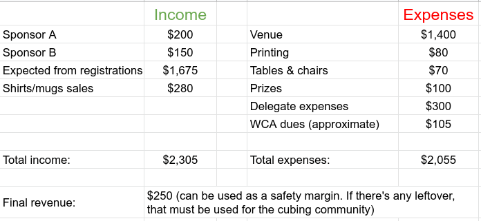

# Budgeting a competition

Budgeting your competition properly is crucial to improving the overall quality and to avoiding any financial loss. While budgeting, strive to answer the following questions:

## What expenses are there?

Making a list with all the expenses is a great way to start and get an estimate on how much you need to collect from registration fees (although a lower registration fee is always preferable) or if the venue is too expensive and you need to find a cheaper one.

- Is the venue free? If not, how much does it cost?
- Does the venue require an insurance fee? If so, how much does it cost?
- Do you need to pay the venue to set up anything?
- Is there any extra fee to have venue staff present on the competition day(s)? If yes, how much?
- Does the venue demand any percentage of the money collected from the registrations?
- Do the Delegate(s) live near the competition? Are you going to need to cover any of their expenses? If so, which ones?
  - You should always try to get the closest Delegate possible to lower the expenses. Nevertheless, Delegate expenses must only include costs incurred as a direct result of attending the competition as a listed Delegate. For more information on covering Delegates’ expenses, see the section on finances of the [Code of Ethics](https://www.worldcubeassociation.org/documents/Code%20of%20Ethics.pdf).
- Do you need to rent tables/chairs?
- Do you need to rent audio/visual equipment?
- Are competitors receiving prizes? How much do those cost?
- Are there any souvenirs for the competitors? (I.e. keychain, pens, etc.)
- If selling merchandise is being considered to offset costs, how much will the merchandise cost to produce?
- Printing costs
- [WCA Dues](https://www.worldcubeassociation.org/documents/policies/external/Dues%20System.pdf)

## What are the sources of income?

Registration fees are the most common way to collect money for your competition. If you are relying on registration fees, make sure to estimate the minimum number of competitors you are expecting while calculating expected income. Guest fees are another, but far less common, source of income. Do your best to keep registration and guest fees reasonably low (especially guest fees), as high costs may make your competition unattractive or inaccessible for competitors and spectators.

To lower registration fees you can sell merchandise (e.g. Shirts, mugs or bags), enable donations on the registration site, or receive financial help from sponsors (e.g. cube stores, the venue itself giving a reduced rate, etc.). If you plan on selling merchandise, be sure to check if on the competition day sales are allowed inside the venue. Keep in mind that depending on your local laws, it may not be financially sustainable or worth it to sell merchandise because of taxes or similar expenses.

Keep in mind when drafting a budget which heavily relies on registration fees that you should distinguish between the competitor limit and the minimum number of competitors you expect to attend. Usually, it will be safer to draft the budget based on the minimum number of expected competitors to avoid financial loss. However, please consider how realistic the numbers are and find a compromise for what you believe is reasonable.

Listing all sources of income and comparing them to the expenses can help you see whether the total income matches or exceeds the expenses. If expenses exceed total income then you will need to find a way to raise more funds. Try to raise slightly more funds than your expected expenses so that you are prepared in case anything goes wrong. If you are going to rely primarily on registrations, it is good to use online payment to avoid the issue of being at a loss due to too many no-shows on the competition. Waiving registration fees for competitors must follow section 1.3 of the [Code of Ethics](https://www.worldcubeassociation.org/documents/Code%20of%20Ethics.pdf).

::::: {.box .attention}
Keep in mind that you **cannot** make a personal profit by organizing a competition! Please keep the Finances section of the [Code of Ethics](https://www.worldcubeassociation.org/documents/Code%20of%20Ethics.pdf) in mind when making your competition budget. If you have leftover funds at the end of your competition, discuss the best use of the funds with your Delegate(s).
:::::

In case you require competitors to pay for the registration in advance, the organization team and Delegate(s) should coordinate who will process the payments and who will perform the required shopping. Keep in mind that if you have a Regional Organization for the area of the competition, it might be preferable to have it process the payments due to potential taxation laws in your region.

### Example Budget

::::: {.box .example .text-left}
Here’s an example budget that could work for your competition. You need to be organized when writing it down in order to make things easier to track. If your final revenue is **negative**, it’s strongly recommended to adjust your expenses and income to avoid any major financial loss. For a more complete list of the expenses you may have, see the budget section of the [competition checklist](https://www.worldcubeassociation.org/edudoc/organizer-guidelines/checklist.pdf).

{.centered height=200px}
:::::

## Translations

Below you can find translations of this document. Contact quality@worldcubeassociation.org for instructions on how to add your own translation.

- [Português Europeu (European Portuguese)](https://worldcubeassociation.org/edudoc/organizer-guidelines/pt/budget.pdf) - translated by António Gomes
