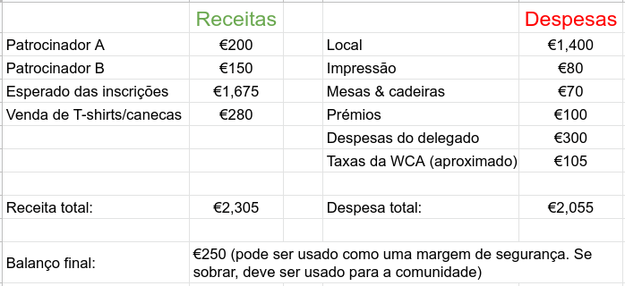

# Orçamentar uma competição

Orçamentar adequadamente a sua competição é crucial para melhorar a qualidade geral e evitar qualquer perda financeira. Ao fazer o orçamento, esforce-se para responder às seguintes perguntas:

## Quais são as despesas?

Fazer uma lista com todas as despesas é uma boa maneira de começar e obter uma estimativa de quanto precisa receber das taxas de inscrição (embora uma taxa de inscrição mais baixa seja sempre preferível) ou se o local de competição for muito caro e seja preciso encontrar um mais barato.

- O local de competição é gratuito? Se não, quanto custa?
- O local exige uma taxa de seguro? Se sim, quanto custa?
- É necessário pagar algo para montar alguma coisa?
- Existe alguma taxa extra para que a equipa do local esteja presente no(s) dia(s) da competição? Se sim, quanto?
- O local exige alguma percentagem do dinheiro arrecadado com as inscrições?
- O(s) Delegado(s) mora(m) perto da competição? Será necessário cobrir alguma das suas despesas? Se sim, quais?
  - Deve sempre tentar obter o Delegado mais próximo possível para diminuir as despesas. No entanto, as despesas do Delegado devem incluir apenas os custos incorridos como resultado direto de participar da competição como um Delegado listado. Para obter mais informações sobre como cobrir as despesas dos delegados, consulte a seção sobre finanças do [Código de Ética](https://www.worldcubeassociation.org/documents/Code%20of%20Ethics.pdf).
- Precisa alugar mesas/cadeiras?
- Precisa alugar equipamento audiovisual?
- Os competidores recebem prémios? Quanto custam?
- Há alguma lembrança para os competidores? (ou seja, chaveiro, canetas, etc.)
- Se a venda de merchandise está a ser considerada para compensar os custos, quanto custará a produção desse material?
- Custos de impressão
- [Taxas da WCA](https://www.worldcubeassociation.org/documents/policies/external/Dues%20System.pdf)

## Quais são as fontes de receita?

As taxas de inscrição são a maneira mais comum de obter dinheiro para sua competição. Se estiver a contar com taxas de inscrição, certifique-se de estimar o número mínimo de concorrentes que espera ao calcular a receita esperada. As taxas para público são outra fonte de receita, mas muito menos comum. Faça o seu melhor para manter as taxas de inscrição e de público razoavelmente baixas (especialmente taxas para público), pois os altos custos podem tornar a sua competição pouco atraente ou inacessível para competidores e espectadores.

Para baixar as taxas de inscrição, pode vender merchandise (por exemplo, camisolas, canecas ou bolsas), habilitar doações no site de inscrição ou receber ajuda financeira de patrocinadores (por exemplo, lojas de cubos, o próprio local dando uma taxa reduzida, etc.). Se planeia vender merchandise, certifique-se de verificar se no dia da competição as vendas são permitidas dentro do local da competição. Lembre-se de que, dependendo das leis locais, pode não ser financeiramente sustentável ou valer a pena vender merchandise devido a impostos ou despesas semelhantes.

Lembre-se ao elaborar um orçamento que dependa muito das taxas de inscrição que deve distinguir entre o limite de competidores e o número mínimo de competidores que espera participar. Normalmente, será mais seguro elaborar o orçamento com base no número mínimo de competidores esperados para evitar perdas financeiras. No entanto, considere quão realistas são os números e encontre um meio-termo para o que acredita ser razoável.

Listar todas as fontes de receitas e compará-las com as despesas pode ajudá-lo a ver se a receita total corresponde ou excede as despesas. Se as despesas excederem a receita total, precisará encontrar uma maneira de obter mais fundos. Tente obter um pouco mais de fundos do que suas despesas esperadas para que você esteja preparado caso algo dê errado. Se vai depender principalmente de inscrições, é bom usar o pagamento on-line para evitar o problema de perder devido a muitas não comparências na competição. A isenção de taxas de inscrição para concorrentes deve seguir a seção 1.3 do [Código de Ética](https://www.worldcubeassociation.org/documents/Code%20of%20Ethics.pdf).

::::: {.box .attention}
Lembre-se de que **não pode** obter lucro pessoal ao organizar uma competição! Lembre-se da seção Finanças do [Código de Ética](https://www.worldcubeassociation.org/documents/Code%20of%20Ethics.pdf) ao fazer o orçamento da sua competição. Se tiver fundos de sobra no final de sua competição, discuta o melhor uso desses fundos com o(s) seu(s) Delegado(s).
:::::

Caso requeira que os concorrentes paguem a inscrição antecipadamente, a equipa de organização e o(s) Delegado(s) devem coordenar quem processará os pagamentos e quem fará as compras necessárias. Lembre-se de que, se tiver uma Organização Regional para a área da competição, talvez seja preferível que ela processe os pagamentos devido a possíveis leis tributárias na sua região.

### Orçamento de Exemplo

::::: {.box .example .text-left}
Aqui está um exemplo de orçamento que pode funcionar para a sua competição. Precisa ser organizado ao escrevê-lo para tornar as coisas mais fáceis de rastrear. Se a sua receita final for **negativa**, é altamente recomendável ajustar as suas despesas e receitas de forma a evitar grandes perdas financeiras. Para uma lista mais completa das despesas que pode ter, veja a seção de Orçamento da [Checklist de competição](https://www.worldcubeassociation.org/edudoc/organizer-guidelines/pt/checklist.pdf).

{.centered height=200px}
:::::
