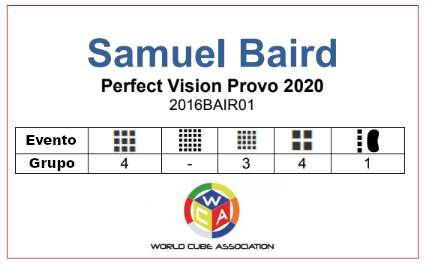

# Melhorando a experiência do Competidor e do Staff

Este é um guia para ajudar os organizadores a identificar alguns itens de qualidade de vida, recursos e pequenas coisas que estes podem fazer como organizadores para melhorar a experiência de competidores, espectadores e staff das suas competições.

## Comunicação

### Crachás Identificativos:

Crachás identificativos podem ser usados ​​para fornecer aos concorrentes informações sobre grupos e tarefas a realizar de uma maneira que facilite o seu acesso e compreensão.

::::: {.box .example}
Um exemplo de crachá identificativo da competição Perfect Vision Provo 2020 pode ser visto abaixo.

{.centered height=200px}
:::::

### Recursos online:

Recursos online podem ser usados ​​para beneficiar competidores, espectadores, patrocinadores e organizadores! Aqui estão alguns recursos online que pode compartilhar com os competidores e explicações como podem ser benéficos:

- Partilha de informações importantes sobre a competição, como informações de grupos e atribuições de tarefas.
- Tutoriais para modalidades podem ajudar a aumentar o número de competidores para essas modalidades.
- A página inicial de um patrocinador pode aumentar a receita do seu patrocinador, permitindo que ele cubra melhor valores de prémios ou do custo do local de competição.
- As informações de viagem podem ajudar os concorrentes e funcionários a planear melhor as suas rotas de viagem e mostrar-lhes opções de hospedagem.

### Posters/Cartazes:

Cartazes podem ser usados ​​para dar informações aos competidores e espectadores. Aqui estão algumas maneiras de como podem ser usados:

- Lembrar as pessoas de coisas que devem ou não fazer, ex. por favor, mantenha-se em silêncio, não use fotografia com flash, fique a 1,5 metros de distância dos competidores.
- Rotular áreas de importância, ex. sala de espera de competidores, sala auxiliar silenciosa, assentos para espectadores.
- Transmitir informações do grupos e/ou responsabilidades de staff aos competidores, listando as informações ou fornecendo um link e/ou código QR que os direcionar para as informações online.

### Folhetos:

Os folhetos podem ser usados ​​para transmitir informações importantes sobre a sua competição para espectadores e competidores, para responder a algumas perguntas frequentes que a sua comunidade local possa ter, para alertar os competidores sobre futuras competições na área e/ou direcionar os competidores para recursos online.

::::: {.box .example}
Um folheto de exemplo pode ser encontrado [aqui](https://docs.google.com/document/d/1cjlvbTQ-e8_TzviEfQ_OUggNtEh-1R7GhKWMU-7IW28/edit?usp=sharing).
:::::

## Reconhecimento de Competidores

É altamente recomendável fazer o esforço de reconhecer as conquistas e o trabalho dos competidores, dando troféus, prémios ou homenagens. Algumas conquistas para se qualificar para troféus, prémios ou honras podem incluir alcançar um pódio num evento, alcançar resultados notáveis, contribuições valiosas para a organização, a melhor soma de classificações/ranking kinch da competição, novo competidor mais rápido e participação.

Os competidores deverão comparecer na cerimónia de encerramento para receberem os troféus/prémios/honras. A cerimónia deverá ser realizada no local da competição, dentro de uma hora após o término do último evento. Os organizadores devem informar os vencedores sobre troféus, prémios ou honras para estarem preparados para conversar com jornalistas ou qualquer média que esteja a cobrir a competição, se aplicável. As equipas de organização das competições devem ter certificados para todos os vencedores das categorias, assinados pelo líder da equipa de organização e pelo Delegado da WCA.

### Prémios:

Os prémios são uma ótima maneira de reconhecer as conquistas dos competidores. Os patrocinadores devem ser procurados para ajudar a fornecer prémios, se possível. Alguns exemplos de prémios incluem cubos, cartões-presente, dinheiro, troféus ou medalhas. Os prémios também podem incluir um objeto ou item relacionado com o nome da competição ex. O Potato Open 2018 ofereceu batatas para os competidores que subiram ao pódio..

### Certificados:

Os certificados são uma das formas mais baratas de reconhecer as conquistas dos competidores, mas podem deixar os competidores com algo para lembrar. É recomendado que dê certificados aos competidores mesmo quando dá prémios para a competição. Pode encontrar modelos de certificados de voluntariado, mérito e participação [aqui](https://drive.google.com/drive/folders/1jrMWgOgNscPDqoxzgnEQ1bnV9D4FDzLj).

## Organização do Local de Competição

### Fitas separadoras:

Fitas separadoras podem ser extremamente úteis para o controlo de público! Algumas maneiras de usar as fitas separadoras são impedir que as pessoas cheguem a 1,5 metros das estações de resolução enquanto estiverem a ser usadas, separar a área de competição das áreas das restantes áreas e criar uma linha para a mesa de registo, se a sua competição tiver uma.

## Para Diversão

### Eventos Não Oficiais:

Realizar eventos que não são reconhecidos oficialmente pode ser divertido para os competidores participarem e os espectadores assistirem. Alguns exemplos de eventos não oficiais que podem ser realizados são eventos de equipa, estafetas e eventos que usam quebra-cabeças não WCA. Isto também pode ajudar a WCA a testar como estes eventos não oficiais podem funcionar em ambientes oficiais no futuro.

### Brindes:

Dar brindes aos competidores é uma ótima maneira de melhorar a sua experiência de competição! Exemplos de brindes que pode dar aos concorrentes podem incluir, mas não estão limitados a: sacos com cordão, t-shirts, camisolas, bonés, pulseiras, autocolantes, pins, porta-chaves, crachás identificativos, imans, canetas, lápis, acessórios para telefone, óculos de sol e logótipos de cubo. Os brindes podem incluir uma marca relacionada com a competição, uma equipa de organização que realizou a competição ou patrocinadores da competição.

## Recompensas/Incentivos de Staff

Para incentivar os competidores a juntarem-se ao staff da organização, há várias coisas que pode fornecer gratuitamente ou com desconto para eles. Isto pode incluir taxas de inscrição gratuitas ou com desconto, refeições, vestuário ou hospedagem. Os incentivos ao staff devem ser divulgados ao público antes da competição para transparência e para inscrever um número maior de membros de staff.
