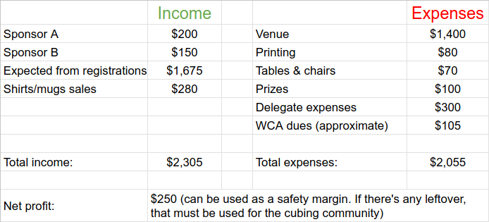
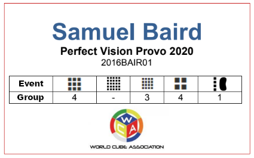

## Organizer Handbook

The _Organizer Handbook_ is an educational reference for the WCA Community at all levels of experience, whether you are a new competitor interested in organizing your first competition or an experienced organizer who has organized dozens of competitions. This handbook outlines the basic tasks and responsibilities for organizers so that every WCA competition can run with consistent levels of quality and fairness. This handbook is organized chronologically, from the earliest stages of planning a competition to post-competition duties.

While this handbook aims to be as complete as possible, it cannot be fully comprehensive. While organizing, you will likely run into situations you cannot foresee or predict. As you organize more competitions, you will build a foundation of experience that will allow you to independently handle scenarios not covered in this handbook.

Official competitions have been held in over 100 countries and regions. It is impossible to include specific organizational characteristics and behaviors for every region. This document attempts to include as wide a range of organizer duties as possible from throughout the WCA.

Finally, the _Organizer Handbook_ aims to reflect official WCA Policy, not create it. When a disagreement or contradiction arises, always defer to the official Policies, Motions, and Regulations. See the Contributing to this Document section for information on how to update this handbook to accurately reflect reality.

# Table of Contents {.page-break-before}
Section left intentionally blank.

# Introduction to Organizing {.page-break-before}

## Who Can Organize a Competition?

Anyone interested in organizing a WCA competition is welcome to get involved, but competition organizers must have the ability to run the event successfully. Organizers must meet certain requirements, such as knowing how competitions work, communicating effectively, and assembling a capable organization team. According to the Code of Ethics, Delegates can decline to work with potential organizers based on factors such as inexperience and already having an abundance of competitions in the region.

If you are interested in becoming a competition organizer, you are encouraged to volunteer at competitions first. Delegates appreciate those who willingly volunteer to help with judging, running, and scrambling.

## How to Organize a Competition

All WCA competitions must be attended and overseen by at least one WCA Delegate. If you want to organize your own competition, contact your nearest Delegate. If they agree to work with you, they can help you with finding a suitable venue and date. If there is no Delegate near your area, you can contact the Regional Delegate in your region.

## Disclaimer about Regional Differences

The WCA operates globally. Practices tend to differ from region to region. Certain sections or nuances of these guidelines might not apply to your region, although this handbook reflects the most common global practices.

The tasks you will need to do vary from region to region, but in general, there are several duties that your Delegate will likely expect you to perform. If you have specific questions, please ask the Delegate you plan to work with.

## Difference Between an Organizer and a Delegate

Delegates are one of the most prominent roles within the World Cube Association. A Delegate represents the WCA at a competition to ensure that competitors adhere to the rules of each event and maintain fair play throughout the competition. Most importantly, all Delegates are expected to have a strong understanding of the [WCA Regulations](https://www.worldcubeassociation.org/regulations/).

As the face of the WCA to competition attendees, a Delegate has many considerations and responsibilities to fulfill their duties effectively.

Delegates are highly experienced Community Members and often help out as organizers. Listed Delegates do not need to be listed separately as organizers to perform organizer duties, as they are members of the organization team by default. Some tasks that are typically performed by a Delegate, such as generating groups and providing competition equipment, are actually organizer duties and can be assigned to Community organizers.

<!-- Using an HTML table here because Markdown formatters and renderers often cannot present the information in a way that is easy to read when editing -->

<table>
  <thead>
    <tr>
      <th>**Delegate Duties**</th>
      <th>**Organizer Duties**</th>
    </tr>
  </thead>
  <tbody>
    <tr>
      <td>Before the competition: 
        Submitting the competition page 
        Assisting Organizers 
        Ensuring WCA Policies are followed 
        Generating scrambles</td>
      <td>Before the competition: 
        Making the competition page 
        Securing a venue 
        Arranging equipment (e.g. timers, mats, scoresheets, puzzle covers, etc.) 
        Generating groups and assigning volunteer duties </td>
    </tr>
    <tr>
      <td>During the competition: 
        Ensuring that the competition follows WCA Regulations and WCA Policies 
        Double-checking entered results</td>
      <td>During the competition: 
        Giving the first-time competitor tutorial 
        Making announcements 
        Finding volunteers as needed 
        Collecting and putting out score sheets 
        Keeping the competition running smoothly</td>
    </tr>
    <tr>
      <td>After the competition: 
        Providing feedback to Community organizers 
        Ensuring WCA Policies are followed 
        Submitting the competition results 
        Writing and submitting the Delegate Report</td>
      <td>After the competition: 
        Submitting any expenses 
        Self-reflecting on feedback provided by Delegates</td>
    </tr>
  </tbody>
</table>

## Organizer-Delegate Relationship

Delegates are ultimately responsible for ensuring the competition follows all WCA Policies. As a non-WCA Volunteer, Community organizers must follow instructions provided by their Delegate. Delegates can limit the tasks Community organizers perform.

All Delegates and organizers have access to the private information on the competition page, including registrations and personal data of registrants. They can also edit information on the competition page. This does not mean organizers can edit anything they wish or handle registrations. They should always check with their Delegate about what they are allowed to do.

Delegates are recommended to create a contract with Community organizers that sets clear expectations and responsibilities. This helps ensure organizers do not accidentally break a WCA Policy or do things that reflect poorly on the WCA.

When an organization team consists of multiple Community organizers, they are all expected to contribute to the success of the competition. The Delegate can remove Community organizers who are not fulfilling their duties from the organization team.

Not everyone who performs organizer tasks must be listed on the competition page, at the discretion of the Delegate. Substantial contributions are typically needed to be listed as an organizer. For example, suggesting a competition idea or a venue is insufficient to be listed as a competition organizer.

## Communication

As an organizer, it is important that you stay up to date on the planning and stay in communication with your Delegates and co-organizers. You can stay in touch with your organization team in many ways, including email, messaging platforms, and video calls.

If you receive an email from a competitor, check with your Delegate on who should respond. It is important to coordinate who replies to emails to prevent multiple people from responding at the same time. Delegates can choose to handle emails themselves, as it is a public-facing task that might not suit a Community organizer, especially if they have little prior experience with emailing.

Parents/guardians tend to worry about their children’s well-being, so it is essential to help ease their worrying. Answer their most common questions in the email to the best of your knowledge or direct them to someone (e.g. a Delegate) who can provide a better answer.

### General Email Structure

A good email structure will make messages look more professional for you and the WCA.

#### Subject

The subject of the email should be straightforward. Avoid long sentences. When you are initiating an email, include the competition name in the subject to let the recipients know what the email is about. The subject is essential when communicating with Delegates since they might have several upcoming competitions.

Here are some examples of subjects. Replace “XX Open 2026” with the actual name of a competition.

- “Important Information about XX Open 2026”
- “XX Open 2026”
- “XX Open 2026 Groups”

#### Greeting

Your greeting should be the first line of the email. A greeting makes the email look more professional and friendly. If you are sending an email to several competitors, consider the following greetings:

- Hi all,
- Dear competitors,
- Good afternoon,

If you are sending an email to one person, consider including their name in the greeting, like the following:

- Hi Jonas,
- Hello Martha,

#### CC or BCC

::::: {.box .important} For privacy reasons, when emailing multiple competitors, you must add them to the Blind Carbon Copy (BCC) field instead of the Carbon Copy (CC) field. :::::

Use the **CC** field when communicating with **organizers and Delegates**.

::::: {.box .important} Always add co-organizers and Delegates to the CC field when responding to a competitor’s email. :::::

Every organizer and Delegate should be aware of all communication from competitors, such as competitors withdrawing from the competition, changing their events, or asking for travel advice. Keeping the entire organization team in CC ensures there are no surprises on the day of the competition.

#### Body

The body is the message you want to convey. Avoid using long sentences without punctuation, and avoid writing using all uppercase letters, all bold, or all underlined. You should only use **bolding**, underlining, or _italicizing_ to emphasize the important keywords in a sentence or key sentences in a paragraph.

Stick to the subject. For example, if the subject mentions groups, you should write about groups in the email. You can also communicate additional relevant information. Add a hyperlink whenever you are linking information from a website. Hyperlinks will prevent the recipients from wasting time searching for the webpage or landing on the wrong one. For example, recipients might find information on “XX Open 2026” and mistake it for “XX Open 2025”.

#### Sign-Off

Your email should end in the same tone that it started with. It should end with a sign-off such as the following:

- Regards,
- Thanks,
- Sincerely,
- Cheers,
- See you soon,

#### Example Sign-Off

::::: {.box .example .text-left} Kind Regards,
Your Name :::::

#### Example Email

::::: {.box .example .text-left} Subject: Important Information about XX Open 2026

Hello competitor,
Thank you for registering for XX Open 2026. Unfortunately, we did not reach the number of registrations in 3x3x3 Cube needed for a fourth round. The third round will be the final round instead. You can find the updated schedule here[add the link to the new schedule].

Kind Regards,
Your Name
Organization Team of XX Open 2026 :::::

::::: {.box .important} Unless your Delegate has given you explicit permission to respond to emails independently, you are expected to share your email draft with the Delegates and the rest of the organization team before sending it to all competitors. :::::

### Multiple Languages

If English is not widely spoken in the competition’s region, you should consider translating the essential points in communications to the competitors into a local language. Sometimes you might need to send entire emails in multiple languages. If you do not speak one of the local languages, you should find someone who does and can help you translate. Depending on where you are, you might also need to include languages from neighboring countries.

## Confidentiality

All organizers and Delegates are expected to maintain a certain level of confidentiality regarding sensitive competition information (e.g. competitors’ emails and birthdates, internal discussions with Delegates, budgets, sponsorship agreements, venue contracts, etc.).

A general rule for maintaining confidentiality is not to tell anyone outside the organization team anything they would not normally learn from public announcements and the competition page.

# **Before the Competition** {.page-break-before}

## How to Form a Team and Contact a Delegate

One of the most important first steps in organizing a competition is to contact the team of people and/or organizations that will help you in making your competition a reality. Whenever possible, an organization team should consist of more than one person. In general, the larger the competition, the more people you need to run the competition. These members come in three main categories: Delegates, Community organizers (i.e. non-Delegate organizers), and Regional Organizations (ROs). This group works together to manage the venue, create and submit the WCA page, manage registrations, communicate with competitors, and ensure that the competition runs smoothly.

The timing for contacting others to join your organization team depends on many factors. The two most important factors are the current frequency of competitions in the region and whether you already know of a suitable venue.

### Delegates

Delegates are official representatives of the WCA whose main purpose is to oversee competitions on behalf of the organization and ensure they follow the Regulations, Policies, Purpose, and Values of the WCA. Every competition must have at least one Junior or Full Delegate present.

Here is the [complete list of Delegates](https://www.worldcubeassociation.org/delegates). Prioritize choosing a Delegate who lives close to the competition venue. If the local Delegate is unavailable for the competition, they should provide next steps or connect you with another Delegate who can help. If there is no Delegate in your region, you can contact your Senior Delegate so that they can try to help you find a Delegate to make your competition official.

Finding an available Delegate and a suitable date could take a few weeks or even a month. Since competitions must be announced at least 28 days before the competition date, start contacting a Delegate at least two months in advance to ensure you can announce the competition on time. The amount of planning time needed varies from competition to competition, so you might need to contact Delegates much further in advance.

Please remember that a Delegate has the authority to reject your competition for various reasons. This can include your current level of experience, the current frequency of competitions in the region, or their own availability.

The best time to contact a Delegate is when you have a willing organization team and have visited a suitable venue. When contacting a venue for information without having consulted a Delegate, ensure you make it clear you are asking on behalf of yourself, not a Delegate team, a Regional Organization, or the WCA. Do not ask for a venue permit or contract without having consulted a Delegate. If you have not been successful in forming an organization team, a Delegate can likely help you find the right people and advise whether you need more organizers.

Delegate emails can be found on the [WCA Delegates page](https://www.worldcubeassociation.org/delegates) at the mail icon to the left of each Delegate picture. Consider the following as a basic example of how to contact a Delegate:

::::: {.box .example .text-left} Subject: Interest in Holding a Competition in [Place] 

Hi [Delegate name], 
I am [name], and I am a speedcuber from [place]. I have volunteered at [number] competitions. I am interested in hosting a competition in [place name] around [date(s)/month(s)]. I have been to [potential venue] before, and I believe it could suit a WCA competition. Please let me know if you are interested and how I should proceed. Thanks for your help! 
Thanks,
[name] :::::

The Delegate should respond to you in a timely manner with more details if they believe they can reasonably assist with your proposal. If they are unavailable, consider asking whether they know other Delegates who might have better availability.

### Co-Organizers

Co-organizers can make it easier to manage each organizer’s workload. Different regions might have differing policies about organizers and their specific roles. Consider asking the following to be co-organizers:

- A friend who is also interested in organizing
- Someone from your region who has organized before
- Your Regional Organization, if there is one
- A Delegate who can help you organize the competition directly, or suggest someone else who could help

Contacting people with prior organizing experience can help you transition smoothly into organizing. A Delegate can also list themselves as an organizer to make it clearer that they intend to help with organizer tasks.

Once you have formed an organization team, it can help to choose a main organizer, especially for larger competitions. The main organizer manages important information and tasks related to organizing the competition. They should have strong leadership skills, since they will assign duties to other organizers and volunteers throughout the competition.

### Regional Organizations

Your Regional Organization (RO) is another important group to contact when forming a team. ROs play an important role in organizing competitions by assisting organizers, managing finances, coordinating equipment, and coordinating among Delegates, among many other tasks. Each RO operates differently and can have different functions than other regions. Not all regions have an RO. Here is the [list of all officially recognized ROs on the WCA website](https://www.worldcubeassociation.org/organizations). If your region does not have a suitable RO, the competition Delegates will manage these tasks.

Additionally, some countries (particularly large ones) have sub-ROs that are not officially recognized by the WCA that can also assist with the same tasks as the primary RO. To determine which organization is most relevant to your competition, consult with the Delegate(s) you have contacted.

## How to Find a Venue

### Where to Look

There are many ways to find a venue. If a venue fits the needs of a cubing competition well, it might become a regular venue for your area.

To determine whether a venue is suitable, read the Venue Setup section as it will give you a better understanding of the space’s actual size once you factor in equipment and setup. If a Regional Organization (RO) is active in your region, please contact them before reaching out to any venue.

Depending on where you are, it could be worth pursuing local schools or universities. If you or someone on the organization team attends the school, these are usually good venues, as they tend to charge less for students and can promote beneficial activities at the school.

Here are some options to consider when you do not have access to a school or university venue:

- Local community centers
- Gymnasiums
- Art theaters
- Sports halls
- Hotel function rooms
- Shopping malls

You can usually find a range of venues through a Google search. **“[Name of city/town/district] venue hire/rental”** is a good place to start.

It is okay if you do not have answers to all the questions below yet. You can settle the details throughout the organization process through essential communications between yourself, Delegates, and the venue. **Stay proactive throughout this process and do not leave questions unanswered until the very end.** If you are a minor, please try to get your parents/guardians on board to help co-organize the event. Either way, it is best to share the workload, so having a co-organizer is always recommended.

### Basic Requirements

The most basic requirement for a competition venue is that it can provide a suitable environment for both competitors and spectators and can be configured to conform to the [WCA Scramble Accountability Policy](https://documents.worldcubeassociation.org/documents/policies/external/Scramble%20Accountability.pdf) (WSAP). Ensure there is enough space for the expected number of people, including volunteers, competitors, and spectators.

Discuss with your RO and/or the Delegates you are working with how many people might realistically attend a competition in your selected area. This can help you estimate roughly how much space you should look for if you have not already identified a good venue. A good rule of thumb is to budget at least four square meters per competitor.

Once you identify a venue, you can contact it in several ways. Common ways to contact them include email, phone calls, online or physical event request forms, in-person visits, or a request for proposal (RFP). Read the [WCA Disclaimer](https://www.worldcubeassociation.org/disclaimer) and ensure you do not insinuate that the WCA is organizing the competition. Share the details you receive with the Delegates you are working with, other co-organizers, and relevant members of the RO, if applicable. These people will help firm up details and decide which venues and dates work best.

To secure the venue, a legal adult must sign and return a formal contract. Some larger venues might also require proof of liability insurance and/or a security deposit. Sometimes the venue provides liability insurance. Other times you must purchase it separately. In general, liability insurance coverage will always do more good than harm, so you should determine whether you should pursue it. If the competition is organized under a Regional Organization (RO), the RO should secure the venue to ensure it aligns with its policies.

::::: {.box .important} You must not sign a venue contract or permit without discussing it with your Delegate. | :::::
| :---: |

### Competition Dates

Before finalizing the competition date, Delegates will ensure it aligns with WCA Policies.

 ::::: {.box .attention} You must follow the requirements set out in the [WCA Competition Requirement Policy](https://documents.worldcubeassociation.org/documents/policies/external/Competition%20Requirements.pdf) (WCRP). Ensure the dates are realistic so the competition can be announced at least 28 days before the competition day, without putting too much time pressure on the WCA Competition Announcement Team (WCAT). Allow enough time for competitors to complete registration and plan their trip. :::::

::::: {.box .important}Please also double-check with the local community and Delegates to avoid breaking the proximity policy stated in the [WCA Competition Requirement Policy.](https://documents.worldcubeassociation.org/documents/policies/external/Competition%20Requirements.pdf) :::::

### Other Factors to Consider

The size, shape, and location of a venue directly affect how well the competition runs. Abnormally shaped rooms or setups can disrupt the flow of the competition and make it run behind schedule. Additionally, venues that are too small for the number of attendees can make the competition experience uncomfortable. Venue location also plays an important role in how many people attend a competition. Venues accessible by multiple modes of transportation (i.e. walking, biking, public transportation, or vehicles) will generally draw more people than those with fewer transportation options. Centrally located venues can have a similar effect, although they can be more expensive than remote venues. Choosing the right venue requires balancing these trade-offs.

To avoid unsuitable venues, consider the typical atmosphere of competitions you have previously attended. For example, a venue or room right next to a concert or other very loud noise does not provide a suitable competitive environment, especially if the competition is holding quiet events. Similarly, room temperature can affect focus and performance. In climates that can be very warm or very cold, ask the venue about heating, fans, or air conditioning.

## Running and Judging Systems

Organizers and Delegates can choose from several running systems for your competition. Some regions prefer certain running systems. This document guides you through the most common running systems used worldwide.

Below are the three different roles regularly used at competitions. You can alter or mix them based on the competition.

### Runner

Runners pick up puzzle covers with scrambled puzzles from the scrambling area, identify the competitors (i.e. call their name), drop off the cover and puzzle at a vacant solving station, and direct the competitor to that station.

Runners also look for judges signaling their attention (e.g. holding up the puzzle cover) to pick up covers with solved puzzles and take them back to the scrambling table. At the scrambling table, they pick up more puzzle covers with scrambled puzzles and repeat the process.

In general, runners do not sit down during the group they are running. They actively move between the competition area and the scrambling table to return solved puzzles or take scrambled puzzles to a solving station.

When runners are used, stations should be numbered. This eases the runner’s job, allowing them to call the competitor to a specific station or identify the station where the competitor is seated.

### Judge

#### Seated Judges

Seated judges are also known as “stationary judges” or “fixed judges”. They sit next to the solving station throughout the entire group or round. They do not call competitors to their stations. When a competitor finishes their attempt, the judge signals the runner to come over, typically by holding up a cover with the solved puzzle and score sheet.

#### Running Judges

Running judges are judges who also do the job of a runner. They judge, pick up scrambled puzzles, and call for competitors before moving them to an available solving station. This system of judges is most often used when there are not many available judges.

### Competitor

#### Stationary Rounds

In stationary rounds, each competitor completes all of their attempts in one sitting. They do not go back to a waiting area between attempts. Some regions use this system exclusively. This system can also be used when the group is small enough (e.g. there are enough solving stations for the number of competitors in the group). Some competitions, especially championship competitions, use this system for only the final rounds of specific events.

#### Non-Stationary Rounds

In non-stationary rounds, competitors return to a waiting area after each attempt until they complete all attempts in the round. This method can save time because it prevents a competitor from occupying a solving station while waiting for their puzzle to be correctly scrambled. This method is effective for competitions with a large number of competitors.

### What is the Best Way?

There is no single answer, as it can vary widely by region and even by competition. In some regions, one approach works better than another.

::::: {.box .example .text-left}Example: In some competitions in China, running judges are preferred, as competitors complete all their attempts in one sitting. In many parts of Europe, seated judges with runners are preferred, as competitors return to the Waiting Area after each attempt. :::::

The running system might also change as the competition progresses (e.g. using seated judges with runners for first rounds and running judges for final rounds, where fewer competition volunteers might be available).

Many factors play into the system chosen for a competition, such as a lack of volunteers, a lack of space or chairs to have a Waiting Area. Always listen to your Delegates’ advice on which system best suits your competition.

The running and judging system you choose directly affects the measures needed to enforce scramble secrecy. For stationary rounds with running judges, scramble secrecy can be especially challenging as competitors could be tempted to watch each other solve when the judges are not present. The Scramble Accountability Policy recommends having someone such as a Delegate supervise competitors during stationary rounds.

## Venue Setup

Since many people will be in the venue for several hours, a well-set-up venue will not only improve competitors’ and guests’ experience but also save you from many logistical problems. Several different areas make up your venue.

You must have the venue set up before the competition starts. This might take a significant amount of time, so allow enough time. This includes moving the tables and chairs and setting up the equipment.

You might also need to modify the setup from one event to the next. For example, you might set aside regular puzzle covers and bring out special covers for Clock. Another example is placing papers and stopwatches out on a side stage for Fewest Moves.

### Definitions

Before going through the details of each area, here are a few definitions you should be aware of:

- The **score-taking table** is where the results are entered into Integrated Live Results. These results let competitors know their ranking and help you use the podiums and advance the competition to the next rounds.
- The **scrambling table** is where scramblers sit to scramble the puzzles for the groups currently solving.
- The **puzzle drop-off table** is where competitors submit their puzzles before their group starts.
- The **solving stations** are the tables where competitors do their solves.
- The **waiting area** is the section of the competing space where competitors wait between solves.

### Check-in Area

The check-in area is the place where competitors verify their presence before entering the competition space. The ideal location for the check-in area is close to the venue door, such as at the entrance or in an adjacent hallway or lobby. Placing the check-in area in any of these locations helps competitors spot it before they enter the competition space.

### Competition Area

The Competition Area is where the solving stations are set up and competitors complete their solves. This usually consists of an array of tables with timers and mats functioning as competing stations. Many competitions also use timer displays to better communicate to the audience the time a competitor achieved.

The number of stations depends on the number of competitors and the type of running and judging system in use. Often, multiple stations can fit at a single table, but do not overcrowd them, as this can negatively affect the competitor and other volunteers helping out. For the specific number needed, contact your Delegate.

Each solving station must have adequate, consistent conditions. Each station should have sharp, consistent lighting along with a comfortable temperature (ideally 20 to 25 degrees Celsius). These factors directly affect competitors’ color recognition and turning ability, respectively. Different conditions at different stations could give some competitors an advantage.

Additionally, arrange the stations so the audience can see most of them. When using multiple rows, consider staggering them or raising the tables in the back onto a small stage so most stations are visible to the audience.

If you are using cables instead of batteries for the displays, place the stations near the power sockets and have enough extension cords if needed. Consider taping the cables down so people do not trip over them during the competition. This might be a requirement in the venue contract.

It is highly recommended that each solving station is numbered with a label on each table. This makes it easier for competitors, organizers, runners, judges, and Delegates to know where they need to go at a given time, especially for a competition with non-stationary competitors and seated judges and runners.

For 3x3x3 Fewest Moves, you can have more competitors per table than in regular speedsolving events. Since spectators do not get to see much, you don’t need to worry about all competitors being visible to the audience. However, you should still place them so the Delegates and/or the judges for the attempt can see all competitors and ensure no one is close enough to copy a solution from another competitor.

### Waiting Area

Unless all rounds are stationary, provide a waiting area for competitors to wait between attempts. The waiting area should consist of an array of chairs that are behind the solving stations. If you do not have a visual barrier between the waiting area and the solving stations, place the chairs facing away from the solving stations so that competitors in the waiting area cannot easily watch other competitors’ attempts.

In final rounds where competitors are called to compete at different times using the same scramble set, you will need to separate the competitors who have not yet been called from those who are already solving. You can do this by having competitors wait in a separate room or by using a barrier to block the solving stations from their view.

### Scrambling Table

The scrambling table should be reasonably close to the solving stations so that it does not take too long for runners to transport puzzles to and from the scrambling table and the solving stations. Use a visual barrier to block the scrambling table so competitors and spectators cannot see puzzles in their scrambled state.

You can attach the drop-off table to the scrambling table. If you use a separate drop-off table, ensure it is close enough to the scrambling table to make it easier for runners to transport the puzzles.

#### Scramble Secrecy

The WCA follows a strict [WCA Scramble Accountability Policy](https://documents.worldcubeassociation.org/documents/policies/external/Scramble%20Accountability.pdf) (WSAP) in every competition. Organizers and Delegates must ensure they follow the WSAP in their competition.

### Score-Taking Table

The score-taking table is a relatively small but important area of the competition space. This is where results are managed and entered into a score-taking platform. If results are double-checked during the competition, this happens in the score-taking area. Once a batch of score sheets has been entered, they are organized and stored.

At smaller competitions, the score-taking table could be combined with the scrambling table. This would allow completed score sheets to be immediately given to the score takers. At larger competitions, it is better to have the score-taking table in a separate area or room reserved for the organization team.

### Spectator Area

Spectators should have a good, clear view of most solving stations and displays. Try to keep the audience reasonably close to the solving stations, but remember there must be a minimum distance of 1.5 meters per [Regulation 7b](https://www.worldcubeassociation.org/regulations/#7b). Also, be aware that besides guests, you will also have many competitors spectating, so ensure you have enough chairs.

The WCA website’s online registration allows you to ask competitors how many guests they will bring. This could help you give a better idea of how many spectators you might have on the day of the competition.

### Enhancements to the Venue Setup

Stanchions can be extremely useful for crowd control. Some ways that you can use stanchions are to prevent people from coming within 1.5 meters of solving stations while they are in use, to separate the competition area from non-competition areas, and to create a line for the registration table.

Posters can be used to provide information to competitors and spectators. Here are a few ways they can be used:

- Remind people of things they should and should not do (e.g. please stay quiet during blindfolded events, do not use flash photography, stay 1.5 meters away from competitors while they are competing).
- Label areas of importance (e.g. waiting area, quiet room, spectator seating).
- Convey group information and/or volunteer responsibilities and assignments to competitors by listing the information or by providing a link and/or QR code that directs them to the information online.

Flyers can also be used to provide information about your competition to spectators and competitors. Flyers can answer some frequently asked questions that your local community might have, to alert competitors about future competitions in the area, and/or to direct competitors to online resources.

## Budgeting

Properly budgeting your competition is crucial to improving the overall quality and avoiding financial loss. While budgeting, consider all the possible expenses and sources of income.

### Expenses

Making a list of all the expenses is a great way to start and estimate how much you need to collect from registration fees or whether you need to find a cheaper venue. If a Regional Organization is on the organization team, they must be involved in the budgeting process to ensure it aligns with their policies. Here are some questions to consider:

- How much does the venue cost?
- Does the venue require liability insurance coverage? If so, how can you obtain it?
- Do you need to pay the venue to set up anything?
- Is there an additional fee for having venue employees present on the competition days?
- Does the venue demand any percentage of the money collected from the registrations?
- Will you need to cover any of the Delegates’ travel expenses?
  - You should always try to get the closest Delegate possible to lower the travel expenses. Nevertheless, Delegate expenses must only include costs incurred directly from attending the competition as a listed Delegate. For more information on covering Delegates’ expenses, see the Finance section of the [Code of Ethics](https://documents.worldcubeassociation.org/documents/Code%20of%20Ethics.pdf).
- Do you need to rent tables or chairs?
- Do you need to rent audio or visual equipment?
- Are competitors receiving prizes?
- Will competitors receive any souvenirs (e.g. keychains, pens, or stickers)?
- If you are considering selling merchandise to offset costs, how much will it cost to produce?
- What are the costs for printing name tags, score sheets, schedule printouts, posters, and other printables?
- If you collect registration fees through the WCA website registration system, how much are the Stripe fees?
- How much will the [WCA Dues](https://documents.worldcubeassociation.org/documents/policies/external/Dues%20System.pdf) be?

### Sources of Income

Registration fees are the most common source of income for competitions. If you rely on registration fees, estimate the minimum number of paying competitors you expect when calculating the expected revenue. Waiving registration fees for competitors must follow section 1.3 of the [Code of Ethics](https://documents.worldcubeassociation.org/documents/Code%20of%20Ethics.pdf).

If registration fees do not generate enough revenue, you can consider charging guest fees. Do your best to keep registration and guest fees reasonably low, as high costs might make your competition unattractive or inaccessible for competitors and spectators.

To lower registration fees, you could sell merchandise (e.g. shirts, mugs, or bags), enable donations on the registration site, or receive financial help from sponsors (e.g. cube stores, local companies, or the venue offering a reduced rate). If you plan to sell merchandise, check whether sales are allowed inside the venue on competition day. Remember that local laws might prohibit you or make it financially unsustainable (e.g. due to taxes or fees) to sell merchandise.

Listing every source of income and comparing it to expenses can help you see whether expected revenue matches or exceeds the expected expenses. Once a competition is announced, the organization team is expected to run the competition, even if it incurs a financial loss. In the event of a financial loss that the profit of previous competitions cannot cover, contact the Financial Committee (WFC).

::::: {.box .important} Remember that you cannot make a personal profit by organizing a competition! You must consider the Finances section of the [Code of Ethics](https://documents.worldcubeassociation.org/documents/Code%20of%20Ethics.pdf) when creating your competition budget. :::::

If you require competitors to pay the registration fee in advance, the organization team should coordinate who will process the payments and perform the necessary shopping. If a Regional Organization is on the organization team, they will likely process the payments to ensure that taxation laws are followed.

### Example Budget

Here is an example budget. Be organized when writing it down to make tracking things easier. If your net profit is negative, adjust your expenses and income to avoid significant financial loss. For a more complete list of possible expenses, see the budget section of the [competition checklist](https://docs.google.com/spreadsheets/d/1i5QStai9sJSrST2EUPBNwfejI0QeW3ojDJ9Ok-GpFCY/copy).

{.centered width=50%}

### Setting the Registration Fee

After calculating the estimated expenses, you can determine how much you need to collect from registration fees while leaving some margin in case you do not fill all registrations. In the example above, we are planning to collect $1675 from registration fees. If the competitor limit is 60, then we will need to charge roughly $28 (1675/60) for registration. Considering mishaps or fewer registrations, we should charge $30 or $35.

This is not the sole criterion for deciding registration fees. You should also look at past registration fees in that area and follow the general trend.

Different competitions naturally have different costs that directly affect the registration fees. For example, a competition in a college might not charge for the venue or furniture, but a commercial location will charge for both.

The registration fees should also reflect the type of competition. A half-day competition should have a lower registration fee than a full-day competition in the same region. Competitions with fewer events and rounds should have a lower registration fee than competitions with more events and rounds in the same region.

## Making the WCA Webpage

### Deciding Events

#### Official Events

One of the most significant decisions an organizer makes when creating the webpage is choosing which events to hold. Choosing the right events and the right number of events matters, and doing so correctly is a step toward a successful competition.

First, the size and duration of your competition will substantially affect how many events you can hold. A multi-day competition will typically hold several more events than a one-day competition. A competition with 200 competitors will typically hold fewer events than a competition with only 30 competitors. A full-day 100-person competition will typically hold four to six events.

Additionally, competitions with events that have multiple rounds will generally fit fewer events into the schedule. If you want to hold events with multiple rounds, consider reducing the number of events to avoid an overcrowded schedule.

Once you have determined how many events your competition can realistically hold, it is time to choose the events. Most competitions include the standard 3x3x3 Cube event. Choosing the remaining events can be a mix of personal preferences and your region’s needs and wants. Understanding which events are popular in your region can help you choose events that many people will sign up for. However, it is also important to hold a variety of events, regardless of popularity, to ensure competing opportunities for all. Either counting manually or asking a Delegate about the frequency of certain events in your region can help you determine which events to include in your competition.

#### Unofficial Events

Unofficial events can be fun for competitors to participate in and for spectators to watch. Only experienced organizers should hold unofficial events. Some examples of unofficial events include team events, relays, and events with non-WCA puzzles. This can also help the WCA test how these unofficial events could work in official settings in the future. You can enter results for unofficial events on [Cubing Contests](https://cubingcontests.com/).

### Scheduling

Creating a reasonable schedule is essential for your competition to run properly. Consider the key factors below to keep it accurate.

#### Venue Details

These details aren’t specific to any event. However, you must consider all of these when creating your competition’s schedule:

1. What time can you arrive at the venue, and what time do you need to leave?

Start by determining the start and end time of each day of the competition. You need to ensure your competition ends with some buffer time before you leave the venue, as any incident could delay the competition. Remember that you will still need to take down the competition setup and meet the venue’s cleaning requirements at the end of the day before you leave.

2. How much setup and takedown is needed? For example, will you need to set up and take down chairs for spectators, or does the venue have fixed seats?

If you are allowed to enter the venue starting at 8:00 AM and it takes you half an hour to set up everything, you cannot schedule the first event to start at 8:10 AM. The same logic applies at the end of the competition. If it takes you another 30 minutes for the takedown at the end of the day, you cannot make a schedule that ends 10 minutes before you leave the venue. This section of the schedule does not necessarily need to be publicly available. Still, as an organizer, you must consider setup and cleanup when scheduling your competition.

Some venues allow you to visit the day before the competition. Consider the possibility of setting up the tables, chairs, and equipment during this time.

Leave enough time at the start of your competition to check in every competitor. If you allow on-the-spot registrations, you will also need to factor that in. Ensure the time scheduled for on-the-spot registrations and check-in is appropriate based on the number of registered competitors (e.g. do not schedule only 10 minutes if you have over 100 competitors registered). There will likely be a large number of competitors arriving just before the main event, so ensure you consider the time and resources needed to check in all those competitors.

3. How many solving stations will be available?

Knowing how many solving stations can be set up tells you how many people can compete at once. Remember that although more stations can shorten the duration of a round, they also require more judges, scramblers, and possibly runners, depending on the running system of your competition. Include the additional time spent finding volunteers if you do not pre-assign volunteer roles.

4. What are the lunch options near the venue?

Remember that while some people travel by car for lunch, other competitors and spectators might need to walk, so consider the time it takes to walk to a restaurant, get food, and return to the competition venue. Check that there is more than one food option nearby to prevent everyone from eating at the same crowded place and to provide options for competitors with dietary restrictions.

Remember that some people might choose to bring food or order food delivery, especially when the lunch options are too far to walk to. Make it clear on the competition website whether the venue allows competitors to bring food inside.

If you are providing food to competitors, consider the potential liability risks. If the competition is run through a Regional Organization, ask a lead member of the Regional Organization for advice on how to safely prepare, handle, and serve food. If lunch is provided to competitors, schedule enough time for people to receive their food from the organizers and finish eating before the competition starts again.

If the only lunch option available is the one provided by the organization team, do your best to accommodate people with dietary restrictions, such as allowing them to request their preferred food in advance.

#### Announcements, Tutorials, and Awards

Include planned announcements, aside from calling up competitors to compete, on the schedule. Examples include a talk about the sponsors, some relevant information about the competition, competitor tutorials, and judging tutorials.

Tutorials will usually be at the start of the competition, just before the main event, or both. They typically take between 5 and 10 minutes. Remember that you do not need to cover every single detail in the tutorials. You only need to cover enough so that everyone understands the basics. Invite competitors to ask questions that were not covered in the tutorials.

If you are holding an awards ceremony, it could add 5 to 20 minutes to your competition after all the rounds have finished. You will also need a buffer in the schedule to prepare certificates if you are writing down the competitors’ results.

#### Events and Rounds

The events and the number of rounds you choose require Delegate approval. Before you start creating the schedule, discuss with the Delegates and agree on which events to hold and how many rounds each will have. Remember, you might not be able to hold every event and round you initially planned.

Remember, just because another competition held a specific event in X time doesn’t mean it can always be held in that time. Here are some factors that affect how long a specific round takes:

1. The number of competitors in the round
2. The number of stations and volunteers
3. The cutoffs and time limits of the round

These indicate how long it takes a person to complete the average, so lower or higher cutoffs and time limits will extend or shorten the time it takes to hold a specific event.

4. The average speed of the community in the event

If most people in your region can solve a 3x3x3 Cube in 12-30 seconds, it takes considerably less time to hold it than in a region where most people take 30-60 seconds to solve the cube. Most of the time, the average speed of first-time competitors will be unknown. If the region tends to have many first-time competitors, schedule additional time for the most popular events as a safety measure.

5. How much the community is familiar with the event

If Square-1 is being held for the first time in the region in five years, the round will take longer due to inexperience and incidents than in a region that holds Square-1 every month. If you hold an event infrequently, you should allocate more time for that round.

6. How familiar the community is with competitions

If you are holding the first competition ever in the region, you can be certain there will be lots of incidents due to inexperience with the competition procedure. Scrambling will take longer, and more judges might need to be trained.

#### Order of Events

You should avoid having two rounds of the same event in a row or sequential rounds of events that are too exhausting, especially at the end of the day (e.g. finishing a competition day with 3x3x3 Fewest Moves, 5x5x5 Blindfolded and 3x3x3 Multi-Blind in a row is a bad idea since people competing in all of them would have a negative experience that can be avoided by simply rearranging the schedule).

#### Simultaneous Events

You can hold multiple events at the same time, but you should not do this if you do not have much experience organizing competitions. When 3x3x3 Fewest Moves or a blindfolded event is held at the same time as other events, a side room is typically used to contain the quiet events. Although simultaneous events make it possible to hold more events in less time, it also requires a larger venue, more equipment, and more volunteers. Since there must be a Delegate overseeing every area where an official event is taking place, you need multiple Delegates if you are using separate rooms.

#### Finalizing the Schedule

Once you have an initial draft of the schedule, work with the competition Delegates to refine it and ensure it fits the local community. This includes, but is not limited to:

3. Setting appropriate time cutoffs and time limits.
4. Setting appropriate advancement conditions for subsequent rounds.
5. Rearranging the schedule.
6. Ensuring the schedule is neither overly optimistic nor pessimistic.

Always communicate with the Delegates when you believe changes are necessary or when you have information relevant to the schedule (e.g. a high number of expected first-time competitors). Ensure that you and the Delegates know the progress of the schedule draft at all times to prevent anyone from losing time working on or trying to improve an inaccurate schedule. Ensure that between two rounds of the same event, you have enough time to enter the previous round’s results and do any preparation you need (e.g. making groups and preparing score sheets for the next round).

#### Making Adjustments to the Schedule

After the registration period closes, you might have more or fewer registered competitors than you expected. If so, you can discuss potential schedule changes with your co-organizers and Delegates. You could adjust the schedule to better accommodate the new expected number of competitors by changing cutoffs and time limits, adding rounds, and changing advancement requirements for subsequent rounds.

If you want to add or remove an event after the competition has been announced, request it as early as possible, since it requires approval from the Delegates and the WCA Competition Announcement Team (WCAT). If you are uncertain about any possible changes or if anything unexpected comes up on the day of the competition, you should discuss it with the Delegates, as they can advise you on the best options for each scenario.

Once the WCAT has approved the addition or removal of an event, you must also notify all competitors.

## Managing Registrations

You can either use the WCA website or an external website, such as your Regional Organization’s website, to manage registration.

If you use an external website, you will first need to import registrations to the WCA website for these tools to work. Regardless of the website you use, the process will be similar.

Since Delegates are responsible for ensuring registrations are handled correctly, they often handle registrations themselves. Do not touch the registrations without explicit permission from your Delegate. If they allow you to handle registrations, they will explain the process to you. Poor registration management can reflect poorly on the organization team and create bad experiences for many people.

### Registration Requirements

Make the registration requirements clear on the competition website. A registration is complete only if the competitor fulfills **all** established requirements (e.g. paying the registration fee). A competitor is **ineligible** to compete if the registration is incomplete (see [Regulation 2c1](https://www.worldcubeassociation.org/regulations/#2c1)). If something unusual occurs with a competitor’s registration, contact your Delegate to find a solution.

If there is a registration fee, you can set registrations to auto-accept. Otherwise, someone on the organization team must accept registrations manually. Registrations from competitors with waived registrations (e.g. competitors on the organization team) will always need to be accepted manually. All members of the organization team should pre-register to ensure their registration is accepted.

If the number of completed registrations exceeds the competitor limit, a waiting list is created. Once a spot is available, you must accept competitors in the order their registration is completed. To prevent people from wasting spots, you could remind competitors to inform the organization team if they will not attend the competition so their spot can go to the first person on the waiting list. Remember, a competitor can join the waiting list only after completing their registration. Once a spot is available, competitors on the waiting list must be accepted in the order that their registration was completed.

If a person cannot meet a registration requirement (e.g. the competitor is from another country and cannot use the payment method indicated on the competition website), the organization team can find an alternative for that person (e.g. paying on the spot) if the Delegates deem it fair. Such alternatives must always be coordinated with the Delegate and based on fairness rather than mistakes made by the competitor, such as missing the registration deadline.

### Registration Lists

You can find all registrations on the Registration tab of the competition website. The registrations are separated into several categories:

- **Pending Registrations:** Registrations that have been submitted but have not yet been approved. These might be incomplete (e.g. missing payment or required comment) or awaiting organizer review. Process and approve pending registrations promptly once all requirements are met. Taking too long to accept registrations could make competitors (especially first-time competitors) think they did something wrong or that something went wrong with their registration.
- **Waiting List Registrations:** When the competitor limit is reached, additional registrations are placed on a waiting list. Competitors on the waiting list must be accepted in the order their registration was completed, once spots become available. To prevent people from wasting spots, you could remind competitors to inform the organization team if they will not attend the competition so their spot can go to the first person on the waiting list.
- **Approved Registrations:** Registrations that have been accepted and confirmed. These competitors are eligible to compete. This list is the final list of registered competitors.
- **Canceled Registrations:** Registrations that were canceled by either the competitor or the organization team. These competitors will not compete, and their spot can be offered to someone on the waiting list. Competitors who wish to un-cancel should be moved to the bottom of the waiting list unless the waiting list has not started yet.
- **Rejected Registrations:** Registrations that were rejected by the organization team. The difference between canceled and rejected registrations is that competitors with a canceled registration can register again, while those with a rejected registration cannot. The rejected status is used in rare cases, such as when a competitor becomes banned.

### Making Changes to the Registration Requirements

Although you can change the registration requirements, do so only in **exceptional** circumstances. The Delegates must first approve every change to the registration requirements, and some also require further approval from the WCA Competition Announcement Team (WCAT). If you need to make changes, communicate with your Delegates early, since it can take a few days to change the requirements.

::::: {.box .important} Clearly announce changes that affect registered competitors. Be consistent with what is on the competition website. For example, you must not accept registrations on the spot if the competition website says on-the-spot registration will not be available. :::::

### Accepting and Managing Competitor Registrations

For more information on how registrations should be handled, see the [WCA Competitions Requirement Policy](https://documents.worldcubeassociation.org/documents/policies/external/Competition%20Requirements.pdf) (WCRP).

## Arranging Equipment

Running a competition requires a significant amount of equipment. Because of the associated costs and to ensure equipment is well maintained, Delegates and Regional Organizations typically own their own equipment.

In regions without a Delegate who can store equipment, a frequent local competitor can hold equipment for the region. In this case, you must contact them directly (usually with the Delegate’s help) to ensure the correct equipment and quantity can be brought to the competition. Additionally, for large competitions, one Delegate’s full set of equipment might not be enough, and you might need to coordinate with other Delegates, some of whom might not be attending the competition.

Here is a basic list of competition equipment:

- Timers
- Mats
- Timer displays (not required, but common)
- Stopwatches
- Puzzle covers (custom covers are often used for the Clock and Square-1 events)
- Pens
- Materials necessary for the competitor tutorial
- Visual barriers (for the scrambling table and/or waiting area)
- Laptops
- Extension cords

## Pre-Competition Email(s)

### Information Packet

A pre-competition email that acts as an information packet for competitors can give competitors an idea of what to expect from the competition, especially when you have a lot of first-time competitors. Sending this email in multiple languages can be helpful or necessary in some regions.

Some benefits of sending this information packet include:

- First-time competitors understand how the competition will run.
- Parents/guardians understand how a competition will run.
- Parents/guardians of young competitors feel more comfortable allowing their competitors to stay at the competition venue by themselves.

Here is some information that you can consider including in an information packet:

- How do groups work? How can competitors find their group information?
- Which judging and running system will be used?
- What should competitors do if they can no longer attend the competition?
- Will there be a tutorial for first-time competitors?
- Should first-time competitors bring identification?
- What should parents/guardians filming competitors be mindful of?
- Where do competitors find their live results?
- Are there any practices unique to this region?

::::: {.box .example .text-left} Example of a region-specific practice:
Using registration ID instead of initials for scrambling and judging signatures. :::::

- Has the schedule been recently revised?
- Who are the sponsors?
- Where can guests and competitors go while they are waiting for their group?
- What is the parking situation at the venue?
- What is your contact information in case someone struggles to find the venue?

::::: {.box .important} You are strongly encouraged to share your email draft with the Delegates before sending it to all competitors. Some Delegates might require you to do this anyway. :::::

### Cancellation Deadline Reminder

In some regions, it is standard practice to send a reminder to all registered competitors about the cancellation deadline shortly before it occurs. This can help minimize no-shows on the day of the competition and maximize the number of people who can get off the waitlist and have a chance to compete. This usually takes the form of a separate email, although you can also lump it into the larger pre-competition email.

In some regions, it is preferable not to send a cancellation deadline reminder. This ensures consistency from competition to competition and can help train competitors to track deadlines without relying on reminders from the organization team.

## Competition Volunteer Team

Reliable, competent, and hard-working volunteers are essential to keep your competition running smoothly and minimize incidents. Here are some thoughts to have when assigning volunteer roles:

### Pre-Assigning Volunteer Roles to Competitors

Pre-assigning volunteer roles to competitors means distributing all duties among competitors. Everyone volunteers at some point during the day, so nothing is given in exchange, and each person has a lighter workload. There is no training or a fancy selection process. Although this might result in slightly less qualified volunteers, no selection process or training is needed before competition day. A judge tutorial or another way to train judges should still be in place at the competition.

One of the many ways you can pre-assign volunteer roles is to assign competitors to volunteer in the group right after they compete, and when it gets to the last group, you can assign them to volunteer in the first group of the round. The advantage of this method is that you avoid losing time looking for people. Since competitors volunteer right after they finish their solves, you avoid calling people who didn’t show up for the competition. It also makes it easier for competitors to keep track of when they are supposed to be judging, scrambling, or running. To pre-assign volunteer roles, you can use tools such as [Groupifier](https://groupifier.jonatanklosko.com/), [Delegate Dashboard](https://delegate-dashboard.netlify.app/), or [AGE](https://goosly.github.io/AGE/).

The pre-assigned system is a good fit when the local community is relatively new, and volunteers have little experience or are unfamiliar with the Regulations. By training specific people beforehand, you can achieve higher-quality volunteers than by teaching them on the day of the competition.

### Dedicated Volunteer Team

A dedicated volunteer team is different from pre-assigning volunteer roles to competitors. With dedicated volunteers, you will have a hand-picked group of people who will work throughout the entire competition, often receiving perks in exchange for their work (e.g. waiving their registration fee per section 1.3 of the [Code of Ethics](https://documents.worldcubeassociation.org/documents/Code%20of%20Ethics.pdf)).

You can incentivize competitors to join a dedicated volunteer team by offering them free or discounted prices. This can include free or discounted registration fees, meals, apparel, or lodging. Make volunteer incentives public before the day of the competition to promote transparency and recruit more volunteers. Organizers should discuss volunteer incentives with Delegates to ensure local competitions in the same area have consistent volunteer-recruiting practices. Using volunteer incentives in an area that previously did not use them could reduce intrinsic motivation to volunteer at competitions. When using volunteer incentives, organizers should ensure volunteer team members perform their duties adequately. Registering as a volunteer and performing some duties does not automatically entitle someone to receive full benefits. If volunteer incentives reduce volunteer quality, consider pre-assigning duties to competitors next time.

### Assigning Volunteer Roles on the Spot

If you assign volunteer roles at the competition, you will save time during pre-competition work. However, you might have trouble finding people willing to help, and even if it only takes a couple of minutes to get enough volunteers, that can add up to a significant amount of time throughout the day. Consider this when scheduling your competition. Remember that some events will take longer to find volunteers than others (e.g. it is harder to find scramblers for 7x7x7 Cube than for 2x2x2 Cube). This approach works well when your local community is familiar with the Regulations and many people are willing to help with anything, regardless of the return.

### Combining Systems

Every approach to assigning volunteer roles has its own advantages and disadvantages. However, you can carefully combine volunteer methods at a competition. In some scenarios, such as having dedicated volunteers for the main event and having some competitors fulfill volunteer duties too during other events, it might work well. This way, you will not fill your competition with too many volunteer groups. Another option is to assign more important roles (i.e. scramblers) to trusted people and let others fill the remaining roles. Remember that these are not the only combinations possible.

Most of the time, you should not have any significant problems assigning volunteer roles for the first rounds. It can be difficult to know who will proceed to subsequent rounds, so do not take chances on specific competitors not advancing.

### General Considerations When Assigning Volunteer Roles

Here is some basic information to consider when assigning volunteer roles:

1. **Judges** should know at least the basic Regulations (e.g. how to distinguish between common +2 penalties and DNFs). They should be able to focus on the competitor they are judging (e.g. they should not use their phone or solve cubes while judging).
2. **Scramblers** should be trustworthy people to avoid incorrect scrambles. If possible, get help from faster people at the event, as they can scramble the puzzle more quickly and often with greater accuracy. Faster competitors can also help when a scramble is incorrect because they can solve the puzzle faster. You should let your Delegate review the list of scramblers before the competition.
3. **Runners** should be aware of their surroundings and be able to handle puzzles with care. They watch for competitors finishing their solves and puzzles being scrambled to efficiently transfer puzzles between solving stations and the scrambling table. If possible, runners should also take multiple puzzles at the same time for efficiency. When the round is non-stationary, runners should be people who are not too shy, as they should call competitors’ names loudly and clearly so that the competitors can hear them. Runners should be confident in enunciating names to the best of their ability. If a runner is not confident in a name’s pronunciation, they should learn it by asking the competitor directly. Familiarity with the community can help, but it is not mandatory.
4. **Score takers** should have good typing skills, be detail-oriented, and be familiar with entering results into Integrated Live Results. They should be able to catch missing signatures and keep up with incoming score sheets to prevent delays in subsequent rounds.

### At the Competition

Regardless of the approach you end up taking to assign volunteer roles, it is good to do a quick recap on the competition day covering the competition procedure, the most common mistakes (e.g. judges lifting the cover before the competitor is ready), and an overview of the most important Regulations, such as common penalties or what to be on the lookout for (e.g. competitors wearing headphones while solving). Always make it clear that when the volunteer is uncertain about any decision or action, they should call the Delegate to help resolve the problem.

If you are using dedicated volunteers, you can consider using volunteer groups for the main event or if you have many people registered in a round (e.g. 3x3x3 Cube First Round). A volunteer group involves all volunteers competing at the same time just before the round is about to start. This keeps all volunteers available to work during the remaining groups of that round. However, avoid doing this for too many rounds in a single competition, as it will most likely cost more time than splitting volunteers across all groups. Also, if you hold volunteer groups at any time other than the regular groups for logistical reasons (e.g. during lunchtime), make this clear on the competition schedule.

## Certificates, Medals, and Trophies

### Arranging and Designing Certificates

Certificates are one of the least expensive ways to recognize competitors’ achievements, but they can still give competitors something to remember. You should give competitors certificates even when you give prizes for the competition. Here is a folder of [templates for volunteering, merit, and participation certificates](https://drive.google.com/drive/folders/1jrMWgOgNscPDqoxzgnEQ1bnV9D4FDzLj). If you do not have a color printer, you can go to a nearby printing/stationery shop and send them a PDF of the certificates for printing. Include a certificate for every winner or podium placement, and ensure there is space for at least one member of the organization team to sign it.

### Arranging Medals or Trophies

Medals and trophies are more expensive than certificates, but are nice to have, especially at larger competitions. If you plan on awarding medals or trophies, contact the shop at least several weeks before the competition to ensure they can be created, checked, and shipped on time. They typically contain the name and date of the competition, the event, and the rank (i.e. first, second, or third place).

### Prizes

Prizes are a common way to recognize competitors’ achievements. If possible, seek sponsors to help provide prizes. Examples include puzzles, gift cards, and cash. Prizes can also include an object or item related to the competition name. For example, Potato Open 2018 offered potatoes to competitors who placed on the podium.

## Making Groups

The preferred system for creating groups varies by region. Some regions prefer balanced groups and others prefer speed-based groups. Talk to your Delegates to confirm which system your region uses and which tool they prefer. The most common tools are [Groupifier](https://groupifier.jonatanklosko.com/), [Delegate Dashboard](https://delegate-dashboard.netlify.app/), and [AGE](https://goosly.github.io/AGE/).

Balanced groups distribute competitors so each group has a mix of competitors across rankings. A benefit of balanced groups is that they separate first-time competitors, making it easier to manage extra attempts caused by inexperience.

Speed-based groups are formed based on competitors with similar rankings. This is preferred for final rounds so potential podium placers get the same set of scrambles.

When all first-time competitors are in the first group, those who show up late, take a long time to solve the puzzle, or get many extra attempts can be moved to the next group. When first-time competitors are all in the last group, they have more time to watch other groups compete first, which can result in fewer extra attempts caused by inexperience.

## Printing and Cutting

### Score Sheets

If you print the score sheets yourself, you will need to cut them yourself. If you get them printed at a local print shop, they might offer to cut them for you.

Score sheets are typically arranged with four sheets per page, sorted by quadrant. To cut them, follow Alexandre Ondet’s diagram below.

{.centered width=50%}

Before cutting the score sheets, they might seem to be out of order. Peek behind each score sheet and you should see a score sheet from the same group. This type of sorting can save a lot of time sifting through score sheets and reduce the likelihood of misplacing them.

Take your time cutting score sheets. Use a paper cutter if possible. A sliding cutter takes longer than a guillotine cutter, but it tends to produce cleaner cuts. Do not cut too many score sheets at once, as slipping might result in sloppily cut scorecards.

### Name Tags

Name tags are not only helpful for identifying which competitor is which, but they can also let competitors quickly look up their groups and volunteer duties. Name tags are typically placed inside transparent badges and worn using a lanyard.

::::: {.box .example} Here is an example name tag from Perfect Vision Provo 2020. 
{.centered width=50%}
:::::

### Other printables

If you are assigning duties, you can print out an overview of who is scrambling, judging, and running. This is available on [Competition Groups](https://competitiongroups.com/).

Schedules and schedule trackers are also useful to print.

## Competition Checklist

This section outlines how organizers can ensure they have done everything necessary to organize their competition.

 ::::: {.box .attention}You can access a copy of the checklist [here](https://docs.google.com/spreadsheets/d/1i5QStai9sJSrST2EUPBNwfejI0QeW3ojDJ9Ok-GpFCY/copy). :::::
| :---: |

This checklist guides you through the organization process and helps you understand it better. You can edit a copy of the spreadsheet to suit your needs or the needs of organizers in your region, such as translating it into a local language.

The **“Checklist”** tab lists the most important tasks you must do as an organizer to ensure your competition runs smoothly. The second column shows whether the step is necessary at every competition. Tick the cells in the third column as you finish the steps over time.

The **“Equipment”** tab lists all the equipment you will need for the competition and everything you need to print. First, mark everything as necessary or “If needed”, depending on whether those items apply to your competition. You can include the amount or quantity of each item in the “Amount” column. Mark the “Done” column as you get each item.

The **“Expected budget”** tab is the expected budget for your competition. Please complete this form and send it to the Delegates before the competition. These can be estimates or actual values based on known prices. When estimating expenses, it is better to overestimate than underestimate.

The **“Final budget”** tab is the actual budget for your competition. You will need to put the final values of each item **after** you make the payment as you go.

The **“Volunteers”** tab lists the volunteers helping you run the competition. “Volunteers” typically refers to people not listed as organizers or Delegates on the WCA competition page, but you can include them too. If there are no assigned volunteers, you can delete this tab.

# **Day of the Competition** {.page-break-before}

## Competitor Check-In

### At The Check-In Area

You need someone at the check-in area to greet and check in competitors as they arrive. This is an important yet often overlooked role. If you are the main organizer, you are likely busy in the morning with sorting out other things. If no one on the organization team is available to help with check-in, ask an experienced Community Member in advance whether they would be willing to help.

For small competitions, you can combine the score-taking area with the check-in area, which makes it easier to ensure someone is stationed there at all times.

### How to Talk to First-Time Competitors

Many first-time competitors will be young, maybe even small children, so ensure they feel welcome. The check-in area is the first in-person interaction they will have with the organization team, so ensure you are friendly and encourage them to ask questions.

### Interacting with Parents/Guardians

Parents/guardians will often have questions about the competition, whether it’s how to view their child’s results online, how many competitors advance to the next round, or how the competition runs. Answer with a helpful, complete response. If you cannot answer a question, pass it on to someone who can. Be polite and friendly, so they enjoy your competition and want to attend more.

### Checking In First-Time Competitors

Most competitions have first-time competitors. All first-timers are expected to have their personal information verified. According to [Regulation 2e](https://www.worldcubeassociation.org/regulations/#2e) and [Regulation 2e++](https://www.worldcubeassociation.org/regulations/#2e++), a Delegate should do this task. The Delegate may assign this task to another member of the organization team, or a trusted competitor if no one on the organization team is available to run the check-in area. Since Delegates primarily handle this task, this information is in the Verifying First-Time Competitors section of the [Delegate Handbook](https://documents.worldcubeassociation.org/edudoc/delegate-handbook/delegate-handbook.pdf).

### Managing On-the-Spot Registrations

On-the-spot registrations are permitted only if the competition website states that on-the-spot registrations will be held. Furthermore, if the competitor limit is reached when online registration closes, you cannot hold on-the-spot registrations. Since Delegates primarily handle this task, this information is in the On-the-Spot Registration section of the [Delegate Handbook](https://documents.worldcubeassociation.org/edudoc/delegate-handbook/delegate-handbook.pdf).

## First-Time Competitor Tutorial

One of the first impressions you will have with first-time competitors is during a first-time competitors tutorial. A Delegate usually runs this, but organizers can help too. This is not a guide with a full script, since some well-polished guides already exist. However, here are some general tips and topics to include to ensure your inexperienced competitors have a fulfilling and educational experience:

- **Ensure you interact.** Try not to make your tutorial a long speech. People will lose interest, especially the children who make up most of your audience. You can ask whether they know their group for the 3x3x3 Cube when you explain how the group system works, or ask for “hands up” when you ask a question about how to receive a +2 penalty. The interactions will keep them engaged and help them pay attention.
- **Do not rush.** Allocate 10 to 15 minutes for the tutorial. This is plenty of time. Do not be afraid to pause and ask whether everyone understands, or repeat yourself in some sections. Speak loudly and slowly so everyone can fully understand what you are saying. Leave plenty of time for questions at the end. People will have questions, even if they do not want to speak up in front of the group.
- **Be clear.** Avoid using unfamiliar jargon, acronyms, or abbreviations unless you explain them.
- **Make it relevant to the competition.** Explain things that are specific to the competition, such as the judging and running system you will be using. When you are explaining judging, mention that people must check with a Delegate if they are uncertain about something.
- **Alert competitors about Regulation A7g.** Regulation A7g states, “At the discretion of the WCA Delegate, an incident or penalty caused by a first-time competitor’s inexperience can be replaced with an extra attempt”. Let them know this. Introduce the Delegates at your competition and tell competitors that if confusion or controversy arises, they can call a Delegate over to resolve the problem (e.g. decide whether an extra attempt should be granted).

## Managing the Venue

The organizer in charge of the venue, likely the main organizer, will be asked many questions throughout the day by competitors, parents/guardians, and spectators about the venue (e.g. the location of the restrooms and nearby places to get coffee). They should ensure there are enough chairs and tables for everyone. They are in charge of keys and ensuring people can access the venue. They are responsible for resolving any venue-related problems that arise and might need to contact the venue owner.

## Making Announcements

### Morning Announcements

The first-time competitor tutorial might not be the only announcement you make. You can use this opportunity to thank everyone for coming, introduce the organization team, and introduce the sponsors. There might be some region-specific practices for morning announcements.

::::: {.box .example .text-left} Example of a region-specific practice:
In Canada, the organization team does a land acknowledgment as a part of the morning announcements. :::::

### Calling Volunteers

One of the organizer duties is calling volunteers (i.e. scramblers, judges, and possibly runners) at the start of each group to ensure it runs smoothly. The organizers need to check that solving stations have judges, scrambling tables have reliable scramblers, and stages have runners if needed. If you printed out an overview of who is scrambling, judging, and running for each group, you can quickly find them during the competition. If someone who is assigned to judge, scramble, or run refuses to fulfill their duty or is missing, notify your Delegates.

### Calling Groups

As a group finishes, start preparing for the next group. This includes placing the next set of score sheets at the drop-off table. When the previous group has finished, announce that the next group is starting. Announce for competitors to drop off their puzzles and for volunteers to go to their positions. If you do not have a microphone available, make the announcement using a loud voice. At this time, the Delegate will need to provide access to the scramble set for the next group.

## Score-Taking

You must have someone enter the results throughout the competition. This does not need to be the same person for the entire competition, but it is often the same few people. If you are the main organizer, do not always assign this to yourself, as you will be busy with other duties and overseeing the competition if concerns arise. If your organization team is large, assign someone other than the main organizer.

Enter results in a timely and accurate manner so competitors can see how they ranked, and so you have enough time to prepare score sheets for subsequent rounds. If results are not entered promptly, it can delay the start of a subsequent round because there will not be enough time to prepare score sheets.

Have someone other than the designated score taker double-check the results so they can be submitted at the end of the competition. Otherwise, the Delegates will spend hours double-checking the results after the competition. Double-checking throughout the day is better than doing it after the competition because it prevents significant score-taking mistakes that could send the wrong competitors to subsequent rounds or award them incorrectly.

The person bringing the score sheets to the score-taking table should also check for missing signatures so they can be resolved as early as possible. The person bringing the score sheets to the scrambling table should check for missing signatures on the last attempt.

Instruct the score taker on how to record extra attempts. They should also watch for missing competitor or judge signatures. The score taker should also look out for a Delegate signature on extra attempts to ensure the extra attempt was authorized.

## Awards Ceremony and Competitor Recognition

Competitors’ achievements and work can be recognized by giving awards, prizes, or honors. Achievements to qualify for awards, prizes, or honors include the following:

- Podium placements
- Achieving notable results
- Valuable volunteer contributions
- Best sum of ranks or Kinch ranks at the competition
- Fastest first-time competitor
- Fastest female competitors
- Valuable volunteer contributions
- Participation

Competitors should attend the awards ceremony to receive awards, prizes, or honors. Hold the awards ceremony at the competition within 30 minutes after the last round ends. If applicable, organizers should inform winners of awards, prizes, or honors so they can prepare to speak with journalists or media covering the competition.

For more details on awards, refer to the Prizes, Certificates, Medals and Trophies section.

# **After the Competition** {.page-break-before}

## Organizer Reflection

This guide helps organizers reflect on past competitions to improve the quality of future competitions.

### Identifying Strengths

If you notice anything running exceptionally well, take notes so you can try to replicate it in the future. Try to note every variable you think could be applicable, including equipment in use, specific people fulfilling volunteer duties, systems in use, competition layout, or group organization.

### Identifying Shortcomings

Identify your shortcomings if you want to improve as a competition organizer. Ensure you ask yourself these questions throughout your competitions:

- Is there anything preventing us from running the competition more efficiently?
- Is there anything detracting from the enjoyment of competitors, volunteers, spectators, or Delegates?

If you answer yes to these questions, take note of exactly what is happening. You do not necessarily need to come up with solutions or improvements on the spot. You can come up with solutions after the competition.

### Getting Feedback

You can get feedback from lots of people, so just ask! Competitors, volunteers, the organization team, and the Delegates are good people to ask. Receiving feedback can help you better understand how your competition ran.

Here are some questions that you should try to get an answer to:

- Were there any problems preventing volunteers from fulfilling their volunteer duties to the best of their abilities? How can you reduce the effects of these problems?
- Was there anything that caused the competition to run less efficiently than it could have run?
- Was there anything detracting from the enjoyment of competitors, volunteers, spectators, or Delegates?
- Were there any common incidents? If so, can we make changes to reduce their frequency?
- Did any volunteers or competitors cause repeated problems?
- What things that were tried out for the first time did or did not work? What caused them to fail or succeed?
- Did any first-time competitors have problems? Can we prevent those problems at future competitions?
- What changes will be made for the next competition?

#### Competitors

There are a few ways to receive feedback from competitors. We recommend surveying the competitors at the competition or online. Here is an [example survey](https://forms.gle/tKNCW1xdVaCXSzG97) to give you ideas for what to ask competitors. Another method is to make social media posts, especially if you have a forum or group specific to the region where the competition was held.

#### Volunteers

If you have dedicated competition volunteers, it can help to get their feedback after the competition. Ask questions to find out whether anything prevented volunteers from fulfilling their duties as efficiently as possible.

#### Delegates and Organizers

A great way to get feedback from Delegates and other organizers is to hold a post-competition discussion. You can do this in person or online. Dinners after the competition, online calls, or online messaging are some good ways to do this. These discussions should recognize strengths, identify shortcomings, and discuss things that could be done differently at future competitions to improve them.

Delegates must write a Delegate Report after each competition. The report includes how well the organization team did and how the competition flowed. Delegates are not obligated to share the contents of the report with Community organizers. However, you could still ask if there are any details they are willing to share that could benefit future competitions.

#### Others

It is also important to improve the experience of others (e.g. parents/guardians, spectators, vendors, and venue employees). Consider reaching out to ask how your organization could improve their experience at future competitions.
